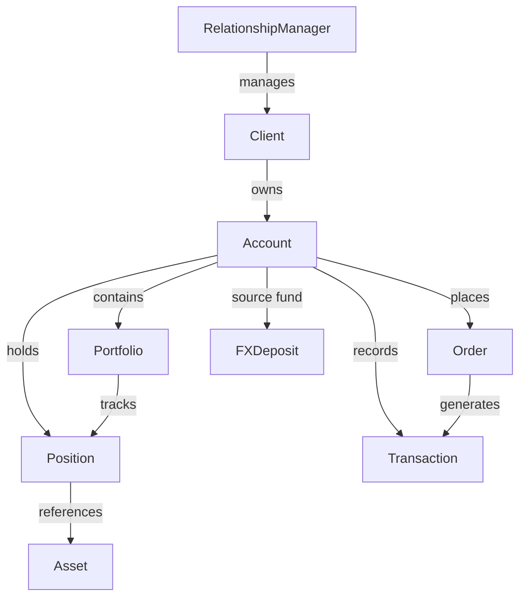

# 01 — Vahalla Wealth Management Data Specification

> **Document Index:** [00-index.md](00-index.md) | **Related:** [02 — Equity & Bond Specification](02-bank-data-specification-equity-bond.md)

| | |
|---|---|
| **Document Title** | Wealth Management Module — Client, Account, Portfolio, Position, Transaction, Order & FX Deposit |
| **System** | Vahalla Wealth Management System |
| **Document Version** | 1.0 |
| **Date** | 2026-02-09 |
| **Classification** | Confidential |
| **Status** | Draft |
| **Prepared By** | Vahalla System Team |

### Revision History

| Version | Date | Author | Description |
|---|---|---|---|
| 1.0 | 2026-02-09 | Vahalla System Team | Initial draft — Wealth Management domain specification |

---

## 1. Purpose

This document defines the data fields, formats, and standards for the **Wealth Management domain** of the Vahalla Investment Module. It covers the core operational entities that manage client relationships, accounts, portfolios, positions, transactions, orders, and FX deposits.

This specification is aligned with **ISO 20022** messaging standards and is intended for banking partners who provide data feeds for the wealth management layer.

For security master data (Equity & Bond fields), refer to [02 — Bank Data Specification — Equity & Bond](02-bank-data-specification-equity-bond.md).

---

## 2. Entity Relationship Overview

---

## 3. Data Standards & Conventions

### 3.1 Requirement Levels

| Label | Description |
|---|---|
| Required | Must be provided in every record |
| Conditional | Required when a specific condition is met |
| Optional | Provide if available |

### 3.2 Data Types

| Type | Format | Example |
|---|---|---|
| String | UTF-8 text | `"John Smith"` |
| Int | Integer | `42` |
| Decimal | Decimal number (no thousands separator) | `1855000.00` |
| Boolean | `true` / `false` | `true` |
| Date | ISO 8601 `YYYY-MM-DD` | `"2026-02-08"` |
| DateTime | ISO 8601 `YYYY-MM-DDTHH:MM:SSZ` | `"2026-02-08T16:00:00Z"` |
| Enum | Predefined value from reference table | `"ACTIVE"` |
| ID | Unique identifier string | `"CLI-001234"` |

### 3.3 ISO Standards

| Standard | Usage |
|---|---|
| ISO 4217 | Currency codes (3 chars) |
| ISO 3166 | Country codes (alpha-2) |
| ISO 8601 | Date and time formats |
| ISO 17442 | Legal Entity Identifier (LEI, 20 chars) |
| ISO 9362 | Bank Identifier Code (BIC, 8 or 11 chars) |
| ISO 10383 | Market Identifier Code (MIC, 4 chars) |
| ISO 20022 | Financial messaging standard |

---

## 4. Client Data Fields

### 4.1 Client Identification

| # | Field Name | Data Type | Required | Description | Example | ISO 20022 Reference |
|---|---|---|---|---|---|---|
| 1 | `id` | ID | Required | Unique client identifier | `"CLI-001234"` | acmt.001 — `AcctPties/PrncplAcctPty/OthrId/Id` |
| 2 | `clientType` | Enum | Required | Client classification | See [Appendix A.1](#a1-clienttype) | acmt.001 — `AcctPties/PrncplAcctPty/CtgyPurp` |
| 3 | `status` | Enum | Required | Client status | See [Appendix A.2](#a2-clientstatus) | — (supplementary) |
| 4 | `lei` | String | Optional | Legal Entity Identifier per ISO 17442 (corporate clients) | `"HWUPKR0MPOU8FGXBT394"` | acmt.001 — `AcctPties/PrncplAcctPty/LEI` |
| 5 | `bic` | String | Optional | Bank Identifier Code per ISO 9362 | `"BOFAUS3NXXX"` | acmt.001 — `AcctPties/PrncplAcctPty/BIC` |
| 6 | `nationalId` | String | Optional | National identification number | `"123-45-6789"` | acmt.001 — `AcctPties/PrncplAcctPty/OthrId/Id` |
| 7 | `taxId` | String | Optional | Tax identification number | `"91-1234567"` | acmt.001 — `AcctPties/PrncplAcctPty/TaxId` |

### 4.2 Client Name & Contact

| # | Field Name | Data Type | Required | Description | Example | ISO 20022 Reference |
|---|---|---|---|---|---|---|
| 8 | `firstName` | String | Optional | First name (individual clients) | `"John"` | acmt.001 — `AcctPties/PrncplAcctPty/Nm/FrstNm` |
| 9 | `lastName` | String | Optional | Last name (individual clients) | `"Smith"` | acmt.001 — `AcctPties/PrncplAcctPty/Nm/Nm` |
| 10 | `fullName` | String | Required | Full legal name | `"John Smith"` | acmt.001 — `AcctPties/PrncplAcctPty/Nm/FullNm` |
| 11 | `dateOfBirth` | Date | Optional | Date of birth | `"1985-06-15"` | acmt.001 — `AcctPties/PrncplAcctPty/DtOfBirth` |
| 12 | `nationality` | String | Optional | Nationality per ISO 3166 alpha-2 | `"US"` | acmt.001 — `AcctPties/PrncplAcctPty/Ntlty` |
| 13 | `countryOfResidence` | String | Optional | Country of residence per ISO 3166 | `"US"` | acmt.001 — `AcctPties/PrncplAcctPty/CtryOfRes` |
| 14 | `language` | String | Optional | Preferred language per ISO 639 | `"en"` | acmt.001 — `AcctPties/PrncplAcctPty/Lang` |

### 4.3 Client Address

| # | Field Name | Data Type | Required | Description | Example | ISO 20022 Reference |
|---|---|---|---|---|---|---|
| 15 | `addressLine1` | String | Optional | Primary address line | `"123 Wall Street"` | acmt.001 — `AcctPties/PrncplAcctPty/PstlAdr/AdrLine` |
| 16 | `addressLine2` | String | Optional | Secondary address line | `"Suite 4500"` | acmt.001 — `AcctPties/PrncplAcctPty/PstlAdr/AdrLine` |
| 17 | `city` | String | Optional | City | `"New York"` | acmt.001 — `AcctPties/PrncplAcctPty/PstlAdr/TwnNm` |
| 18 | `postalCode` | String | Optional | Postal/ZIP code | `"10005"` | acmt.001 — `AcctPties/PrncplAcctPty/PstlAdr/PstCd` |
| 19 | `country` | String | Optional | Country per ISO 3166 alpha-2 | `"US"` | acmt.001 — `AcctPties/PrncplAcctPty/PstlAdr/Ctry` |
| 20 | `email` | String | Optional | Email address | `"john.smith@email.com"` | acmt.001 — `AcctPties/PrncplAcctPty/CtctDtls/EmailAdr` |
| 21 | `phone` | String | Optional | Phone number | `"+1-212-555-0100"` | acmt.001 — `AcctPties/PrncplAcctPty/CtctDtls/PhneNb` |

### 4.4 Client KYC & Compliance

| # | Field Name | Data Type | Required | Description | Example | ISO 20022 Reference |
|---|---|---|---|---|---|---|
| 22 | `kycStatus` | Enum | Optional | KYC verification status | See [Appendix A.3](#a3-kycstatus) | acmt.001 — `AcctPties/PrncplAcctPty/KYCSts` |
| 23 | `kycVerificationDate` | DateTime | Optional | Date of last KYC verification | `"2025-06-01T00:00:00Z"` | acmt.001 — `AcctPties/PrncplAcctPty/KYCChckDt` |
| 24 | `kycExpiryDate` | DateTime | Optional | KYC expiry date | `"2026-06-01T00:00:00Z"` | — (supplementary) |
| 25 | `riskProfile` | Enum | Optional | Client risk profile | See [Appendix A.4](#a4-clientriskprofile) | acmt.001 — `AcctPties/PrncplAcctPty/RskLvl` |
| 26 | `fatcaStatus` | String | Optional | FATCA classification | `"COMPLIANT"` | acmt.001 — `AcctPties/PrncplAcctPty/FATCASts` |
| 27 | `crsReportable` | Boolean | Optional | CRS reportable flag | `true` | acmt.001 — `AcctPties/PrncplAcctPty/CRSRptbl` |
| 28 | `pepStatus` | Boolean | Optional | Politically Exposed Person flag | `false` | acmt.001 — `AcctPties/PrncplAcctPty/PltclyExpsdPrsn` |
| 29 | `sanctionsScreeningDate` | DateTime | Optional | Last sanctions screening date | `"2025-12-01T00:00:00Z"` | — (supplementary) |

### 4.5 Client Classification

| # | Field Name | Data Type | Required | Description | Example | ISO 20022 Reference |
|---|---|---|---|---|---|---|
| 30 | `investorClassification` | String | Optional | Investor classification | `"PROFESSIONAL"` | acmt.001 — `AcctPties/PrncplAcctPty/InvstrPrfl/InvstrTp` |
| 31 | `mifidClassification` | String | Optional | MiFID II classification | `"RETAIL"` | acmt.001 — `AcctPties/PrncplAcctPty/MiFIDClssfctn` |

### 4.6 Client Relationships & Metadata

| # | Field Name | Data Type | Required | Description | Example | ISO 20022 Reference |
|---|---|---|---|---|---|---|
| 32 | `relationshipManagerId` | ID | Required | Assigned RM identifier | `"RM-001"` | — (supplementary) |
| 33 | `onboardingDate` | DateTime | Optional | Client onboarding date | `"2024-01-15T00:00:00Z"` | acmt.001 — `AcctPties/PrncplAcctPty/OpngDt` |
| 34 | `lastReviewDate` | DateTime | Optional | Last periodic review date | `"2025-06-01T00:00:00Z"` | acmt.001 — `AcctPties/PrncplAcctPty/LstRvwDt` |
| 35 | `nextReviewDate` | DateTime | Optional | Next scheduled review date | `"2026-06-01T00:00:00Z"` | — (supplementary) |
| 36 | `createdAt` | DateTime | Required | Record creation timestamp | `"2024-01-15T09:00:00Z"` | — (supplementary) |
| 37 | `updatedAt` | DateTime | Required | Last update timestamp | `"2026-02-08T14:00:00Z"` | — (supplementary) |

---

## 5. Relationship Manager Data Fields

| # | Field Name | Data Type | Required | Description | Example | ISO 20022 Reference |
|---|---|---|---|---|---|---|
| 1 | `id` | ID | Required | Unique RM identifier | `"RM-001"` | — (supplementary) |
| 2 | `employeeId` | String | Required | Employee ID | `"EMP-5678"` | — (supplementary) |
| 3 | `firstName` | String | Required | First name | `"Sarah"` | — (supplementary) |
| 4 | `lastName` | String | Required | Last name | `"Johnson"` | — (supplementary) |
| 5 | `fullName` | String | Required | Full name | `"Sarah Johnson"` | — (supplementary) |
| 6 | `email` | String | Required | Email address | `"sarah.johnson@bank.com"` | — (supplementary) |
| 7 | `phone` | String | Optional | Phone number | `"+1-212-555-0200"` | — (supplementary) |
| 8 | `title` | String | Optional | Job title | `"Senior Relationship Manager"` | — (supplementary) |
| 9 | `department` | String | Optional | Department | `"Private Banking"` | — (supplementary) |
| 10 | `branch` | String | Optional | Branch location | `"New York"` | — (supplementary) |
| 11 | `region` | String | Optional | Region | `"North America"` | — (supplementary) |
| 12 | `supervisorId` | ID | Optional | Supervisor RM identifier | `"RM-000"` | — (supplementary) |
| 13 | `licenseNumber` | String | Optional | License number | `"LIC-2024-001"` | — (supplementary) |
| 14 | `licenseType` | String | Optional | License type | `"Series 7"` | — (supplementary) |
| 15 | `licenseExpiryDate` | DateTime | Optional | License expiry date | `"2027-12-31T00:00:00Z"` | — (supplementary) |
| 16 | `certifications` | [String] | Optional | List of certifications | `["CFA", "CFP"]` | — (supplementary) |
| 17 | `totalClientsManaged` | Int | Optional | Total clients managed | `45` | — (supplementary) |
| 18 | `totalAum` | Decimal | Optional | Total assets under management | `250000000.00` | — (supplementary) |
| 19 | `aumCurrency` | String | Optional | AUM currency per ISO 4217 | `"USD"` | — (supplementary) |
| 20 | `active` | Boolean | Required | Active status | `true` | — (supplementary) |
| 21 | `startDate` | DateTime | Optional | Employment start date | `"2020-03-01T00:00:00Z"` | — (supplementary) |
| 22 | `createdAt` | DateTime | Required | Record creation timestamp | `"2020-03-01T09:00:00Z"` | — (supplementary) |
| 23 | `updatedAt` | DateTime | Required | Last update timestamp | `"2026-02-08T14:00:00Z"` | — (supplementary) |

---

## 6. Account Data Fields

### 6.1 Account Identification

| # | Field Name | Data Type | Required | Description | Example | ISO 20022 Reference |
|---|---|---|---|---|---|---|
| 1 | `id` | ID | Required | Unique account identifier | `"ACC-001234"` | acmt.001 — `InvstmtAcct/AcctId/Prtry/Id` |
| 2 | `accountNumber` | String | Required | Account number | `"1234567890"` | acmt.001 — `InvstmtAcct/AcctId/IBAN` |
| 3 | `accountName` | String | Optional | Account name | `"John Smith - Investment"` | acmt.001 — `InvstmtAcct/Nm` |
| 4 | `accountType` | Enum | Required | Account type | See [Appendix A.5](#a5-accounttype) | acmt.001 — `InvstmtAcct/Tp/Cd` |
| 5 | `status` | Enum | Required | Account status | See [Appendix A.6](#a6-accountstatus) | acmt.001 — `InvstmtAcct/Sts` |

### 6.2 Account Details

| # | Field Name | Data Type | Required | Description | Example | ISO 20022 Reference |
|---|---|---|---|---|---|---|
| 6 | `baseCurrency` | String | Required | Base currency per ISO 4217 | `"USD"` | acmt.001 — `InvstmtAcct/BaseCcy` |
| 7 | `openingDate` | DateTime | Required | Account opening date | `"2024-01-15T00:00:00Z"` | acmt.001 — `InvstmtAcct/OpngDt` |
| 8 | `closingDate` | DateTime | Optional | Account closing date | `null` | acmt.001 — `InvstmtAcct/ClsgDt` |
| 9 | `lastActivityDate` | DateTime | Optional | Last activity date | `"2026-02-08T16:00:00Z"` | — (supplementary) |

### 6.3 Account Servicing

| # | Field Name | Data Type | Required | Description | Example | ISO 20022 Reference |
|---|---|---|---|---|---|---|
| 10 | `custodian` | String | Optional | Custodian institution name | `"State Street"` | acmt.001 — `AcctSvcr/Nm` |
| 11 | `custodianLei` | String | Optional | Custodian LEI per ISO 17442 | `"549300ZFEEJ2IP5VME73"` | acmt.001 — `AcctSvcr/LEI` |
| 12 | `custodianBic` | String | Optional | Custodian BIC per ISO 9362 | `"SBOSUS33XXX"` | acmt.001 — `AcctSvcr/BIC` |
| 13 | `servicingInstitution` | String | Optional | Servicing institution name | `"Bank of America"` | acmt.001 — `AcctSvcr/SvcgInstn/Nm` |
| 14 | `servicingInstitutionLei` | String | Optional | Servicing institution LEI | `"9DJT3UXIJIZJI4WXO774"` | acmt.001 — `AcctSvcr/SvcgInstn/LEI` |

### 6.4 Account Balance

| # | Field Name | Data Type | Required | Description | Example | ISO 20022 Reference |
|---|---|---|---|---|---|---|
| 15 | `cashBalance` | Decimal | Optional | Cash balance | `150000.00` | camt.052 — `Bal/Amt` |
| 16 | `cashCurrency` | String | Optional | Cash currency per ISO 4217 | `"USD"` | camt.052 — `Bal/Amt/@Ccy` |
| 17 | `marketValue` | Decimal | Optional | Total market value of holdings | `1855000.00` | semt.003 — `TtlPrtflValtn/Amt` |
| 18 | `totalValue` | Decimal | Optional | Total value (cash + market value) | `2005000.00` | semt.003 — `TtlPrtflValtn/TtlVal` |
| 19 | `valuationDate` | DateTime | Optional | Valuation date | `"2026-02-08T16:00:00Z"` | semt.003 — `StmtGnlDtls/StmtDt` |
| 20 | `valuationCurrency` | String | Optional | Valuation currency per ISO 4217 | `"USD"` | semt.003 — `TtlPrtflValtn/Amt/@Ccy` |

### 6.5 Account Margin

| # | Field Name | Data Type | Required | Description | Example | ISO 20022 Reference |
|---|---|---|---|---|---|---|
| 21 | `marginLimit` | Decimal | Optional | Margin limit | `500000.00` | — (supplementary) |
| 22 | `marginUsed` | Decimal | Optional | Margin used | `150000.00` | — (supplementary) |
| 23 | `marginAvailable` | Decimal | Optional | Margin available | `350000.00` | — (supplementary) |
| 24 | `marginCurrency` | String | Optional | Margin currency per ISO 4217 | `"USD"` | — (supplementary) |

### 6.6 Account Restrictions

| # | Field Name | Data Type | Required | Description | Example | ISO 20022 Reference |
|---|---|---|---|---|---|---|
| 25 | `tradingRestricted` | Boolean | Optional | Trading restriction flag | `false` | acmt.001 — `InvstmtAcct/Rstrctn/RstrctnTp` |
| 26 | `withdrawalRestricted` | Boolean | Optional | Withdrawal restriction flag | `false` | acmt.001 — `InvstmtAcct/Rstrctn/RstrctnTp` |
| 27 | `restrictionReason` | String | Optional | Reason for restriction | `null` | acmt.001 — `InvstmtAcct/Rstrctn/Desc` |

### 6.7 Account Tax

| # | Field Name | Data Type | Required | Description | Example | ISO 20022 Reference |
|---|---|---|---|---|---|---|
| 28 | `taxStatus` | Enum | Optional | Tax status | See [Appendix A.15](#a15-taxstatus) | acmt.001 — `InvstmtAcct/TaxXmptn/Cd` |
| 29 | `taxCountry` | String | Optional | Tax country per ISO 3166 | `"US"` | acmt.001 — `InvstmtAcct/TaxCtry` |
| 30 | `withholdingTaxRate` | Decimal | Optional | Withholding tax rate (%) | `30.00` | acmt.001 — `InvstmtAcct/WhldgTaxRate` |

### 6.8 Account Settlement

| # | Field Name | Data Type | Required | Description | Example | ISO 20022 Reference |
|---|---|---|---|---|---|---|
| 31 | `defaultSettlementCurrency` | String | Optional | Default settlement currency per ISO 4217 | `"USD"` | sese.023 — `SttlmParams/SttlmCcy` |
| 32 | `defaultSettlementCycle` | Enum | Optional | Default settlement cycle | `"T_PLUS_2"` | sese.023 — `SttlmParams/SttlmCycl` |
| 33 | `settlementInstructions` | String | Optional | Settlement instructions | `"DTC clearing"` | sese.023 — `SttlmParams/SttlmInstrs` |

### 6.9 Account Relationships & Metadata

| # | Field Name | Data Type | Required | Description | Example | ISO 20022 Reference |
|---|---|---|---|---|---|---|
| 34 | `clientId` | ID | Required | Owning client identifier | `"CLI-001234"` | acmt.001 — `AcctPties/PrncplAcctPty/OthrId/Id` |
| 35 | `createdAt` | DateTime | Required | Record creation timestamp | `"2024-01-15T09:00:00Z"` | — (supplementary) |
| 36 | `updatedAt` | DateTime | Required | Last update timestamp | `"2026-02-08T14:00:00Z"` | — (supplementary) |

---

## 7. Portfolio Data Fields

### 7.1 Portfolio Identification

| # | Field Name | Data Type | Required | Description | Example | ISO 20022 Reference |
|---|---|---|---|---|---|---|
| 1 | `id` | ID | Required | Unique portfolio identifier | `"PF-001234"` | semt.003 — `SfkpgAcct/Id` |
| 2 | `portfolioName` | String | Required | Portfolio name | `"Growth Portfolio"` | semt.003 — `SfkpgAcct/Nm` |
| 3 | `portfolioCode` | String | Optional | Portfolio code | `"GRW-001"` | semt.003 — `SfkpgAcct/Dsgnt` |
| 4 | `baseCurrency` | String | Required | Base currency per ISO 4217 | `"USD"` | semt.003 — `StmtGnlDtls/RptgCcy` |
| 5 | `strategy` | Enum | Optional | Portfolio strategy | See [Appendix A.7](#a7-portfoliostrategy) | — (supplementary) |
| 6 | `benchmark` | String | Optional | Benchmark name | `"S&P 500"` | — (supplementary) |
| 7 | `benchmarkIsin` | String | Optional | Benchmark ISIN | `"US78378X1072"` | — (supplementary) |

### 7.2 Portfolio Valuation

| # | Field Name | Data Type | Required | Description | Example | ISO 20022 Reference |
|---|---|---|---|---|---|---|
| 8 | `marketValue` | Decimal | Optional | Total market value | `1855000.00` | semt.003 — `TtlPrtflValtn/Amt` |
| 9 | `costBasis` | Decimal | Optional | Total cost basis | `1650000.00` | semt.003 — `BalForAcct/AcqstnDt/CostVal` |
| 10 | `unrealizedPnL` | Decimal | Optional | Unrealized profit/loss | `205000.00` | semt.003 — `BalForAcct/UnrlsdGnOrLoss` |
| 11 | `realizedPnL` | Decimal | Optional | Realized profit/loss | `45000.00` | — (supplementary) |
| 12 | `totalReturn` | Decimal | Optional | Total return (%) | `15.20` | — (supplementary) |
| 13 | `valuationDate` | DateTime | Optional | Valuation date | `"2026-02-08T16:00:00Z"` | semt.003 — `StmtGnlDtls/StmtDt` |
| 14 | `valuationCurrency` | String | Optional | Valuation currency per ISO 4217 | `"USD"` | semt.003 — `StmtGnlDtls/RptgCcy` |

### 7.3 Portfolio Risk Metrics

| # | Field Name | Data Type | Required | Description | Example | ISO 20022 Reference |
|---|---|---|---|---|---|---|
| 15 | `volatility` | Decimal | Optional | Portfolio volatility (%) | `12.50` | — (supplementary) |
| 16 | `sharpeRatio` | Decimal | Optional | Sharpe ratio | `1.85` | — (supplementary) |
| 17 | `beta` | Decimal | Optional | Portfolio beta | `1.10` | — (supplementary) |
| 18 | `maxDrawdown` | Decimal | Optional | Maximum drawdown (%) | `8.30` | — (supplementary) |
| 19 | `valueAtRisk` | Decimal | Optional | Value at Risk | `92500.00` | — (supplementary) |

### 7.4 Portfolio Asset Allocation

| # | Field Name | Data Type | Required | Description | Example | ISO 20022 Reference |
|---|---|---|---|---|---|---|
| 20 | `equityWeight` | Decimal | Optional | Equity allocation (%) | `60.00` | — (supplementary) |
| 21 | `fixedIncomeWeight` | Decimal | Optional | Fixed income allocation (%) | `25.00` | — (supplementary) |
| 22 | `cashWeight` | Decimal | Optional | Cash allocation (%) | `10.00` | — (supplementary) |
| 23 | `alternativesWeight` | Decimal | Optional | Alternatives allocation (%) | `5.00` | — (supplementary) |

### 7.5 Portfolio Investment Guidelines

| # | Field Name | Data Type | Required | Description | Example | ISO 20022 Reference |
|---|---|---|---|---|---|---|
| 24 | `targetReturn` | Decimal | Optional | Target return (%) | `8.00` | — (supplementary) |
| 25 | `riskBudget` | Decimal | Optional | Risk budget (%) | `15.00` | — (supplementary) |
| 26 | `maxSinglePositionWeight` | Decimal | Optional | Max single position weight (%) | `10.00` | — (supplementary) |
| 27 | `maxSectorWeight` | Decimal | Optional | Max sector weight (%) | `25.00` | — (supplementary) |
| 28 | `maxCountryWeight` | Decimal | Optional | Max country weight (%) | `40.00` | — (supplementary) |

### 7.6 Portfolio Compliance

| # | Field Name | Data Type | Required | Description | Example | ISO 20022 Reference |
|---|---|---|---|---|---|---|
| 29 | `investmentPolicyCompliant` | Boolean | Optional | Investment policy compliance flag | `true` | — (supplementary) |
| 30 | `lastComplianceCheckDate` | DateTime | Optional | Last compliance check date | `"2026-02-01T00:00:00Z"` | — (supplementary) |
| 31 | `complianceBreaches` | Int | Optional | Number of compliance breaches | `0` | — (supplementary) |

### 7.7 Portfolio Relationships & Metadata

| # | Field Name | Data Type | Required | Description | Example | ISO 20022 Reference |
|---|---|---|---|---|---|---|
| 32 | `accountId` | ID | Required | Parent account identifier | `"ACC-001234"` | semt.003 — `SfkpgAcct/AcctOwnr` |
| 33 | `inceptionDate` | DateTime | Optional | Portfolio inception date | `"2024-01-15T00:00:00Z"` | — (supplementary) |
| 34 | `lastRebalanceDate` | DateTime | Optional | Last rebalance date | `"2026-01-15T00:00:00Z"` | — (supplementary) |
| 35 | `nextRebalanceDate` | DateTime | Optional | Next scheduled rebalance date | `"2026-04-15T00:00:00Z"` | — (supplementary) |
| 36 | `createdAt` | DateTime | Required | Record creation timestamp | `"2024-01-15T09:00:00Z"` | — (supplementary) |
| 37 | `updatedAt` | DateTime | Required | Last update timestamp | `"2026-02-08T14:00:00Z"` | — (supplementary) |

---

## 8. Position Data Fields

### 8.1 Position Identification

| # | Field Name | Data Type | Required | Description | Example | ISO 20022 Reference |
|---|---|---|---|---|---|---|
| 1 | `id` | ID | Required | Unique position identifier | `"POS-001234"` | semt.003 — `BalForAcct/SfkpgPlc/Id` |
| 2 | `assetId` | ID | Required | Reference to security/asset record | `"SEC-EQ-001"` | semt.003 — `FinInstrmId/OthrId/Id` |
| 3 | `assetClass` | Enum | Required | Asset class | `"SECURITIES"` | semt.003 — `FinInstrmId/ClssfctnTp` |
| 4 | `isin` | String | Optional | ISIN of the held asset | `"US0378331005"` | semt.003 — `FinInstrmId/ISIN` |
| 5 | `ticker` | String | Optional | Ticker symbol | `"AAPL"` | semt.003 — `FinInstrmId/TckrSymb` |
| 6 | `assetName` | String | Required | Asset name | `"Apple Inc. Common Stock"` | semt.003 — `FinInstrmId/Nm` |

### 8.2 Position Quantity

| # | Field Name | Data Type | Required | Description | Example | ISO 20022 Reference |
|---|---|---|---|---|---|---|
| 7 | `quantity` | Decimal | Required | Holding quantity | `10000` | semt.003 — `BalForAcct/AggtBal/ShrtLngPos/Qty` |
| 8 | `side` | Enum | Required | Position side | See [Appendix A.8](#a8-positionside) | semt.003 — `BalForAcct/AggtBal/ShrtLngPos/Ind` |
| 9 | `status` | Enum | Required | Position status | See [Appendix A.9](#a9-positionstatus) | — (supplementary) |

### 8.3 Position Cost & Valuation

| # | Field Name | Data Type | Required | Description | Example | ISO 20022 Reference |
|---|---|---|---|---|---|---|
| 10 | `averageCost` | Decimal | Required | Average cost per unit | `165.00` | semt.003 — `BalForAcct/AvrgCostPricPerUnit` |
| 11 | `costBasis` | Decimal | Required | Total cost basis (quantity × averageCost) | `1650000.00` | semt.003 — `BalForAcct/AcqstnDt/CostVal` |
| 12 | `costCurrency` | String | Required | Cost currency per ISO 4217 | `"USD"` | semt.003 — `BalForAcct/AcqstnDt/CostVal/@Ccy` |
| 13 | `currentPrice` | Decimal | Optional | Current market price | `185.50` | semt.003 — `BalForAcct/PricDtls/MktPric/Val` |
| 14 | `marketValue` | Decimal | Optional | Current market value | `1855000.00` | semt.003 — `BalForAcct/HldgVal/Amt` |
| 15 | `valuationCurrency` | String | Optional | Valuation currency per ISO 4217 | `"USD"` | semt.003 — `BalForAcct/HldgVal/Amt/@Ccy` |
| 16 | `valuationDate` | DateTime | Optional | Valuation date | `"2026-02-08T16:00:00Z"` | semt.003 — `BalForAcct/PricDtls/PricDt` |

### 8.4 Position P&L

| # | Field Name | Data Type | Required | Description | Example | ISO 20022 Reference |
|---|---|---|---|---|---|---|
| 17 | `unrealizedPnL` | Decimal | Optional | Unrealized profit/loss | `205000.00` | semt.003 — `BalForAcct/UnrlsdGnOrLoss` |
| 18 | `unrealizedPnLPercent` | Decimal | Optional | Unrealized P&L (%) | `12.42` | — (supplementary) |
| 19 | `realizedPnL` | Decimal | Optional | Realized profit/loss | `45000.00` | — (supplementary) |
| 20 | `totalPnL` | Decimal | Optional | Total P&L | `250000.00` | — (supplementary) |

### 8.5 Position Income

| # | Field Name | Data Type | Required | Description | Example | ISO 20022 Reference |
|---|---|---|---|---|---|---|
| 21 | `accruedInterest` | Decimal | Optional | Accrued interest | `0.00` | semt.003 — `BalForAcct/AccrdIntrstAmt` |
| 22 | `accruedDividend` | Decimal | Optional | Accrued dividend | `550.00` | — (supplementary) |

### 8.6 Position Weight & Settlement

| # | Field Name | Data Type | Required | Description | Example | ISO 20022 Reference |
|---|---|---|---|---|---|---|
| 23 | `portfolioWeight` | Decimal | Optional | Weight in portfolio (%) | `15.50` | — (supplementary) |
| 24 | `settledQuantity` | Decimal | Optional | Settled quantity | `10000` | semt.003 — `BalForAcct/AvlblBal/Qty` |
| 25 | `unsettledQuantity` | Decimal | Optional | Unsettled quantity | `0` | semt.003 — `BalForAcct/NotAvlblBal/Qty` |

### 8.7 Position Dates & Relationships

| # | Field Name | Data Type | Required | Description | Example | ISO 20022 Reference |
|---|---|---|---|---|---|---|
| 26 | `openDate` | DateTime | Required | Position open date | `"2024-06-15T10:30:00Z"` | — (supplementary) |
| 27 | `lastTradeDate` | DateTime | Optional | Last trade date | `"2026-01-20T14:00:00Z"` | — (supplementary) |
| 28 | `maturityDate` | DateTime | Optional | Maturity date (bonds) | `null` | semt.003 — `FinInstrmAttrbts/MtrtyDt` |
| 29 | `accountId` | ID | Required | Parent account identifier | `"ACC-001234"` | semt.003 — `SfkpgAcct/Id` |
| 30 | `portfolioId` | ID | Optional | Parent portfolio identifier | `"PF-001234"` | semt.003 — `SfkpgAcct/Dsgnt` |
| 31 | `createdAt` | DateTime | Required | Record creation timestamp | `"2024-06-15T10:30:00Z"` | — (supplementary) |
| 32 | `updatedAt` | DateTime | Required | Last update timestamp | `"2026-02-08T16:00:00Z"` | — (supplementary) |

---

## 9. Transaction Data Fields

### 9.1 Transaction Identification

| # | Field Name | Data Type | Required | Description | Example | ISO 20022 Reference |
|---|---|---|---|---|---|---|
| 1 | `id` | ID | Required | Unique transaction identifier | `"TXN-001234"` | sese.023 — `TxId/AcctOwnrTxId` |
| 2 | `transactionReference` | String | Required | Transaction reference number | `"REF-2026-001234"` | sese.023 — `TxId/AcctSvcrTxId` |
| 3 | `instructionReference` | String | Optional | Instruction reference | `"INST-2026-001"` | sese.023 — `TxId/MktInfrstrctrTxId` |
| 4 | `tradeId` | String | Optional | Trade identifier | `"TRD-2026-001234"` | sese.023 — `TradDtls/TradId` |

### 9.2 Transaction Details

| # | Field Name | Data Type | Required | Description | Example | ISO 20022 Reference |
|---|---|---|---|---|---|---|
| 5 | `transactionType` | Enum | Required | Transaction type | See [Appendix A.10](#a10-transactiontype) | sese.023 — `TradDtls/SctiesMvmntTp` |
| 6 | `status` | Enum | Required | Transaction status | See [Appendix A.11](#a11-transactionstatus) | sese.023 — `PrcgSts/Cd` |

### 9.3 Transaction Instrument

| # | Field Name | Data Type | Required | Description | Example | ISO 20022 Reference |
|---|---|---|---|---|---|---|
| 7 | `assetId` | ID | Optional | Reference to security/asset record | `"SEC-EQ-001"` | sese.023 — `FinInstrmId/OthrId/Id` |
| 8 | `assetClass` | Enum | Optional | Asset class | `"SECURITIES"` | sese.023 — `FinInstrmId/ClssfctnTp` |
| 9 | `isin` | String | Optional | ISIN of the traded asset | `"US0378331005"` | sese.023 — `FinInstrmId/ISIN` |
| 10 | `assetName` | String | Optional | Asset name | `"Apple Inc. Common Stock"` | sese.023 — `FinInstrmId/Nm` |

### 9.4 Transaction Quantity & Price

| # | Field Name | Data Type | Required | Description | Example | ISO 20022 Reference |
|---|---|---|---|---|---|---|
| 11 | `quantity` | Decimal | Optional | Quantity traded | `500` | sese.023 — `QtyAndAcctDtls/SttldQty` |
| 12 | `price` | Decimal | Optional | Execution price | `185.50` | sese.023 — `TradDtls/DealPric/Val` |
| 13 | `priceCurrency` | String | Optional | Price currency per ISO 4217 | `"USD"` | sese.023 — `TradDtls/DealPric/Val/@Ccy` |
| 14 | `grossAmount` | Decimal | Required | Gross amount | `92750.00` | sese.023 — `AmtDtls/TradAmt/Amt` |
| 15 | `netAmount` | Decimal | Required | Net amount (after fees) | `92700.00` | sese.023 — `AmtDtls/SttlmAmt/Amt` |
| 16 | `currency` | String | Required | Transaction currency per ISO 4217 | `"USD"` | sese.023 — `AmtDtls/TradAmt/Amt/@Ccy` |
| 17 | `exchangeRate` | Decimal | Optional | FX exchange rate (if cross-currency) | `1.00` | sese.023 — `OthrAmts/FXRate` |

### 9.5 Transaction Fees & Charges

| # | Field Name | Data Type | Required | Description | Example | ISO 20022 Reference |
|---|---|---|---|---|---|---|
| 18 | `commission` | Decimal | Optional | Commission | `25.00` | sese.023 — `OthrAmts/ExctgBrkrCmmssn` |
| 19 | `brokerageFee` | Decimal | Optional | Brokerage fee | `15.00` | sese.023 — `OthrAmts/BrkrgFees` |
| 20 | `stampDuty` | Decimal | Optional | Stamp duty | `0.00` | sese.023 — `OthrAmts/StmpDty` |
| 21 | `tax` | Decimal | Optional | Tax | `10.00` | sese.023 — `OthrAmts/TaxAmt` |
| 22 | `otherFees` | Decimal | Optional | Other fees | `0.00` | sese.023 — `OthrAmts/OthrFees` |
| 23 | `totalFees` | Decimal | Optional | Total fees | `50.00` | sese.023 — `OthrAmts/TtlFeesAndTaxes` |
| 24 | `feeCurrency` | String | Optional | Fee currency per ISO 4217 | `"USD"` | sese.023 — `OthrAmts/ExctgBrkrCmmssn/@Ccy` |

### 9.6 Transaction Dates

| # | Field Name | Data Type | Required | Description | Example | ISO 20022 Reference |
|---|---|---|---|---|---|---|
| 25 | `tradeDate` | DateTime | Required | Trade date | `"2026-02-08T14:30:00Z"` | sese.023 — `TradDtls/TradDt` |
| 26 | `settlementDate` | DateTime | Optional | Settlement date | `"2026-02-10T00:00:00Z"` | sese.023 — `SttlmParams/SttlmDt/Dt` |
| 27 | `valueDate` | DateTime | Optional | Value date | `"2026-02-10T00:00:00Z"` | sese.023 — `SttlmParams/ValDt` |
| 28 | `bookingDate` | DateTime | Optional | Booking date | `"2026-02-08T16:00:00Z"` | sese.023 — `SttlmParams/BookgDt` |

### 9.7 Transaction Settlement

| # | Field Name | Data Type | Required | Description | Example | ISO 20022 Reference |
|---|---|---|---|---|---|---|
| 29 | `settlementStatus` | String | Optional | Settlement status | `"SETTLED"` | sese.023 — `PrcgSts/SttlmSts` |
| 30 | `settlementType` | Enum | Optional | Settlement type | See [Appendix A.16](#a16-settlementtype) | sese.023 — `SttlmParams/SttlmTp` |
| 31 | `settlementCurrency` | String | Optional | Settlement currency per ISO 4217 | `"USD"` | sese.023 — `AmtDtls/SttlmAmt/Amt/@Ccy` |
| 32 | `settlementAmount` | Decimal | Optional | Settlement amount | `92700.00` | sese.023 — `AmtDtls/SttlmAmt/Amt` |

### 9.8 Transaction Counterparty

| # | Field Name | Data Type | Required | Description | Example | ISO 20022 Reference |
|---|---|---|---|---|---|---|
| 33 | `counterparty` | String | Optional | Counterparty name | `"Goldman Sachs"` | sese.023 — `DlvrgSttlmPties/Pty1/Nm` |
| 34 | `counterpartyLei` | String | Optional | Counterparty LEI per ISO 17442 | `"784F5XWPLTWKTBV3E584"` | sese.023 — `DlvrgSttlmPties/Pty1/LEI` |
| 35 | `broker` | String | Optional | Broker name | `"Morgan Stanley"` | sese.023 — `DlvrgSttlmPties/Brkr/Nm` |
| 36 | `brokerLei` | String | Optional | Broker LEI per ISO 17442 | `"IGJSJL3JD5P30I6NJZ34"` | sese.023 — `DlvrgSttlmPties/Brkr/LEI` |
| 37 | `executionVenue` | String | Optional | Execution venue | `"NASDAQ"` | sese.023 — `TradDtls/PlcOfTrad/Nm` |
| 38 | `mic` | String | Optional | Market Identifier Code per ISO 10383 | `"XNAS"` | sese.023 — `TradDtls/PlcOfTrad/MIC` |

### 9.9 Transaction Relationships & Metadata

| # | Field Name | Data Type | Required | Description | Example | ISO 20022 Reference |
|---|---|---|---|---|---|---|
| 39 | `accountId` | ID | Required | Parent account identifier | `"ACC-001234"` | sese.023 — `QtyAndAcctDtls/SfkpgAcct/Id` |
| 40 | `portfolioId` | ID | Optional | Portfolio identifier | `"PF-001234"` | sese.023 — `QtyAndAcctDtls/SfkpgAcct/Dsgnt` |
| 41 | `positionId` | ID | Optional | Related position identifier | `"POS-001234"` | — (supplementary) |
| 42 | `orderId` | ID | Optional | Originating order identifier | `"ORD-001234"` | — (supplementary) |
| 43 | `createdAt` | DateTime | Required | Record creation timestamp | `"2026-02-08T14:30:00Z"` | — (supplementary) |
| 44 | `updatedAt` | DateTime | Required | Last update timestamp | `"2026-02-10T16:00:00Z"` | — (supplementary) |

---

## 10. FX Deposit Data Fields

### 10.1 Deposit Identification

| # | Field Name | Data Type | Required | Description | Example | ISO 20022 Reference |
|---|---|---|---|---|---|---|
| 1 | `id` | ID | Required | Unique deposit identifier | `"FXD-001234"` | camt.052 — `Ntry/NtryRef` |
| 2 | `depositReference` | String | Required | Deposit reference number | `"DEP-2026-001234"` | camt.052 — `Ntry/AcctSvcrRef` |
| 3 | `depositType` | Enum | Required | Deposit type | See [Appendix A.17](#a17-deposittype) | camt.052 — `Ntry/BkTxCd/Prtry/Cd` |
| 4 | `status` | Enum | Required | Deposit status | See [Appendix A.18](#a18-depositstatus) | camt.052 — `Ntry/Sts` |

### 10.2 Deposit Currency & Amount

| # | Field Name | Data Type | Required | Description | Example | ISO 20022 Reference |
|---|---|---|---|---|---|---|
| 5 | `currency` | String | Required | Deposit currency per ISO 4217 | `"USD"` | camt.052 — `Ntry/Amt/@Ccy` |
| 6 | `principalAmount` | Decimal | Required | Principal amount | `1000000.00` | camt.052 — `Ntry/Amt` |
| 7 | `currentBalance` | Decimal | Optional | Current balance | `1012500.00` | camt.052 — `Bal/Amt` |

### 10.3 Deposit Interest

| # | Field Name | Data Type | Required | Description | Example | ISO 20022 Reference |
|---|---|---|---|---|---|---|
| 8 | `interestType` | Enum | Required | Interest type | See [Appendix A.21](#a21-interesttype) | camt.052 — `Ntry/NtryDtls/TxDtls/RltdAgts/IntrstTp` |
| 9 | `interestRate` | Decimal | Required | Interest rate (%) | `5.00` | camt.052 — `Ntry/NtryDtls/TxDtls/Intrst/Rate` |
| 10 | `floatingRateIndex` | Enum | Optional | Floating rate index (if floating) | See [Appendix A.22](#a22-floatingrateindex) | camt.052 — `Ntry/NtryDtls/TxDtls/Intrst/FltgRateIdx` |
| 11 | `floatingRateSpread` | Decimal | Optional | Spread over floating rate (bps) | `50.00` | camt.052 — `Ntry/NtryDtls/TxDtls/Intrst/Sprd` |
| 12 | `accruedInterest` | Decimal | Optional | Accrued interest | `12500.00` | camt.052 — `Ntry/NtryDtls/TxDtls/Intrst/AccrdAmt` |
| 13 | `interestAmount` | Decimal | Optional | Total interest earned | `12500.00` | camt.052 — `Ntry/NtryDtls/TxDtls/Intrst/Amt` |
| 14 | `interestCurrency` | String | Optional | Interest currency per ISO 4217 | `"USD"` | camt.052 — `Ntry/NtryDtls/TxDtls/Intrst/Amt/@Ccy` |
| 15 | `dayCountBasis` | Enum | Optional | Day count convention | `"ACT_360"` | camt.052 — `Ntry/NtryDtls/TxDtls/Intrst/DayCntBsis` |
| 16 | `interestPaymentFrequency` | Enum | Optional | Interest payment frequency | `"MONTHLY"` | camt.052 — `Ntry/NtryDtls/TxDtls/Intrst/PmtFrqcy` |
| 17 | `compoundingFrequency` | Enum | Optional | Compounding frequency | `"MONTHLY"` | — (supplementary) |

### 10.4 Deposit Term & Maturity

| # | Field Name | Data Type | Required | Description | Example | ISO 20022 Reference |
|---|---|---|---|---|---|---|
| 18 | `termType` | Enum | Required | Term type | See [Appendix A.19](#a19-deposittermtype) | camt.052 — `Ntry/NtryDtls/TxDtls/RltdDts/TrmTp` |
| 19 | `tenorDays` | Int | Optional | Tenor in days | `90` | camt.052 — `Ntry/NtryDtls/TxDtls/RltdDts/Tenor` |
| 20 | `noticePeriodDays` | Int | Optional | Notice period in days | `0` | — (supplementary) |
| 21 | `startDate` | DateTime | Required | Deposit start date | `"2026-01-15T00:00:00Z"` | camt.052 — `Ntry/NtryDtls/TxDtls/RltdDts/StartDt` |
| 22 | `maturityDate` | DateTime | Optional | Maturity date | `"2026-04-15T00:00:00Z"` | camt.052 — `Ntry/NtryDtls/TxDtls/RltdDts/MtrtyDt` |
| 23 | `valueDate` | DateTime | Optional | Value date | `"2026-01-15T00:00:00Z"` | camt.052 — `Ntry/ValDt/Dt` |

### 10.5 Deposit Rollover

| # | Field Name | Data Type | Required | Description | Example | ISO 20022 Reference |
|---|---|---|---|---|---|---|
| 24 | `rolloverType` | Enum | Optional | Rollover type | See [Appendix A.20](#a20-rollovertype) | — (supplementary) |
| 25 | `rolloverCount` | Int | Optional | Number of rollovers | `0` | — (supplementary) |
| 26 | `nextRolloverDate` | DateTime | Optional | Next rollover date | `null` | — (supplementary) |

### 10.6 Deposit Early Withdrawal

| # | Field Name | Data Type | Required | Description | Example | ISO 20022 Reference |
|---|---|---|---|---|---|---|
| 27 | `earlyWithdrawalAllowed` | Boolean | Optional | Early withdrawal allowed flag | `true` | — (supplementary) |
| 28 | `earlyWithdrawalPenaltyRate` | Decimal | Optional | Early withdrawal penalty rate (%) | `1.00` | — (supplementary) |
| 29 | `breakCost` | Decimal | Optional | Break cost | `0.00` | — (supplementary) |
| 30 | `minimumBalance` | Decimal | Optional | Minimum balance | `100000.00` | — (supplementary) |

### 10.7 Deposit Servicing Institution

| # | Field Name | Data Type | Required | Description | Example | ISO 20022 Reference |
|---|---|---|---|---|---|---|
| 31 | `depositBank` | String | Optional | Deposit bank name | `"Citibank"` | camt.052 — `Acct/Svcr/FinInstnId/Nm` |
| 32 | `depositBankLei` | String | Optional | Deposit bank LEI per ISO 17442 | `"6SHGI4ZSSLCXXQSBB395"` | camt.052 — `Acct/Svcr/FinInstnId/LEI` |
| 33 | `depositBankBic` | String | Optional | Deposit bank BIC per ISO 9362 | `"CITIUS33XXX"` | camt.052 — `Acct/Svcr/FinInstnId/BICFI` |
| 34 | `branchCode` | String | Optional | Branch code | `"NYC-001"` | camt.052 — `Acct/Svcr/BrnchId/Id` |

### 10.8 Deposit Settlement

| # | Field Name | Data Type | Required | Description | Example | ISO 20022 Reference |
|---|---|---|---|---|---|---|
| 35 | `settlementAccount` | String | Optional | Settlement account | `"1234567890"` | camt.052 — `Acct/Id/IBAN` |
| 36 | `settlementCurrency` | String | Optional | Settlement currency per ISO 4217 | `"USD"` | camt.052 — `Acct/Ccy` |
| 37 | `settlementInstructions` | String | Optional | Settlement instructions | `"Wire transfer"` | — (supplementary) |

### 10.9 Deposit Tax

| # | Field Name | Data Type | Required | Description | Example | ISO 20022 Reference |
|---|---|---|---|---|---|---|
| 38 | `withholdingTaxRate` | Decimal | Optional | Withholding tax rate (%) | `30.00` | camt.052 — `Ntry/NtryDtls/TxDtls/Tax/WhldgTaxRate` |
| 39 | `taxStatus` | Enum | Optional | Tax status | See [Appendix A.15](#a15-taxstatus) | camt.052 — `Ntry/NtryDtls/TxDtls/Tax/TaxSts` |

### 10.10 Deposit Source Fund & Relationships

| # | Field Name | Data Type | Required | Description | Example | ISO 20022 Reference |
|---|---|---|---|---|---|---|
| 40 | `sourceAccountId` | ID | Optional | Linked source account identifier | `"ACC-001234"` | — (supplementary) |
| 41 | `fundingTransactionRef` | String | Optional | Funding transaction reference | `"TXN-FND-001"` | — (supplementary) |
| 42 | `accountId` | ID | Required | Parent account identifier | `"ACC-001234"` | camt.052 — `Acct/Id/Prtry/Id` |
| 43 | `clientId` | ID | Required | Client identifier | `"CLI-001234"` | camt.052 — `Acct/Ownr/Id` |
| 44 | `createdAt` | DateTime | Required | Record creation timestamp | `"2026-01-15T09:00:00Z"` | — (supplementary) |
| 45 | `updatedAt` | DateTime | Required | Last update timestamp | `"2026-02-08T14:00:00Z"` | — (supplementary) |

---

## 11. Order Data Fields

### 11.1 Order Identification

| # | Field Name | Data Type | Required | Description | Example | ISO 20022 Reference |
|---|---|---|---|---|---|---|
| 1 | `id` | ID | Required | Unique order identifier | `"ORD-001234"` | setr.001 — `OrdrId/OrdrRef` |
| 2 | `orderReference` | String | Required | Order reference number | `"REF-ORD-2026-001"` | setr.001 — `OrdrId/ClntOrdrLkId` |
| 3 | `clientOrderId` | String | Optional | Client-assigned order ID | `"CO-2026-001"` | setr.001 — `OrdrId/ClntRef` |

### 11.2 Order Details

| # | Field Name | Data Type | Required | Description | Example | ISO 20022 Reference |
|---|---|---|---|---|---|---|
| 4 | `side` | Enum | Required | Order side | See [Appendix A.12](#a12-orderside) | setr.001 — `OrdrDtls/Sd` |
| 5 | `orderType` | Enum | Required | Order type | See [Appendix A.13](#a13-ordertype) | setr.001 — `OrdrDtls/OrdrTp` |
| 6 | `status` | Enum | Required | Order status | See [Appendix A.14](#a14-orderstatus) | setr.001 — `OrdrDtls/OrdrSts` |
| 7 | `timeInForce` | Enum | Required | Time in force | See [Appendix A.23](#a23-timeinforce) | setr.001 — `OrdrDtls/TmInForce` |

### 11.3 Order Instrument

| # | Field Name | Data Type | Required | Description | Example | ISO 20022 Reference |
|---|---|---|---|---|---|---|
| 8 | `assetId` | ID | Required | Reference to security/asset record | `"SEC-EQ-001"` | setr.001 — `FinInstrmId/OthrId/Id` |
| 9 | `assetClass` | Enum | Required | Asset class | `"SECURITIES"` | setr.001 — `FinInstrmId/ClssfctnTp` |
| 10 | `isin` | String | Optional | ISIN of the ordered asset | `"US0378331005"` | setr.001 — `FinInstrmId/ISIN` |
| 11 | `assetName` | String | Required | Asset name | `"Apple Inc. Common Stock"` | setr.001 — `FinInstrmId/Nm` |

### 11.4 Order Quantity & Price

| # | Field Name | Data Type | Required | Description | Example | ISO 20022 Reference |
|---|---|---|---|---|---|---|
| 12 | `quantity` | Decimal | Required | Order quantity | `500` | setr.001 — `OrdrDtls/OrdrQty` |
| 13 | `filledQuantity` | Decimal | Optional | Filled quantity | `500` | setr.001 — `OrdrDtls/ExctdQty` |
| 14 | `remainingQuantity` | Decimal | Optional | Remaining quantity | `0` | setr.001 — `OrdrDtls/RmngQty` |
| 15 | `limitPrice` | Decimal | Optional | Limit price | `186.00` | setr.001 — `OrdrDtls/LmtPric/Val` |
| 16 | `stopPrice` | Decimal | Optional | Stop price | `null` | setr.001 — `OrdrDtls/StopPric/Val` |
| 17 | `averageFilledPrice` | Decimal | Optional | Average filled price | `185.50` | setr.001 — `OrdrDtls/AvrgPric/Val` |
| 18 | `currency` | String | Required | Order currency per ISO 4217 | `"USD"` | setr.001 — `OrdrDtls/OrdrQty/@Ccy` |

### 11.5 Order Validity & Execution

| # | Field Name | Data Type | Required | Description | Example | ISO 20022 Reference |
|---|---|---|---|---|---|---|
| 19 | `expiryDate` | DateTime | Optional | Order expiry date | `"2026-02-08T16:00:00Z"` | setr.001 — `OrdrDtls/XpryDtTm` |
| 20 | `executionVenue` | String | Optional | Execution venue | `"NASDAQ"` | setr.001 — `OrdrDtls/PlcOfTrad/Nm` |
| 21 | `mic` | String | Optional | Market Identifier Code per ISO 10383 | `"XNAS"` | setr.001 — `OrdrDtls/PlcOfTrad/MIC` |

### 11.6 Order Dates

| # | Field Name | Data Type | Required | Description | Example | ISO 20022 Reference |
|---|---|---|---|---|---|---|
| 22 | `orderDate` | DateTime | Required | Order creation date | `"2026-02-08T14:00:00Z"` | setr.001 — `OrdrDtls/OrdrDtTm` |
| 23 | `submittedDate` | DateTime | Optional | Order submission date | `"2026-02-08T14:00:05Z"` | setr.001 — `OrdrDtls/SbmttdDtTm` |
| 24 | `lastFilledDate` | DateTime | Optional | Last fill date | `"2026-02-08T14:30:00Z"` | setr.001 — `OrdrDtls/LstExctdDtTm` |
| 25 | `cancelledDate` | DateTime | Optional | Cancellation date | `null` | setr.001 — `OrdrDtls/CxlDtTm` |

### 11.7 Order Relationships & Metadata

| # | Field Name | Data Type | Required | Description | Example | ISO 20022 Reference |
|---|---|---|---|---|---|---|
| 26 | `accountId` | ID | Required | Parent account identifier | `"ACC-001234"` | setr.001 — `InvstmtAcctDtls/AcctId` |
| 27 | `portfolioId` | ID | Optional | Portfolio identifier | `"PF-001234"` | setr.001 — `InvstmtAcctDtls/AcctDsgnt` |
| 28 | `requestedBy` | ID | Optional | Requester (RM or Client ID) | `"RM-001"` | — (supplementary) |
| 29 | `approvedBy` | ID | Optional | Approver identifier | `"RM-000"` | — (supplementary) |
| 30 | `createdAt` | DateTime | Required | Record creation timestamp | `"2026-02-08T14:00:00Z"` | — (supplementary) |
| 31 | `updatedAt` | DateTime | Required | Last update timestamp | `"2026-02-08T14:30:00Z"` | — (supplementary) |

---

## Appendix A: Enum Reference Tables

### A.1 ClientType

| Value | Description | ISO 20022 Reference |
|---|---|---|
| `INDIVIDUAL` | Individual/personal client | acmt.001 — `InvstrPrfl/InvstrTp/INDV` |
| `CORPORATE` | Corporate entity | acmt.001 — `InvstrPrfl/InvstrTp/CORP` |
| `INSTITUTIONAL` | Institutional investor | acmt.001 — `InvstrPrfl/InvstrTp/INST` |
| `TRUST` | Trust account | acmt.001 — `InvstrPrfl/InvstrTp/TRST` |
| `JOINT` | Joint account holders | — (supplementary) |
| `MINOR` | Minor (under legal age) | — (supplementary) |
| `NON_PROFIT` | Non-profit organization | — (supplementary) |

### A.2 ClientStatus

| Value | Description | ISO 20022 Reference |
|---|---|---|
| `ACTIVE` | Active client | — (supplementary) |
| `INACTIVE` | Inactive client | — (supplementary) |
| `SUSPENDED` | Suspended | — (supplementary) |
| `CLOSED` | Closed | — (supplementary) |
| `PENDING_APPROVAL` | Pending approval | — (supplementary) |
| `DORMANT` | Dormant account | — (supplementary) |

### A.3 KYCStatus

| Value | Description | ISO 20022 Reference |
|---|---|---|
| `VERIFIED` | KYC verified | acmt.001 — `KYCSts/VRFD` |
| `PENDING` | Verification pending | acmt.001 — `KYCSts/PEND` |
| `EXPIRED` | Verification expired | acmt.001 — `KYCSts/EXPD` |
| `REJECTED` | Verification rejected | acmt.001 — `KYCSts/RJCT` |
| `UNDER_REVIEW` | Under review | acmt.001 — `KYCSts/URVW` |

### A.4 ClientRiskProfile

| Value | Description | ISO 20022 Reference |
|---|---|---|
| `CONSERVATIVE` | Conservative risk tolerance | acmt.001 — `RskLvl/CNSV` |
| `MODERATELY_CONSERVATIVE` | Moderately conservative | acmt.001 — `RskLvl/MDCV` |
| `MODERATE` | Moderate risk tolerance | acmt.001 — `RskLvl/MDRT` |
| `MODERATELY_AGGRESSIVE` | Moderately aggressive | acmt.001 — `RskLvl/MDAG` |
| `AGGRESSIVE` | Aggressive risk tolerance | acmt.001 — `RskLvl/AGGR` |

### A.5 AccountType

| Value | Description | ISO 20022 Reference |
|---|---|---|
| `CASH` | Cash account | acmt.001 — `InvstmtAcct/Tp/Cd/CASH` |
| `MARGIN` | Margin account | acmt.001 — `InvstmtAcct/Tp/Cd/MRGN` |
| `CUSTODY` | Custody account | acmt.001 — `InvstmtAcct/Tp/Cd/CUST` |
| `DISCRETIONARY` | Discretionary managed account | acmt.001 — `InvstmtAcct/Tp/Cd/DISC` |
| `ADVISORY` | Advisory account | acmt.001 — `InvstmtAcct/Tp/Cd/ADVS` |
| `EXECUTION_ONLY` | Execution-only account | acmt.001 — `InvstmtAcct/Tp/Cd/EXEC` |
| `TRUST` | Trust account | acmt.001 — `InvstmtAcct/Tp/Cd/TRST` |
| `RETIREMENT` | Retirement account | acmt.001 — `InvstmtAcct/Tp/Cd/RTRM` |
| `JOINT` | Joint account | acmt.001 — `InvstmtAcct/Tp/Cd/JONT` |

### A.6 AccountStatus

| Value | Description | ISO 20022 Reference |
|---|---|---|
| `ACTIVE` | Active | acmt.001 — `InvstmtAcct/Sts/ACTV` |
| `INACTIVE` | Inactive | acmt.001 — `InvstmtAcct/Sts/INAC` |
| `SUSPENDED` | Suspended | acmt.001 — `InvstmtAcct/Sts/SUSP` |
| `CLOSED` | Closed | acmt.001 — `InvstmtAcct/Sts/CLOS` |
| `FROZEN` | Frozen | acmt.001 — `InvstmtAcct/Sts/FRZN` |
| `PENDING_APPROVAL` | Pending approval | acmt.001 — `InvstmtAcct/Sts/PEND` |

### A.7 PortfolioStrategy

| Value | Description | ISO 20022 Reference |
|---|---|---|
| `GROWTH` | Growth-oriented strategy | — (supplementary) |
| `INCOME` | Income-focused strategy | — (supplementary) |
| `BALANCED` | Balanced growth and income | — (supplementary) |
| `CAPITAL_PRESERVATION` | Capital preservation | — (supplementary) |
| `AGGRESSIVE_GROWTH` | Aggressive growth | — (supplementary) |
| `INDEX_TRACKING` | Index tracking/passive | — (supplementary) |
| `ABSOLUTE_RETURN` | Absolute return strategy | — (supplementary) |

### A.8 PositionSide

| Value | Description | ISO 20022 Reference |
|---|---|---|
| `LONG` | Long position | semt.003 — `AggtBal/ShrtLngPos/LONG` |
| `SHORT` | Short position | semt.003 — `AggtBal/ShrtLngPos/SHRT` |

### A.9 PositionStatus

| Value | Description | ISO 20022 Reference |
|---|---|---|
| `OPEN` | Open position | — (supplementary) |
| `CLOSED` | Closed position | — (supplementary) |
| `PARTIALLY_CLOSED` | Partially closed | — (supplementary) |

### A.10 TransactionType

| Value | Description | ISO 20022 Reference |
|---|---|---|
| `BUY` | Purchase | sese.023 — `SctiesMvmntTp/DELI` |
| `SELL` | Sale | sese.023 — `SctiesMvmntTp/RECE` |
| `TRANSFER_IN` | Transfer in | sese.023 — `SctiesMvmntTp/RECE` |
| `TRANSFER_OUT` | Transfer out | sese.023 — `SctiesMvmntTp/DELI` |
| `DIVIDEND` | Dividend payment | camt.052 — `BkTxCd/Prtry/Cd/DIVD` |
| `INTEREST` | Interest payment | camt.052 — `BkTxCd/Prtry/Cd/INTR` |
| `COUPON` | Coupon payment | camt.052 — `BkTxCd/Prtry/Cd/COUP` |
| `REDEMPTION` | Redemption | camt.052 — `BkTxCd/Prtry/Cd/REDM` |
| `SUBSCRIPTION` | Subscription | camt.052 — `BkTxCd/Prtry/Cd/SUBS` |
| `FEE` | Fee charge | camt.052 — `BkTxCd/Prtry/Cd/FEES` |
| `TAX` | Tax charge | camt.052 — `BkTxCd/Prtry/Cd/TAXE` |
| `CORPORATE_ACTION` | Corporate action | camt.052 — `BkTxCd/Prtry/Cd/CORP` |
| `FX_CONVERSION` | FX conversion | camt.052 — `BkTxCd/Prtry/Cd/FXCN` |
| `MARGIN_CALL` | Margin call | — (supplementary) |

### A.11 TransactionStatus

| Value | Description | ISO 20022 Reference |
|---|---|---|
| `PENDING` | Pending | sese.023 — `PrcgSts/PEND` |
| `EXECUTED` | Executed | sese.023 — `PrcgSts/EXCT` |
| `SETTLED` | Settled | sese.023 — `PrcgSts/STTL` |
| `FAILED` | Failed | sese.023 — `PrcgSts/FAIL` |
| `CANCELLED` | Cancelled | sese.023 — `PrcgSts/CANC` |
| `PARTIALLY_FILLED` | Partially filled | sese.023 — `PrcgSts/PFIL` |
| `AWAITING_SETTLEMENT` | Awaiting settlement | sese.023 — `PrcgSts/AWST` |

### A.12 OrderSide

| Value | Description | ISO 20022 Reference |
|---|---|---|
| `BUY` | Buy order | setr.001 — `OrdrDtls/Sd/BUYI` |
| `SELL` | Sell order | setr.001 — `OrdrDtls/Sd/SELL` |

### A.13 OrderType

| Value | Description | ISO 20022 Reference |
|---|---|---|
| `MARKET` | Market order | setr.001 — `OrdrDtls/OrdrTp/MRKT` |
| `LIMIT` | Limit order | setr.001 — `OrdrDtls/OrdrTp/LMTO` |
| `STOP` | Stop order | setr.001 — `OrdrDtls/OrdrTp/STOP` |
| `STOP_LIMIT` | Stop-limit order | setr.001 — `OrdrDtls/OrdrTp/STLI` |
| `TRAILING_STOP` | Trailing stop order | setr.001 — `OrdrDtls/OrdrTp/TRST` |

### A.14 OrderStatus

| Value | Description | ISO 20022 Reference |
|---|---|---|
| `PENDING` | Pending | setr.001 — `OrdrSts/PEND` |
| `SUBMITTED` | Submitted | setr.001 — `OrdrSts/SBMT` |
| `PARTIALLY_FILLED` | Partially filled | setr.001 — `OrdrSts/PFIL` |
| `FILLED` | Fully filled | setr.001 — `OrdrSts/FILL` |
| `CANCELLED` | Cancelled | setr.001 — `OrdrSts/CANC` |
| `REJECTED` | Rejected | setr.001 — `OrdrSts/RJCT` |
| `EXPIRED` | Expired | setr.001 — `OrdrSts/EXPD` |

### A.15 TaxStatus

| Value | Description | ISO 20022 Reference |
|---|---|---|
| `TAXABLE` | Taxable | acmt.001 — `TaxXmptn/Cd/TAXB` |
| `TAX_EXEMPT` | Tax exempt | acmt.001 — `TaxXmptn/Cd/TXEX` |
| `TAX_DEFERRED` | Tax deferred | acmt.001 — `TaxXmptn/Cd/TXDF` |
| `WITHHOLDING` | Subject to withholding | acmt.001 — `TaxXmptn/Cd/WHLD` |
| `NOT_APPLICABLE` | Not applicable | acmt.001 — `TaxXmptn/Cd/NOAP` |

### A.16 SettlementType

| Value | Description | ISO 20022 Reference |
|---|---|---|
| `CASH` | Cash settlement | sese.023 — `SttlmParams/SttlmTp/CASH` |
| `PHYSICAL` | Physical delivery | sese.023 — `SttlmParams/SttlmTp/PHYS` |
| `NET_CASH` | Net cash settlement | sese.023 — `SttlmParams/SttlmTp/NCSH` |
| `DVP` | Delivery versus payment | sese.023 — `SttlmParams/SttlmTp/DVPA` |
| `FOP` | Free of payment | sese.023 — `SttlmParams/SttlmTp/FREE` |
| `RVP` | Receive versus payment | sese.023 — `SttlmParams/SttlmTp/RVPA` |

### A.17 DepositType

| Value | Description | ISO 20022 Reference |
|---|---|---|
| `SAVINGS` | Savings deposit | camt.052 — `BkTxCd/Prtry/Cd/SAVG` |
| `FIXED_TERM` | Fixed-term deposit | camt.052 — `BkTxCd/Prtry/Cd/FXTM` |
| `CALL_DEPOSIT` | Call deposit | camt.052 — `BkTxCd/Prtry/Cd/CALL` |
| `NOTICE_DEPOSIT` | Notice deposit | camt.052 — `BkTxCd/Prtry/Cd/NTCE` |
| `OVERNIGHT` | Overnight deposit | camt.052 — `BkTxCd/Prtry/Cd/OVNT` |
| `TIME_DEPOSIT` | Time deposit | camt.052 — `BkTxCd/Prtry/Cd/TMDP` |
| `DEMAND_DEPOSIT` | Demand deposit | camt.052 — `BkTxCd/Prtry/Cd/DMND` |
| `STRUCTURED_DEPOSIT` | Structured deposit | camt.052 — `BkTxCd/Prtry/Cd/STRD` |

### A.18 DepositStatus

| Value | Description | ISO 20022 Reference |
|---|---|---|
| `ACTIVE` | Active deposit | camt.052 — `Ntry/Sts/ACTV` |
| `MATURED` | Matured | camt.052 — `Ntry/Sts/MTRD` |
| `BROKEN` | Early termination | camt.052 — `Ntry/Sts/BRKN` |
| `PENDING_ACTIVATION` | Pending activation | camt.052 — `Ntry/Sts/PEND` |
| `ROLLED_OVER` | Rolled over | camt.052 — `Ntry/Sts/RLOV` |
| `CLOSED` | Closed | camt.052 — `Ntry/Sts/CLOS` |

### A.19 DepositTermType

| Value | Description | ISO 20022 Reference |
|---|---|---|
| `OPEN_ENDED` | Open-ended | — (supplementary) |
| `FIXED_TERM` | Fixed term | — (supplementary) |
| `NOTICE_PERIOD` | Notice period | — (supplementary) |
| `OVERNIGHT` | Overnight | — (supplementary) |
| `WEEKLY` | Weekly | — (supplementary) |
| `MONTHLY` | Monthly | — (supplementary) |
| `QUARTERLY` | Quarterly | — (supplementary) |
| `SEMI_ANNUAL` | Semi-annual | — (supplementary) |
| `ANNUAL` | Annual | — (supplementary) |

### A.20 RolloverType

| Value | Description | ISO 20022 Reference |
|---|---|---|
| `NONE` | No rollover | — (supplementary) |
| `PRINCIPAL_ONLY` | Principal only | — (supplementary) |
| `PRINCIPAL_AND_INTEREST` | Principal and interest | — (supplementary) |
| `AUTOMATIC` | Automatic rollover | — (supplementary) |
| `MANUAL` | Manual rollover | — (supplementary) |

### A.21 InterestType

| Value | Description | ISO 20022 Reference |
|---|---|---|
| `FIXED` | Fixed interest rate | reda.041 — `IntrstTp/FIXD` |
| `FLOATING` | Floating interest rate | reda.041 — `IntrstTp/FLOT` |
| `ZERO_COUPON` | Zero coupon | reda.041 — `IntrstTp/ZCPN` |
| `STEP_UP` | Step-up rate | reda.041 — `IntrstTp/STUP` |
| `STEP_DOWN` | Step-down rate | reda.041 — `IntrstTp/STDN` |
| `VARIABLE` | Variable rate | reda.041 — `IntrstTp/VRBL` |

### A.22 FloatingRateIndex

| Value | Description | ISO 20022 Reference |
|---|---|---|
| `LIBOR` | London Interbank Offered Rate | reda.041 — `FltgRateIdx/LIBO` |
| `SOFR` | Secured Overnight Financing Rate | reda.041 — `FltgRateIdx/SOFR` |
| `EURIBOR` | Euro Interbank Offered Rate | reda.041 — `FltgRateIdx/EURI` |
| `SONIA` | Sterling Overnight Index Average | reda.041 — `FltgRateIdx/SONI` |
| `TONAR` | Tokyo Overnight Average Rate | reda.041 — `FltgRateIdx/TONA` |
| `ESTR` | Euro Short-Term Rate | reda.041 — `FltgRateIdx/ESTR` |
| `SARON` | Swiss Average Rate Overnight | reda.041 — `FltgRateIdx/SARO` |
| `PRIME_RATE` | Prime rate | reda.041 — `FltgRateIdx/PRIM` |

### A.23 TimeInForce

| Value | Description | ISO 20022 Reference |
|---|---|---|
| `DAY` | Day order | setr.001 — `TmInForce/DAYO` |
| `GTC` | Good till cancelled | setr.001 — `TmInForce/GTCA` |
| `GTD` | Good till date | setr.001 — `TmInForce/GTDT` |
| `IOC` | Immediate or cancel | setr.001 — `TmInForce/IOCA` |
| `FOK` | Fill or kill | setr.001 — `TmInForce/FIKI` |
| `OPG` | At the opening | setr.001 — `TmInForce/OPEN` |
| `CLO` | At the close | setr.001 — `TmInForce/CLOS` |

---

*End of Document*
