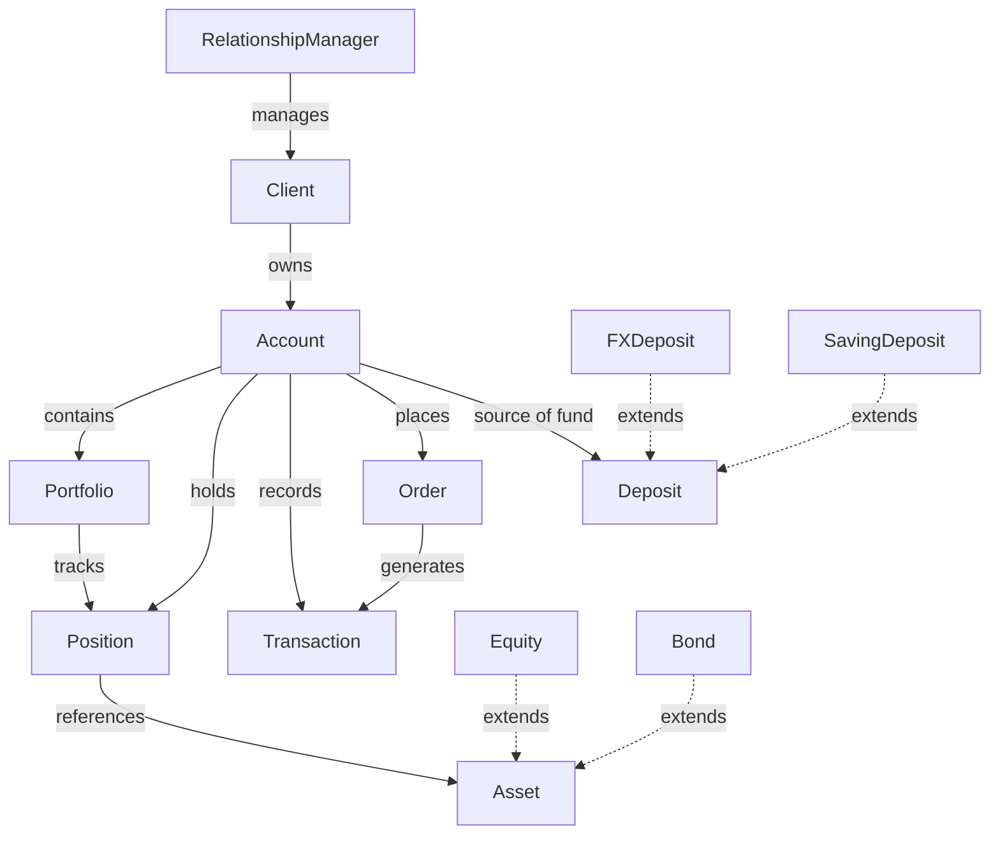
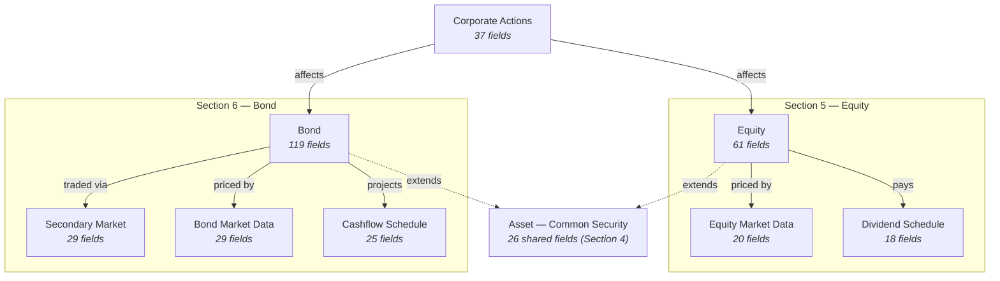

# 02 — Vahalla Wealth Data Specification

> **Document Index:** [00-index.md](00-index.md) | **Related:** [02.1 — CSV Sample Data](02.1-sample-data-csv-equity-bond.md) | [02.2 — Position CSV](02.2-sample-data-csv-position.md) | [02.3 — Transaction & Order CSV](02.3-sample-data-csv-transaction-order.md)

| | |
|---|---|
| **Document Title** | Investment Module - Equity & Bond Specification |
| **System** | Vahalla Wealth Management System |
| **Document Version** | 1.8 |
| **Date** | 2026-02-09 |
| **Classification** | Confidential |
| **Status** | Draft |
| **Prepared By** | Vahalla System Team |

### Revision History

| Version | Date | Author | Description |
|---|---|---|---|
| 1.0 | 2025-09-10 | Vahalla System Team | Initial draft — Equity & Bond specification with common identification, equity, and bond field tables |
| 1.1 | 2025-10-22 | Vahalla System Team | Added Equity Additional Data sections (analyst ratings, financials, valuation metrics, technical indicators, ownership) |
| 1.2 | 2025-12-05 | Vahalla System Team | Added Bond Additional Data sections (credit analysis, bond metrics, call/put features); added Appendix A enum reference tables |
| 1.3 | 2026-01-14 | Vahalla System Team | Added Equity & Bond Market Data Feed sections with OHLC, VWAP, bid/ask, volume; merged Asset Price into Market Data Feeds |
| 1.4 | 2026-01-28 | Vahalla System Team | Added Equity Dividend Schedule, Bond Cashflow Schedule, and Corporate Actions entities; restructured field numbering per entity |
| 1.5 | 2026-02-05 | Vahalla System Team | Added Entity Summary table (Section 3.5); added key fields (assetId, isin, timestamp) to all feed entities; renumbered all sections |
| 1.6 | 2026-02-06 | Vahalla System Team | ThaiBMA alignment — added bond coupon type, amortization, inflation-linked, tax & regulatory, local identifiers (ThaiBMA symbol), issuance details, settlement & custody (TSD), ESG/green bond, local credit ratings (TRIS, Fitch Thai), benchmark & spread analysis, yield curve reference, official MTM pricing, investor holdings, repo & lending; added turnover metrics to Bond Market Data Feed |
| 1.7 | 2026-02-09 | Vahalla System Team | Added Bond Secondary Market Trading entity (Section 6.17) — trade identification, classification (outright, repo, switch, when-issued), economics, counterparty, ThaiBMA trade reporting, repo-specific fields; removed Asset Valuation (merged into Position); updated entity diagrams |
| 1.8 | 2026-02-09 | Vahalla System Team | Added `marketType` field (`PRIMARY` / `SECONDARY`) to Bond Issuance Details (Section 6.4) and Bond Secondary Market Trade Classification (Section 6.17.2); added Appendix A.15 MarketType enum; renumbered bond fields accordingly |

---

## 1. Purpose

This document specifies the data fields, formats, and standards required from banking partners to integrate securities data into our Wealth Management System. The data model is aligned with the **ISO 20022** financial messaging standard to ensure interoperability, consistency, and regulatory compliance across all partners. The system consolidates investment data from multiple banks and presents it to Relationship Managers (RMs) for portfolio management and client advisory.

**This version covers Equity and Bond (Fixed Income) asset classes only.** Specifications for other asset classes (Derivatives, Investment Funds, FX, Structured Products, Commodities, Money Market) will be provided separately.

---

## 2. Entity Relationship Overview

### 2.1 Wealth Management Entities (doc 01)

The following diagram illustrates the relationships between the core entities in the Vahalla Wealth Management System.



### 2.2 Security Data Model (this document)



---

## 3. Data Standards & Conventions

### 3.1 Applicable ISO Standards

| Standard | Description | Usage |
|---|---|---|
| **ISO 6166** | ISIN — International Securities Identification Number | Primary security identifier (12 chars) |
| **ISO 6167** | CUSIP — Committee on Uniform Securities Identification Procedures | US/Canada security identifier (9 chars) |
| **SEDOL** | Stock Exchange Daily Official List | UK/Ireland security identifier (7 chars) |
| **ISO 17442** | LEI — Legal Entity Identifier | Issuer identification (20 chars) |
| **ISO 18774** | FISN — Financial Instrument Short Name | Standardized short name (max 35 chars) |
| **ISO 10962** | CFI — Classification of Financial Instruments | Instrument classification (6 chars) |
| **ISO 10383** | MIC — Market Identifier Code | Exchange/venue identification (4 chars) |
| **ISO 4217** | Currency Codes | All currency fields (3 chars, e.g. USD, EUR, THB) |
| **ISO 3166** | Country Codes | Country of issuance (2-char alpha) |
| **ISO 8601** | Date/Time Format | All date and timestamp fields |
| **ISO 20022** | Financial Messaging Standard | Overall data model alignment |

### 3.2 Data Type Definitions

| Data Type | Format | Example |
|---|---|---|
| `String` | UTF-8 text | `"Apple Inc."` |
| `Decimal` | Numeric with decimal precision (up to 18 digits) | `150.2500` |
| `Int` | Integer | `100` |
| `Boolean` | `true` / `false` | `true` |
| `Date` | ISO 8601 date: `YYYY-MM-DD` | `2026-01-15` |
| `DateTime` | ISO 8601 with timezone: `YYYY-MM-DDTHH:MM:SSZ` | `2026-01-15T09:30:00Z` |
| `Enum` | Predefined value from allowed list | `COMMON` |

### 3.3 Field Requirement Levels

| Level | Label | Meaning |
|---|---|---|
| **Required** | Required | Must be provided. Record will be rejected without this field. |
| **Conditionally Required** | Conditional | Required when a specific condition is met (noted in Description). |
| **Optional** | Optional | Provide if available. Enhances data quality. |

### 3.4 Delivery Format

- **Preferred:** JSON or XML (ISO 20022 compliant messages)
- **Acceptable:** CSV with header row matching field names, or plain text (fixed-width/delimited)
- **Encoding:** UTF-8
- **Frequency:** Daily end-of-day batch, or real-time via API

### 3.5 Entity Summary

This document defines the following entities. Each entity has its own field numbering (`#`) starting from 1. The **Common** fields (Section 4) are shared across all entities via the `Asset` and `Security` interfaces.

| Entity / Object | Section | # Fields | Description | ISO 20022 Message | Frequency |
|---|---|---|---|---|---|
| **Common Security** | Section 4 | 26 | Shared identification, classification, and timestamps for all securities | `reda.041` | Static / On change |
| **Equity** | Section 5.1–5.6 | 61 | Equity-specific fields: fundamentals, analyst ratings, financials, valuation, technicals, ownership | `reda.041` | Static / Daily |
| **Equity Market Data** | Section 5.7 | 20 | Real-time / EOD market data feed for equities: OHLC prices, VWAP, volume, liquidity, source | `semt.002` | Intraday / EOD |
| **Equity Dividend Schedule** | Section 5.8 | 18 | Declared and projected dividends: amount, dates, tax, stock dividends, DRIP | `seev.031` | On declaration / Daily |
| **Bond** | Section 6.1–6.16 | 119 | Bond-specific fields: coupon, amortization, inflation-linked, tax, local identifiers, issuance, market type, settlement, ESG, credit, call/put, analytics, benchmark, yield curve, MTM, duration, investor holdings, repo/lending | `reda.041`, `semt.002` | Static / Daily |
| **Bond Secondary Market** | Section 6.17 | 29 | Secondary market trade data: trade type, market type, counterparty, execution venue, economics, ThaiBMA reporting, repo-specific fields | `sese.023` | Per trade / Daily |
| **Bond Market Data** | Section 6.18 | 29 | Real-time / EOD market data feed for bonds: prices, yields, clean/dirty, volume, liquidity, turnover, source | `semt.002` | Intraday / EOD |
| **Bond Cashflow Schedule** | Section 6.19 | 25 | Projected coupon, principal, and redemption cashflows per bond: accrual, payment dates, floating rate | `reda.041` | On issuance / On change |
| **Corporate Actions** | Section 7 | 37 | Corporate action events for equity and bond: splits, mergers, dividends, calls, tenders | `seev.031` | On event / Daily |

> **Note:** Field `#` restarts from 1 for each entity. When combining entities in a CSV file, use the field name (not `#`) as the unique column identifier.

---

## 4. Common Security Identification Fields

These fields apply to **all securities** (Equity and Bond). Every record must include these fields.

### 4.1 Primary Identification

| # | Field Name | Data Type | Required | Description | Example | ISO 20022 Reference |
|---|---|---|---|---|---|---|
| 1 | `id` | String | Required | Unique identifier assigned by the bank for this security record | `"SEC-001234"` | reda.041 — `SctyId/OthrId/Id` |
| 2 | `isin` | String | Required | ISIN code per ISO 6166 (12 chars) | `"US0378331005"` | reda.041 — `SctyId/ISIN` |
| 3 | `cusip` | String | Optional | CUSIP identifier (9 chars, US/Canada securities) | `"037833100"` | reda.041 — `SctyId/OthrId/Id` (CUSIP) |
| 4 | `sedol` | String | Optional | SEDOL identifier (7 chars, UK/Ireland securities) | `"2046251"` | reda.041 — `SctyId/OthrId/Id` (SEDOL) |
| 5 | `ticker` | String | Optional | Exchange ticker symbol | `"AAPL"` | reda.041 — `SctyId/TckrSymb` |
| 6 | `name` | String | Required | Full legal name of the security | `"Apple Inc. Common Stock"` | reda.041 — `FinInstrmAttrbts/Nm` |
| 7 | `assetClass` | Enum | Required | Must be `SECURITIES` for all records in this specification | `"SECURITIES"` | reda.041 — `FinInstrmAttrbts/ClssfctnTp` |

### 4.2 Issuer & Classification

| # | Field Name | Data Type | Required | Description | Example | ISO 20022 Reference |
|---|---|---|---|---|---|---|
| 8 | `issuer` | String | Optional | Name of the issuing entity | `"Apple Inc."` | reda.041 — `Issr/Nm` |
| 9 | `lei` | String | Optional | Legal Entity Identifier of issuer per ISO 17442 (20 chars) | `"HWUPKR0MPOU8FGXBT394"` | reda.041 — `Issr/LEI` |
| 10 | `fisn` | String | Optional | Financial Instrument Short Name per ISO 18774 (max 35 chars) | `"APPLE INC/SH"` | reda.041 — `FinInstrmAttrbts/FISN` |
| 11 | `cfi` | String | Optional | Classification of Financial Instruments per ISO 10962 (6 chars) | `"ESVUFR"` | reda.041 — `FinInstrmAttrbts/CFICd` |
| 12 | `currency` | String | Required | Trading/denomination currency per ISO 4217 (3 chars) | `"USD"` | reda.041 — `FinInstrmAttrbts/DnmtnCcy` |
| 13 | `country` | String | Optional | Country of issuance per ISO 3166-1 alpha-2 | `"US"` | reda.041 — `FinInstrmAttrbts/CtryOfIsse` |
| 14 | `description` | String | Optional | Free-text description of the security | `"Common shares of Apple Inc."` | reda.041 — `FinInstrmAttrbts/Desc` |
| 15 | `documentUrl` | String | Optional | URL to fund fact sheet, prospectus, or key information document (KID) | `"https://bank.com/docs/AAPL-factsheet.pdf"` | reda.041 — `AddtlInf/InfURL` |

### 4.3 Security Common Fields

| # | Field Name | Data Type | Required | Description | Allowed Values / Example | ISO 20022 Reference |
|---|---|---|---|---|---|---|
| 16 | `securityType` | Enum | Required | Top-level security classification | See [Appendix A.1](#a1-securitytype) | reda.041 — `FinInstrmAttrbts/ClssfctnTp` |
| 17 | `exchange` | String | Optional | Primary exchange name | `"NASDAQ"` | reda.041 — `TradgDtls/PlcOfListg/Nm` |
| 18 | `mic` | String | Optional | Market Identifier Code per ISO 10383 (4 chars) | `"XNAS"` | reda.041 — `TradgDtls/PlcOfListg/MktIdCd` |
| 19 | `tradingStatus` | Enum | Optional | Current trading status | See [Appendix A.2](#a2-tradingstatus) | reda.041 — `TradgDtls/TradgSts` |
| 20 | `formOfSecurity` | Enum | Optional | Form of security holding | See [Appendix A.3](#a3-formofsecurity) | reda.041 — `FinInstrmAttrbts/SctiesForm` |
| 21 | `settlementCycle` | Enum | Optional | Standard settlement cycle | See [Appendix A.4](#a4-settlementcycle) | reda.041 — `TradgDtls/SttlmCycl` |
| 22 | `minimumDenomination` | Decimal | Optional | Minimum tradeable denomination | `1000.00` | reda.041 — `FinInstrmAttrbts/MinDnmtn` |
| 23 | `listingDate` | Date | Optional | Date the security was listed on the exchange | `"2024-03-15"` | reda.041 — `TradgDtls/ListgDt` |
| 24 | `maturityDate` | Date | Optional | Maturity date (applicable to bonds/notes) | `"2034-03-15"` | reda.041 — `FinInstrmAttrbts/MtrtyDt` |

### 4.4 Timestamps

| # | Field Name | Data Type | Required | Description | Example | ISO 20022 Reference |
|---|---|---|---|---|---|---|
| 25 | `createdAt` | DateTime | Required | Record creation timestamp | `"2026-01-15T09:30:00Z"` | reda.041 — `CreDtTm` |
| 26 | `updatedAt` | DateTime | Required | Last update timestamp | `"2026-02-01T14:00:00Z"` | reda.041 — `UpdDtTm` |

---

## 5. Equity Data Fields

For records where `securityType` = `EQUITY`, `PREFERRED_STOCK`, `CONVERTIBLE_BOND`, or `WARRANT`.

### 5.1 Equity-Specific Fields

| # | Field Name | Data Type | Required | Description | Allowed Values / Example | ISO 20022 Reference |
|---|---|---|---|---|---|---|
| 1 | `equityType` | Enum | Required | Specific equity sub-type | See [Appendix A.5](#a5-equitytype) | reda.041 — `Eqty/EqtyTp` |
| 2 | `sector` | String | Optional | GICS or ICB sector classification | `"Information Technology"` | reda.041 — `Eqty/Sctr` |
| 3 | `industry` | String | Optional | Industry sub-classification | `"Consumer Electronics"` | reda.041 — `Eqty/Indstry` |
| 4 | `marketCap` | Decimal | Optional | Market capitalization in trading currency | `2850000000000.00` | reda.041 — `Eqty/MktCptlstn` |
| 5 | `sharesOutstanding` | Decimal | Optional | Total shares outstanding | `15500000000` | reda.041 — `Eqty/ShrsOutstndg` |
| 6 | `dividendYield` | Decimal | Optional | Annual dividend yield (percentage, e.g. 1.5 = 1.5%) | `0.55` | reda.041 — `Eqty/DvddYld` |
| 7 | `beta` | Decimal | Optional | Beta coefficient vs. benchmark | `1.28` | — (supplementary) |
| 8 | `eps` | Decimal | Optional | Earnings per share (trailing 12 months) | `6.42` | reda.041 — `Eqty/ErngsPerShr` |
| 9 | `peRatio` | Decimal | Optional | Price-to-earnings ratio | `29.50` | reda.041 — `Eqty/PricErngsRatio` |
| 10 | `votingRights` | Boolean | Optional | Whether shares carry voting rights | `true` | reda.041 — `Eqty/VtngRghts` |
| 11 | `dividendFrequency` | Enum | Optional | Dividend payment frequency | See [Appendix A.6](#a6-paymentfrequency) | reda.041 — `Eqty/DvddPmtFrqcy` |
| 12 | `parValue` | Decimal | Optional | Par/nominal value per share | `0.00001` | reda.041 — `FinInstrmAttrbts/ParVal` |
| 13 | `delistingDate` | Date | Optional | Date the security was/will be delisted | `"2026-12-31"` | reda.041 — `TradgDtls/DlstgDt` |
| 14 | `lotSize` | Int | Optional | Standard trading lot size | `100` | reda.041 — `TradgDtls/LotSz` |
| 15 | `boardLot` | Int | Optional | Board lot size (if different from lot size) | `100` | reda.041 — `TradgDtls/BrdLotSz` |
| 16 | `priceMultiplier` | Decimal | Optional | Contract/price multiplier | `1.00` | reda.041 — `TradgDtls/PricMltplr` |
| 17 | `restrictionType` | Enum | Optional | Trading restriction classification | See [Appendix A.7](#a7-restrictiontype) | reda.041 — `TradgDtls/RstrctnTp` |
| 18 | `paymentStatus` | Enum | Optional | Share payment status | See [Appendix A.8](#a8-paymentstatus) | reda.041 — `Eqty/PmtSts` |

### 5.2 Equity Additional Data — Analyst Ratings

Provide if available. Used for RM advisory dashboards.

| # | Field Name | Data Type | Required | Description | Example | ISO 20022 Reference |
|---|---|---|---|---|---|---|
| 19 | `consensusRating` | String | Optional | Consensus analyst recommendation | `"BUY"`, `"HOLD"`, `"SELL"` | — (supplementary) |
| 20 | `numberOfAnalysts` | Int | Optional | Number of analysts covering | `42` | — (supplementary) |
| 21 | `buyRatings` | Int | Optional | Number of buy recommendations | `30` | — (supplementary) |
| 22 | `holdRatings` | Int | Optional | Number of hold recommendations | `10` | — (supplementary) |
| 23 | `sellRatings` | Int | Optional | Number of sell recommendations | `2` | — (supplementary) |
| 24 | `targetPrice` | Decimal | Optional | Consensus target price | `210.00` | — (supplementary) |
| 25 | `priceTarget12M` | Decimal | Optional | 12-month forward target price | `225.00` | — (supplementary) |

### 5.3 Equity Additional Data — Financial Metrics

Provide if available. Sourced from latest financial statements.

| # | Field Name | Data Type | Required | Description | Example | ISO 20022 Reference |
|---|---|---|---|---|---|---|
| 26 | `revenue` | Decimal | Optional | Total revenue (trailing 12 months) | `394328000000.00` | — (supplementary) |
| 27 | `revenueGrowth` | Decimal | Optional | Year-over-year revenue growth (%) | `8.10` | — (supplementary) |
| 28 | `netIncome` | Decimal | Optional | Net income (trailing 12 months) | `96995000000.00` | — (supplementary) |
| 29 | `netIncomeGrowth` | Decimal | Optional | Year-over-year net income growth (%) | `10.20` | — (supplementary) |
| 30 | `ebitda` | Decimal | Optional | EBITDA | `130541000000.00` | — (supplementary) |
| 31 | `ebitdaMargin` | Decimal | Optional | EBITDA margin (%) | `33.10` | — (supplementary) |
| 32 | `operatingMargin` | Decimal | Optional | Operating margin (%) | `30.74` | — (supplementary) |
| 33 | `profitMargin` | Decimal | Optional | Net profit margin (%) | `24.60` | — (supplementary) |
| 34 | `roe` | Decimal | Optional | Return on equity (%) | `160.09` | — (supplementary) |
| 35 | `roa` | Decimal | Optional | Return on assets (%) | `28.30` | — (supplementary) |
| 36 | `debtToEquity` | Decimal | Optional | Debt-to-equity ratio | `1.87` | — (supplementary) |
| 37 | `currentRatio` | Decimal | Optional | Current ratio | `0.99` | — (supplementary) |
| 38 | `quickRatio` | Decimal | Optional | Quick ratio | `0.94` | — (supplementary) |
| 39 | `freeCashFlow` | Decimal | Optional | Free cash flow | `111443000000.00` | — (supplementary) |

### 5.4 Equity Additional Data — Valuation Metrics

| # | Field Name | Data Type | Required | Description | Example | ISO 20022 Reference |
|---|---|---|---|---|---|---|
| 40 | `priceToBook` | Decimal | Optional | Price-to-book ratio | `47.20` | — (supplementary) |
| 41 | `priceToSales` | Decimal | Optional | Price-to-sales ratio | `7.50` | — (supplementary) |
| 42 | `evToEbitda` | Decimal | Optional | Enterprise value to EBITDA | `22.30` | — (supplementary) |
| 43 | `evToSales` | Decimal | Optional | Enterprise value to sales | `7.40` | — (supplementary) |
| 44 | `pegRatio` | Decimal | Optional | Price/earnings-to-growth ratio | `2.80` | — (supplementary) |
| 45 | `dividendPayoutRatio` | Decimal | Optional | Dividend payout ratio (%) | `15.40` | — (supplementary) |
| 46 | `earningsYield` | Decimal | Optional | Earnings yield (%) | `3.39` | — (supplementary) |

### 5.5 Equity Additional Data — Technical Indicators

| # | Field Name | Data Type | Required | Description | Example | ISO 20022 Reference |
|---|---|---|---|---|---|---|
| 47 | `rsi` | Decimal | Optional | Relative Strength Index (0–100) | `58.30` | — (supplementary) |
| 48 | `macd` | Decimal | Optional | MACD value | `2.15` | — (supplementary) |
| 49 | `sma50` | Decimal | Optional | 50-day Simple Moving Average | `182.50` | — (supplementary) |
| 50 | `sma200` | Decimal | Optional | 200-day Simple Moving Average | `175.20` | — (supplementary) |
| 51 | `ema50` | Decimal | Optional | 50-day Exponential Moving Average | `183.10` | — (supplementary) |
| 52 | `ema200` | Decimal | Optional | 200-day Exponential Moving Average | `176.00` | — (supplementary) |
| 53 | `bollingerUpper` | Decimal | Optional | Bollinger Band upper | `195.00` | — (supplementary) |
| 54 | `bollingerLower` | Decimal | Optional | Bollinger Band lower | `170.00` | — (supplementary) |
| 55 | `atr` | Decimal | Optional | Average True Range | `3.45` | — (supplementary) |

### 5.6 Equity Additional Data — Ownership

| # | Field Name | Data Type | Required | Description | Example | ISO 20022 Reference |
|---|---|---|---|---|---|---|
| 56 | `institutionalOwnership` | Decimal | Optional | Institutional ownership (%) | `60.50` | — (supplementary) |
| 57 | `insiderOwnership` | Decimal | Optional | Insider ownership (%) | `0.07` | — (supplementary) |
| 58 | `publicFloat` | Decimal | Optional | Public float (%) | `99.93` | — (supplementary) |
| 59 | `sharesShort` | Decimal | Optional | Number of shares sold short | `120000000` | — (supplementary) |
| 60 | `shortRatio` | Decimal | Optional | Short ratio (days to cover) | `1.90` | — (supplementary) |
| 61 | `shortPercentOfFloat` | Decimal | Optional | Short interest as % of float | `0.80` | — (supplementary) |

### 5.7 Equity Market Data Feed

> **Source:** Real-time or end-of-day market data feed. These fields are updated intraday or at market close and are distinct from static reference data (Section 5.1–5.4). Portfolio-level valuation is handled by the Position entity ([01 — Wealth Management Specification](01-wealth-management-specification.md)).

#### 5.7.1 Key Fields

| # | Field Name | Data Type | Required | Description | Example | ISO 20022 Reference |
|---|---|---|---|---|---|---|
| 1 | `assetId` | String | Required | Reference to the security record ID (foreign key to Section 4 `id`) | `"SEC-EQ-001"` | semt.002 — `FinInstrmId/OthrId/Id` |
| 2 | `isin` | String | Required | ISIN of the security (alternative key) | `"US0378331005"` | semt.002 — `FinInstrmId/ISIN` |
| 3 | `timestamp` | DateTime | Required | Market data snapshot timestamp | `"2026-02-08T16:00:00Z"` | semt.002 — `MktPric/PricDtTm` |
| 4 | `currency` | String | Required | Price currency per ISO 4217 | `"USD"` | semt.002 — `MktPric/Ccy` |
| 5 | `source` | String | Optional | Pricing source | `"Bloomberg"`, `"Reuters"` | semt.002 — `MktPric/SrcOfPric` |

#### 5.7.2 Equity Prices

| # | Field Name | Data Type | Required | Description | Example | ISO 20022 Reference |
|---|---|---|---|---|---|---|
| 6 | `bidPrice` | Decimal | Optional | Bid price | `185.45` | semt.002 — `MktPric/BdPric` |
| 7 | `askPrice` | Decimal | Optional | Ask price | `185.55` | semt.002 — `MktPric/AskPric` |
| 8 | `midPrice` | Decimal | Optional | Mid price | `185.50` | semt.002 — `MktPric/MdPric` |
| 9 | `lastTradePrice` | Decimal | Optional | Last traded price | `185.50` | semt.002 — `MktPric/LastTradPric` |
| 10 | `openPrice` | Decimal | Optional | Opening price | `184.20` | semt.002 — `MktPric/OpnPric` |
| 11 | `highPrice` | Decimal | Optional | Intraday high price | `186.75` | semt.002 — `MktPric/HghPric` |
| 12 | `lowPrice` | Decimal | Optional | Intraday low price | `183.90` | semt.002 — `MktPric/LwPric` |
| 13 | `closePrice` | Decimal | Optional | Closing price | `185.50` | semt.002 — `MktPric/ClsPric` |
| 14 | `previousClosePrice` | Decimal | Optional | Previous session closing price | `184.00` | semt.002 — `MktPric/PrvsClsPric` |
| 15 | `volumeWeightedAveragePrice` | Decimal | Optional | VWAP | `185.32` | semt.002 — `MktPric/VWAP` |

#### 5.7.3 Equity Volume & Liquidity

| # | Field Name | Data Type | Required | Description | Example | ISO 20022 Reference |
|---|---|---|---|---|---|---|
| 16 | `volume` | Decimal | Optional | Latest trading volume | `54230000` | semt.002 — `MktPric/Vol` |
| 17 | `averageVolume` | Decimal | Optional | Average daily trading volume (30-day) | `62100000` | semt.002 — `MktPric/AvrgDlyVol` |
| 18 | `numberOfTrades` | Int | Optional | Number of trades in session | `245000` | semt.002 — `MktPric/NbOfTrds` |
| 19 | `turnover` | Decimal | Optional | Total turnover value (price × volume) | `10050000000.00` | semt.002 — `MktPric/Trnvr` |
| 20 | `lastUpdateTime` | DateTime | Optional | Last market data update time | `"2026-02-08T16:00:00Z"` | semt.002 — `MktPric/LastUpdtTm` |

### 5.8 Equity Dividend Schedule

> **Source:** Generated from declared dividends and historical patterns. Linked to the equity record via `assetId`. One row per dividend event.

#### 5.8.1 Key Fields

| # | Field Name | Data Type | Required | Description | Example | ISO 20022 Reference |
|---|---|---|---|---|---|---|
| 1 | `assetId` | String | Required | Reference to the equity record ID (foreign key to Section 4 `id`) | `"SEC-EQ-001"` | seev.031 — `CorpActnGnlInf/FinInstrmId/OthrId/Id` |
| 2 | `isin` | String | Required | ISIN of the equity (alternative key) | `"US0378331005"` | seev.031 — `CorpActnGnlInf/FinInstrmId/ISIN` |
| 3 | `dividendId` | String | Required | Unique identifier for this dividend entry | `"DIV-EQ001-20260315-CASH"` | seev.031 — `CorpActnGnlInf/EvtId` |

#### 5.8.2 Dividend Details

| # | Field Name | Data Type | Required | Description | Allowed Values / Example | ISO 20022 Reference |
|---|---|---|---|---|---|---|
| 4 | `dividendType` | Enum | Required | Type of dividend | `"CASH"`, `"STOCK"`, `"SPECIAL"`, `"INTERIM"`, `"FINAL"`, `"RETURN_OF_CAPITAL"`, `"SCRIP"` | seev.031 — `CorpActnDtls/DvddTp` |
| 5 | `amountPerShare` | Decimal | Required | Dividend amount per share | `0.24` | seev.031 — `CorpActnDtls/GrssDvddPerShr/Amt` |
| 6 | `currency` | String | Required | Payment currency per ISO 4217 | `"USD"` | seev.031 — `CorpActnDtls/GrssDvddPerShr/Ccy` |
| 7 | `netAmountPerShare` | Decimal | Optional | Net dividend per share (after withholding tax) | `0.204` | seev.031 — `CorpActnDtls/NetDvddPerShr/Amt` |
| 8 | `withholdingTaxRate` | Decimal | Optional | Withholding tax rate (%) | `15.00` | seev.031 — `CorpActnDtls/TaxRate` |
| 9 | `dividendYield` | Decimal | Optional | Annualised dividend yield at declaration (%) | `0.52` | seev.031 — `CorpActnDtls/DvddYld` |

#### 5.8.3 Key Dates

| # | Field Name | Data Type | Required | Description | Example | ISO 20022 Reference |
|---|---|---|---|---|---|---|
| 10 | `declarationDate` | Date | Required | Date the dividend was declared | `"2026-01-30"` | seev.031 — `CorpActnDtls/AnncmntDt` |
| 11 | `exDividendDate` | Date | Required | Ex-dividend date (shares trade without dividend after this date) | `"2026-02-07"` | seev.031 — `CorpActnDtls/ExDvddDt` |
| 12 | `recordDate` | Date | Required | Record date for determining payment eligibility | `"2026-02-10"` | seev.031 — `CorpActnDtls/RcrdDt` |
| 13 | `paymentDate` | Date | Required | Dividend payment date | `"2026-02-15"` | seev.031 — `CorpActnDtls/PmtDt` |

#### 5.8.4 Stock Dividend (if applicable)

| # | Field Name | Data Type | Required | Description | Example | ISO 20022 Reference |
|---|---|---|---|---|---|---|
| 14 | `stockDividendRatio` | String | Conditional | Stock dividend ratio (e.g. "1:20" = 1 new share per 20 held). Required if `dividendType` = `STOCK` | `"1:20"` | seev.031 — `CorpActnDtls/ShrRatio` |
| 15 | `stockDividendIsin` | String | Optional | ISIN of the shares distributed (if different from parent) | `"US0378331005"` | seev.031 — `CorpActnDtls/NewSctyISIN` |

#### 5.8.5 Frequency & Status

| # | Field Name | Data Type | Required | Description | Allowed Values / Example | ISO 20022 Reference |
|---|---|---|---|---|---|---|
| 16 | `frequency` | Enum | Optional | Dividend payment frequency | See [Appendix A.6](#a6-paymentfrequency) | seev.031 — `CorpActnDtls/PmtFrqcy` |
| 17 | `status` | Enum | Optional | Status of the dividend | `"DECLARED"`, `"CONFIRMED"`, `"PAID"`, `"CANCELLED"`, `"ESTIMATED"` | seev.031 — `CorpActnDtls/PrcgSts` |
| 18 | `reinvestmentEligible` | Boolean | Optional | Whether DRIP (Dividend Reinvestment Plan) is available | `true` | seev.031 — `CorpActnDtls/DRIPInd` |

---

## 6. Bond (Fixed Income) Data Fields

For records where `securityType` = `BOND`, `CONVERTIBLE_BOND`, or `DEBENTURE`.

### 6.1 Bond-Specific Fields

| # | Field Name | Data Type | Required | Description | Allowed Values / Example | ISO 20022 Reference |
|---|---|---|---|---|---|---|
| 1 | `bondType` | Enum | Required | Bond sub-type classification | See [Appendix A.9](#a9-bondtype) | reda.041 — `Debt/DebtTp` |
| 2 | `faceValue` | Decimal | Required | Par/face value per unit | `1000.00` | reda.041 — `Debt/FaceAmt` |
| 3 | `couponRate` | Decimal | Required | Annual coupon rate (%, e.g. 5.25 = 5.25%) | `5.25` | reda.041 — `Debt/IntrstRate` |
| 4 | `issueDate` | Date | Required | Original issuance date | `"2024-03-15"` | reda.041 — `Debt/IsseDt` |
| 5 | `issuePrice` | Decimal | Optional | Price at issuance (% of face value) | `99.50` | reda.041 — `Debt/IssePric` |
| 6 | `redemptionPrice` | Decimal | Optional | Redemption price (% of face value) | `100.00` | reda.041 — `Debt/RedPric` |
| 7 | `paymentFrequency` | Enum | Optional | Coupon payment frequency | See [Appendix A.6](#a6-paymentfrequency) | reda.041 — `Debt/IntrstPmtFrqcy` |
| 8 | `dayCountBasis` | Enum | Optional | Day count convention for interest calculation | See [Appendix A.10](#a10-daycountbasis) | reda.041 — `Debt/DayCntBsis` |
| 9 | `accrualStartDate` | Date | Optional | Interest accrual start date | `"2024-03-15"` | reda.041 — `Debt/AcrlStrtDt` |
| 10 | `firstCouponDate` | Date | Optional | First coupon payment date | `"2024-09-15"` | reda.041 — `Debt/FrstCpnDt` |
| 11 | `lastCouponDate` | Date | Optional | Last coupon payment date before maturity | `"2034-03-15"` | reda.041 — `Debt/LastCpnDt` |
| 12 | `businessDayConvention` | Enum | Optional | Business day adjustment rule | See [Appendix A.11](#a11-businessdayconvention) | reda.041 — `Debt/BizDayCnvtn` |
| 13 | `interestComputationMethod` | String | Optional | Interest computation method description | `"30/360"` | reda.041 — `Debt/IntrstCmptnMtd` |
| 14 | `couponType` | Enum | Required | Coupon structure type | `"FIXED"`, `"FLOATING"`, `"ZERO_COUPON"`, `"STEP_UP"`, `"STEP_DOWN"`, `"INFLATION_LINKED"`, `"VARIABLE"` | reda.041 — `Debt/IntrstTp` |
| 15 | `originalFaceValue` | Decimal | Optional | Original face value at issuance (before amortization) | `1000.00` | reda.041 — `Debt/OrgnlFaceAmt` |
| 16 | `currentFaceValue` | Decimal | Optional | Current face value (after amortization/partial redemption) | `750.00` | reda.041 — `Debt/CurFaceAmt` |
| 17 | `amortizationType` | Enum | Optional | Amortization schedule type | `"BULLET"`, `"AMORTIZING"`, `"SINKING_FUND"`, `"CUSTOM"` | reda.041 — `Debt/AmrTp` |
| 18 | `amortizationFactor` | Decimal | Optional | Current pool/amortization factor (0–1, where 1 = no amortization) | `0.75` | reda.041 — `Debt/Fctr` |
| 19 | `inflationIndex` | String | Optional | Inflation index name (for inflation-linked bonds) | `"CPI"`, `"HICP"`, `"Thai_CPI"` | reda.041 — `Debt/InfltnIdx` |
| 20 | `baseIndexValue` | Decimal | Optional | Base index value at issuance | `108.50` | reda.041 — `Debt/BaseIdxVal` |
| 21 | `indexRatio` | Decimal | Optional | Current index ratio (current CPI / base CPI) | `1.0325` | reda.041 — `Debt/IdxRatio` |
| 22 | `realYield` | Decimal | Optional | Real yield (inflation-adjusted, %) | `1.25` | reda.041 — `Debt/RealYld` |

### 6.2 Bond Tax & Regulatory

| # | Field Name | Data Type | Required | Description | Allowed Values / Example | ISO 20022 Reference |
|---|---|---|---|---|---|---|
| 23 | `withholdingTaxRate` | Decimal | Optional | Withholding tax rate on coupon (%) | `15.00` | reda.041 — `Debt/TaxDtls/WhldgTaxRate` |
| 24 | `taxExemptStatus` | Enum | Optional | Tax exemption status | `"TAXABLE"`, `"TAX_EXEMPT"`, `"PARTIALLY_EXEMPT"` | reda.041 — `Debt/TaxDtls/TaxXmptSts` |
| 25 | `taxExemptInvestorTypes` | String | Optional | Investor types eligible for tax exemption | `"CENTRAL_BANK, SOVEREIGN_FUND"` | reda.041 — `Debt/TaxDtls/XmptInvstrTp` |
| 26 | `secRegistrationNo` | String | Optional | Securities regulator registration number | `"SEC-TH-2024-001"` | reda.041 — `Debt/RgltryDtls/RegnNb` |
| 27 | `regulatoryClassification` | String | Optional | Regulatory classification (e.g. BOT, SEC, MAS) | `"BOT_REGISTERED"` | reda.041 — `Debt/RgltryDtls/ClssfctnTp` |

### 6.3 Bond Local Identifiers & Classification

| # | Field Name | Data Type | Required | Description | Example | ISO 20022 Reference |
|---|---|---|---|---|---|---|
| 28 | `localSymbol` | String | Optional | Local market symbol (e.g. ThaiBMA symbol) | `"LB256A"` | reda.041 — `SctyId/OthrId/Id` (LOCAL) |
| 29 | `localSymbolSource` | String | Optional | Source of local symbol | `"THAIBMA"`, `"BURSA"`, `"SGX"` | reda.041 — `SctyId/OthrId/IdSrc` |
| 30 | `localSectorClassification` | String | Optional | Local market sector classification | `"GOVERNMENT"`, `"STATE_ENTERPRISE"`, `"CORPORATE"`, `"FINANCIAL_INSTITUTION"` | reda.041 — `FinInstrmAttrbts/ClssfctnTp` |
| 31 | `localSubSector` | String | Optional | Local market sub-sector | `"BANKING"`, `"ENERGY"`, `"PROPERTY"` | reda.041 — `FinInstrmAttrbts/SubClssfctnTp` |

### 6.4 Bond Issuance Details

| # | Field Name | Data Type | Required | Description | Allowed Values / Example | ISO 20022 Reference |
|---|---|---|---|---|---|---|
| 32 | `marketType` | Enum | Required | Indicates whether the bond is offered in the primary or secondary market | See [Appendix A.15](#a15-markettype) | reda.041 — `Debt/MktTp` |
| 33 | `issueSize` | Decimal | Optional | Total issuance size (face value) | `50000000000.00` | reda.041 — `Debt/TtlIssdNmnlAmt` |
| 34 | `issueSizeCurrency` | String | Optional | Currency of issue size per ISO 4217 | `"THB"` | reda.041 — `Debt/TtlIssdNmnlAmt/Ccy` |
| 35 | `issueMethod` | Enum | Optional | Method of issuance | `"AUCTION"`, `"PRIVATE_PLACEMENT"`, `"PUBLIC_OFFERING"`, `"BOOK_BUILDING"`, `"TAP_ISSUE"` | reda.041 — `Debt/IsseMtd` |
| 36 | `leadManager` | String | Optional | Lead manager / bookrunner | `"Krungthai Bank"` | reda.041 — `Debt/LeadMgr/Nm` |
| 37 | `leadManagerLei` | String | Optional | LEI of lead manager | `"549300R2YVKC5QQXMV07"` | reda.041 — `Debt/LeadMgr/LEI` |
| 38 | `sellingGroup` | String | Optional | Selling group / co-managers | `"SCB, BBL, KBANK"` | reda.041 — `Debt/SellgGrp` |
| 39 | `programName` | String | Optional | Issuance program name (for MTN, CP programs) | `"PTT Global Chemical MTN Programme"` | reda.041 — `Debt/PrgrmNm` |

### 6.5 Bond Settlement & Custody

| # | Field Name | Data Type | Required | Description | Example | ISO 20022 Reference |
|---|---|---|---|---|---|---|
| 40 | `csdCode` | String | Optional | Central Securities Depository code | `"TSD"`, `"EUROCLEAR"`, `"CLEARSTREAM"`, `"DTC"` | reda.041 — `SttlmDtls/CSD/Id` |
| 41 | `csdAccountId` | String | Optional | CSD account identifier | `"TSD-ACC-001"` | reda.041 — `SttlmDtls/CSD/AcctId` |
| 42 | `registrarAgent` | String | Optional | Bond registrar / transfer agent | `"Thailand Securities Depository"` | reda.041 — `SttlmDtls/Regar/Nm` |
| 43 | `payingAgent` | String | Optional | Paying agent for coupon/principal payments | `"Bank of Thailand"` | reda.041 — `SttlmDtls/PngAgt/Nm` |
| 44 | `settlementLocation` | String | Optional | Settlement location / market | `"THAILAND"`, `"EUROCLEAR"` | reda.041 — `SttlmDtls/SttlmPlc` |

### 6.6 Bond ESG / Green Bond Classification

| # | Field Name | Data Type | Required | Description | Allowed Values / Example | ISO 20022 Reference |
|---|---|---|---|---|---|---|
| 45 | `greenBondFlag` | Boolean | Optional | Whether the bond is classified as a green/sustainable bond | `true` | reda.041 — `Debt/SstnbltyInd` |
| 46 | `esgClassification` | Enum | Optional | ESG bond classification | `"GREEN"`, `"SOCIAL"`, `"SUSTAINABILITY"`, `"SUSTAINABILITY_LINKED"`, `"TRANSITION"`, `"BLUE"` | reda.041 — `Debt/SstnbltyClssfctn` |
| 47 | `useOfProceeds` | String | Optional | Intended use of proceeds | `"Renewable energy, clean transportation"` | reda.041 — `Debt/UseOfPrcds` |
| 48 | `externalReviewProvider` | String | Optional | External review / second-party opinion provider | `"Sustainalytics"`, `"CICERO"`, `"DNV"` | reda.041 — `Debt/XtrnlRvwPrvdr` |
| 49 | `esgFramework` | String | Optional | Framework or standard followed | `"ICMA Green Bond Principles"`, `"CBI Standard"` | reda.041 — `Debt/SstnbltyFrmwrk` |

### 6.7 Bond Credit & Seniority

| # | Field Name | Data Type | Required | Description | Allowed Values / Example | ISO 20022 Reference |
|---|---|---|---|---|---|---|
| 50 | `creditRating` | String | Optional | Primary credit rating | `"AA+"` | reda.041 — `Debt/CdtRtg/Rtg` |
| 51 | `ratingAgency` | String | Optional | Rating agency name | `"S&P"`, `"Moody's"`, `"Fitch"` | reda.041 — `Debt/CdtRtg/RtgAgncy` |
| 52 | `seniority` | Enum | Optional | Debt seniority ranking | See [Appendix A.12](#a12-senioritytype) | reda.041 — `Debt/SnrtyTp` |
| 53 | `securedType` | Enum | Optional | Secured/unsecured classification | See [Appendix A.13](#a13-securedtype) | reda.041 — `Debt/ScrdTp` |
| 54 | `guarantor` | String | Optional | Name of guarantor entity (if any) | `"US Government"` | reda.041 — `Debt/Guarntr/Nm` |
| 55 | `covenants` | String | Optional | Summary of key covenants | `"Negative pledge, cross-default"` | reda.041 — `Debt/Cvnts` |
| 56 | `defaultStatus` | Boolean | Optional | Whether the bond is currently in default | `false` | reda.041 — `Debt/DfltSts` |

### 6.8 Bond Call/Put Features

| # | Field Name | Data Type | Required | Description | Example | ISO 20022 Reference |
|---|---|---|---|---|---|---|
| 57 | `callable` | Boolean | Optional | Whether the bond is callable | `true` | reda.041 — `Debt/CallFeatrs/CallInd` |
| 58 | `callPrice` | Decimal | Conditional | Call price (% of face). Required if `callable` = `true` | `102.00` | reda.041 — `Debt/CallFeatrs/CallPric` |
| 59 | `callDate` | Date | Conditional | First call date. Required if `callable` = `true` | `"2029-03-15"` | reda.041 — `Debt/CallFeatrs/CallDt` |
| 60 | `puttable` | Boolean | Optional | Whether the bond is puttable | `false` | reda.041 — `Debt/PutFeatrs/PutInd` |
| 61 | `putPrice` | Decimal | Conditional | Put price (% of face). Required if `puttable` = `true` | `100.00` | reda.041 — `Debt/PutFeatrs/PutPric` |
| 62 | `putDate` | Date | Conditional | First put date. Required if `puttable` = `true` | `"2029-03-15"` | reda.041 — `Debt/PutFeatrs/PutDt` |

### 6.9 Bond Analytics & Structured Products

| # | Field Name | Data Type | Required | Description | Example | ISO 20022 Reference |
|---|---|---|---|---|---|---|
| 63 | `yieldToMaturity` | Decimal | Optional | Yield to maturity (%) | `5.10` | reda.041 — `Debt/YldToMtrty` |
| 64 | `duration` | Decimal | Optional | Macaulay duration (years) | `7.25` | reda.041 — `Debt/Drtn` |
| 65 | `convexity` | Decimal | Optional | Convexity measure | `62.30` | reda.041 — `Debt/Cnvxty` |
| 66 | `minimumIncrement` | Decimal | Optional | Minimum trading increment | `1000.00` | reda.041 — `TradgDtls/MinIncrmt` |
| 67 | `poolIdentifier` | String | Optional | Pool ID (for securitized bonds, e.g. MBS) | `"POOL-2024-001"` | reda.041 — `Debt/PoolId` |
| 68 | `tranche` | String | Optional | Tranche identifier (for structured bonds) | `"A1"` | reda.041 — `Debt/Trnch` |
| 69 | `series` | String | Optional | Series identifier | `"2024-1"` | reda.041 — `Debt/Srs` |

### 6.10 Bond Credit Analysis

Provide if available. Critical for RM credit risk assessment.

| # | Field Name | Data Type | Required | Description | Example | ISO 20022 Reference |
|---|---|---|---|---|---|---|
| 70 | `creditRatingMoodys` | String | Optional | Moody's credit rating | `"Aa1"` | reda.041 — `Debt/CdtRtg/Rtg` (Moody's) |
| 71 | `creditRatingSP` | String | Optional | S&P credit rating | `"AA+"` | reda.041 — `Debt/CdtRtg/Rtg` (S&P) |
| 72 | `creditRatingFitch` | String | Optional | Fitch credit rating | `"AA+"` | reda.041 — `Debt/CdtRtg/Rtg` (Fitch) |
| 73 | `creditRatingTris` | String | Optional | TRIS Rating (Thai local agency) | `"AAA"` | reda.041 — `Debt/CdtRtg/Rtg` (TRIS) |
| 74 | `creditRatingFitchThai` | String | Optional | Fitch Ratings (Thailand) local rating | `"AA+(tha)"` | reda.041 — `Debt/CdtRtg/Rtg` (Fitch Thai) |
| 75 | `ratingOutlook` | Enum | Optional | Credit rating outlook | `"STABLE"`, `"POSITIVE"`, `"NEGATIVE"`, `"DEVELOPING"`, `"NOT_RATED"` | reda.041 — `Debt/CdtRtg/Otlk` |
| 76 | `ratingDate` | Date | Optional | Date of the most recent rating action | `"2025-11-15"` | reda.041 — `Debt/CdtRtg/RtgDt` |
| 77 | `creditSpread` | Decimal | Optional | Credit spread over benchmark (basis points) | `85.00` | semt.002 — `FinInstrmDtls/CdtSprd` |
| 78 | `zSpread` | Decimal | Optional | Zero-volatility spread (basis points) | `92.00` | semt.002 — `FinInstrmDtls/ZSprd` |
| 79 | `oas` | Decimal | Optional | Option-adjusted spread (basis points) | `78.00` | semt.002 — `FinInstrmDtls/OptnAdjstdSprd` |
| 80 | `probabilityOfDefault` | Decimal | Optional | Probability of default (%) | `0.05` | — (supplementary) |
| 81 | `lossGivenDefault` | Decimal | Optional | Loss given default (%) | `40.00` | — (supplementary) |
| 82 | `recoveryRate` | Decimal | Optional | Expected recovery rate (%) | `60.00` | — (supplementary) |

### 6.11 Bond Benchmark & Spread Analysis

| # | Field Name | Data Type | Required | Description | Example | ISO 20022 Reference |
|---|---|---|---|---|---|---|
| 83 | `benchmarkBondId` | String | Optional | Reference benchmark bond ID (e.g. government bond) | `"TH-GOV-10Y"` | semt.002 — `FinInstrmDtls/BchmrkBnd/Id` |
| 84 | `benchmarkBondIsin` | String | Optional | ISIN of the benchmark bond | `"TH0623A3C603"` | semt.002 — `FinInstrmDtls/BchmrkBnd/ISIN` |
| 85 | `benchmarkSpread` | Decimal | Optional | Spread over benchmark bond (basis points) | `45.00` | semt.002 — `FinInstrmDtls/BchmrkSprd` |
| 86 | `gSpread` | Decimal | Optional | G-spread: spread over interpolated government yield curve (bps) | `52.00` | semt.002 — `FinInstrmDtls/GSprd` |
| 87 | `iSpread` | Decimal | Optional | I-spread: spread over swap curve (bps) | `48.00` | semt.002 — `FinInstrmDtls/ISprd` |
| 88 | `assetSwapSpread` | Decimal | Optional | Asset swap spread (bps) | `55.00` | semt.002 — `FinInstrmDtls/AsstSwpSprd` |

### 6.12 Bond Yield Curve Reference

| # | Field Name | Data Type | Required | Description | Example | ISO 20022 Reference |
|---|---|---|---|---|---|---|
| 89 | `interpolatedYield` | Decimal | Optional | Interpolated yield from reference curve (%) | `2.85` | semt.002 — `FinInstrmDtls/IntrpltdYld` |
| 90 | `parYield` | Decimal | Optional | Par yield at matching tenor (%) | `2.80` | semt.002 — `FinInstrmDtls/ParYld` |
| 91 | `zeroRate` | Decimal | Optional | Zero-coupon (spot) rate at matching tenor (%) | `2.82` | semt.002 — `FinInstrmDtls/ZeroRate` |
| 92 | `forwardRate` | Decimal | Optional | Implied forward rate (%) | `3.10` | semt.002 — `FinInstrmDtls/FwdRate` |
| 93 | `yieldCurveType` | Enum | Optional | Type of yield curve used | `"GOVERNMENT"`, `"CORPORATE_AAA"`, `"CORPORATE_AA"`, `"SWAP"` | semt.002 — `FinInstrmDtls/YldCrvTp` |
| 94 | `yieldCurveDate` | Date | Optional | Date of the yield curve snapshot | `"2026-02-08"` | semt.002 — `FinInstrmDtls/YldCrvDt` |

### 6.13 Bond Official Mark-to-Market

| # | Field Name | Data Type | Required | Description | Example | ISO 20022 Reference |
|---|---|---|---|---|---|---|
| 95 | `officialMtmPrice` | Decimal | Optional | Official mark-to-market price (% of face value) | `99.85` | semt.002 — `MktPric/OffclPric` |
| 96 | `officialMtmYield` | Decimal | Optional | Official MTM yield (%) | `5.12` | semt.002 — `MktPric/OffclYld` |
| 97 | `mtmSource` | String | Optional | Source of official MTM price | `"THAIBMA"`, `"BLOOMBERG_BVAL"`, `"REFINITIV"` | semt.002 — `MktPric/OffclPricSrc` |
| 98 | `mtmDate` | Date | Optional | Date of the official MTM valuation | `"2026-02-08"` | semt.002 — `MktPric/OffclPricDt` |
| 99 | `valuationYield` | Decimal | Optional | Yield used for NAV/portfolio valuation (%) | `5.10` | semt.002 — `MktPric/ValtnYld` |

### 6.14 Bond Duration & Risk Metrics

| # | Field Name | Data Type | Required | Description | Example | ISO 20022 Reference |
|---|---|---|---|---|---|---|
| 100 | `macaulayDuration` | Decimal | Optional | Macaulay duration (years) | `7.25` | semt.002 — `FinInstrmDtls/Drtn` |
| 101 | `modifiedDuration` | Decimal | Optional | Modified duration | `6.90` | semt.002 — `FinInstrmDtls/ModfdDrtn` |
| 102 | `effectiveDuration` | Decimal | Optional | Effective duration (for bonds with optionality) | `6.50` | semt.002 — `FinInstrmDtls/FctvDrtn` |
| 103 | `dv01` | Decimal | Optional | Dollar value of a basis point (per $1M face) | `690.00` | semt.002 — `FinInstrmDtls/DV01` |
| 104 | `convexity` | Decimal | Optional | Convexity measure (additional analytics) | `62.30` | semt.002 — `FinInstrmDtls/Cnvxty` |
| 105 | `yieldToWorst` | Decimal | Optional | Yield to worst (%) | `4.85` | semt.002 — `FinInstrmDtls/YldToWrst` |
| 106 | `yieldToCall` | Decimal | Optional | Yield to call (%) | `4.90` | semt.002 — `FinInstrmDtls/YldToCall` |
| 107 | `yieldToPut` | Decimal | Optional | Yield to put (%) | `5.00` | semt.002 — `FinInstrmDtls/YldToPut` |
| 108 | `currentYield` | Decimal | Optional | Current yield (%) | `5.25` | semt.002 — `FinInstrmDtls/CurYld` |
| 109 | `accruedInterest` | Decimal | Optional | Accrued interest per unit | `13.15` | semt.002 — `FinInstrmDtls/AcrdIntrst` |

### 6.15 Bond Investor Holdings

| # | Field Name | Data Type | Required | Description | Example | ISO 20022 Reference |
|---|---|---|---|---|---|---|
| 110 | `foreignHoldingPct` | Decimal | Optional | Foreign investor holding (%) | `15.30` | semt.002 — `HldgDtls/FrgnHldgPct` |
| 111 | `localInstitutionalPct` | Decimal | Optional | Local institutional investor holding (%) | `55.20` | semt.002 — `HldgDtls/LclInstlHldgPct` |
| 112 | `retailHoldingPct` | Decimal | Optional | Retail investor holding (%) | `8.50` | semt.002 — `HldgDtls/RtlHldgPct` |
| 113 | `centralBankHoldingPct` | Decimal | Optional | Central bank / sovereign holding (%) | `21.00` | semt.002 — `HldgDtls/CntrlBkHldgPct` |
| 114 | `holdingsDate` | Date | Optional | Date of holdings data snapshot | `"2026-01-31"` | semt.002 — `HldgDtls/HldgDt` |

### 6.16 Bond Repo & Lending

| # | Field Name | Data Type | Required | Description | Allowed Values / Example | ISO 20022 Reference |
|---|---|---|---|---|---|---|
| 115 | `repoEligible` | Boolean | Optional | Whether the bond is eligible for repo transactions | `true` | reda.041 — `Debt/RepoElgblty` |
| 116 | `repoRate` | Decimal | Optional | General collateral repo rate (%) | `1.75` | semt.002 — `FinInstrmDtls/RepoRate` |
| 117 | `specialnessSpread` | Decimal | Optional | Specialness spread over GC rate (bps) — indicates demand for specific bond | `25.00` | semt.002 — `FinInstrmDtls/SpclnssSprd` |
| 118 | `lendingAvailability` | Enum | Optional | Securities lending availability | `"AVAILABLE"`, `"LIMITED"`, `"UNAVAILABLE"`, `"ON_SPECIAL"` | semt.002 — `FinInstrmDtls/LndgAvlblty` |
| 119 | `lendingFee` | Decimal | Optional | Securities lending fee (bps) | `10.00` | semt.002 — `FinInstrmDtls/LndgFee` |

### 6.17 Bond Secondary Market Trading

> **Source:** Secondary market trade data reported via ThaiBMA or other trade reporting platforms. One row per trade or aggregated per bond per day.

#### 6.17.1 Trade Identification

| # | Field Name | Data Type | Required | Description | Example | ISO 20022 Reference |
|---|---|---|---|---|---|---|
| 120 | `tradeId` | String | Required | Unique secondary market trade identifier | `"TRD-BD001-20260208-001"` | sese.023 — `TradDtls/TradId` |
| 121 | `tradeDate` | Date | Required | Trade execution date | `"2026-02-08"` | sese.023 — `TradDtls/TradDt` |
| 122 | `tradeTime` | DateTime | Optional | Trade execution timestamp | `"2026-02-08T10:30:00+07:00"` | sese.023 — `TradDtls/TradDtTm` |
| 123 | `settlementDate` | Date | Required | Settlement date | `"2026-02-10"` | sese.023 — `TradDtls/SttlmDt` |

#### 6.17.2 Trade Classification

| # | Field Name | Data Type | Required | Description | Allowed Values / Example | ISO 20022 Reference |
|---|---|---|---|---|---|---|
| 124 | `tradeType` | Enum | Required | Type of secondary market trade | `"OUTRIGHT"`, `"REPO"`, `"REVERSE_REPO"`, `"SWITCH"`, `"WHEN_ISSUED"`, `"BUY_SELL_BACK"`, `"SELL_BUY_BACK"` | sese.023 — `TradDtls/TradTp` |
| 125 | `marketType` | Enum | Required | Indicates whether this trade occurred in the primary or secondary market | See [Appendix A.15](#a15-markettype) | sese.023 — `TradDtls/MktTp` |
| 126 | `executionVenue` | Enum | Optional | Where the trade was executed | `"OTC"`, `"EXCHANGE"`, `"ATS"`, `"ELECTRONIC_PLATFORM"`, `"VOICE_BROKER"` | sese.023 — `TradDtls/PlcOfTrad` |
| 127 | `marketSide` | Enum | Required | Side of the trade | `"BUY"`, `"SELL"` | sese.023 — `TradDtls/Sd` |
| 128 | `dealerType` | Enum | Optional | Classification of trade participants | `"DEALER_TO_DEALER"`, `"DEALER_TO_CLIENT"`, `"CLIENT_TO_CLIENT"` | sese.023 — `TradDtls/DlrTp` |

#### 6.17.3 Trade Economics

| # | Field Name | Data Type | Required | Description | Example | ISO 20022 Reference |
|---|---|---|---|---|---|---|
| 129 | `tradePrice` | Decimal | Required | Traded price (% of face value) | `99.85` | sese.023 — `TradDtls/DealPric` |
| 130 | `tradeYield` | Decimal | Optional | Yield at trade price (%) | `5.12` | sese.023 — `TradDtls/Yld` |
| 131 | `tradeFaceValue` | Decimal | Required | Face value amount traded | `50000000.00` | sese.023 — `TradDtls/TradQty/FaceAmt` |
| 132 | `tradeSettlementAmount` | Decimal | Required | Total settlement amount (dirty price × face value) | `50525000.00` | sese.023 — `TradDtls/SttlmAmt` |
| 133 | `tradeCurrency` | String | Required | Trade currency per ISO 4217 | `"THB"` | sese.023 — `TradDtls/SttlmAmt/Ccy` |
| 134 | `accruedInterestAtTrade` | Decimal | Optional | Accrued interest at trade date | `625000.00` | sese.023 — `TradDtls/AcrdIntrst` |

#### 6.17.4 Counterparty

| # | Field Name | Data Type | Required | Description | Example | ISO 20022 Reference |
|---|---|---|---|---|---|---|
| 135 | `counterpartyName` | String | Optional | Name of the counterparty | `"Krungthai Bank"` | sese.023 — `TradDtls/CtrPty/Nm` |
| 136 | `counterpartyLei` | String | Optional | LEI of the counterparty | `"549300R2YVKC5QQXMV07"` | sese.023 — `TradDtls/CtrPty/LEI` |
| 137 | `counterpartyType` | Enum | Optional | Type of counterparty | `"BANK"`, `"INSURANCE"`, `"FUND_MANAGER"`, `"PENSION_FUND"`, `"CENTRAL_BANK"`, `"CORPORATE"`, `"RETAIL"` | sese.023 — `TradDtls/CtrPty/Tp` |
| 138 | `brokerName` | String | Optional | Broker / intermediary name | `"Phatra Securities"` | sese.023 — `TradDtls/Brkr/Nm` |

#### 6.17.5 Trade Reporting (ThaiBMA)

| # | Field Name | Data Type | Required | Description | Example | ISO 20022 Reference |
|---|---|---|---|---|---|---|
| 139 | `reportingPlatform` | String | Optional | Trade reporting platform | `"THAIBMA"`, `"TRACE"`, `"TRAX"`, `"MTS"` | sese.023 — `TradDtls/RptgPltfrm` |
| 140 | `reportedTradeId` | String | Optional | Trade ID assigned by reporting platform | `"TBMA-20260208-12345"` | sese.023 — `TradDtls/RptdTradId` |
| 141 | `reportingTimestamp` | DateTime | Optional | Time the trade was reported | `"2026-02-08T10:35:00+07:00"` | sese.023 — `TradDtls/RptgDtTm` |
| 142 | `reportingStatus` | Enum | Optional | Status of trade report | `"REPORTED"`, `"CONFIRMED"`, `"REJECTED"`, `"AMENDED"`, `"CANCELLED"` | sese.023 — `TradDtls/RptgSts` |
| 143 | `reportingDelay` | String | Optional | Reporting delay category | `"REAL_TIME"`, `"T_PLUS_15MIN"`, `"END_OF_DAY"` | sese.023 — `TradDtls/RptgDly` |

#### 6.17.6 Repo-Specific Fields (if applicable)

| # | Field Name | Data Type | Required | Description | Example | ISO 20022 Reference |
|---|---|---|---|---|---|---|
| 144 | `repoTermType` | Enum | Conditional | Repo term type. Required if `tradeType` ∈ {`REPO`, `REVERSE_REPO`} | `"OVERNIGHT"`, `"TERM"`, `"OPEN"` | sese.023 — `TradDtls/RepoTrmTp` |
| 145 | `repoRate` | Decimal | Conditional | Repo rate (%). Required if `tradeType` ∈ {`REPO`, `REVERSE_REPO`} | `1.75` | sese.023 — `TradDtls/RepoRate` |
| 146 | `repoMaturityDate` | Date | Conditional | Repo maturity / repurchase date | `"2026-02-15"` | sese.023 — `TradDtls/RepoMtrtyDt` |
| 147 | `repurchasePrice` | Decimal | Optional | Repurchase price (% of face value) | `99.88` | sese.023 — `TradDtls/RprcsPric` |
| 148 | `haircut` | Decimal | Optional | Collateral haircut (%) | `2.00` | sese.023 — `TradDtls/Hrct` |

### 6.18 Bond Market Data Feed

> **Source:** Real-time or end-of-day market data feed. These fields are updated intraday or at market close and are distinct from static reference data (Section 6.1–6.17). Portfolio-level valuation is handled by the Position entity ([01 — Wealth Management Specification](01-wealth-management-specification.md)).

#### 6.18.1 Key Fields

| # | Field Name | Data Type | Required | Description | Example | ISO 20022 Reference |
|---|---|---|---|---|---|---|
| 1 | `assetId` | String | Required | Reference to the security record ID (foreign key to Section 4 `id`) | `"SEC-BD-001"` | semt.002 — `FinInstrmId/OthrId/Id` |
| 2 | `isin` | String | Required | ISIN of the security (alternative key) | `"US912828Z784"` | semt.002 — `FinInstrmId/ISIN` |
| 3 | `timestamp` | DateTime | Required | Market data snapshot timestamp | `"2026-02-08T16:00:00Z"` | semt.002 — `MktPric/PricDtTm` |
| 4 | `currency` | String | Required | Price currency per ISO 4217 | `"USD"` | semt.002 — `MktPric/Ccy` |
| 5 | `source` | String | Optional | Pricing source | `"Bloomberg"`, `"Reuters"` | semt.002 — `MktPric/SrcOfPric` |

#### 6.18.2 Bond Prices

| # | Field Name | Data Type | Required | Description | Example | ISO 20022 Reference |
|---|---|---|---|---|---|---|
| 6 | `bidPrice` | Decimal | Optional | Bid price (% of face value) | `99.75` | semt.002 — `MktPric/BdPric` |
| 7 | `askPrice` | Decimal | Optional | Ask price (% of face value) | `100.25` | semt.002 — `MktPric/AskPric` |
| 8 | `midPrice` | Decimal | Optional | Mid price (% of face value) | `100.00` | semt.002 — `MktPric/MdPric` |
| 9 | `lastTradePrice` | Decimal | Optional | Last traded price (% of face value) | `99.90` | semt.002 — `MktPric/LastTradPric` |
| 10 | `openPrice` | Decimal | Optional | Opening price (% of face value) | `99.80` | semt.002 — `MktPric/OpnPric` |
| 11 | `highPrice` | Decimal | Optional | Intraday high price (% of face value) | `100.30` | semt.002 — `MktPric/HghPric` |
| 12 | `lowPrice` | Decimal | Optional | Intraday low price (% of face value) | `99.65` | semt.002 — `MktPric/LwPric` |
| 13 | `closePrice` | Decimal | Optional | Closing price (% of face value) | `99.90` | semt.002 — `MktPric/ClsPric` |
| 14 | `cleanPrice` | Decimal | Optional | Clean price (excl. accrued interest) | `99.90` | semt.002 — `MktPric/ClnPric` |
| 15 | `dirtyPrice` | Decimal | Optional | Dirty price (incl. accrued interest) | `101.05` | semt.002 — `MktPric/DrtyPric` |
| 16 | `volumeWeightedAveragePrice` | Decimal | Optional | VWAP (% of face value) | `99.88` | semt.002 — `MktPric/VWAP` |

#### 6.18.3 Bond Yields (Market Data)

| # | Field Name | Data Type | Required | Description | Example | ISO 20022 Reference |
|---|---|---|---|---|---|---|
| 17 | `bidYield` | Decimal | Optional | Bid yield (%) | `5.30` | semt.002 — `MktPric/BdYld` |
| 18 | `askYield` | Decimal | Optional | Ask yield (%) | `5.20` | semt.002 — `MktPric/AskYld` |
| 19 | `midYield` | Decimal | Optional | Mid yield (%) | `5.25` | semt.002 — `MktPric/MdYld` |
| 20 | `lastTradeYield` | Decimal | Optional | Last traded yield (%) | `5.26` | semt.002 — `MktPric/LastTradYld` |

#### 6.18.4 Bond Volume & Liquidity

| # | Field Name | Data Type | Required | Description | Example | ISO 20022 Reference |
|---|---|---|---|---|---|---|
| 21 | `volume` | Decimal | Optional | Trading volume (face value traded) | `50000000.00` | semt.002 — `MktPric/Vol` |
| 22 | `averageDailyVolume` | Decimal | Optional | 30-day average daily volume | `25000000.00` | semt.002 — `MktPric/AvrgDlyVol` |
| 23 | `numberOfTrades` | Int | Optional | Number of trades in session | `85` | semt.002 — `MktPric/NbOfTrds` |
| 24 | `outstandingAmount` | Decimal | Optional | Total outstanding face value | `500000000.00` | reda.041 — `Debt/OutstndgAmt` |
| 25 | `liquidityScore` | Decimal | Optional | Liquidity score (0–100) | `72.50` | — (supplementary) |
| 26 | `turnoverRatio` | Decimal | Optional | Turnover ratio (volume / outstanding, %) | `10.00` | semt.002 — `MktPric/TrnvrRatio` |
| 27 | `bidAskSpreadAvg` | Decimal | Optional | Average bid-ask spread (bps, 30-day) | `8.50` | semt.002 — `MktPric/AvrgBdAskSprd` |
| 28 | `daysTraded30d` | Int | Optional | Number of days traded in last 30 days | `22` | semt.002 — `MktPric/DysTrdd` |
| 29 | `lastUpdateTime` | DateTime | Optional | Last market data update time | `"2026-02-08T16:00:00Z"` | semt.002 — `MktPric/LastUpdtTm` |

### 6.19 Bond Cashflow Schedule

> **Source:** Generated from bond terms at issuance or recalculated on coupon reset / amortisation events. Linked to the bond record via `assetId`. One row per scheduled cashflow.

#### 6.19.1 Key Fields

| # | Field Name | Data Type | Required | Description | Example | ISO 20022 Reference |
|---|---|---|---|---|---|---|
| 1 | `assetId` | String | Required | Reference to the bond record ID (foreign key to Section 4 `id`) | `"SEC-BD-001"` | reda.041 — `FinInstrmId/OthrId/Id` |
| 2 | `isin` | String | Required | ISIN of the bond (alternative key) | `"US912828Z784"` | reda.041 — `FinInstrmId/ISIN` |
| 3 | `cashflowId` | String | Required | Unique identifier for this cashflow entry | `"CF-BD001-20240915-CPN"` | reda.041 — `CshFlwId` |

#### 6.19.2 Cashflow Details

| # | Field Name | Data Type | Required | Description | Allowed Values / Example | ISO 20022 Reference |
|---|---|---|---|---|---|---|
| 4 | `cashflowType` | Enum | Required | Type of cashflow | `"COUPON"`, `"PRINCIPAL"`, `"AMORTIZATION"`, `"CALL_REDEMPTION"`, `"PUT_REDEMPTION"`, `"SINKING_FUND"`, `"PARTIAL_REDEMPTION"` | reda.041 — `CshFlwTp` |
| 5 | `cashflowDate` | Date | Required | Scheduled payment date | `"2024-09-15"` | reda.041 — `CshFlwDt` |
| 6 | `amount` | Decimal | Required | Cashflow amount per unit of face value | `25.00` | reda.041 — `CshFlwAmt` |
| 7 | `currency` | String | Required | Payment currency per ISO 4217 | `"USD"` | reda.041 — `CshFlwCcy` |
| 8 | `couponRate` | Decimal | Conditional | Applicable coupon rate for this period (%). Required if `cashflowType` = `COUPON` | `5.00` | reda.041 — `Debt/IntrstRate` |

#### 6.19.3 Accrual Period

| # | Field Name | Data Type | Required | Description | Example | ISO 20022 Reference |
|---|---|---|---|---|---|---|
| 9 | `accrualStartDate` | Date | Conditional | Start of accrual period. Required if `cashflowType` = `COUPON` | `"2024-03-15"` | reda.041 — `Debt/AcrlStrtDt` |
| 10 | `accrualEndDate` | Date | Conditional | End of accrual period. Required if `cashflowType` = `COUPON` | `"2024-09-15"` | reda.041 — `Debt/AcrlEndDt` |
| 11 | `dayCountFraction` | Decimal | Optional | Day count fraction for this accrual period | `0.50` | reda.041 — `Debt/DayCntFrctn` |
| 12 | `dayCountBasis` | Enum | Optional | Day count convention used | See [Appendix A.10](#a10-daycountbasis) | reda.041 — `Debt/DayCntBsis` |

#### 6.19.4 Record & Payment Dates

| # | Field Name | Data Type | Required | Description | Example | ISO 20022 Reference |
|---|---|---|---|---|---|---|
| 13 | `exDividendDate` | Date | Optional | Ex-dividend date (bond trades without accrued interest after this date) | `"2024-09-01"` | reda.041 — `ExDvddDt` |
| 14 | `recordDate` | Date | Optional | Record date for determining payment eligibility | `"2024-09-03"` | reda.041 — `RcrdDt` |
| 15 | `paymentDate` | Date | Optional | Actual payment settlement date (if different from `cashflowDate`) | `"2024-09-17"` | reda.041 — `PmtDt` |
| 16 | `paymentStatus` | Enum | Optional | Status of the cashflow | `"SCHEDULED"`, `"CONFIRMED"`, `"PAID"`, `"MISSED"`, `"DEFERRED"` | reda.041 — `PmtSts` |

#### 6.19.5 Principal & Notional

| # | Field Name | Data Type | Required | Description | Example | ISO 20022 Reference |
|---|---|---|---|---|---|---|
| 17 | `notionalBefore` | Decimal | Optional | Outstanding notional before this cashflow | `1000.00` | reda.041 — `Debt/OutstndgAmt` |
| 18 | `notionalAfter` | Decimal | Optional | Outstanding notional after this cashflow | `1000.00` | reda.041 — `Debt/RmnngAmt` |
| 19 | `principalAmount` | Decimal | Conditional | Principal repayment amount. Required if `cashflowType` ∈ {`PRINCIPAL`, `AMORTIZATION`, `SINKING_FUND`, `PARTIAL_REDEMPTION`} | `100.00` | reda.041 — `Debt/PrncplAmt` |
| 20 | `redemptionPrice` | Decimal | Optional | Redemption price (% of face value) for call/put/maturity | `100.00` | reda.041 — `Debt/RedPric` |

#### 6.19.6 Floating Rate (if applicable)

| # | Field Name | Data Type | Required | Description | Example | ISO 20022 Reference |
|---|---|---|---|---|---|---|
| 21 | `referenceRate` | String | Optional | Benchmark rate name (for floating-rate bonds) | `"SOFR"`, `"EURIBOR_3M"` | reda.041 — `Debt/RefRate` |
| 22 | `referenceRateValue` | Decimal | Optional | Benchmark rate value at fixing (%) | `5.30` | reda.041 — `Debt/RefRateVal` |
| 23 | `spread` | Decimal | Optional | Spread over reference rate (basis points) | `50.00` | reda.041 — `Debt/Sprd` |
| 24 | `fixingDate` | Date | Optional | Rate fixing date | `"2024-03-13"` | reda.041 — `Debt/FxgDt` |
| 25 | `allInRate` | Decimal | Optional | All-in rate (reference + spread, %) | `5.80` | reda.041 — `Debt/AllInRate` |

---

## 7. Corporate Actions

Corporate actions affect both equity and bond securities. This entity captures events that change the structure, ownership, or value of a security. Linked to the security record via `assetId`. One row per corporate action event.

### 7.1 Key Fields

| # | Field Name | Data Type | Required | Description | Example | ISO 20022 Reference |
|---|---|---|---|---|---|---|
| 1 | `corporateActionId` | String | Required | Unique identifier for this corporate action | `"CA-20260215-001"` | seev.031 — `CorpActnGnlInf/EvtId` |
| 2 | `assetId` | String | Required | Reference to the security record ID (foreign key to Section 4 `id`) | `"SEC-EQ-001"` | seev.031 — `CorpActnGnlInf/FinInstrmId/OthrId/Id` |
| 3 | `isin` | String | Required | ISIN of the affected security | `"US0378331005"` | seev.031 — `CorpActnGnlInf/FinInstrmId/ISIN` |

### 7.2 Event Classification

| # | Field Name | Data Type | Required | Description | Allowed Values / Example | ISO 20022 Reference |
|---|---|---|---|---|---|---|
| 4 | `eventType` | Enum | Required | Type of corporate action event | `"CASH_DIVIDEND"`, `"STOCK_DIVIDEND"`, `"STOCK_SPLIT"`, `"REVERSE_SPLIT"`, `"RIGHTS_ISSUE"`, `"BONUS_ISSUE"`, `"MERGER"`, `"ACQUISITION"`, `"SPIN_OFF"`, `"TENDER_OFFER"`, `"EXCHANGE_OFFER"`, `"CAPITAL_RETURN"`, `"DELISTING"`, `"NAME_CHANGE"`, `"SYMBOL_CHANGE"`, `"BOND_CALL"`, `"BOND_PUT"`, `"BOND_EXCHANGE"`, `"CONSENT_SOLICITATION"`, `"COUPON_CHANGE"` | seev.031 — `CorpActnGnlInf/EvtTp` |
| 5 | `mandatoryVoluntary` | Enum | Required | Whether the action is mandatory or voluntary | `"MANDATORY"`, `"VOLUNTARY"`, `"MANDATORY_WITH_CHOICE"` | seev.031 — `CorpActnGnlInf/MndtryVlntry` |
| 6 | `status` | Enum | Required | Processing status | `"ANNOUNCED"`, `"PENDING"`, `"CONFIRMED"`, `"COMPLETED"`, `"CANCELLED"`, `"LAPSED"` | seev.031 — `CorpActnGnlInf/PrcgSts` |
| 7 | `description` | String | Optional | Free-text description of the event | `"2-for-1 stock split effective March 15, 2026"` | seev.031 — `CorpActnGnlInf/AddtlInf` |

### 7.3 Event Dates

| # | Field Name | Data Type | Required | Description | Example | ISO 20022 Reference |
|---|---|---|---|---|---|---|
| 8 | `announcementDate` | Date | Required | Date the action was announced | `"2026-01-15"` | seev.031 — `CorpActnDtls/AnncmntDt` |
| 9 | `exDate` | Date | Conditional | Ex-date (security trades without entitlement after this date) | `"2026-03-13"` | seev.031 — `CorpActnDtls/ExDt` |
| 10 | `recordDate` | Date | Conditional | Record date for determining eligibility | `"2026-03-14"` | seev.031 — `CorpActnDtls/RcrdDt` |
| 11 | `effectiveDate` | Date | Required | Date the action takes effect | `"2026-03-15"` | seev.031 — `CorpActnDtls/FctvDt` |
| 12 | `paymentDate` | Date | Optional | Payment/settlement date | `"2026-03-17"` | seev.031 — `CorpActnDtls/PmtDt` |
| 13 | `electionDeadline` | Date | Optional | Deadline for voluntary elections | `"2026-03-10"` | seev.031 — `CorpActnDtls/ElctnDdln` |
| 14 | `marketDeadline` | Date | Optional | Market-side election deadline | `"2026-03-12"` | seev.031 — `CorpActnDtls/MktDdln` |

### 7.4 Financial Terms — Cash

| # | Field Name | Data Type | Required | Description | Example | ISO 20022 Reference |
|---|---|---|---|---|---|---|
| 15 | `cashAmount` | Decimal | Conditional | Cash amount per share/unit | `0.24` | seev.031 — `CorpActnDtls/CshMvmnt/GrssAmt` |
| 16 | `cashCurrency` | String | Conditional | Cash payment currency per ISO 4217 | `"USD"` | seev.031 — `CorpActnDtls/CshMvmnt/Ccy` |
| 17 | `netCashAmount` | Decimal | Optional | Net cash amount (after tax) | `0.204` | seev.031 — `CorpActnDtls/CshMvmnt/NetAmt` |
| 18 | `withholdingTaxRate` | Decimal | Optional | Withholding tax rate (%) | `15.00` | seev.031 — `CorpActnDtls/TaxRate` |
| 19 | `offerPrice` | Decimal | Optional | Offer/tender price per share | `150.00` | seev.031 — `CorpActnDtls/OfferPric` |

### 7.5 Financial Terms — Securities Movement

| # | Field Name | Data Type | Required | Description | Example | ISO 20022 Reference |
|---|---|---|---|---|---|---|
| 20 | `ratio` | String | Conditional | Ratio for splits, mergers, rights (e.g. "2:1" = 2 new for 1 old) | `"2:1"` | seev.031 — `CorpActnDtls/SctiesMvmnt/Ratio` |
| 21 | `newIsin` | String | Optional | ISIN of the new/resulting security | `"US0378331005"` | seev.031 — `CorpActnDtls/SctiesMvmnt/NewSctyISIN` |
| 22 | `newSecurityName` | String | Optional | Name of the new/resulting security | `"Apple Inc. Common Stock (Post-Split)"` | seev.031 — `CorpActnDtls/SctiesMvmnt/NewSctyNm` |
| 23 | `fractionalShareTreatment` | Enum | Optional | How fractional shares are handled | `"CASH_IN_LIEU"`, `"ROUND_UP"`, `"ROUND_DOWN"`, `"ROUND_NEAREST"` | seev.031 — `CorpActnDtls/FrctnlShrTrtmnt` |
| 24 | `subscriptionPrice` | Decimal | Optional | Subscription price for rights issues | `"120.00"` | seev.031 — `CorpActnDtls/SbcptPric` |

### 7.6 Counterparty & Conditions (Mergers / Acquisitions / Tenders)

| # | Field Name | Data Type | Required | Description | Example | ISO 20022 Reference |
|---|---|---|---|---|---|---|
| 25 | `acquirerName` | String | Optional | Name of the acquiring entity | `"Microsoft Corporation"` | seev.031 — `CorpActnDtls/Acqrr/Nm` |
| 26 | `acquirerLei` | String | Optional | LEI of the acquiring entity | `"INR2EJN1ERAN0W5ZP974"` | seev.031 — `CorpActnDtls/Acqrr/LEI` |
| 27 | `minimumAcceptance` | Decimal | Optional | Minimum acceptance threshold (%) | `90.00` | seev.031 — `CorpActnDtls/MinAccptnc` |
| 28 | `prorationFactor` | Decimal | Optional | Proration factor if oversubscribed (%) | `85.50` | seev.031 — `CorpActnDtls/PrratnFctr` |
| 29 | `regulatoryApproval` | Boolean | Optional | Whether regulatory approval is required/obtained | `true` | seev.031 — `CorpActnDtls/RgltryApprvl` |
| 30 | `conditions` | String | Optional | Summary of conditions for completion | `"Subject to shareholder and regulatory approval"` | seev.031 — `CorpActnDtls/Conds` |

### 7.7 Bond-Specific Corporate Actions

| # | Field Name | Data Type | Required | Description | Example | ISO 20022 Reference |
|---|---|---|---|---|---|---|
| 31 | `callPrice` | Decimal | Optional | Call/redemption price (% of face value) | `102.00` | seev.031 — `CorpActnDtls/CallPric` |
| 32 | `newCouponRate` | Decimal | Optional | New coupon rate after coupon change (%) | `4.50` | seev.031 — `CorpActnDtls/NewIntrstRate` |
| 33 | `partialRedemptionFactor` | Decimal | Optional | Partial redemption factor (% of face value redeemed) | `25.00` | seev.031 — `CorpActnDtls/PrtlRedFctr` |
| 34 | `consentFee` | Decimal | Optional | Consent solicitation fee (per unit) | `5.00` | seev.031 — `CorpActnDtls/CnsntFee` |

### 7.8 Source & Audit

| # | Field Name | Data Type | Required | Description | Example | ISO 20022 Reference |
|---|---|---|---|---|---|---|
| 35 | `source` | String | Optional | Data source for the corporate action | `"Bloomberg"`, `"DTCC"`, `"Euroclear"` | seev.031 — `CorpActnGnlInf/SrcOfCorpActn` |
| 36 | `createdAt` | DateTime | Required | Record creation timestamp | `"2026-01-15T09:00:00Z"` | seev.031 — `CreDtTm` |
| 37 | `updatedAt` | DateTime | Required | Last update timestamp | `"2026-02-08T14:00:00Z"` | seev.031 — `UpdDtTm` |

---

## 8. Sample Data

### 8.1 Equity Example (JSON)

```json
{
  "id": "SEC-EQ-001",
  "isin": "US0378331005",
  "cusip": "037833100",
  "ticker": "AAPL",
  "name": "Apple Inc. Common Stock",
  "assetClass": "SECURITIES",
  "securityType": "EQUITY",
  "equityType": "COMMON",
  "issuer": "Apple Inc.",
  "lei": "HWUPKR0MPOU8FGXBT394",
  "fisn": "APPLE INC/SH",
  "cfi": "ESVUFR",
  "currency": "USD",
  "country": "US",
  "exchange": "NASDAQ",
  "mic": "XNAS",
  "tradingStatus": "ACTIVE",
  "formOfSecurity": "BOOK_ENTRY",
  "settlementCycle": "T_PLUS_2",
  "listingDate": "1980-12-12",
  "sector": "Information Technology",
  "industry": "Consumer Electronics",
  "marketCap": 2850000000000.00,
  "sharesOutstanding": 15500000000,
  "dividendYield": 0.55,
  "beta": 1.28,
  "eps": 6.42,
  "peRatio": 29.50,
  "votingRights": true,
  "dividendFrequency": "QUARTERLY",
  "parValue": 0.00001,
  "lotSize": 100,
  "restrictionType": "UNRESTRICTED",
  "paymentStatus": "FULLY_PAID",
  "createdAt": "2026-01-01T00:00:00Z",
  "updatedAt": "2026-02-08T16:00:00Z",
  "additional": {
    "analystRatings": {
      "consensusRating": "BUY",
      "numberOfAnalysts": 42,
      "buyRatings": 30,
      "holdRatings": 10,
      "sellRatings": 2,
      "targetPrice": 210.00
    },
    "financials": {
      "revenue": 394328000000.00,
      "revenueGrowth": 8.10,
      "netIncome": 96995000000.00,
      "eps": 6.42,
      "roe": 160.09,
      "debtToEquity": 1.87
    },
    "valuation": {
      "priceToBook": 47.20,
      "evToEbitda": 22.30,
      "pegRatio": 2.80
    }
  }
}
```

### 8.2 Bond Example (JSON)

```json
{
  "id": "SEC-BD-001",
  "isin": "US912828Z784",
  "cusip": "912828Z78",
  "name": "US Treasury Note 2.5% 2034",
  "assetClass": "SECURITIES",
  "securityType": "BOND",
  "bondType": "GOVERNMENT",
  "issuer": "United States Treasury",
  "lei": "254900HROIFWPRGM1V77",
  "currency": "USD",
  "country": "US",
  "exchange": "OTC",
  "tradingStatus": "ACTIVE",
  "formOfSecurity": "BOOK_ENTRY",
  "settlementCycle": "T_PLUS_1",
  "marketType": "PRIMARY",
  "faceValue": 1000.00,
  "couponRate": 2.50,
  "issueDate": "2024-03-15",
  "maturityDate": "2034-03-15",
  "issuePrice": 99.50,
  "redemptionPrice": 100.00,
  "paymentFrequency": "SEMI_ANNUAL",
  "dayCountBasis": "ACT_ACT",
  "accrualStartDate": "2024-03-15",
  "firstCouponDate": "2024-09-15",
  "businessDayConvention": "MODIFIED_FOLLOWING",
  "seniority": "SENIOR",
  "securedType": "UNSECURED",
  "callable": false,
  "puttable": false,
  "defaultStatus": false,
  "creditRating": "AA+",
  "ratingAgency": "S&P",
  "yieldToMaturity": 2.65,
  "duration": 8.20,
  "convexity": 75.40,
  "createdAt": "2024-03-15T00:00:00Z",
  "updatedAt": "2026-02-08T16:00:00Z",
  "additional": {
    "creditAnalysis": {
      "creditRatingMoodys": "Aaa",
      "creditRatingSP": "AA+",
      "creditRatingFitch": "AAA",
      "creditSpread": 0.00,
      "probabilityOfDefault": 0.001,
      "recoveryRate": 100.00
    },
    "bondMetrics": {
      "macaulayDuration": 8.20,
      "modifiedDuration": 7.95,
      "effectiveDuration": 7.95,
      "dv01": 795.00,
      "yieldToWorst": 2.65,
      "currentYield": 2.50,
      "accruedInterest": 10.27
    },
    "marketData": {
      "bidPrice": 98.75,
      "askPrice": 99.00,
      "midPrice": 98.875,
      "lastTradePrice": 98.90,
      "openPrice": 98.80,
      "highPrice": 99.10,
      "lowPrice": 98.65,
      "closePrice": 98.90,
      "cleanPrice": 98.90,
      "dirtyPrice": 99.93,
      "volumeWeightedAveragePrice": 98.88,
      "bidYield": 2.68,
      "askYield": 2.62,
      "midYield": 2.65,
      "lastTradeYield": 2.66,
      "volume": 50000000.00,
      "averageDailyVolume": 25000000.00,
      "numberOfTrades": 850,
      "outstandingAmount": 50000000000.00,
      "liquidityScore": 95.00,
      "lastUpdateTime": "2026-02-08T16:00:00Z"
    }
  }
}
```

### 8.3 Equity Example (CSV)

> Full CSV reference with formatting rules: [02.1 — CSV Sample Data](02.1-sample-data-csv-equity-bond.md)

**Header Row:**

```csv
id,isin,cusip,sedol,ticker,name,assetClass,securityType,equityType,issuer,lei,fisn,cfi,documentUrl,currency,country,exchange,mic,tradingStatus,formOfSecurity,settlementCycle,listingDate,minimumDenomination,maturityDate,createdAt,updatedAt,sector,industry,marketCap,sharesOutstanding,dividendYield,beta,eps,peRatio,votingRights,dividendFrequency,parValue,delistingDate,lotSize,boardLot,priceMultiplier,restrictionType,paymentStatus,consensusRating,numberOfAnalysts,buyRatings,holdRatings,sellRatings,targetPrice,priceTarget12M,revenue,revenueGrowth,netIncome,netIncomeGrowth,ebitda,ebitdaMargin,operatingMargin,profitMargin,roe,roa,debtToEquity,currentRatio,quickRatio,freeCashFlow,priceToBook,priceToSales,evToEbitda,evToSales,pegRatio,dividendPayoutRatio,earningsYield,rsi,macd,sma50,sma200,ema50,ema200,bollingerUpper,bollingerLower,atr,volume,averageVolume,institutionalOwnership,insiderOwnership,publicFloat,sharesShort,shortRatio,shortPercentOfFloat
```

**Data Row:**

```csv
SEC-EQ-001,US0378331005,037833100,2046251,AAPL,"Apple Inc. Common Stock",SECURITIES,EQUITY,COMMON,"Apple Inc.",HWUPKR0MPOU8FGXBT394,"APPLE INC/SH",ESVUFR,,USD,US,NASDAQ,XNAS,ACTIVE,BOOK_ENTRY,T_PLUS_2,1980-12-12,,,,2026-01-01T00:00:00Z,2026-02-08T16:00:00Z,"Information Technology","Consumer Electronics",2850000000000.00,15500000000,0.55,1.28,6.42,29.50,true,QUARTERLY,0.00001,,100,100,1.00,UNRESTRICTED,FULLY_PAID,BUY,42,30,10,2,210.00,225.00,394328000000.00,8.10,96995000000.00,10.20,130541000000.00,33.10,30.74,24.60,160.09,28.30,1.87,0.99,0.94,111443000000.00,47.20,7.50,22.30,7.40,2.80,15.40,3.39,58.30,2.15,182.50,175.20,183.10,176.00,195.00,170.00,3.45,54230000,62100000,60.50,0.07,99.93,120000000,1.90,0.80
```

### 8.4 Bond Example (CSV)

**Header Row:**

```csv
id,isin,cusip,sedol,ticker,name,assetClass,securityType,bondType,issuer,lei,fisn,cfi,documentUrl,currency,country,exchange,mic,tradingStatus,formOfSecurity,settlementCycle,listingDate,minimumDenomination,maturityDate,createdAt,updatedAt,marketType,faceValue,couponRate,issueDate,issuePrice,redemptionPrice,paymentFrequency,dayCountBasis,accrualStartDate,firstCouponDate,lastCouponDate,businessDayConvention,interestComputationMethod,creditRating,ratingAgency,seniority,securedType,guarantor,covenants,defaultStatus,callable,callPrice,callDate,puttable,putPrice,putDate,yieldToMaturity,duration,convexity,minimumIncrement,poolIdentifier,tranche,series,creditRatingMoodys,creditRatingSP,creditRatingFitch,creditSpread,zSpread,oas,probabilityOfDefault,lossGivenDefault,recoveryRate,macaulayDuration,modifiedDuration,effectiveDuration,dv01,convexity_additional,yieldToWorst,yieldToCall,yieldToPut,currentYield,accruedInterest,bidPrice,askPrice,midPrice,lastTradePrice,volume,averageDailyVolume,outstandingAmount,liquidityScore
```

**Data Row:**

```csv
SEC-BD-001,US912828Z784,912828Z78,,,"US Treasury Note 2.5% 2034",SECURITIES,BOND,GOVERNMENT,"United States Treasury",254900HROIFWPRGM1V77,,,USD,US,OTC,,ACTIVE,BOOK_ENTRY,T_PLUS_1,,,2034-03-15,2024-03-15T00:00:00Z,2026-02-08T16:00:00Z,PRIMARY,1000.00,2.50,2024-03-15,99.50,100.00,SEMI_ANNUAL,ACT_ACT,2024-03-15,2024-09-15,,MODIFIED_FOLLOWING,,"AA+","S&P",SENIOR,UNSECURED,,,false,false,,,false,,,2.65,8.20,75.40,,,,,Aaa,"AA+",AAA,0.00,,,0.001,,100.00,8.20,7.95,7.95,795.00,75.40,2.65,,,2.50,10.27,98.75,99.00,98.875,,,,50000000000.00,95.00
```

> **Note:** For CSV delivery, the `additional` nested structure is flattened into the same row. The `convexity_additional` column differentiates `BondMetrics.convexity` from the direct `Bond.convexity` field.

---

## Appendix A: Enum Reference Tables

### A.1 SecurityType

ISO 20022: `FinancialInstrumentProductType1Code` — reda.041 — `FinInstrmAttrbts/ClssfctnTp`

| Value | Description |
|---|---|
| `EQUITY` | Common or preferred equity shares |
| `BOND` | Fixed income bond |
| `NOTE` | Promissory or medium-term note |
| `DEBENTURE` | Unsecured debt instrument |
| `PREFERRED_STOCK` | Preferred equity shares |
| `CONVERTIBLE_BOND` | Bond convertible to equity |
| `WARRANT` | Right to purchase shares at a set price |

### A.2 TradingStatus

ISO 20022: `SecurityStatus2Code` — reda.041 — `TradgDtls/TradgSts`

| Value | Description |
|---|---|
| `ACTIVE` | Currently trading |
| `SUSPENDED` | Trading temporarily suspended |
| `HALTED` | Trading halted (regulatory or circuit breaker) |
| `DELISTED` | Removed from exchange listing |
| `PENDING` | Pending listing or approval |

### A.3 FormOfSecurity

ISO 20022: `FormOfSecurity1Code` — reda.041 — `FinInstrmAttrbts/SctiesForm`

| Value | Description |
|---|---|
| `REGISTERED` | Registered in owner's name |
| `BEARER` | Bearer instrument (ownership by possession) |
| `BOOK_ENTRY` | Electronic book-entry form |

### A.4 SettlementCycle

ISO 20022: `SettlementDate1Code` — reda.041 — `TradgDtls/SttlmCycl`

| Value | Description |
|---|---|
| `T_PLUS_0` | Same-day settlement |
| `T_PLUS_1` | Trade date + 1 business day |
| `T_PLUS_2` | Trade date + 2 business days (standard for most equities) |
| `T_PLUS_3` | Trade date + 3 business days |
| `IMMEDIATE` | Immediate settlement |

### A.5 EquityType

ISO 20022: `EquityType1Code` — reda.041 — `Eqty/EqtyTp`

| Value | Description |
|---|---|
| `COMMON` | Common/ordinary shares |
| `PREFERRED` | Preferred shares |
| `DEPOSITARY_RECEIPT` | Depositary receipt (generic) |
| `ADR` | American Depositary Receipt |
| `GDR` | Global Depositary Receipt |
| `WARRANT` | Equity warrant |
| `RIGHT` | Subscription right |
| `UNIT` | Unit (combination of shares and warrants) |

### A.6 PaymentFrequency

ISO 20022: `Frequency1Code` — reda.041 — `Debt/IntrstPmtFrqcy`

| Value | Description |
|---|---|
| `ANNUAL` | Once per year |
| `SEMI_ANNUAL` | Twice per year |
| `QUARTERLY` | Four times per year |
| `MONTHLY` | Once per month |
| `WEEKLY` | Once per week |
| `DAILY` | Daily |
| `AT_MATURITY` | Single payment at maturity |
| `IRREGULAR` | Non-standard schedule |

### A.7 RestrictionType

ISO 20022: `SecurityRestrictionType2Code` — reda.041 — `TradgDtls/RstrctnTp`

| Value | Description |
|---|---|
| `RESTRICTED` | Subject to trading restrictions |
| `UNRESTRICTED` | Freely tradeable |
| `REGULATION_S` | Regulation S (offshore transactions) |
| `RULE_144A` | Rule 144A (qualified institutional buyers) |

### A.8 PaymentStatus

ISO 20022: `SecuritiesPaymentStatus1Code` — reda.041 — `Eqty/PmtSts`

| Value | Description |
|---|---|
| `FULLY_PAID` | Shares are fully paid |
| `PARTLY_PAID` | Shares are partially paid (call liability exists) |
| `NIL_PAID` | No payment made (rights issue) |

### A.9 BondType

ISO 20022: `DebtType1Code` — reda.041 — `Debt/DebtTp`

| Value | Description |
|---|---|
| `GOVERNMENT` | Sovereign/government bond |
| `CORPORATE` | Corporate bond |
| `MUNICIPAL` | Municipal/local government bond |
| `AGENCY` | Government agency bond |
| `CONVERTIBLE` | Convertible bond |
| `ZERO_COUPON` | Zero-coupon bond |
| `FLOATING_RATE` | Floating rate bond |
| `INFLATION_LINKED` | Inflation-linked bond |
| `PERPETUAL` | Perpetual bond (no maturity) |
| `CALLABLE` | Callable bond |
| `PUTTABLE` | Puttable bond |

### A.10 DayCountBasis

ISO 20022: `InterestComputationMethod2Code` — reda.041 — `Debt/DayCntBsis`

| Value | Description |
|---|---|
| `ACT_360` | Actual/360 |
| `ACT_365` | Actual/365 (Fixed) |
| `ACT_ACT` | Actual/Actual (ISDA or ICMA) |
| `THIRTY_360` | 30/360 (US Bond Basis) |
| `THIRTY_E_360` | 30E/360 (Eurobond Basis) |

### A.11 BusinessDayConvention

ISO 20022: `BusinessDayConventionType1Code` — reda.041 — `Debt/BizDayCnvtn`

| Value | Description |
|---|---|
| `FOLLOWING` | Next business day |
| `MODIFIED_FOLLOWING` | Next business day unless it crosses month-end, then preceding |
| `PRECEDING` | Previous business day |
| `MODIFIED_PRECEDING` | Previous business day unless it crosses month-start, then following |
| `UNADJUSTED` | No adjustment |

### A.12 SeniorityType

ISO 20022: `DebtSeniority1Code` — reda.041 — `Debt/SnrtyTp`

| Value | Description |
|---|---|
| `SENIOR` | Senior unsecured debt |
| `SUBORDINATED` | Subordinated debt |
| `JUNIOR` | Junior debt |
| `MEZZANINE` | Mezzanine debt |
| `PARI_PASSU` | Equal ranking with other obligations |

### A.13 SecuredType

ISO 20022: `CollateralType1Code` — reda.041 — `Debt/ScrdTp`

| Value | Description |
|---|---|
| `SECURED` | Backed by specific collateral |
| `UNSECURED` | No specific collateral |
| `PARTIALLY_SECURED` | Partially backed by collateral |

### A.14 ValuationMethod

ISO 20022: `ValuationBasis1Code` — semt.002 — `ValtnMtd`

| Value | Description |
|---|---|
| `MARK_TO_MARKET` | Valued at current market price |
| `MARK_TO_MODEL` | Valued using a pricing model |
| `MARK_TO_MANAGEMENT` | Valued per management estimate |
| `THEORETICAL_PRICING` | Theoretical/calculated price |
| `VENDOR_PRICING` | Price sourced from third-party vendor |

### A.15 MarketType

ISO 20022: `MarketType1Code` — reda.041 — `Debt/MktTp`

| Value | Description |
|---|---|
| `PRIMARY` | Bond acquired at original issuance (primary market offering) |
| `SECONDARY` | Bond traded after initial issuance (secondary market) |

---

## 9. Data Quality Requirements

| Requirement | Description |
|---|---|
| **Completeness** | All required (Required) fields must be populated. Null or empty values for required fields will cause record rejection. |
| **Accuracy** | Identifiers (ISIN, CUSIP, SEDOL, LEI) must be valid and verifiable against official registries. |
| **Timeliness** | End-of-day data must be delivered by **T+0 22:00 UTC**. Intraday pricing updates are preferred. |
| **Consistency** | Enum values must exactly match the allowed values listed in Appendix A (case-sensitive, UPPER_SNAKE_CASE). |
| **Uniqueness** | Each security record must have a unique `id`. Duplicate ISIN records for the same security are not permitted. |
| **Currency Alignment** | All monetary values must be accompanied by their currency code. Currency codes must be valid ISO 4217. |
| **Historical Data** | Initial data load should include at least **3 years** of historical pricing data where available. |

---

## 10. Contact & Support

For questions regarding this specification, please contact:

| Role | Contact |
|---|---|
| **Technical Integration** | it@codefin.io |
| **Data Quality** | kanawat@codefin.io |
| **Business Requirements** | kanawat@codefin.io |

---

## 11. Required Data Files from Bank

The following table lists all data files that the bank must provide to the Vahalla Wealth Management System. Files are grouped by specification document and delivery frequency.

### 11.1 Equity & Bond Data Files (this document)

| # | File Name | Description | Frequency | Format | ISO 20022 Reference |
|---|---|---|---|---|---|
| 1 | `equity_master.csv` | Equity security master data — all fields from [Section 4](#4-common-security-identification-fields) and [Section 5](#5-equity-data-fields) | Daily | CSV / JSON | reda.041 |
| 2 | `bond_master.csv` | Bond security master data — all fields from [Section 4](#4-common-security-identification-fields) and [Section 6](#6-bond-fixed-income-data-fields) | Daily | CSV / JSON | reda.041 |
| 3 | `equity_pricing.csv` | End-of-day equity market data feed ([Section 5.7](#57-equity-market-data-feed)) | Daily | CSV / JSON | semt.002 |
| 4 | `bond_pricing.csv` | End-of-day bond market data feed ([Section 6.18](#618-bond-market-data-feed)) | Daily | CSV / JSON | semt.002 |
| 5 | `bond_secondary_market.csv` | Bond secondary market trades — trade type, counterparty, ThaiBMA reporting ([Section 6.17](#617-bond-secondary-market-trading)) | Daily | CSV / JSON | sese.023 |
| 6 | `equity_analytics.csv` | Analyst ratings, financials, technicals ([Section 5](#5-equity-data-fields) additional) | Daily / Weekly | CSV / JSON | — (supplementary) |
| 7 | `bond_analytics.csv` | Credit metrics, spread data, risk analytics ([Section 6](#6-bond-fixed-income-data-fields) additional) | Daily / Weekly | CSV / JSON | — (supplementary) |

### 11.2 Wealth Management Data Files ([01 — Wealth Management Specification](01-wealth-management-specification.md))

| # | File Name | Description | Frequency | Format | ISO 20022 Reference |
|---|---|---|---|---|---|
| 8 | `client.csv` | Client master data — identification, KYC, classification | Daily | CSV / JSON | acmt.001 |
| 9 | `relationship_manager.csv` | Relationship manager data | As needed | CSV / JSON | — (supplementary) |
| 10 | `account.csv` | Account master data — identification, balance, margin, tax | Daily | CSV / JSON | acmt.001 |
| 11 | `portfolio.csv` | Portfolio data — valuation, risk metrics, allocation | Daily | CSV / JSON | semt.003 |
| 12 | `position.csv` | Position data — holdings, cost, valuation, P&L | Daily | CSV / JSON | semt.003 |
| 13 | `transaction.csv` | Transaction data — trades, fees, settlement, counterparty | Daily | CSV / JSON | sese.023 |
| 14 | `order.csv` | Order data — order details, quantity, price, execution | Daily | CSV / JSON | setr.001 |
| 15 | `fx_deposit.csv` | FX deposit data — interest, term, maturity, rollover | Daily | CSV / JSON | camt.052 |
| 16 | `saving_deposit.csv` | Saving deposit data — interest, term, insurance, withdrawal limits | Daily | CSV / JSON | camt.052 |

### 11.3 Delivery Schedule

| Delivery Type | Cutoff Time | Description |
|---|---|---|
| **End-of-Day (EOD)** | T+0 22:00 UTC | Full snapshot of all master data, positions, and balances |
| **Intraday** | Real-time / Hourly | Transaction and order updates (preferred via API) |
| **Weekly** | Monday 06:00 UTC | Analytics and supplementary data (if not daily) |
| **As Needed** | On change | Relationship manager updates, client onboarding |

### 11.4 File Naming Convention

```
{entity}_{date}_{sequence}.{format}
```

| Component | Format | Example |
|---|---|---|
| `entity` | Lowercase entity name | `equity_master`, `position`, `transaction` |
| `date` | ISO 8601 date `YYYYMMDD` | `20260208` |
| `sequence` | Zero-padded sequence number | `001`, `002` |
| `format` | File extension | `csv`, `json`, `xml` |

**Examples:**
- `equity_master_20260208_001.csv`
- `position_20260208_001.csv`
- `transaction_20260208_001.json`

### 11.5 Delivery Method

| Method | Protocol | Description |
|---|---|---|
| **SFTP** | SFTP over SSH | Primary — bank pushes files to designated SFTP directory |
| **API** | REST / GraphQL over HTTPS | Real-time and intraday updates |
| **Message Queue** | ISO 20022 MX (XML) | Optional — for banks supporting ISO 20022 native messaging |

> **Note:** For CSV formatting rules and sample data rows, refer to:
> - [02.1 — CSV Sample Data — Equity & Bond](02.1-sample-data-csv-equity-bond.md)
> - [02.2 — CSV Sample Data — Position](02.2-sample-data-csv-position.md)
> - [02.3 — CSV Sample Data — Transaction & Order](02.3-sample-data-csv-transaction-order.md)

---

*End of Document*
