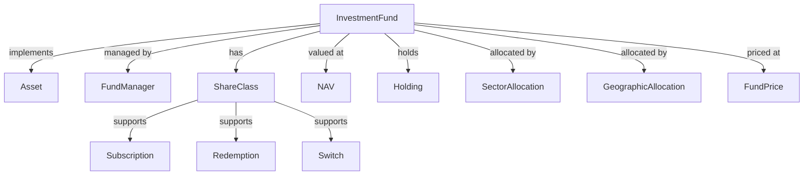

# 03 — Vahalla Wealth Data Specification — Investment Funds

> **Document Index:** [00-index.md](00-index.md) | **Related:** [03.1 — Fund Master Data (CSV & JSON)](03.1-sample-data-csv-investment-funds.md) | [03.2 — Fund Position, Transaction & Order (CSV & JSON)](03.2-sample-data-csv-fund-position-transaction.md) | [02 — Equity & Bond Specification](02-bank-data-specification-equity-bond.md) | [01 — Wealth Management Specification](01-wealth-management-specification.md)

| | |
|---|---|
| **Document Title** | Investment Module — Investment Funds Specification |
| **System** | Vahalla Wealth Management System |
| **Document Version** | 1.5 |
| **Date** | 2026-02-12 |
| **Classification** | Confidential |
| **Status** | Draft |
| **Prepared By** | Vahalla System Team |

### Revision History

| Version | Date | Author | Description |
|---|---|---|---|
| 1.0 | 2025-06-01 | Vahalla System Team | Initial draft — Investment Funds specification with fund identification, classification, NAV, share class, fee structure, and performance fields |
| 1.1 | 2025-08-15 | Vahalla System Team | Added Fund Manager, Custodian, and Distributor entity sections; added subscription/redemption processing fields; added Appendix A enum reference tables |
| 1.2 | 2025-10-20 | Vahalla System Team | Added Fund Position, Transaction & Order entities; added switch and distribution processing; added fund-level risk metrics (Sharpe, Sortino, max drawdown) |
| 1.3 | 2025-12-10 | Vahalla System Team | Added Hedge Fund and Private Equity specific fields (lock-up, gate, side pocket, vintage year, IRR); added REIT-specific fields (FFO, occupancy, cap rate); expanded regulatory reporting (UCITS, AIFMD, MiFID II) |
| 1.4 | 2026-01-22 | Vahalla System Team | Added Fund Market Data Feed and Fund Cashflow Schedule entities; added benchmark comparison fields; added ESG scoring and sustainability classification |
| 1.5 | 2026-02-12 | Vahalla System Team | Added sample data sections (JSON & CSV); added Entity Summary table; added data quality requirements and delivery specifications; final field renumbering |

---

## 1. Purpose

This document specifies the data fields, formats, and standards required from banking partners to integrate **Investment Fund** data into the Vahalla Wealth Management System. The data model is aligned with **ISO 20022** (`reda.041`, `reda.043`, `setr.001`, `setr.004`, `setr.013`).

**This version covers Investment Funds** including Mutual Funds, ETFs, Index Funds, Hedge Funds, REITs, Private Equity Funds, and Venture Capital Funds. For Equity and Bond asset classes, refer to [02 — Equity & Bond Specification](02-bank-data-specification-equity-bond.md).

---

## 2. Entity Relationship Overview

---

## 3. Data Standards & Conventions

All data standards, conventions, data type definitions, field requirement levels, and delivery formats are identical to [02 — Equity & Bond Specification, Section 3](02-bank-data-specification-equity-bond.md#3-data-standards--conventions).

### 3.1 ISO 20022 Message References for Investment Funds

| Message Code | Message Name | Usage |
|---|---|---|
| **reda.041** | Fund Reference Data Report | Fund master data, identification, characteristics |
| **reda.043** | Fund Processing Passport | Subscription/redemption processing, cut-off times, settlement |
| **setr.001** | Subscription Order | Fund subscription order details |
| **setr.004** | Redemption Order | Fund redemption order details |
| **setr.013** | Switch Order | Fund switch (exchange) order details |
| **semt.003** | Securities Balance Custody Report | Fund position/holding statements |

---

## 4. Common Security Identification Fields

Investment Fund records share the same common identification fields (§4.1–§4.4) as defined in [02 — Equity & Bond Specification, Section 4](02-bank-data-specification-equity-bond.md#4-common-security-identification-fields), with the following differences:

- The `assetClass` field must be set to `INVESTMENT_FUNDS` (per the `AssetClass` enum).
- Instead of `securityType` (which applies only to the `SECURITIES` asset class), Investment Funds use `fundSecurityType` from the `FundSecurityType` enum (ISO 20022 CFI — Collective Investment Vehicles classification).

| `fundSecurityType` Value | Description | Example Fund Types |
|---|---|---|
| `OPEN_END_INVESTMENT_FUND` | Open-ended collective investment scheme | Mutual Fund, UCITS, Index Fund |
| `CLOSED_END_INVESTMENT_FUND` | Closed-ended collective investment scheme | Closed-end Fund, Investment Trust |
| `ETF` | Exchange-traded fund | ETF, Leveraged ETF, Inverse ETF |
| `MONEY_MARKET_FUND` | Money market fund (short-term) | Prime MMF, Government MMF |
| `REAL_ESTATE_FUND` | Real estate investment fund | REIT, Real Estate Fund |
| `HEDGE_FUND` | Alternative/hedge fund | Hedge Fund, Fund of Hedge Funds |
| `PRIVATE_EQUITY_FUND` | Private equity fund | PE Fund, Venture Capital Fund |
| `PENSION_FUND` | Pension/retirement fund | Defined Benefit, Defined Contribution |

The specific fund sub-type is further classified by the `fundType` field (`InvestmentFundType` enum) in §5.1.

---

## 5. Fund Identification

### 5.1 Fund Type & Management

| # | Field Name | Data Type | Required | Description | Example | ISO 20022 Reference |
|---|---|---|---|---|---|---|
| 27 | `fundType` | Enum | Required | Investment fund sub-type | See [Appendix A.1](#a1-investmentfundtype) | reda.041 — `FndRpt/FndDtls/FndTp` |
| 28 | `fundManager` | String | Optional | Fund management company name | `"BlackRock Fund Advisors"` | reda.041 — `FndRpt/FndMgmtCpny/Nm` |
| 29 | `fundManagerLei` | String | Optional | LEI of fund manager per ISO 17442 | `"PY6ZTBDV0RQX3E9HJW36"` | reda.041 — `FndRpt/FndMgmtCpny/LEI` |
| 30 | `fundManagerBic` | String | Optional | BIC of fund manager per ISO 9362 | `"BLACKUS33"` | reda.041 — `FndRpt/FndMgmtCpny/BIC` |
| 31 | `investmentManager` | String | Optional | Investment manager name (if different) | `"BlackRock Investment Management"` | reda.041 — `FndRpt/InvstmtMgr/Nm` |
| 32 | `investmentManagerLei` | String | Optional | LEI of investment manager | `"PY6ZTBDV0RQX3E9HJW36"` | reda.041 — `FndRpt/InvstmtMgr/LEI` |

### 5.2 Fund Characteristics

| # | Field Name | Data Type | Required | Description | Example | ISO 20022 Reference |
|---|---|---|---|---|---|---|
| 33 | `fundCategory` | String | Optional | Fund category per local regulation | `"Large Cap Growth"` | reda.041 — `FndRpt/FndDtls/FndCtgy` |
| 34 | `fundCategoryDescription` | String | Optional | Description of fund category | `"Invests in large-cap growth equities"` | reda.041 — `FndRpt/FndDtls/FndCtgyDesc` |
| 35 | `fundNature` | String | Optional | Open-ended or closed-ended | `"OPEN_ENDED"` | reda.041 — `FndRpt/FndDtls/FndNtr` |
| 36 | `fundStyle` | String | Optional | Investment style | `"GROWTH"`, `"VALUE"`, `"BLEND"` | reda.041 — `FndRpt/FndDtls/InvstmtStyl` |
| 37 | `fundCurrency` | String | Required | Base/reference currency per ISO 4217 | `"USD"` | reda.041 — `FndRpt/FndDtls/BaseCcy` |

#### Recommended `fundCategory` Values

The `fundCategory` field is a free-text string, but the following standardised values are **recommended** to ensure consistency across data providers. These align with ISO 20022 fund classification (`reda.041 — FndCtgy`), Morningstar Global Category, and EFAMA/ICI industry standards.

| Category | Description | Example Funds |
|---|---|---|
| `Equity — Large Cap` | Invests primarily in large-capitalisation equities | S&P 500 Index Fund, Large Cap Growth |
| `Equity — Mid Cap` | Invests primarily in mid-capitalisation equities | Mid Cap Value, Mid Cap Growth |
| `Equity — Small Cap` | Invests primarily in small-capitalisation equities | Russell 2000 Index Fund |
| `Equity — Global` | Invests in equities across multiple regions | MSCI World Index Fund |
| `Equity — Emerging Markets` | Invests in emerging market equities | MSCI EM Index Fund |
| `Equity — Sector` | Invests in a specific sector (tech, healthcare, etc.) | Technology Select Fund |
| `Fixed Income — Government` | Invests in government bonds and treasuries | US Treasury Bond Fund |
| `Fixed Income — Corporate` | Invests in investment-grade corporate bonds | Corporate Bond Index Fund |
| `Fixed Income — High Yield` | Invests in below-investment-grade bonds | High Yield Bond Fund |
| `Fixed Income — Global` | Invests in bonds across multiple regions | Global Aggregate Bond Fund |
| `Fixed Income — Inflation-Linked` | Invests in inflation-protected securities | TIPS Fund |
| `Fixed Income — Short-Term` | Invests in short-duration fixed income | Short-Term Bond Fund |
| `Multi-Asset — Balanced` | Balanced allocation across equities and bonds | 60/40 Balanced Fund |
| `Multi-Asset — Target Date` | Glide-path allocation based on target retirement date | Target Date 2040 Fund |
| `Multi-Asset — Income` | Focuses on income generation across asset classes | Multi-Asset Income Fund |
| `Alternative — Long/Short` | Long/short equity or credit strategies | Market Neutral Fund |
| `Alternative — Macro` | Global macro and risk parity strategies | All Weather Fund |
| `Alternative — Event Driven` | Merger arbitrage, distressed, special situations | Event Driven Fund |
| `Real Estate` | Invests in real estate securities or direct property | REIT Index Fund |
| `Commodity` | Invests in commodities or commodity-linked instruments | Gold Fund, Commodity Index Fund |
| `Money Market` | Invests in short-term money market instruments | Prime Money Market Fund |

> **Note:** Providers may use more granular sub-categories (e.g., `"Equity — Large Cap Growth"`, `"Fixed Income — Intermediate Core-Plus Bond"`). The `fundCategoryDescription` field should provide additional detail when needed.

---

## 6. Fund Valuation

| # | Field Name | Data Type | Required | Description | Example | ISO 20022 Reference |
|---|---|---|---|---|---|---|
| 38 | `inceptionDate` | Date | Optional | Fund inception date | `"2003-03-10"` | reda.041 — `FndRpt/FndDtls/IncptnDt` |
| 39 | `nav` | Decimal | Required | Net Asset Value (total) | `45000000000.00` | reda.041 — `FndRpt/ValtnDtls/NAV` |
| 40 | `navPerShare` | Decimal | Required | NAV per share/unit | `485.50` | reda.041 — `FndRpt/ValtnDtls/NAVPerUnit` |
| 41 | `totalAssets` | Decimal | Optional | Total AUM | `46500000000.00` | reda.041 — `FndRpt/ValtnDtls/TtlAsstVal` |
| 42 | `totalLiabilities` | Decimal | Optional | Total liabilities | `1500000000.00` | reda.041 — `FndRpt/ValtnDtls/TtlLbltyVal` |
| 43 | `netAssets` | Decimal | Optional | Net assets | `45000000000.00` | reda.041 — `FndRpt/ValtnDtls/NetAsstVal` |
| 44 | `sharesOutstanding` | Decimal | Optional | Total shares/units outstanding | `92700000` | reda.041 — `FndRpt/ValtnDtls/UnitsOutstndg` |
| 45 | `grossAssetValue` | Decimal | Optional | Gross asset value | `46500000000.00` | reda.041 — `FndRpt/ValtnDtls/GrssAsstVal` |
| 46 | `navFrequency` | Enum | Optional | NAV calculation frequency | See [02 — Appendix A.6](02-bank-data-specification-equity-bond.md) | reda.041 — `FndRpt/ValtnDtls/NAVClctnFrqcy` |

---

## 7. Fees & Expenses

| # | Field Name | Data Type | Required | Description | Example | ISO 20022 Reference |
|---|---|---|---|---|---|---|
| 47 | `expenseRatio` | Decimal | Required | Total expense ratio (TER) % | `0.03` | reda.043 — `FndPrcgPsptRpt/FeesDtls/TtlExpnsRatio` |
| 48 | `managementFee` | Decimal | Optional | Annual management fee (%) | `0.03` | reda.043 — `FndPrcgPsptRpt/FeesDtls/MgmtFee` |
| 49 | `performanceFee` | Decimal | Optional | Performance fee (%) | `0.00` | reda.043 — `FndPrcgPsptRpt/FeesDtls/PrfrmncFee` |
| 50 | `entryCharge` | Decimal | Optional | Front-end load (%) | `0.00` | reda.043 — `FndPrcgPsptRpt/FeesDtls/NtryFee` |
| 51 | `exitCharge` | Decimal | Optional | Back-end load (%) | `0.00` | reda.043 — `FndPrcgPsptRpt/FeesDtls/XtFee` |
| 52 | `redemptionFee` | Decimal | Optional | Redemption fee (%) | `0.00` | reda.043 — `FndPrcgPsptRpt/FeesDtls/RedFee` |

---

## 8. Investment Details

### 8.1 Minimums & Objectives

| # | Field Name | Data Type | Required | Description | Example | ISO 20022 Reference |
|---|---|---|---|---|---|---|
| 53 | `minimumInvestment` | Decimal | Optional | Minimum initial investment | `1000.00` | reda.043 — `FndPrcgPsptRpt/SbcptDtls/MinInvstmtAmt` |
| 54 | `minimumAdditionalInvestment` | Decimal | Optional | Minimum additional investment | `100.00` | reda.043 — `FndPrcgPsptRpt/SbcptDtls/MinAddtlInvstmtAmt` |
| 55 | `maximumInvestment` | Decimal | Optional | Maximum investment amount | `null` | reda.043 — `FndPrcgPsptRpt/SbcptDtls/MaxInvstmtAmt` |
| 56 | `minimumHoldingAmount` | Decimal | Optional | Minimum holding amount | `500.00` | reda.043 — `FndPrcgPsptRpt/RedDtls/MinHldgAmt` |
| 57 | `benchmark` | String | Optional | Benchmark index name | `"S&P 500 Index"` | reda.041 — `FndRpt/FndDtls/BchmrkNm` |
| 58 | `benchmarkIsin` | String | Optional | Benchmark ISIN | `"US78378X1072"` | reda.041 — `FndRpt/FndDtls/BchmrkISIN` |
| 59 | `strategy` | String | Optional | Investment strategy | `"Passive index tracking"` | reda.041 — `FndRpt/FndDtls/InvstmtStrtgy` |
| 60 | `investmentObjective` | String | Optional | Investment objective | `"Track the S&P 500 Index"` | reda.041 — `FndRpt/FndDtls/InvstmtObjctv` |
| 61 | `riskRating` | Enum | Optional | Risk rating | See [Appendix A.5](#a5-riskrating) | reda.041 — `FndRpt/FndDtls/RskRtg` |
| 62 | `srriRating` | Int | Optional | SRRI (1–7) | `5` | reda.041 — `FndRpt/FndDtls/SRRIRtg` |

### 8.2 Holding Period Restrictions

| # | Field Name | Data Type | Required | Description | Example | ISO 20022 Reference |
|---|---|---|---|---|---|---|
| 63 | `minimumHoldingPeriod` | Int | Optional | Minimum holding period (days) | `0` | reda.043 — `FndPrcgPsptRpt/RedDtls/MinHldgPrd` |
| 64 | `lockUpPeriod` | Int | Optional | Initial lock-up period (days) | `0` | reda.043 — `FndPrcgPsptRpt/RedDtls/LckUpPrd` |
| 65 | `noticePeriodForRedemption` | Int | Optional | Advance notice for redemption (days) | `0` | reda.043 — `FndPrcgPsptRpt/RedDtls/NtcPrd` |

---

## 9. Legal, Regulatory & Service Providers

### 9.1 Legal & Regulatory

| # | Field Name | Data Type | Required | Description | Example | ISO 20022 Reference |
|---|---|---|---|---|---|---|
| 66 | `legalStructure` | Enum | Optional | Fund legal structure | See [Appendix A.3](#a3-fundlegalstructure) | reda.041 — `FndRpt/FndDtls/LglStrctr` |
| 67 | `domicile` | String | Optional | Country of domicile per ISO 3166 | `"IE"` | reda.041 — `FndRpt/FndDtls/CtryOfDmcl` |
| 68 | `registrationCountry` | String | Optional | Registration country per ISO 3166 | `"IE"` | reda.041 — `FndRpt/FndDtls/CtryOfRegntn` |
| 69 | `regulator` | String | Optional | Regulatory authority | `"Central Bank of Ireland"` | reda.041 — `FndRpt/FndDtls/Rgltr/Nm` |
| 70 | `regulatorLei` | String | Optional | Regulator LEI | `"..."` | reda.041 — `FndRpt/FndDtls/Rgltr/LEI` |
| 71 | `ucitsCompliant` | Boolean | Optional | UCITS compliance flag | `true` | reda.041 — `FndRpt/FndDtls/UCITSCmplnt` |
| 72 | `fundStatus` | Enum | Required | Current fund status | See [Appendix A.6b](#a6b-fundstatus) | reda.041 — `FndRpt/FndDtls/FndSts` |

### 9.2 Service Providers

| # | Field Name | Data Type | Required | Description | Example | ISO 20022 Reference |
|---|---|---|---|---|---|---|
| 73 | `custodian` | String | Optional | Custodian name | `"State Street Bank"` | reda.041 — `FndRpt/SvcPrvdrs/Cstdn/Nm` |
| 74 | `custodianLei` | String | Optional | Custodian LEI | `"571474TGEMMWANRLN572"` | reda.041 — `FndRpt/SvcPrvdrs/Cstdn/LEI` |
| 75 | `administrator` | String | Optional | Fund administrator | `"State Street Fund Services"` | reda.041 — `FndRpt/SvcPrvdrs/FndAdmstr/Nm` |
| 76 | `administratorLei` | String | Optional | Administrator LEI | `"571474TGEMMWANRLN572"` | reda.041 — `FndRpt/SvcPrvdrs/FndAdmstr/LEI` |
| 77 | `auditor` | String | Optional | Auditor name | `"PricewaterhouseCoopers"` | reda.041 — `FndRpt/SvcPrvdrs/Audtr/Nm` |
| 78 | `transferAgent` | String | Optional | Transfer agent | `"BNY Mellon"` | reda.041 — `FndRpt/SvcPrvdrs/TrfAgt/Nm` |
| 79 | `legalAdvisor` | String | Optional | Legal advisor | `"Dechert LLP"` | reda.041 — `FndRpt/SvcPrvdrs/LglAdvsr/Nm` |

---

## 10. Distribution & Income

### 10.1 Distribution Policy

| # | Field Name | Data Type | Required | Description | Example | ISO 20022 Reference |
|---|---|---|---|---|---|---|
| 80 | `distributionPolicy` | Enum | Optional | Distribution policy | See [Appendix A.2](#a2-funddistributionpolicy) | reda.041 — `FndRpt/DstrbtnPlcy/DstrbtnPlcyTp` |
| 81 | `dividendFrequency` | Enum | Optional | Dividend frequency | See [02 — Appendix A.6](02-bank-data-specification-equity-bond.md) | reda.041 — `FndRpt/DstrbtnPlcy/DvddFrqcy` |
| 82 | `lastDividendDate` | Date | Optional | Last dividend date | `"2026-01-15"` | reda.041 — `FndRpt/DstrbtnPlcy/LastDvddDt` |
| 83 | `lastDividendAmount` | Decimal | Optional | Last dividend per share | `1.85` | reda.041 — `FndRpt/DstrbtnPlcy/LastDvddAmt` |
| 84 | `exDividendDate` | Date | Optional | Ex-dividend date | `"2026-01-12"` | reda.041 — `FndRpt/DstrbtnPlcy/ExDvddDt` |
| 85 | `paymentDate` | Date | Optional | Dividend payment date | `"2026-01-15"` | reda.041 — `FndRpt/DstrbtnPlcy/PmtDt` |

### 10.2 Income Equalisation

| # | Field Name | Data Type | Required | Description | Example | ISO 20022 Reference |
|---|---|---|---|---|---|---|
| 86 | `incomeEqualisation` | Boolean | Optional | Income equalisation applies | `true` | reda.043 — `FndPrcgPsptRpt/IncmEqlstn/Ind` |
| 87 | `equalisationMethod` | String | Optional | Equalisation method | `"FULL"`, `"PARTIAL"`, `"NONE"` | reda.043 — `FndPrcgPsptRpt/IncmEqlstn/Mtd` |
| 88 | `equalisationRate` | Decimal | Optional | Equalisation rate (%) | `0.50` | reda.043 — `FndPrcgPsptRpt/IncmEqlstn/Rate` |

---

## 11. Share Class & Trading

| # | Field Name | Data Type | Required | Description | Example | ISO 20022 Reference |
|---|---|---|---|---|---|---|
| 89 | `shareClassType` | Enum | Optional | Share class type | See [Appendix A.4](#a4-shareclasstype) | reda.041 — `FndRpt/ShrClssDtls/ShrClssTp` |
| 90 | `tradingCurrency` | String | Optional | Trading currency per ISO 4217 | `"USD"` | reda.041 — `FndRpt/ShrClssDtls/TradgCcy` |
| 91 | `baseCurrency` | String | Optional | Base currency per ISO 4217 | `"USD"` | reda.041 — `FndRpt/ShrClssDtls/BaseCcy` |
| 92 | `hedged` | Boolean | Optional | Currency-hedged flag | `false` | reda.041 — `FndRpt/ShrClssDtls/HdgdInd` |
| 93 | `hedgingStrategy` | String | Optional | Hedging strategy | `null` | reda.041 — `FndRpt/ShrClssDtls/HdgStrtgy` |

---

## 12. Subscription & Redemption

### 12.1 Subscription

| # | Field Name | Data Type | Required | Description | Example | ISO 20022 Reference |
|---|---|---|---|---|---|---|
| 94 | `subscriptionFrequency` | Enum | Optional | Subscription frequency | See [Appendix A.7](#a7-redemptionfrequency) | reda.043 — `FndPrcgPsptRpt/SbcptDtls/SbcptFrqcy` |
| 95 | `subscriptionNoticePeriod` | Int | Optional | Notice period (days) | `0` | reda.043 — `FndPrcgPsptRpt/SbcptDtls/NtcPrd` |
| 96 | `subscriptionCutOffTime` | String | Optional | Cut-off time | `"16:00"` | reda.043 — `FndPrcgPsptRpt/SbcptDtls/CutOffTm` |
| 97 | `subscriptionCutOffTimeZone` | String | Optional | Cut-off time zone | `"America/New_York"` | reda.043 — `FndPrcgPsptRpt/SbcptDtls/CutOffTmZn` |
| 98 | `subscriptionSettlementPeriod` | Int | Optional | Settlement period (T+N) | `1` | reda.043 — `FndPrcgPsptRpt/SbcptDtls/SttlmPrd` |
| 99 | `initialSubscriptionAmount` | Decimal | Optional | Min initial subscription | `1000.00` | reda.043 — `FndPrcgPsptRpt/SbcptDtls/InitlSbcptAmt` |
| 100 | `subsequentSubscriptionAmount` | Decimal | Optional | Min subsequent subscription | `100.00` | reda.043 — `FndPrcgPsptRpt/SbcptDtls/SbsqntSbcptAmt` |
| 101 | `maximumSubscriptionAmount` | Decimal | Optional | Max subscription | `null` | reda.043 — `FndPrcgPsptRpt/SbcptDtls/MaxSbcptAmt` |

### 12.2 Redemption

| # | Field Name | Data Type | Required | Description | Example | ISO 20022 Reference |
|---|---|---|---|---|---|---|
| 102 | `redemptionFrequency` | Enum | Optional | Redemption frequency | See [Appendix A.7](#a7-redemptionfrequency) | reda.043 — `FndPrcgPsptRpt/RedDtls/RedFrqcy` |
| 103 | `redemptionNoticePeriod` | Int | Optional | Notice period (days) | `0` | reda.043 — `FndPrcgPsptRpt/RedDtls/NtcPrd` |
| 104 | `redemptionCutOffTime` | String | Optional | Cut-off time | `"16:00"` | reda.043 — `FndPrcgPsptRpt/RedDtls/CutOffTm` |
| 105 | `redemptionCutOffTimeZone` | String | Optional | Cut-off time zone | `"America/New_York"` | reda.043 — `FndPrcgPsptRpt/RedDtls/CutOffTmZn` |
| 106 | `redemptionSettlementPeriod` | Int | Optional | Settlement period (T+N) | `1` | reda.043 — `FndPrcgPsptRpt/RedDtls/SttlmPrd` |
| 107 | `minimumRedemptionAmount` | Decimal | Optional | Min redemption | `100.00` | reda.043 — `FndPrcgPsptRpt/RedDtls/MinRedAmt` |
| 108 | `maximumRedemptionAmount` | Decimal | Optional | Max redemption | `null` | reda.043 — `FndPrcgPsptRpt/RedDtls/MaxRedAmt` |

### 12.3 Switching

| # | Field Name | Data Type | Required | Description | Example | ISO 20022 Reference |
|---|---|---|---|---|---|---|
| 109 | `switchingAllowed` | Boolean | Optional | Switching allowed | `true` | reda.043 — `FndPrcgPsptRpt/SwtchDtls/SwtchInd` |
| 110 | `switchingFrequency` | Enum | Optional | Switching frequency | See [Appendix A.7](#a7-redemptionfrequency) | reda.043 — `FndPrcgPsptRpt/SwtchDtls/SwtchFrqcy` |
| 111 | `switchingCharge` | Decimal | Optional | Switching charge (%) | `0.00` | reda.043 — `FndPrcgPsptRpt/SwtchDtls/SwtchChrg` |
| 112 | `switchingCutOffTime` | String | Optional | Cut-off time | `"16:00"` | reda.043 — `FndPrcgPsptRpt/SwtchDtls/CutOffTm` |

### 12.4 Order Desk & Dealing

| # | Field Name | Data Type | Required | Description | Example | ISO 20022 Reference |
|---|---|---|---|---|---|---|
| 113 | `dealingFrequency` | Enum | Optional | Dealing frequency | See [02 — Appendix A.6](02-bank-data-specification-equity-bond.md) | reda.043 — `FndPrcgPsptRpt/DlgFrqcy` |
| 114 | `settlementPeriod` | Int | Optional | Standard settlement (T+N) | `2` | reda.043 — `FndPrcgPsptRpt/SttlmPrd` |

---

## 13. Performance Data

| # | Field Name | Data Type | Required | Description | Example | ISO 20022 Reference |
|---|---|---|---|---|---|---|
| 115 | `ytdReturn` | Decimal | Optional | Year-to-date return (%) | `4.25` | — (supplementary) |
| 116 | `oneMonthReturn` | Decimal | Optional | 1-month return (%) | `1.20` | — (supplementary) |
| 117 | `threeMonthReturn` | Decimal | Optional | 3-month return (%) | `3.50` | — (supplementary) |
| 118 | `sixMonthReturn` | Decimal | Optional | 6-month return (%) | `8.10` | — (supplementary) |
| 119 | `oneYearReturn` | Decimal | Optional | 1-year return (%) | `15.80` | — (supplementary) |
| 120 | `threeYearReturn` | Decimal | Optional | 3-year annualized (%) | `12.50` | — (supplementary) |
| 121 | `fiveYearReturn` | Decimal | Optional | 5-year annualized (%) | `14.20` | — (supplementary) |
| 122 | `tenYearReturn` | Decimal | Optional | 10-year annualized (%) | `13.10` | — (supplementary) |
| 123 | `inceptionReturn` | Decimal | Optional | Since-inception annualized (%) | `10.85` | — (supplementary) |
| 124 | `sharpeRatio` | Decimal | Optional | Sharpe ratio | `1.15` | — (supplementary) |
| 125 | `sortinoRatio` | Decimal | Optional | Sortino ratio | `1.45` | — (supplementary) |
| 126 | `informationRatio` | Decimal | Optional | Information ratio | `0.85` | — (supplementary) |
| 127 | `volatility` | Decimal | Optional | Annualized volatility (%) | `15.20` | — (supplementary) |
| 128 | `beta` | Decimal | Optional | Beta vs. benchmark | `1.00` | — (supplementary) |
| 129 | `alpha` | Decimal | Optional | Alpha vs. benchmark (%) | `0.05` | — (supplementary) |
| 130 | `maxDrawdown` | Decimal | Optional | Maximum drawdown (%) | `-33.80` | — (supplementary) |
| 131 | `trackingError` | Decimal | Optional | Tracking error (%) | `0.04` | — (supplementary) |

---

## 14. Portfolio Composition

| # | Field Name | Data Type | Required | Description | Example | ISO 20022 Reference |
|---|---|---|---|---|---|---|
| 132 | `numberOfHoldings` | Int | Optional | Total holdings | `503` | reda.041 — `FndRpt/PrtflCmpst/NbOfHldgs` |
| 133 | `averageMarketCap` | Decimal | Optional | Weighted avg market cap | `250000000000.00` | — (supplementary) |
| 134 | `portfolioTurnover` | Decimal | Optional | Annual turnover (%) | `4.00` | reda.041 — `FndRpt/PrtflCmpst/PrtflTrnvr` |
| 135 | `cashPosition` | Decimal | Optional | Cash as % of NAV | `0.50` | reda.041 — `FndRpt/PrtflCmpst/CshPstn` |

---

## 15. Tax Information

| # | Field Name | Data Type | Required | Description | Example | ISO 20022 Reference |
|---|---|---|---|---|---|---|
| 136 | `taxStatus` | Enum | Optional | Tax status | See [02 — Appendix A.15](02-bank-data-specification-equity-bond.md) | reda.041 — `FndRpt/TaxDtls/TaxSts` |
| 137 | `taxDomicile` | String | Optional | Tax domicile per ISO 3166 | `"IE"` | reda.041 — `FndRpt/TaxDtls/TaxDmcl` |
| 138 | `withholdingTaxRate` | Decimal | Optional | Withholding tax rate (%) | `0.00` | reda.041 — `FndRpt/TaxDtls/WhldgTaxRate` |
| 139 | `taxReportingStatus` | String | Optional | Tax reporting status | `"UK Reporting Fund"` | reda.041 — `FndRpt/TaxDtls/TaxRptgSts` |
| 140 | `fatcaStatus` | String | Optional | FATCA compliance | `"COMPLIANT"` | — (supplementary) |
| 141 | `crsReportable` | Boolean | Optional | CRS reportable flag | `true` | — (supplementary) |

---

## 16. Pricing & Valuation

| # | Field Name | Data Type | Required | Description | Example | ISO 20022 Reference |
|---|---|---|---|---|---|---|
| 142 | `bidPrice` | Decimal | Optional | Bid price | `485.30` | reda.041 — `FndRpt/PricDtls/BidPric/Val` |
| 143 | `askPrice` | Decimal | Optional | Ask/offer price | `485.70` | reda.041 — `FndRpt/PricDtls/OffrPric/Val` |
| 144 | `midPrice` | Decimal | Optional | Mid price | `485.50` | reda.041 — `FndRpt/PricDtls/MidPric/Val` |
| 145 | `navDate` | Date | Optional | NAV calculation date | `"2026-02-08"` | reda.041 — `FndRpt/ValtnDtls/NAVDt` |
| 146 | `pricingSource` | String | Optional | Pricing source | `"Bloomberg"` | — (supplementary) |
| 147 | `pricingMethod` | String | Optional | Pricing methodology | `"FORWARD"` | reda.041 — `FndRpt/PricDtls/PricMtd` |

---

## 17. ESG & Sustainability

| # | Field Name | Data Type | Required | Description | Example | ISO 20022 Reference |
|---|---|---|---|---|---|---|
| 148 | `esgRating` | String | Optional | ESG rating | `"AA"` | — (supplementary) |
| 149 | `esgScore` | Decimal | Optional | ESG score | `7.50` | — (supplementary) |
| 150 | `sustainabilityRating` | String | Optional | Sustainability rating | `"Above Average"` | — (supplementary) |
| 151 | `article8Compliant` | Boolean | Optional | SFDR Article 8 | `true` | reda.041 — `FndRpt/ESGDtls/Art8Cmplnt` |
| 152 | `article9Compliant` | Boolean | Optional | SFDR Article 9 | `false` | reda.041 — `FndRpt/ESGDtls/Art9Cmplnt` |
| 153 | `sustainabilityFocus` | String | Optional | Sustainability focus | `"ESG Integration"` | reda.041 — `FndRpt/ESGDtls/SstnbltyFcs` |

---

## 18. Reporting & Documentation

| # | Field Name | Data Type | Required | Description | Example | ISO 20022 Reference |
|---|---|---|---|---|---|---|
| 154 | `reportingFrequency` | Enum | Optional | Reporting frequency | See [Appendix A.10](#a10-reportingfrequency) | reda.041 — `FndRpt/RptgDtls/RptgFrqcy` |
| 155 | `factsheetUrl` | String | Optional | Factsheet URL | `"https://ishares.com/literature/fact-sheet/ivv.pdf"` | reda.041 — `FndRpt/RptgDtls/FctShtURL` |
| 156 | `prospectusUrl` | String | Optional | Prospectus URL | `"https://ishares.com/literature/prospectus/ivv.pdf"` | reda.041 — `FndRpt/RptgDtls/PrspctsURL` |
| 157 | `kiidUrl` | String | Optional | KIID URL | `"https://ishares.com/literature/kiid/ivv.pdf"` | reda.041 — `FndRpt/RptgDtls/KIIDURL` |
| 158 | `annualReportUrl` | String | Optional | Annual report URL | `"https://ishares.com/literature/annual/ivv.pdf"` | reda.041 — `FndRpt/RptgDtls/AnnlRptURL` |
| 159 | `semiAnnualReportUrl` | String | Optional | Semi-annual report URL | `null` | reda.041 — `FndRpt/RptgDtls/SemiAnnlRptURL` |
| 160 | `lastReportDate` | Date | Optional | Last report date | `"2025-12-31"` | reda.041 — `FndRpt/RptgDtls/LastRptDt` |

---

## 19. Fund Structure (ISO 20022)

| # | Field Name | Data Type | Required | Description | Example | ISO 20022 Reference |
|---|---|---|---|---|---|---|
| 161 | `fundFamily` | String | Optional | Fund family ID | `"iShares"` | reda.041 — `FndRpt/FndStrctr/FndFmly` |
| 162 | `fundFamilyName` | String | Optional | Fund family name | `"iShares by BlackRock"` | reda.041 — `FndRpt/FndStrctr/FndFmlyNm` |
| 163 | `umbrellaFund` | String | Optional | Parent umbrella fund | `null` | reda.041 — `FndRpt/FndStrctr/UmbrllFnd` |
| 164 | `umbrellaFundLei` | String | Optional | Umbrella fund LEI | `null` | reda.041 — `FndRpt/FndStrctr/UmbrllFndLEI` |
| 165 | `subFundName` | String | Optional | Sub-fund name | `null` | reda.041 — `FndRpt/FndStrctr/SubFndNm` |
| 166 | `shareClassName` | String | Optional | Share class name | `"iShares Core S&P 500 ETF"` | reda.041 — `FndRpt/ShrClssDtls/ShrClssNm` |
| 167 | `shareClassCurrency` | String | Optional | Share class currency | `"USD"` | reda.041 — `FndRpt/ShrClssDtls/ShrClssCcy` |
| 168 | `shareClassLaunchDate` | Date | Optional | Share class launch date | `"2000-05-15"` | reda.041 — `FndRpt/ShrClssDtls/LaunchDt` |
| 169 | `shareClassLifecycle` | String | Optional | Lifecycle status | `"ACTIVE"` | reda.041 — `FndRpt/ShrClssDtls/Lfcycl` |

---

## 20. Operational Features (ISO 20022)

| # | Field Name | Data Type | Required | Description | Example | ISO 20022 Reference |
|---|---|---|---|---|---|---|
| 170 | `swingPricing` | Boolean | Optional | Swing pricing applies | `false` | reda.043 — `FndPrcgPsptRpt/OprlFeatrs/SwngPricInd` |
| 171 | `swingFactor` | Decimal | Optional | Swing factor (%) | `null` | reda.043 — `FndPrcgPsptRpt/OprlFeatrs/SwngFctr` |
| 172 | `swingPricingThreshold` | Decimal | Optional | Swing threshold (%) | `null` | reda.043 — `FndPrcgPsptRpt/OprlFeatrs/SwngPricThrshld` |
| 173 | `dilutionLevy` | Decimal | Optional | Dilution levy | `null` | reda.043 — `FndPrcgPsptRpt/OprlFeatrs/DltnLvy` |
| 174 | `dilutionLevyRate` | Decimal | Optional | Dilution levy rate (%) | `null` | reda.043 — `FndPrcgPsptRpt/OprlFeatrs/DltnLvyRate` |
| 175 | `gateProvisions` | Boolean | Optional | Gate provisions exist | `false` | reda.043 — `FndPrcgPsptRpt/OprlFeatrs/GtPrvsnInd` |
| 176 | `gateThreshold` | Decimal | Optional | Gate threshold (%) | `null` | reda.043 — `FndPrcgPsptRpt/OprlFeatrs/GtThrshld` |
| 177 | `sidePockets` | Boolean | Optional | Side pockets used | `false` | reda.043 — `FndPrcgPsptRpt/OprlFeatrs/SdPcktInd` |
| 178 | `redemptionSuspended` | Boolean | Optional | Redemptions suspended | `false` | reda.043 — `FndPrcgPsptRpt/OprlFeatrs/RedSspdInd` |
| 179 | `subscriptionSuspended` | Boolean | Optional | Subscriptions suspended | `false` | reda.043 — `FndPrcgPsptRpt/OprlFeatrs/SbcptSspdInd` |

---

## 21. Investment Restrictions

| # | Field Name | Data Type | Required | Description | Example | ISO 20022 Reference |
|---|---|---|---|---|---|---|
| 180 | `maxLeverage` | Decimal | Optional | Max leverage ratio | `1.00` | reda.041 — `FndRpt/InvstmtRstrctns/MaxLvrg` |
| 181 | `maxConcentration` | Decimal | Optional | Max single position (%) | `5.00` | reda.041 — `FndRpt/InvstmtRstrctns/MaxCncntrtn` |
| 182 | `maxSectorExposure` | Decimal | Optional | Max sector exposure (%) | `25.00` | reda.041 — `FndRpt/InvstmtRstrctns/MaxSctrExpsr` |
| 183 | `maxGeographicExposure` | Decimal | Optional | Max country exposure (%) | `100.00` | reda.041 — `FndRpt/InvstmtRstrctns/MaxGeoExpsr` |
| 184 | `shortSellingAllowed` | Boolean | Optional | Short selling allowed | `false` | reda.041 — `FndRpt/InvstmtRstrctns/ShrtSellgInd` |
| 185 | `derivativesAllowed` | Boolean | Optional | Derivatives allowed | `true` | reda.041 — `FndRpt/InvstmtRstrctns/DrvtvsInd` |
| 186 | `borrowingAllowed` | Boolean | Optional | Borrowing allowed | `false` | reda.041 — `FndRpt/InvstmtRstrctns/BrrwgInd` |

---

## 22. Financial Information (ISO 20022)

| # | Field Name | Data Type | Required | Description | Example | ISO 20022 Reference |
|---|---|---|---|---|---|---|
| 187 | `fiscalYearEnd` | String | Optional | Fiscal year end (MM-DD) | `"03-31"` | reda.041 — `FndRpt/FinInf/FsclYrEnd` |
| 188 | `launchDate` | Date | Optional | Fund launch date | `"2000-05-15"` | reda.041 — `FndRpt/FinInf/LaunchDt` |
| 189 | `closureDate` | Date | Optional | Fund closure date | `null` | reda.041 — `FndRpt/FinInf/ClsrDt` |
| 190 | `mergerDate` | Date | Optional | Fund merger date | `null` | reda.041 — `FndRpt/FinInf/MrgrDt` |
| 191 | `navCalculationFrequency` | Enum | Optional | NAV calculation frequency | See [02 — Appendix A.6](02-bank-data-specification-equity-bond.md) | reda.041 — `FndRpt/ValtnDtls/NAVClctnFrqcy` |
| 192 | `valuationTime` | String | Optional | Daily valuation time | `"16:00"` | reda.041 — `FndRpt/ValtnDtls/ValtnTm` |
| 193 | `valuationTimeZone` | String | Optional | Valuation time zone | `"America/New_York"` | reda.041 — `FndRpt/ValtnDtls/ValtnTmZn` |
| 194 | `pricingMethodology` | String | Optional | Pricing methodology | `"FORWARD_PRICING"` | reda.041 — `FndRpt/PricDtls/PricMtdlgy` |
| 195 | `decimalPlaces` | Int | Optional | Decimal places for NAV | `2` | reda.041 — `FndRpt/ValtnDtls/DcmlPlcs` |

---

*Continued in [Appendix A: Enum Reference Tables](#appendix-a-enum-reference-tables)*

---

## Appendix A: Enum Reference Tables

### A.1 InvestmentFundType

| Value | Description | ISO 20022 Reference |
|---|---|---|
| `MUTUAL_FUND` | Open-ended mutual fund | reda.041 — `FndTp/MUTL` |
| `HEDGE_FUND` | Hedge fund (alternative investment) | reda.041 — `FndTp/HEDG` |
| `REIT` | Real Estate Investment Trust | reda.041 — `FndTp/REIT` |
| `PRIVATE_EQUITY_FUND` | Private equity fund | reda.041 — `FndTp/PRIV` |
| `ETF` | Exchange-Traded Fund | reda.041 — `FndTp/ETFT` |
| `INDEX_FUND` | Passively managed index fund | reda.041 — `FndTp/INDX` |
| `VENTURE_CAPITAL_FUND` | Venture capital fund | reda.041 — `FndTp/VCAP` |

### A.2 FundDistributionPolicy

| Value | Description | ISO 20022 Reference |
|---|---|---|
| `ACCUMULATING` | Income is reinvested | reda.041 — `DstrbtnPlcyTp/ACCU` |
| `DISTRIBUTING` | Income is distributed | reda.041 — `DstrbtnPlcyTp/DIST` |
| `MIXED` | Combination | reda.041 — `DstrbtnPlcyTp/MIXD` |

### A.3 FundLegalStructure

| Value | Description | ISO 20022 Reference |
|---|---|---|
| `OPEN_ENDED` | Open-ended investment company | reda.041 — `LglStrctr/OPEN` |
| `CLOSED_ENDED` | Closed-ended investment company | reda.041 — `LglStrctr/CLSD` |
| `UNIT_TRUST` | Unit trust | reda.041 — `LglStrctr/UNTT` |
| `MUTUAL_FUND` | Mutual fund structure | reda.041 — `LglStrctr/MUTL` |
| `SICAV` | Société d'Investissement à Capital Variable | reda.041 — `LglStrctr/SICV` |
| `FCP` | Fonds Commun de Placement | reda.041 — `LglStrctr/FCPE` |
| `OEIC` | Open-Ended Investment Company (UK) | reda.041 — `LglStrctr/OEIC` |
| `INVESTMENT_TRUST` | Investment trust (closed-ended, UK) | reda.041 — `LglStrctr/INVT` |

### A.4 ShareClassType

| Value | Description | ISO 20022 Reference |
|---|---|---|
| `CLASS_A` | Class A (typically front-end load) | reda.041 — `ShrClssTp/CLSA` |
| `CLASS_B` | Class B (typically back-end load) | reda.041 — `ShrClssTp/CLSB` |
| `CLASS_C` | Class C (typically level load) | reda.041 — `ShrClssTp/CLSC` |
| `CLASS_I` | Class I (institutional, lower fees) | reda.041 — `ShrClssTp/CLSI` |
| `INSTITUTIONAL` | Institutional share class | reda.041 — `ShrClssTp/INST` |
| `RETAIL` | Retail share class | reda.041 — `ShrClssTp/RETL` |
| `HEDGED` | Currency-hedged share class | reda.041 — `ShrClssTp/HDGD` |
| `UNHEDGED` | Unhedged share class | reda.041 — `ShrClssTp/UNHD` |

### A.5 RiskRating

| Value | Description | ISO 20022 Reference |
|---|---|---|
| `VERY_LOW` | Very low risk (SRRI 1) | reda.041 — `RskRtg/VLOW` |
| `LOW` | Low risk (SRRI 2) | reda.041 — `RskRtg/LOWW` |
| `MEDIUM_LOW` | Medium-low risk (SRRI 3) | reda.041 — `RskRtg/MLOW` |
| `MEDIUM` | Medium risk (SRRI 4) | reda.041 — `RskRtg/MEDM` |
| `MEDIUM_HIGH` | Medium-high risk (SRRI 5) | reda.041 — `RskRtg/MHGH` |
| `HIGH` | High risk (SRRI 6) | reda.041 — `RskRtg/HIGH` |
| `VERY_HIGH` | Very high risk (SRRI 7) | reda.041 — `RskRtg/VHGH` |

### A.6b FundStatus

| Value | Description | ISO 20022 Reference |
|---|---|---|
| `ACTIVE` | Actively trading | reda.041 — `FndSts/ACTV` |
| `SUSPENDED` | Trading suspended | reda.041 — `FndSts/SUSP` |
| `CLOSED` | Closed to new investors | reda.041 — `FndSts/CLSD` |
| `LIQUIDATING` | In liquidation | reda.041 — `FndSts/LIQD` |
| `MERGED` | Merged into another fund | reda.041 — `FndSts/MRGD` |
| `TERMINATED` | Terminated | reda.041 — `FndSts/TERM` |

### A.7 RedemptionFrequency

| Value | Description | ISO 20022 Reference |
|---|---|---|
| `DAILY` | Daily dealing | reda.043 — `RedFrqcy/DAIL` |
| `WEEKLY` | Weekly dealing | reda.043 — `RedFrqcy/WEEK` |
| `MONTHLY` | Monthly dealing | reda.043 — `RedFrqcy/MNTH` |
| `QUARTERLY` | Quarterly dealing | reda.043 — `RedFrqcy/QUTR` |
| `SEMI_ANNUAL` | Semi-annual dealing | reda.043 — `RedFrqcy/SEMI` |
| `ANNUAL` | Annual dealing | reda.043 — `RedFrqcy/ANNL` |
| `ON_DEMAND` | On demand | reda.043 — `RedFrqcy/ODMD` |
| `NOTICE_REQUIRED` | Notice period required | reda.043 — `RedFrqcy/NTCE` |

### A.8 InvestorType

| Value | Description | ISO 20022 Reference |
|---|---|---|
| `RETAIL` | Retail investor | reda.043 — `InvstrTp/RETL` |
| `PROFESSIONAL` | Professional investor (MiFID II) | reda.043 — `InvstrTp/PROF` |
| `INSTITUTIONAL` | Institutional investor | reda.043 — `InvstrTp/INST` |
| `QUALIFIED` | Qualified investor | reda.043 — `InvstrTp/QUAL` |
| `ACCREDITED` | Accredited investor (SEC) | reda.043 — `InvstrTp/ACRD` |
| `ELIGIBLE_COUNTERPARTY` | Eligible counterparty (MiFID II) | reda.043 — `InvstrTp/ELCP` |

### A.9 DistributionChannel

| Value | Description | ISO 20022 Reference |
|---|---|---|
| `DIRECT` | Direct from fund manager | reda.043 — `DstrbtnChnl/DRCT` |
| `PLATFORM` | Via investment platform | reda.043 — `DstrbtnChnl/PLTF` |
| `ADVISOR` | Via financial advisor | reda.043 — `DstrbtnChnl/ADVR` |
| `BANK` | Via bank distribution | reda.043 — `DstrbtnChnl/BANK` |
| `BROKER` | Via broker-dealer | reda.043 — `DstrbtnChnl/BRKR` |
| `INSTITUTIONAL` | Institutional channel | reda.043 — `DstrbtnChnl/INST` |

### A.10 ReportingFrequency

| Value | Description | ISO 20022 Reference |
|---|---|---|
| `DAILY` | Daily reporting | reda.041 — `RptgFrqcy/DAIL` |
| `WEEKLY` | Weekly reporting | reda.041 — `RptgFrqcy/WEEK` |
| `MONTHLY` | Monthly reporting | reda.041 — `RptgFrqcy/MNTH` |
| `QUARTERLY` | Quarterly reporting | reda.041 — `RptgFrqcy/QUTR` |
| `SEMI_ANNUAL` | Semi-annual reporting | reda.041 — `RptgFrqcy/SEMI` |
| `ANNUAL` | Annual reporting | reda.041 — `RptgFrqcy/ANNL` |

### A.11 FundOrderType

| Value | Description | ISO 20022 Reference |
|---|---|---|
| `SUBSCRIPTION` | New investment into fund | setr.001 — `OrdrTp/SUBS` |
| `REDEMPTION` | Withdrawal from fund | setr.004 — `OrdrTp/REDM` |
| `SWITCH_IN` | Switch into fund (from another) | setr.013 — `OrdrTp/SWIN` |
| `SWITCH_OUT` | Switch out of fund (to another) | setr.013 — `OrdrTp/SWOT` |
| `TRANSFER_IN` | Transfer in (re-registration) | setr.001 — `OrdrTp/TRIN` |
| `TRANSFER_OUT` | Transfer out (re-registration) | setr.004 — `OrdrTp/TROT` |

---

*End of Document*
