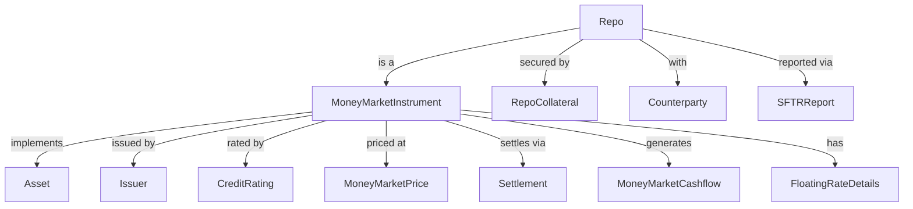

# 04 — Vahalla Wealth Data Specification — Money Market Instruments

> **Document Index:** [00-index.md](00-index.md) | **Related:** [04.1 — Money Market Sample Data (CSV & JSON)](04.1-sample-data-csv-money-market.md) | [02 — Equity & Bond Specification](02-bank-data-specification-equity-bond.md) | [03 — Investment Funds Specification](03-bank-data-specification-investment-funds.md) | [01 — Wealth Management Specification](01-wealth-management-specification.md)

| | |
|---|---|
| **Document Title** | Investment Module — Money Market Instruments Specification |
| **System** | Vahalla Wealth Management System |
| **Document Version** | 1.0 |
| **Date** | 2025-07-09 |
| **Classification** | Confidential |
| **Status** | Draft |
| **Prepared By** | Vahalla System Team |

### Revision History

| Version | Date | Author | Description |
|---|---|---|---|
| 1.0 | 2025-07-09 | Vahalla System Team | Initial draft — Money Market Instruments specification |

---

## 1. Purpose

This document specifies the data fields, formats, and standards required from banking partners to integrate **Money Market Instrument** data into the Vahalla Wealth Management System. The data model is aligned with **ISO 20022** (`mmkt.001` — Money Market Unsecured Market Transaction, `mmkt.002` — Money Market Secured Market Transaction, `mmkt.003` — Money Market Foreign Exchange Swaps, `semt.003` — Securities Balance Custody Report).

**This version covers Money Market Instruments** including Treasury Bills, Commercial Paper, Certificates of Deposit, Repos/Reverse Repos, Bankers' Acceptances, Time Deposits, Call Deposits, Overnight Deposits, Term Deposits, Discount Notes, and Promissory Notes. For other asset classes, refer to:
- [02 — Equity & Bond Specification](02-bank-data-specification-equity-bond.md)
- [03 — Investment Funds Specification](03-bank-data-specification-investment-funds.md)

---

## 2. Entity Relationship Overview

---

## 3. Data Standards & Conventions

### 3.1 Applicable ISO Standards

| Standard | Description | Usage |
|---|---|---|
| **ISO 6166** | ISIN — International Securities Identification Number | Primary security identifier (12 chars) |
| **ISO 6167** | CUSIP — Committee on Uniform Securities Identification Procedures | US/Canada security identifier (9 chars) |
| **SEDOL** | Stock Exchange Daily Official List | UK/Ireland security identifier (7 chars) |
| **ISO 17442** | LEI — Legal Entity Identifier | Issuer/counterparty identification (20 chars) |
| **ISO 18774** | FISN — Financial Instrument Short Name | Standardized short name (max 35 chars) |
| **ISO 10962** | CFI — Classification of Financial Instruments | Instrument classification (6 chars) |
| **ISO 10383** | MIC — Market Identifier Code | Trading venue identification (4 chars) |
| **ISO 4217** | Currency Codes | All currency fields (3 chars, e.g. USD, EUR, GBP) |
| **ISO 3166** | Country Codes | Country of issuance (2-char alpha) |
| **ISO 8601** | Date/Time Format | All date and timestamp fields |
| **ISO 20022** | Financial Messaging Standard | Overall data model alignment |

### 3.2 ISO 20022 Message References

| Message Type | Name | Usage |
|---|---|---|
| **mmkt.001** | Money Market Unsecured Market Transaction Report | Unsecured deposits, CP, CD, T-Bills |
| **mmkt.002** | Money Market Secured Market Transaction Report | Repos, reverse repos, collateral details |
| **mmkt.003** | Money Market Foreign Exchange Swaps Report | FX swaps in money market context |
| **semt.003** | Securities Balance Custody Report | Money market position/holding statements |
| **sese.023** | Securities Settlement Transaction Instruction | Settlement of money market trades |
| **colr.003** | Collateral Proposal | Repo collateral management |

### 3.3 Data Type Definitions

| Data Type | Format | Example |
|---|---|---|
| `String` | UTF-8 text | `"US Treasury 3M Bill"` |
| `Decimal` | Numeric with decimal precision (up to 18 digits) | `99.7500` |
| `Int` | Integer | `90` |
| `Boolean` | `true` / `false` | `true` |
| `Date` | ISO 8601 date: `YYYY-MM-DD` | `2026-01-15` |
| `DateTime` | ISO 8601 with timezone: `YYYY-MM-DDTHH:MM:SSZ` | `2026-01-15T09:30:00Z` |
| `Enum` | Predefined value from allowed list | `TREASURY_BILL` |

### 3.4 Field Requirement Levels

| Level | Label | Meaning |
|---|---|---|
| **Required** | Required | Must be provided. Record will be rejected without this field. |
| **Conditionally Required** | Conditional | Required when a specific condition is met (noted in Description). |
| **Optional** | Optional | Provide if available. Enhances data quality. |

### 3.5 Delivery Format

- **Preferred:** JSON or XML (ISO 20022 compliant messages)
- **Acceptable:** CSV with header row matching field names, or plain text (fixed-width/delimited)
- **Encoding:** UTF-8
- **Frequency:** Daily end-of-day batch, or real-time via API

---

## 4. Common Identification Fields

Money Market Instrument records share the same common identification fields (§4.1–§4.4) as defined in [02 — Equity & Bond Specification, Section 4](02-bank-data-specification-equity-bond.md#4-common-security-identification-fields), with the following differences:

- The `assetClass` field must be set to `MONEY_MARKET_INSTRUMENTS` (per the `AssetClass` enum).
- Instead of `securityType`, Money Market Instruments use `instrumentType` from the `MoneyMarketInstrumentType` enum.

| `instrumentType` Value | Description | Typical Tenor |
|---|---|---|
| `TREASURY_BILL` | Government short-term discount instrument | 4 weeks – 52 weeks |
| `COMMERCIAL_PAPER` | Unsecured corporate short-term note | 1 day – 270 days |
| `CERTIFICATE_OF_DEPOSIT` | Bank-issued time deposit certificate | 1 month – 12 months |
| `REPO` | Repurchase agreement (sell & buy back) | Overnight – 1 year |
| `REVERSE_REPO` | Reverse repurchase agreement (buy & sell back) | Overnight – 1 year |
| `BANKERS_ACCEPTANCE` | Bank-guaranteed trade finance instrument | 30 – 180 days |
| `TIME_DEPOSIT` | Fixed-term bank deposit | 1 week – 12 months |
| `CALL_DEPOSIT` | Deposit withdrawable on demand/notice | On demand |
| `OVERNIGHT_DEPOSIT` | One-day interbank deposit | Overnight |
| `TERM_DEPOSIT` | Fixed-term deposit with agreed rate | 1 week – 12 months |
| `MONEY_MARKET_FUND` | Short-term collective investment vehicle | N/A |
| `DISCOUNT_NOTE` | Agency/GSE short-term discount note | 1 day – 360 days |
| `PROMISSORY_NOTE` | Issuer promise to pay at maturity | 30 – 365 days |

---

## 5. Money Market Identification

### 5.1 Instrument Type & Program

| # | Field Name | Data Type | Required | Description | Example | ISO 20022 Reference |
|---|---|---|---|---|---|---|
| 15 | `instrumentType` | Enum | Required | Money market instrument sub-type | See [Appendix A.1](#a1-moneymarketinstrumenttype) | mmkt.001 — `TxTp` |
| 16 | `shortTermPaperId` | String | Optional | Short-term paper identifier | `"STP-2026-001"` | mmkt.001 — `InstrmId/ShrtTrmPprId` |
| 17 | `dealerReference` | String | Optional | Dealer/broker reference number | `"DLR-GS-2026-0145"` | mmkt.001 — `DlrRef` |
| 18 | `programName` | String | Optional | CP/CD program name | `"Apple Inc. CP Program"` | mmkt.001 — `PrgrmNm` |
| 19 | `seriesNumber` | String | Optional | Series number within program | `"Series 2026-A"` | mmkt.001 — `SrsNb` |
| 20 | `trancheNumber` | String | Optional | Tranche number within series | `"Tranche 1"` | mmkt.001 — `TrchNb` |
| 21 | `uniqueTransactionIdentifier` | String | Optional | UTI for SFTR reporting | `"UTI2026020700001"` | mmkt.002 — `UnqTxIdr` |
| 22 | `uniqueProductIdentifier` | String | Optional | UPI for regulatory reporting | `"UPI2026020700001"` | mmkt.002 — `UnqPdctIdr` |
| 23 | `instrumentStatus` | Enum | Optional | Current instrument lifecycle status | See [Appendix A.2](#a2-moneymarketstatus) | mmkt.001 — `InstrmSts` |

---

## 6. Instrument Specifications

| # | Field Name | Data Type | Required | Description | Example | ISO 20022 Reference |
|---|---|---|---|---|---|---|
| 24 | `faceValue` | Decimal | Required | Par/face value of the instrument | `1000000.00` | mmkt.001 — `FaceVal` |
| 25 | `denomination` | Decimal | Optional | Minimum denomination | `100000.00` | mmkt.001 — `Dnmtn` |
| 26 | `minimumTradingAmount` | Decimal | Optional | Minimum trading amount | `100000.00` | mmkt.001 — `MinTradgAmt` |
| 27 | `minimumIncrement` | Decimal | Optional | Minimum increment above minimum | `1000.00` | mmkt.001 — `MinIncrmt` |
| 28 | `lotSize` | Decimal | Optional | Standard lot size | `1000000.00` | mmkt.001 — `LotSz` |
| 29 | `totalIssueSize` | Decimal | Optional | Total amount issued | `5000000000.00` | mmkt.001 — `TtlIssdAmt` |
| 30 | `outstandingIssueSize` | Decimal | Optional | Amount currently outstanding | `4500000000.00` | mmkt.001 — `OutsdngAmt` |
| 31 | `maximumIssueSize` | Decimal | Optional | Maximum program size | `10000000000.00` | mmkt.001 — `MaxIssdAmt` |
| 32 | `fungible` | Boolean | Optional | Whether fungible with other issues | `true` | mmkt.001 — `Fngb` |

---

## 7. Dates

| # | Field Name | Data Type | Required | Description | Example | ISO 20022 Reference |
|---|---|---|---|---|---|---|
| 33 | `issueDate` | Date | Required | Date of issuance | `"2026-01-15"` | mmkt.001 — `IssDt` |
| 34 | `maturityDate` | Date | Required | Maturity/redemption date | `"2026-04-15"` | mmkt.001 — `MtrtyDt` |
| 35 | `valueDate` | Date | Optional | Value/settlement date | `"2026-01-15"` | mmkt.001 — `ValDt` |
| 36 | `settlementDate` | Date | Optional | Settlement date | `"2026-01-15"` | sese.023 — `SttlmDt` |
| 37 | `firstPaymentDate` | Date | Optional | First interest payment date | `"2026-02-15"` | mmkt.001 — `FrstPmtDt` |
| 38 | `lastPaymentDate` | Date | Optional | Last interest payment date | `"2026-04-15"` | mmkt.001 — `LastPmtDt` |
| 39 | `nextPaymentDate` | Date | Optional | Next scheduled payment date | `"2026-02-15"` | mmkt.001 — `NxtPmtDt` |
| 40 | `terminationDate` | Date | Conditional | Repo termination date (required for repos) | `"2026-01-22"` | mmkt.002 — `TermntnDt` |

---

## 8. Pricing & Valuation

| # | Field Name | Data Type | Required | Description | Example | ISO 20022 Reference |
|---|---|---|---|---|---|---|
| 41 | `discountRate` | Decimal | Conditional | Discount rate (for discount instruments) | `5.25` | mmkt.001 — `DscntRate` |
| 42 | `yieldToMaturity` | Decimal | Optional | Yield to maturity (annualised) | `5.35` | mmkt.001 — `YldToMtrty` |
| 43 | `issuePrice` | Decimal | Optional | Price at issuance | `98.6875` | mmkt.001 — `IssePric` |
| 44 | `redemptionPrice` | Decimal | Optional | Price at redemption (typically 100) | `100.00` | mmkt.001 — `RedPric` |
| 45 | `cleanPrice` | Decimal | Optional | Clean price (excl. accrued interest) | `99.75` | mmkt.001 — `ClnPric` |
| 46 | `dirtyPrice` | Decimal | Optional | Dirty price (incl. accrued interest) | `99.85` | mmkt.001 — `DrtyPric` |
| 47 | `accruedInterest` | Decimal | Optional | Accrued interest amount | `1250.00` | mmkt.001 — `AcrdIntrst` |
| 48 | `currentYield` | Decimal | Optional | Current yield | `5.30` | mmkt.001 — `CurYld` |
| 49 | `pricingMethod` | Enum | Optional | Pricing/quotation method | See [Appendix A.3](#a3-pricingmethod) | mmkt.001 — `PricgMtd` |
| 50 | `quotationType` | String | Optional | Quotation type | `"YIELD"`, `"PRICE"`, `"DISCOUNT"` | mmkt.001 — `QtnTp` |

---

## 9. Interest Details

### 9.1 Fixed/Discount Interest

| # | Field Name | Data Type | Required | Description | Example | ISO 20022 Reference |
|---|---|---|---|---|---|---|
| 51 | `interestPaymentType` | Enum | Optional | Interest payment mechanism | See [Appendix A.4](#a4-interestpaymenttype) | mmkt.001 — `IntrstPmtTp` |
| 52 | `interestRate` | Decimal | Conditional | Fixed interest rate (% p.a.) | `5.25` | mmkt.001 — `IntrstRate` |
| 53 | `interestPaymentFrequency` | Enum | Optional | Interest payment frequency | `MONTHLY`, `AT_MATURITY` | mmkt.001 — `IntrstPmtFrqcy` |
| 54 | `nextInterestPaymentDate` | Date | Optional | Next interest payment date | `"2026-02-15"` | mmkt.001 — `NxtIntrstPmtDt` |
| 55 | `interestAccrualDate` | Date | Optional | Interest accrual start date | `"2026-01-15"` | mmkt.001 — `IntrstAcrlDt` |

### 9.2 Floating Rate Details

| # | Field Name | Data Type | Required | Description | Example | ISO 20022 Reference |
|---|---|---|---|---|---|---|
| 56 | `floatingRateIndex` | Enum | Conditional | Reference rate index (required if floating) | `SOFR`, `EURIBOR` | mmkt.001 — `FltgRateIndx` |
| 57 | `floatingRateIndexTenor` | String | Conditional | Index tenor | `"3M"`, `"ON"` | mmkt.001 — `FltgRateIndxTnr` |
| 58 | `floatingRateSpread` | Decimal | Conditional | Spread over index (basis points) | `15.00` | mmkt.001 — `FltgRateSprd` |
| 59 | `floatingRateResetFrequency` | Enum | Conditional | Rate reset frequency | `MONTHLY`, `QUARTERLY` | mmkt.001 — `FltgRateRstFrqcy` |
| 60 | `nextResetDate` | Date | Optional | Next rate reset date | `"2026-02-15"` | mmkt.001 — `NxtRstDt` |
| 61 | `rateFloor` | Decimal | Optional | Minimum rate floor | `0.00` | mmkt.001 — `RateFlr` |
| 62 | `rateCap` | Decimal | Optional | Maximum rate cap | `10.00` | mmkt.001 — `RateCap` |

---

## 10. Credit & Rating

| # | Field Name | Data Type | Required | Description | Example | ISO 20022 Reference |
|---|---|---|---|---|---|---|
| 63 | `creditRating` | String | Optional | Composite credit rating | `"A-1+"` | mmkt.001 — `CdtRtg` |
| 64 | `creditRatingMoodys` | String | Optional | Moody's short-term rating | `"P-1"` | mmkt.001 — `CdtRtgMdys` |
| 65 | `creditRatingSP` | String | Optional | S&P short-term rating | `"A-1+"` | mmkt.001 — `CdtRtgSP` |
| 66 | `creditRatingFitch` | String | Optional | Fitch short-term rating | `"F1+"` | mmkt.001 — `CdtRtgFtch` |
| 67 | `ratingAgency` | String | Optional | Primary rating agency | `"S&P Global Ratings"` | mmkt.001 — `RtgAgncy` |
| 68 | `creditQualityStep` | Enum | Optional | CRD IV credit quality step | See [Appendix A.5](#a5-creditqualitystep) | mmkt.001 — `CdtQltyStep` |
| 69 | `defaultStatus` | Boolean | Optional | Whether instrument is in default | `false` | mmkt.001 — `DfltSts` |
| 70 | `ratingDate` | Date | Optional | Date of last rating action | `"2026-01-10"` | mmkt.001 — `RtgDt` |
| 71 | `ratingOutlook` | String | Optional | Rating outlook | `"STABLE"`, `"POSITIVE"`, `"NEGATIVE"` | mmkt.001 — `RtgOtlk` |

---

## 11. Settlement

| # | Field Name | Data Type | Required | Description | Example | ISO 20022 Reference |
|---|---|---|---|---|---|---|
| 72 | `settlementType` | Enum | Optional | Settlement method | `CASH`, `PHYSICAL` | sese.023 — `SttlmTp` |
| 73 | `settlementCycle` | Enum | Optional | Settlement cycle | `T_PLUS_0`, `T_PLUS_1`, `T_PLUS_2` | sese.023 — `SttlmCycl` |
| 74 | `clearingSystem` | String | Optional | Clearing system name | `"Fedwire"`, `"Euroclear"` | sese.023 — `ClrSys` |
| 75 | `clearingSystemLei` | String | Optional | LEI of clearing system | `"549300EXAMPLE000CS01"` | sese.023 — `ClrSys/LEI` |
| 76 | `deliveryType` | Enum | Optional | Delivery method | `CASH`, `PHYSICAL` | sese.023 — `DlvryTp` |
| 77 | `settlementLocation` | String | Optional | Settlement location/depository | `"DTC"`, `"Euroclear"` | sese.023 — `SttlmLctn` |
| 78 | `custodian` | String | Optional | Custodian name | `"JPMorgan Chase"` | sese.023 — `Cstdn` |
| 79 | `custodianLei` | String | Optional | LEI of custodian | `"7H6GLXDRUGQFU57RNE97"` | sese.023 — `Cstdn/LEI` |

---

## 12. Trading

| # | Field Name | Data Type | Required | Description | Example | ISO 20022 Reference |
|---|---|---|---|---|---|---|
| 80 | `tradingVenue` | String | Optional | Trading venue/platform | `"TradeWeb"`, `"Bloomberg"` | mmkt.001 — `TradgVn` |
| 81 | `mic` | String | Optional | Market Identifier Code (ISO 10383) | `"XOTC"` | mmkt.001 — `MIC` |
| 82 | `tradingCurrency` | String | Optional | Trading currency per ISO 4217 | `"USD"` | mmkt.001 — `TradgCcy` |
| 83 | `tradingStatus` | Enum | Optional | Current trading status | `ACTIVE`, `SUSPENDED` | mmkt.001 — `TradgSts` |
| 84 | `firstTradingDate` | Date | Optional | First trading date | `"2026-01-15"` | mmkt.001 — `FrstTradgDt` |
| 85 | `lastTradingDate` | Date | Optional | Last trading date | `"2026-04-14"` | mmkt.001 — `LastTradgDt` |

---

## 13. Repo-Specific Fields

> **Note:** Fields in this section are **conditionally required** when `instrumentType` is `REPO`, `REVERSE_REPO`, or any repo variant.

### 13.1 Repo Terms

| # | Field Name | Data Type | Required | Description | Example | ISO 20022 Reference |
|---|---|---|---|---|---|---|
| 86 | `repoType` | Enum | Conditional | Type of repo transaction | See [Appendix A.6](#a6-repotype) | mmkt.002 — `RpTp` |
| 87 | `repoTerminationType` | Enum | Conditional | Term structure of repo | See [Appendix A.7](#a7-repoterminationtype) | mmkt.002 — `RpTermntnTp` |
| 88 | `repoRate` | Decimal | Conditional | Repo interest rate (% p.a.) | `5.30` | mmkt.002 — `RpRate` |
| 89 | `repoSpread` | Decimal | Optional | Spread over benchmark (bps) | `10.00` | mmkt.002 — `RpSprd` |
| 90 | `haircut` | Decimal | Conditional | Collateral haircut (%) | `2.00` | mmkt.002 — `Hrct` |

### 13.2 Collateral

| # | Field Name | Data Type | Required | Description | Example | ISO 20022 Reference |
|---|---|---|---|---|---|---|
| 91 | `collateralType` | Enum | Conditional | Type of collateral pledged | See [Appendix A.8](#a8-collateraltype) | mmkt.002 — `CollTp` |
| 92 | `collateralValue` | Decimal | Conditional | Market value of collateral | `1020000.00` | mmkt.002 — `CollVal` |
| 93 | `collateralCurrency` | String | Conditional | Collateral currency per ISO 4217 | `"USD"` | mmkt.002 — `CollCcy` |
| 94 | `collateralIsin` | String | Optional | ISIN of collateral security | `"US912828ZT58"` | mmkt.002 — `CollISIN` |
| 95 | `initialMargin` | Decimal | Optional | Initial margin requirement (%) | `102.00` | mmkt.002 — `InitlMrgn` |
| 96 | `variationMargin` | Decimal | Optional | Variation margin amount | `5000.00` | mmkt.002 — `VartnMrgn` |
| 97 | `marginCall` | Boolean | Optional | Whether margin calls apply | `true` | mmkt.002 — `MrgnCall` |
| 98 | `marginCallFrequency` | String | Optional | Margin call frequency | `"DAILY"` | mmkt.002 — `MrgnCallFrqcy` |
| 99 | `substitutionAllowed` | Boolean | Optional | Whether collateral substitution is allowed | `true` | mmkt.002 — `SbstttnAllwd` |
| 100 | `substitutionNotice` | Int | Optional | Notice period for substitution (days) | `1` | mmkt.002 — `SbstttnNtce` |
| 101 | `minimumNoticeForTermination` | Int | Optional | Minimum notice for early termination (days) | `1` | mmkt.002 — `MinNtceForTermntn` |

### 13.3 Counterparty

| # | Field Name | Data Type | Required | Description | Example | ISO 20022 Reference |
|---|---|---|---|---|---|---|
| 102 | `counterparty` | String | Conditional | Counterparty name (required for repos) | `"Goldman Sachs"` | mmkt.002 — `CtrPty/Nm` |
| 103 | `counterpartyLei` | String | Conditional | LEI of counterparty | `"784F5XWPLTWKTBV3E584"` | mmkt.002 — `CtrPty/LEI` |
| 104 | `counterpartyRating` | String | Optional | Counterparty credit rating | `"A+"` | mmkt.002 — `CtrPty/CdtRtg` |
| 105 | `tripartyAgent` | String | Optional | Triparty agent name | `"BNY Mellon"` | mmkt.002 — `TrPtyAgt/Nm` |
| 106 | `tripartyAgentLei` | String | Optional | LEI of triparty agent | `"HPFHU0OQ28E4N0NFVK49"` | mmkt.002 — `TrPtyAgt/LEI` |
| 107 | `clearingBroker` | String | Optional | Clearing broker name | `"FICC"` | mmkt.002 — `ClrBrkr/Nm` |
| 108 | `clearingBrokerLei` | String | Optional | LEI of clearing broker | `"549300EXAMPLE000CB01"` | mmkt.002 — `ClrBrkr/LEI` |

---

## 14. Issuer Details

| # | Field Name | Data Type | Required | Description | Example | ISO 20022 Reference |
|---|---|---|---|---|---|---|
| 109 | `issuerLei` | String | Optional | LEI of issuer per ISO 17442 | `"549300EXAMPLE000IS01"` | mmkt.001 — `Issr/LEI` |
| 110 | `issuerType` | Enum | Optional | Issuer classification | See [Appendix A.9](#a9-issuertype) | mmkt.001 — `Issr/Tp` |
| 111 | `issuerCountry` | String | Optional | Issuer country per ISO 3166 | `"US"` | mmkt.001 — `Issr/Ctry` |
| 112 | `issuerSector` | String | Optional | Issuer industry sector | `"Financial Services"` | mmkt.001 — `Issr/Sctr` |
| 113 | `issuerCreditRating` | String | Optional | Issuer long-term credit rating | `"AA+"` | mmkt.001 — `Issr/CdtRtg` |
| 114 | `guarantor` | String | Optional | Guarantor name | `"US Government"` | mmkt.001 — `Grntr/Nm` |
| 115 | `guarantorLei` | String | Optional | LEI of guarantor | `"549300EXAMPLE000GR01"` | mmkt.001 — `Grntr/LEI` |
| 116 | `guarantorType` | String | Optional | Guarantor type | `"SOVEREIGN"` | mmkt.001 — `Grntr/Tp` |
| 117 | `backupFacility` | Boolean | Optional | Whether backup liquidity facility exists | `false` | mmkt.001 — `BckpFclty` |
| 118 | `backupFacilityProvider` | String | Optional | Backup facility provider name | `"JPMorgan Chase"` | mmkt.001 — `BckpFcltyPrvdr` |

---

## 15. Regulatory

| # | Field Name | Data Type | Required | Description | Example | ISO 20022 Reference |
|---|---|---|---|---|---|---|
| 119 | `regulatoryClassification` | Enum | Optional | Regulatory classification for LCR/HQLA | See [Appendix A.10](#a10-regulatoryclassification) | mmkt.001 — `RgltryClssfctn` |
| 120 | `eligibleCollateralFlag` | Boolean | Optional | Eligible as collateral | `true` | mmkt.001 — `ElgblCollFlg` |
| 121 | `liquidityCoverageRatio` | Boolean | Optional | LCR eligible | `true` | mmkt.001 — `LqdtyCvrgeRto` |
| 122 | `centralBankEligible` | Boolean | Optional | Eligible for central bank operations | `true` | mmkt.001 — `CntrlBkElgbl` |
| 123 | `ecbEligible` | Boolean | Optional | ECB eligible collateral | `false` | mmkt.001 — `ECBElgbl` |
| 124 | `fedEligible` | Boolean | Optional | Fed eligible collateral | `true` | mmkt.001 — `FEDElgbl` |
| 125 | `reportingJurisdiction` | String | Optional | Regulatory reporting jurisdiction | `"US"` | mmkt.001 — `RptgJursdctn` |
| 126 | `regulatoryReportingRequired` | Boolean | Optional | Whether regulatory reporting is required | `true` | mmkt.001 — `RgltryRptgReqrd` |

---

## 16. Additional Details

### 16.1 Day Count & Conventions

| # | Field Name | Data Type | Required | Description | Example | ISO 20022 Reference |
|---|---|---|---|---|---|---|
| 127 | `dayCountBasis` | Enum | Optional | Day count convention | `ACT_360`, `ACT_365` | mmkt.001 — `DayCntBsis` |
| 128 | `businessDayConvention` | Enum | Optional | Business day adjustment | `MODIFIED_FOLLOWING` | mmkt.001 — `BizDayConv` |
| 129 | `interestCalculationMethod` | String | Optional | Interest calculation method | `"Simple"`, `"Compound"` | mmkt.001 — `IntrstCalcMtd` |
| 130 | `compoundingMethod` | String | Optional | Compounding method | `"None"`, `"Flat"`, `"Straight"` | mmkt.001 — `CmpdgMtd` |
| 131 | `rollConvention` | String | Optional | Roll date convention | `"EOM"`, `"IMM"` | mmkt.001 — `RollConv` |

### 16.2 Valuation

| # | Field Name | Data Type | Required | Description | Example | ISO 20022 Reference |
|---|---|---|---|---|---|---|
| 132 | `valuationMethod` | Enum | Optional | Valuation methodology | `MARK_TO_MARKET` | mmkt.001 — `ValtnMtd` |
| 133 | `valuationSource` | String | Optional | Valuation data source | `"Bloomberg"` | mmkt.001 — `ValtnSrc` |
| 134 | `valuationDate` | Date | Optional | Last valuation date | `"2026-02-08"` | mmkt.001 — `ValtnDt` |
| 135 | `marketValue` | Decimal | Optional | Current market value | `998750.00` | mmkt.001 — `MktVal` |
| 136 | `bookValue` | Decimal | Optional | Book/amortised value | `997500.00` | mmkt.001 — `BkVal` |

---

## 17. Market Data

| # | Field Name | Data Type | Required | Description | Example | ISO 20022 Reference |
|---|---|---|---|---|---|---|
| 137 | `bidPrice` | Decimal | Optional | Bid price | `99.70` | mmkt.001 — `BdPric` |
| 138 | `askPrice` | Decimal | Optional | Ask price | `99.80` | mmkt.001 — `AskPric` |
| 139 | `bidYield` | Decimal | Optional | Bid yield (%) | `5.35` | mmkt.001 — `BdYld` |
| 140 | `askYield` | Decimal | Optional | Ask yield (%) | `5.25` | mmkt.001 — `AskYld` |
| 141 | `midPrice` | Decimal | Optional | Mid price | `99.75` | mmkt.001 — `MidPric` |
| 142 | `lastTradePrice` | Decimal | Optional | Last traded price | `99.75` | mmkt.001 — `LastTradPric` |
| 143 | `openPrice` | Decimal | Optional | Opening price | `99.70` | mmkt.001 — `OpnPric` |
| 144 | `highPrice` | Decimal | Optional | Intraday high price | `99.82` | mmkt.001 — `HghPric` |
| 145 | `lowPrice` | Decimal | Optional | Intraday low price | `99.68` | mmkt.001 — `LwPric` |
| 146 | `closePrice` | Decimal | Optional | Closing price | `99.75` | mmkt.001 — `ClsPric` |
| 147 | `volume` | Decimal | Optional | Trading volume | `50000000.00` | mmkt.001 — `Vol` |
| 148 | `volumeWeightedAveragePrice` | Decimal | Optional | VWAP | `99.74` | mmkt.001 — `VWAP` |
| 149 | `outstandingAmount` | Decimal | Optional | Outstanding notional amount | `4500000000.00` | mmkt.001 — `OutsdngAmt` |
| 150 | `numberOfTrades` | Int | Optional | Number of trades | `125` | mmkt.001 — `NbOfTrds` |
| 151 | `lastUpdateTime` | DateTime | Optional | Last market data update time | `"2026-02-08T16:00:00Z"` | mmkt.001 — `LastUpdtTm` |

---

## 18. Tax Information

| # | Field Name | Data Type | Required | Description | Example | ISO 20022 Reference |
|---|---|---|---|---|---|---|
| 152 | `taxStatus` | Enum | Optional | Tax status | `TAXABLE`, `TAX_EXEMPT` | mmkt.001 — `TaxSts` |
| 153 | `withholdingTaxRate` | Decimal | Optional | Withholding tax rate (%) | `0.00` | mmkt.001 — `WhldgTaxRate` |
| 154 | `taxExempt` | Boolean | Optional | Whether tax exempt | `true` | mmkt.001 — `TaxXmpt` |
| 155 | `taxCountry` | String | Optional | Tax jurisdiction per ISO 3166 | `"US"` | mmkt.001 — `TaxCtry` |

---

## 19. Documentation

| # | Field Name | Data Type | Required | Description | Example | ISO 20022 Reference |
|---|---|---|---|---|---|---|
| 156 | `prospectusUrl` | String | Optional | URL to prospectus/offering document | `"https://..."` | mmkt.001 — `PrspctsURL` |
| 157 | `termSheetUrl` | String | Optional | URL to term sheet | `"https://..."` | mmkt.001 — `TrmShtURL` |
| 158 | `offeringCircularUrl` | String | Optional | URL to offering circular | `"https://..."` | mmkt.001 — `OffrngCrclrURL` |

---

## 20. SFTR Reporting (Repos)

> **Note:** Fields in this section support **Securities Financing Transactions Regulation (SFTR)** reporting for repo transactions.

| # | Field Name | Data Type | Required | Description | Example | ISO 20022 Reference |
|---|---|---|---|---|---|---|
| 159 | `reportingCounterparty` | String | Conditional | Reporting counterparty name | `"JPMorgan Chase"` | mmkt.002 — `RptgCtrPty/Nm` |
| 160 | `reportingCounterpartyLei` | String | Conditional | LEI of reporting counterparty | `"7H6GLXDRUGQFU57RNE97"` | mmkt.002 — `RptgCtrPty/LEI` |
| 161 | `reportingTimestamp` | DateTime | Conditional | Reporting timestamp | `"2026-02-08T18:00:00Z"` | mmkt.002 — `RptgTmStmp` |
| 162 | `actionType` | Enum | Conditional | Reporting action type | `NEW`, `MODIFY`, `CANCEL` | mmkt.002 — `ActnTp` |

---

## 21. Additional Repo Fields

| # | Field Name | Data Type | Required | Description | Example | ISO 20022 Reference |
|---|---|---|---|---|---|---|
| 163 | `repurchasePrice` | Decimal | Conditional | Agreed repurchase price | `1000145.83` | mmkt.002 — `RpPric` |
| 164 | `repurchaseDate` | Date | Conditional | Agreed repurchase date | `"2026-01-22"` | mmkt.002 — `RpDt` |
| 165 | `openRepoFlag` | Boolean | Optional | Whether repo is open (no fixed end date) | `false` | mmkt.002 — `OpnRpFlg` |
| 166 | `autoRenewal` | Boolean | Optional | Whether repo auto-renews | `false` | mmkt.002 — `AutoRnwl` |

---

## 22. Risk Metrics

| # | Field Name | Data Type | Required | Description | Example | ISO 20022 Reference |
|---|---|---|---|---|---|---|
| 167 | `duration` | Decimal | Optional | Macaulay duration (years) | `0.24` | mmkt.001 — `Drtn` |
| 168 | `modifiedDuration` | Decimal | Optional | Modified duration | `0.23` | mmkt.001 — `ModDrtn` |
| 169 | `convexity` | Decimal | Optional | Convexity | `0.001` | mmkt.001 — `Cnvxty` |
| 170 | `dv01` | Decimal | Optional | Dollar value of 1bp change | `23.50` | mmkt.001 — `DV01` |

---

## Appendix A — Enum Reference Tables

### A.1 MoneyMarketInstrumentType

| Value | Description | ISO 20022 Reference |
|---|---|---|
| `TREASURY_BILL` | Government short-term discount instrument | mmkt.001 — `InstrmTp/TBIL` |
| `COMMERCIAL_PAPER` | Unsecured corporate short-term note | mmkt.001 — `InstrmTp/CMPR` |
| `CERTIFICATE_OF_DEPOSIT` | Bank-issued time deposit certificate | mmkt.001 — `InstrmTp/CDEP` |
| `REPO` | Repurchase agreement | mmkt.002 — `InstrmTp/REPO` |
| `REVERSE_REPO` | Reverse repurchase agreement | mmkt.002 — `InstrmTp/RVPO` |
| `BANKERS_ACCEPTANCE` | Bank-guaranteed trade finance instrument | mmkt.001 — `InstrmTp/BKAC` |
| `TIME_DEPOSIT` | Fixed-term bank deposit | mmkt.001 — `InstrmTp/TMDP` |
| `CALL_DEPOSIT` | Deposit withdrawable on demand/notice | mmkt.001 — `InstrmTp/CLDP` |
| `OVERNIGHT_DEPOSIT` | One-day interbank deposit | mmkt.001 — `InstrmTp/ONDP` |
| `TERM_DEPOSIT` | Fixed-term deposit with agreed rate | mmkt.001 — `InstrmTp/TRDP` |
| `MONEY_MARKET_FUND` | Short-term collective investment vehicle | mmkt.001 — `InstrmTp/MMFT` |
| `DISCOUNT_NOTE` | Agency/GSE short-term discount note | mmkt.001 — `InstrmTp/DSNT` |
| `PROMISSORY_NOTE` | Issuer promise to pay at maturity | mmkt.001 — `InstrmTp/PRNT` |

### A.2 MoneyMarketStatus

| Value | Description | ISO 20022 Reference |
|---|---|---|
| `ACTIVE` | Instrument is live and tradeable | mmkt.001 — `InstrmSts/ACTV` |
| `MATURED` | Instrument has reached maturity | mmkt.001 — `InstrmSts/MTRD` |
| `DEFAULTED` | Issuer has defaulted | mmkt.001 — `InstrmSts/DFLT` |
| `CALLED` | Instrument has been called/redeemed early | mmkt.001 — `InstrmSts/CALL` |
| `CANCELLED` | Instrument has been cancelled | mmkt.001 — `InstrmSts/CANC` |
| `SUSPENDED` | Trading suspended | mmkt.001 — `InstrmSts/SUSP` |

### A.3 PricingMethod

| Value | Description | ISO 20022 Reference |
|---|---|---|
| `DISCOUNT_BASIS` | Priced on discount basis (T-Bills, CP) | mmkt.001 — `PricgMtd/DISC` |
| `YIELD_BASIS` | Priced on yield basis (CDs) | mmkt.001 — `PricgMtd/YELD` |
| `MONEY_MARKET_BASIS` | Money market yield convention | mmkt.001 — `PricgMtd/MMKT` |
| `BOND_EQUIVALENT_YIELD` | Bond-equivalent yield conversion | mmkt.001 — `PricgMtd/BEQY` |
| `ACTUAL_360` | Actual/360 day count | mmkt.001 — `PricgMtd/A360` |
| `ACTUAL_365` | Actual/365 day count | mmkt.001 — `PricgMtd/A365` |

### A.4 InterestPaymentType

| Value | Description | ISO 20022 Reference |
|---|---|---|
| `DISCOUNT` | Issued at discount, redeemed at par | mmkt.001 — `IntrstPmtTp/DISC` |
| `INTEREST_BEARING` | Pays periodic interest | mmkt.001 — `IntrstPmtTp/INTR` |
| `ZERO_COUPON` | No periodic interest, single payment at maturity | mmkt.001 — `IntrstPmtTp/ZERO` |
| `FLOATING_RATE` | Variable rate linked to reference index | mmkt.001 — `IntrstPmtTp/FLTG` |

### A.5 CreditQualityStep

| Value | Description | ISO 20022 Reference |
|---|---|---|
| `STEP_1` | Highest quality (AAA/Aaa to AA-/Aa3) | mmkt.001 — `CdtQltyStep/STP1` |
| `STEP_2` | High quality (A+/A1 to A-/A3) | mmkt.001 — `CdtQltyStep/STP2` |
| `STEP_3` | Upper medium (BBB+/Baa1 to BBB-/Baa3) | mmkt.001 — `CdtQltyStep/STP3` |
| `STEP_4` | Lower medium (BB+/Ba1 to BB-/Ba3) | mmkt.001 — `CdtQltyStep/STP4` |
| `STEP_5` | Speculative (B+/B1 to B-/B3) | mmkt.001 — `CdtQltyStep/STP5` |
| `STEP_6` | Highly speculative / Default (CCC and below) | mmkt.001 — `CdtQltyStep/STP6` |
| `NOT_RATED` | No rating available | mmkt.001 — `CdtQltyStep/NRTD` |

### A.6 RepoType

| Value | Description | ISO 20022 Reference |
|---|---|---|
| `CLASSIC_REPO` | Standard repurchase agreement | mmkt.002 — `RpTp/CLRP` |
| `BUY_SELL_BACK` | Buy/sell-back transaction | mmkt.002 — `RpTp/BYSB` |
| `SELL_BUY_BACK` | Sell/buy-back transaction | mmkt.002 — `RpTp/SLBB` |
| `TRIPARTY_REPO` | Triparty repo via agent | mmkt.002 — `RpTp/TRPR` |
| `HOLD_IN_CUSTODY` | Hold-in-custody repo | mmkt.002 — `RpTp/HICR` |
| `GENERAL_COLLATERAL` | General collateral repo (GC) | mmkt.002 — `RpTp/GNCL` |
| `SPECIAL_COLLATERAL` | Special/specific collateral repo | mmkt.002 — `RpTp/SPCL` |

### A.7 RepoTerminationType

| Value | Description | ISO 20022 Reference |
|---|---|---|
| `OPEN` | Open repo (no fixed end date) | mmkt.002 — `RpTermntnTp/OPEN` |
| `TERM` | Term repo (fixed end date) | mmkt.002 — `RpTermntnTp/TERM` |
| `OVERNIGHT` | Overnight repo (1 business day) | mmkt.002 — `RpTermntnTp/OVRN` |
| `EVERGREEN` | Evergreen repo (auto-renewing) | mmkt.002 — `RpTermntnTp/EGRN` |

### A.8 CollateralType

| Value | Description | ISO 20022 Reference |
|---|---|---|
| `GOVERNMENT_SECURITIES` | Government bonds/T-Bills | mmkt.002 — `CollTp/GOVT` |
| `CORPORATE_BONDS` | Corporate bonds | mmkt.002 — `CollTp/CORP` |
| `EQUITIES` | Equity securities | mmkt.002 — `CollTp/EQTY` |
| `CASH` | Cash collateral | mmkt.002 — `CollTp/CASH` |
| `MIXED` | Mixed collateral pool | mmkt.002 — `CollTp/MIXD` |
| `GENERAL_COLLATERAL` | General collateral basket | mmkt.002 — `CollTp/GNCL` |

### A.9 IssuerType

| Value | Description | ISO 20022 Reference |
|---|---|---|
| `SOVEREIGN` | Sovereign government | mmkt.001 — `IssrTp/SOVR` |
| `CORPORATE` | Corporate issuer | mmkt.001 — `IssrTp/CORP` |
| `FINANCIAL_INSTITUTION` | Bank/financial institution | mmkt.001 — `IssrTp/FIIN` |
| `SUPRANATIONAL` | Supranational organisation | mmkt.001 — `IssrTp/SUPN` |
| `AGENCY` | Government agency/GSE | mmkt.001 — `IssrTp/AGCY` |
| `MUNICIPAL` | Municipal/local government | mmkt.001 — `IssrTp/MUNI` |
| `SPECIAL_PURPOSE_VEHICLE` | SPV/conduit | mmkt.001 — `IssrTp/SPVH` |

### A.10 RegulatoryClassification

| Value | Description | ISO 20022 Reference |
|---|---|---|
| `ELIGIBLE_COLLATERAL_ECB` | ECB eligible collateral | mmkt.001 — `RgltryClssfctn/ECBE` |
| `ELIGIBLE_COLLATERAL_FED` | Fed eligible collateral | mmkt.001 — `RgltryClssfctn/FEDE` |
| `HQLA_LEVEL_1` | High Quality Liquid Assets — Level 1 | mmkt.001 — `RgltryClssfctn/HQL1` |
| `HQLA_LEVEL_2A` | High Quality Liquid Assets — Level 2A | mmkt.001 — `RgltryClssfctn/HQ2A` |
| `HQLA_LEVEL_2B` | High Quality Liquid Assets — Level 2B | mmkt.001 — `RgltryClssfctn/HQ2B` |
| `NON_HQLA` | Non-HQLA | mmkt.001 — `RgltryClssfctn/NHQL` |

---

*End of Document*
