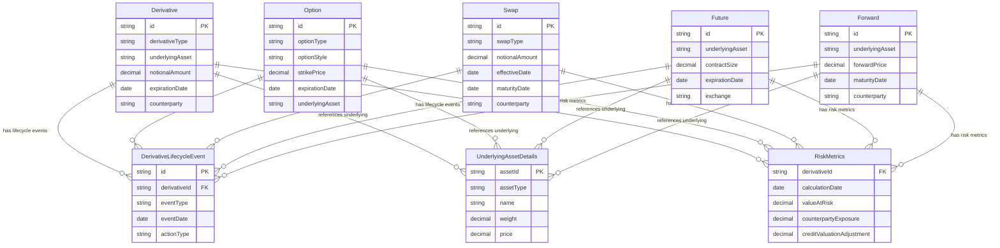

# 05 — Vahalla Wealth Data — Bank Data Specification — Derivatives

| | |
|---|---|
| **Document** | Bank Data Specification — Derivatives |
| **System** | Vahalla Wealth Management System |
| **Version** | 1.0 |
| **Classification** | Confidential |
| **Maintained By** | Vahalla System Team |

## Revision History

| Version | Date | Author | Changes |
|---|---|---|---|
| 1.0 | 2026-02-12 | Vahalla System Team | Initial release — Derivative, Option, Swap, Future, Forward |

---

## 1. Purpose

This document defines the **data fields, formats, and standards** required from the bank for **Derivative instruments** within the Vahalla Wealth Management System.

It covers the following instrument types:

- **Derivative** — Generic OTC derivative (CDS, IRS, Total Return Swap, Variance Swap)
- **Option** — Listed and OTC options (equity, index, commodity, currency)
- **Swap** — Interest Rate Swaps, Credit Default Swaps, Equity Swaps, Commodity Swaps, etc.
- **Future** — Exchange-traded futures (equity, index, commodity, interest rate)
- **Forward** — OTC forward contracts (equity, commodity, interest rate)

Each entity is mapped to its **ISO 20022** message element where applicable.

---

## 2. Entity Relationship Overview



### Entity Summary

| Entity | Fields | Description |
|---|---|---|
| **Derivative** | 65 | Generic OTC derivative master data (CDS, IRS, TRS, Variance Swap) |
| **Option** | 62 | Listed and OTC option master data |
| **Swap** | 72 | Swap master data (IRS, CDS, Equity Swap, etc.) |
| **Future** | 55 | Exchange-traded futures master data |
| **Forward** | 52 | OTC forward contract master data |
| **Derivative Lifecycle Event** | 17 | Trade lifecycle events (amendments, novations, terminations) |
| **Underlying Asset Details** | 9 | Underlying asset reference data (for baskets, indices) |
| **Risk Metrics** | 13 | Market, credit, liquidity, and operational risk metrics |

---

## 3. Data Standards & Conventions

### 3.1 Applicable ISO Standards

| Standard | Description | Usage |
|---|---|---|
| **ISO 6166** | ISIN — International Securities Identification Number | Primary identifier for listed derivatives |
| **ISO 10383** | MIC — Market Identifier Code | Exchange identification |
| **ISO 17442** | LEI — Legal Entity Identifier | Counterparty, clearing house, issuer identification |
| **ISO 4217** | Currency Codes | All currency fields (3-letter codes) |
| **ISO 3166** | Country Codes | Country of listing or counterparty |
| **ISO 8601** | Date/Time Format | All date and timestamp fields |
| **ISO 20022** | Financial Messaging | Field-level mapping to ISO 20022 message elements |
| **ISDA** | Derivatives Documentation | Master agreement, confirmation, and product taxonomy |

### 3.2 Data Type Definitions

| Data Type | Format | Example |
|---|---|---|
| `String` | UTF-8 text | `"S&P 500 Index Future"` |
| `Decimal` | Numeric, dot separator, no thousands | `1250.50` |
| `Date` | `YYYY-MM-DD` (ISO 8601) | `"2026-06-20"` |
| `DateTime` | `YYYY-MM-DDTHH:MM:SSZ` (ISO 8601 UTC) | `"2026-01-15T09:30:00Z"` |
| `Boolean` | `true` / `false` | `true` |
| `Enum` | UPPER_SNAKE_CASE constant | `"INTEREST_RATE_SWAP"` |
| `Int` | Integer | `1500` |

### 3.3 Field Requirement Levels

| Level | Meaning |
|---|---|
| **Required** | Must always be provided. Null or empty values will cause record rejection. |
| **Conditional** | Required when a specific condition is met (noted in Description). |
| **Optional** | May be omitted. Improves data quality when provided. |

### 3.4 Delivery Format

Data may be delivered in **CSV** or **JSON** format. See [05.1 — CSV Sample Data](05.1-sample-data-csv-derivatives.md) for formatting rules.

---

## 4. Common Identification Fields

> These fields appear on **every** derivative entity (Derivative, Option, Swap, Future, Forward) as they implement the `Asset` interface.

| # | Field Name | Data Type | Required | Description | Example | ISO 20022 Reference |
|---|---|---|---|---|---|---|
| 1 | `id` | String | Required | Unique record identifier | `"DRV-001234"` | `FinInstrmId/OthrId/Id` |
| 2 | `isin` | String | Conditional | ISIN (12 chars). Required for listed derivatives | `"US0378331005"` | `FinInstrmId/ISIN` |
| 3 | `cusip` | String | Optional | CUSIP (9 chars) | `"037833100"` | `FinInstrmId/OthrId/Id` (CUSIP) |
| 4 | `sedol` | String | Optional | SEDOL (7 chars) | `"2046251"` | `FinInstrmId/OthrId/Id` (SEDOL) |
| 5 | `ticker` | String | Conditional | Ticker symbol. Required for listed options and futures | `"SPX 260620C04200"` | `FinInstrmId/OthrId/Id` (Ticker) |
| 6 | `name` | String | Required | Instrument name | `"S&P 500 Jun-26 4200 Call"` | `FinInstrmNm` |
| 7 | `assetClass` | Enum | Required | Always `DERIVATIVES` | `"DERIVATIVES"` | `ClssfctnTp/AsstClss` |
| 8 | `issuer` | String | Optional | Issuer / originator name | `"CME Group"` | `Issr` |
| 9 | `lei` | String | Optional | Legal Entity Identifier (20 chars) | `"LCZ7XYGSLJUHFXXNXD88"` | `Issr/LEI` |
| 10 | `fisn` | String | Optional | Financial Instrument Short Name (max 35 chars) | `"SPX/CALL/4200/0626"` | `FinInstrmId/FISN` |
| 11 | `cfi` | String | Optional | Classification of Financial Instruments (6 chars) | `"OCAFPS"` | `FinInstrmId/CFI` |
| 12 | `currency` | String | Required | Primary currency per ISO 4217 | `"USD"` | `DnmtnCcy` |
| 13 | `country` | String | Optional | Country of listing or counterparty per ISO 3166 | `"US"` | `PlcOfListg/Ctry` |
| 14 | `description` | String | Optional | Free-text description | `"S&P 500 Index call option, strike 4200, Jun 2026 expiry"` | `FinInstrmDesc` |
| 15 | `documentUrl` | String | Optional | URL to term sheet, confirmation, or prospectus | `"https://bank.com/docs/DRV001.pdf"` | `AddtlInf/URL` |
| 16 | `createdAt` | DateTime | Required | Record creation timestamp | `"2026-01-15T09:30:00Z"` | `CreDtTm` |
| 17 | `updatedAt` | DateTime | Required | Record last-update timestamp | `"2026-02-12T16:00:00Z"` | `UpdDtTm` |

---

## 5. Derivative (Generic OTC) Data Fields

> **Scope:** Generic OTC derivative instruments including CDS, IRS, Total Return Swap, and Variance Swap. For listed options use [Section 6](#6-option-data-fields), for swaps use [Section 7](#7-swap-data-fields), for futures use [Section 8](#8-future-data-fields), and for forwards use [Section 9](#9-forward-data-fields).

### 5.1 Derivative Identification

| # | Field Name | Data Type | Required | Description | Allowed Values / Example | ISO 20022 Reference |
|---|---|---|---|---|---|---|
| 1 | `derivativeType` | Enum | Required | Derivative instrument type | See [Appendix A.1](#a1-derivativetype) | deriv.013 — `DerivTrad/DerivTp` |
| 2 | `underlyingAsset` | String | Required | Underlying asset name or identifier | `"S&P 500 Index"` | deriv.013 — `DerivTrad/UndrlygAsst/Nm` |
| 3 | `underlyingAssetIsin` | String | Optional | Underlying asset ISIN | `"US78378X1072"` | deriv.013 — `DerivTrad/UndrlygAsst/ISIN` |
| 4 | `underlyingAssetType` | Enum | Optional | Underlying asset type | See [Appendix A.2](#a2-underlyingassettype) | deriv.013 — `DerivTrad/UndrlygAsst/Tp` |
| 5 | `underlyingAssetLei` | String | Optional | Underlying asset issuer LEI | `"549300EXAMPLE000001"` | deriv.013 — `DerivTrad/UndrlygAsst/LEI` |

### 5.2 Contract Specifications

| # | Field Name | Data Type | Required | Description | Example | ISO 20022 Reference |
|---|---|---|---|---|---|---|
| 6 | `contractSize` | Decimal | Optional | Contract size / multiplier | `100.00` | deriv.013 — `DerivTrad/CtrctSpcfctns/CtrctSz` |
| 7 | `contractMultiplier` | Decimal | Optional | Contract multiplier | `100.00` | deriv.013 — `DerivTrad/CtrctSpcfctns/CtrctMltplr` |
| 8 | `lotSize` | Decimal | Optional | Minimum lot size | `1.00` | deriv.013 — `DerivTrad/CtrctSpcfctns/LotSz` |
| 9 | `minimumTradingSize` | Decimal | Optional | Minimum trading size | `1.00` | deriv.013 — `DerivTrad/CtrctSpcfctns/MinTradgSz` |

### 5.3 Dates

| # | Field Name | Data Type | Required | Description | Example | ISO 20022 Reference |
|---|---|---|---|---|---|---|
| 10 | `tradeDate` | Date | Optional | Trade execution date | `"2026-01-15"` | deriv.013 — `DerivTrad/TradDt` |
| 11 | `effectiveDate` | Date | Optional | Contract effective date | `"2026-01-17"` | deriv.013 — `DerivTrad/FctvDt` |
| 12 | `expirationDate` | Date | Optional | Contract expiration date | `"2026-06-20"` | deriv.013 — `DerivTrad/XprtnDt` |
| 13 | `maturityDate` | Date | Optional | Contract maturity date | `"2026-06-20"` | deriv.013 — `DerivTrad/MtrtyDt` |
| 14 | `firstExerciseDate` | Date | Optional | First exercise date (Bermudan/American) | `"2026-02-15"` | deriv.013 — `DerivTrad/FrstExrcDt` |
| 15 | `lastExerciseDate` | Date | Optional | Last exercise date | `"2026-06-20"` | deriv.013 — `DerivTrad/LastExrcDt` |
| 16 | `settlementDate` | Date | Optional | Settlement date | `"2026-06-22"` | deriv.013 — `DerivTrad/SttlmDt` |

### 5.4 Pricing & Valuation

| # | Field Name | Data Type | Required | Description | Example | ISO 20022 Reference |
|---|---|---|---|---|---|---|
| 17 | `strikePrice` | Decimal | Optional | Strike price (for options embedded in derivatives) | `4200.00` | deriv.013 — `DerivTrad/StrkPric` |
| 18 | `premium` | Decimal | Optional | Premium amount | `50000.00` | deriv.013 — `DerivTrad/Prmm` |
| 19 | `notionalAmount` | Decimal | Optional | Notional amount | `10000000.00` | deriv.013 — `DerivTrad/NtnlAmt` |
| 20 | `notionalCurrency` | String | Optional | Notional currency per ISO 4217 | `"USD"` | deriv.013 — `DerivTrad/NtnlCcy` |

### 5.5 Settlement

| # | Field Name | Data Type | Required | Description | Allowed Values / Example | ISO 20022 Reference |
|---|---|---|---|---|---|---|
| 21 | `settlementType` | Enum | Optional | Settlement type | See [Appendix A.3](#a3-settlementtype) | deriv.013 — `DerivTrad/SttlmTp` |
| 22 | `deliveryType` | Enum | Optional | Delivery type | See [Appendix A.4](#a4-deliverytype) | deriv.013 — `DerivTrad/DlvryTp` |
| 23 | `settlementCurrency` | String | Optional | Settlement currency per ISO 4217 | `"USD"` | deriv.013 — `DerivTrad/SttlmCcy` |

### 5.6 Trading & Clearing

| # | Field Name | Data Type | Required | Description | Allowed Values / Example | ISO 20022 Reference |
|---|---|---|---|---|---|---|
| 24 | `exchange` | String | Optional | Exchange name (for listed derivatives) | `"CME"`, `"EUREX"`, `"ICE"` | deriv.013 — `DerivTrad/Xchg` |
| 25 | `mic` | String | Optional | Market Identifier Code per ISO 10383 (4 chars) | `"XCME"` | deriv.013 — `DerivTrad/MktIdCd` |
| 26 | `clearingType` | Enum | Optional | Clearing type | See [Appendix A.5](#a5-clearingtype) | deriv.013 — `DerivTrad/ClrgTp` |
| 27 | `clearingHouse` | String | Optional | Clearing house name | `"CME Clearing"` | deriv.013 — `DerivTrad/ClrgHs` |
| 28 | `clearingHouseLei` | String | Optional | Clearing house LEI | `"SNZ2OJLFK8MNNCLQOF39"` | deriv.013 — `DerivTrad/ClrgHsLEI` |

### 5.7 Counterparty Information

| # | Field Name | Data Type | Required | Description | Example | ISO 20022 Reference |
|---|---|---|---|---|---|---|
| 29 | `counterparty` | String | Optional | Counterparty name | `"JPMorgan Chase & Co."` | deriv.013 — `DerivTrad/CtrPty/Nm` |
| 30 | `counterpartyLei` | String | Optional | Counterparty LEI (20 chars) | `"8I5DZWZKVSZI1NUHU748"` | deriv.013 — `DerivTrad/CtrPty/LEI` |
| 31 | `centralCounterparty` | String | Optional | Central counterparty name | `"LCH Ltd"` | deriv.013 — `DerivTrad/CCP/Nm` |
| 32 | `centralCounterpartyLei` | String | Optional | Central counterparty LEI | `"F226TOH6YD6XJB17KS62"` | deriv.013 — `DerivTrad/CCP/LEI` |

### 5.8 Regulatory

| # | Field Name | Data Type | Required | Description | Example | ISO 20022 Reference |
|---|---|---|---|---|---|---|
| 33 | `reportingJurisdiction` | String | Optional | Reporting jurisdiction | `"EU"`, `"US"`, `"UK"` | deriv.013 — `DerivTrad/Rgltry/RptgJrsdctn` |
| 34 | `tradingVenue` | String | Optional | Trading venue name | `"CME Globex"` | deriv.013 — `DerivTrad/TradgVn/Nm` |
| 35 | `tradingVenueLei` | String | Optional | Trading venue LEI | `"SNZ2OJLFK8MNNCLQOF39"` | deriv.013 — `DerivTrad/TradgVn/LEI` |
| 36 | `regulatoryReportingRequired` | Boolean | Optional | Whether regulatory reporting is required | `true` | deriv.013 — `DerivTrad/Rgltry/RgltryRptgReqrd` |

### 5.9 Risk & Margin

| # | Field Name | Data Type | Required | Description | Example | ISO 20022 Reference |
|---|---|---|---|---|---|---|
| 37 | `initialMargin` | Decimal | Optional | Initial margin amount | `500000.00` | deriv.013 — `DerivTrad/Mrgn/InitlMrgn` |
| 38 | `variationMargin` | Decimal | Optional | Variation margin amount | `25000.00` | deriv.013 — `DerivTrad/Mrgn/VartnMrgn` |
| 39 | `marginCurrency` | String | Optional | Margin currency per ISO 4217 | `"USD"` | deriv.013 — `DerivTrad/Mrgn/MrgnCcy` |
| 40 | `independentAmount` | Decimal | Optional | Independent amount | `0.00` | deriv.013 — `DerivTrad/Mrgn/IndpdntAmt` |
| 41 | `thresholdAmount` | Decimal | Optional | Threshold amount | `250000.00` | deriv.013 — `DerivTrad/Mrgn/ThrshldAmt` |
| 42 | `minimumTransferAmount` | Decimal | Optional | Minimum transfer amount | `50000.00` | deriv.013 — `DerivTrad/Mrgn/MinTrfAmt` |

### 5.10 Product Identification

| # | Field Name | Data Type | Required | Description | Example | ISO 20022 Reference |
|---|---|---|---|---|---|---|
| 43 | `uniqueProductIdentifier` | String | Optional | Unique Product Identifier (UPI) | `"UPI-DERIV-2026-001234"` | deriv.013 — `DerivTrad/PdctId/UPI` |
| 44 | `productTaxonomy` | String | Optional | Product taxonomy classification | `"Credit:Single Name:CDS"` | deriv.013 — `DerivTrad/PdctId/PdctTxnmy` |
| 45 | `assetClassHierarchy` | String | Optional | Asset class hierarchy | `"Derivatives:Credit:CDS"` | deriv.013 — `DerivTrad/PdctId/AsstClssHrrchy` |

### 5.11 Pricing Details

| # | Field Name | Data Type | Required | Description | Example | ISO 20022 Reference |
|---|---|---|---|---|---|---|
| 46 | `pricingSource` | String | Optional | Pricing data source | `"Bloomberg"`, `"Reuters"`, `"Markit"` | deriv.013 — `DerivTrad/Pricg/PricgSrc` |
| 47 | `pricingMethod` | String | Optional | Pricing methodology | `"MODEL"`, `"MARKET"`, `"VENDOR"` | deriv.013 — `DerivTrad/Pricg/PricgMtd` |
| 48 | `referencePrice` | Decimal | Optional | Reference price | `102.50` | deriv.013 — `DerivTrad/Pricg/RefPric` |
| 49 | `referencePriceSource` | String | Optional | Reference price source | `"Bloomberg"` | deriv.013 — `DerivTrad/Pricg/RefPricSrc` |

### 5.12 Regulatory Reporting

| # | Field Name | Data Type | Required | Description | Allowed Values / Example | ISO 20022 Reference |
|---|---|---|---|---|---|---|
| 50 | `tradeRepository` | String | Optional | Trade repository name | `"DTCC GTR"`, `"Regis-TR"` | deriv.013 — `DerivTrad/Rgltry/TradRpstry` |
| 51 | `tradeRepositoryLei` | String | Optional | Trade repository LEI | `"549300JJHZ1QQKBQ5S07"` | deriv.013 — `DerivTrad/Rgltry/TradRpstryLEI` |
| 52 | `reportingTimestamp` | DateTime | Optional | Regulatory reporting timestamp | `"2026-01-15T10:00:00Z"` | deriv.013 — `DerivTrad/Rgltry/RptgTmStmp` |
| 53 | `actionType` | Enum | Optional | Regulatory action type | See [Appendix A.6](#a6-actiontype) | deriv.013 — `DerivTrad/Rgltry/ActnTp` |
| 54 | `clearingObligationFlag` | Boolean | Optional | Subject to clearing obligation | `true` | deriv.013 — `DerivTrad/Rgltry/ClrgOblgtnFlg` |
| 55 | `tradingObligationFlag` | Boolean | Optional | Subject to trading obligation | `false` | deriv.013 — `DerivTrad/Rgltry/TradgOblgtnFlg` |

### 5.13 Contract Details

| # | Field Name | Data Type | Required | Description | Allowed Values / Example | ISO 20022 Reference |
|---|---|---|---|---|---|---|
| 56 | `masterAgreementType` | Enum | Optional | Master agreement type | See [Appendix A.7](#a7-masteragreementtype) | deriv.013 — `DerivTrad/CtrctDtls/MstrAgrmntTp` |
| 57 | `masterAgreementVersion` | String | Optional | Master agreement version | `"2002"` | deriv.013 — `DerivTrad/CtrctDtls/MstrAgrmntVrsn` |
| 58 | `contractVersion` | String | Optional | Contract version | `"1.0"` | deriv.013 — `DerivTrad/CtrctDtls/CtrctVrsn` |
| 59 | `contractAmendmentDate` | Date | Optional | Last contract amendment date | `"2026-02-01"` | deriv.013 — `DerivTrad/CtrctDtls/CtrctAmdmntDt` |

### 5.14 Valuation Details

| # | Field Name | Data Type | Required | Description | Allowed Values / Example | ISO 20022 Reference |
|---|---|---|---|---|---|---|
| 60 | `valuationMethod` | Enum | Optional | Valuation method | See [Appendix A.8](#a8-valuationmethod) | deriv.013 — `DerivTrad/Valtn/ValtnMtd` |
| 61 | `valuationSource` | String | Optional | Valuation source | `"Bloomberg"`, `"Internal Model"` | deriv.013 — `DerivTrad/Valtn/ValtnSrc` |
| 62 | `markToMarket` | Decimal | Optional | Mark-to-market value | `125000.00` | deriv.013 — `DerivTrad/Valtn/MkToMkt` |

### 5.15 Clearing Details

| # | Field Name | Data Type | Required | Description | Example | ISO 20022 Reference |
|---|---|---|---|---|---|---|
| 63 | `clearingMember` | String | Optional | Clearing member name | `"Goldman Sachs"` | deriv.013 — `DerivTrad/Clrg/ClrgMmbr` |
| 64 | `clearingMemberLei` | String | Optional | Clearing member LEI | `"784F5XWPLTWKTBV3E584"` | deriv.013 — `DerivTrad/Clrg/ClrgMmbrLEI` |
| 65 | `clearingAccount` | String | Optional | Clearing account number | `"CLR-GS-001234"` | deriv.013 — `DerivTrad/Clrg/ClrgAcct` |
| 66 | `clearingObligation` | Boolean | Optional | Subject to clearing obligation | `true` | deriv.013 — `DerivTrad/Clrg/ClrgOblgtn` |

---

## 6. Option Data Fields

> **Scope:** Listed and OTC options — equity options, index options, commodity options, currency options. Field numbering restarts at 1 (common identification fields from [Section 4](#4-common-identification-fields) apply in addition).

### 6.1 Option Identification

| # | Field Name | Data Type | Required | Description | Allowed Values / Example | ISO 20022 Reference |
|---|---|---|---|---|---|---|
| 1 | `optionType` | Enum | Required | Option type (call or put) | See [Appendix A.9](#a9-optiontype) | deriv.013 — `Optn/OptnTp` |
| 2 | `optionStyle` | Enum | Required | Option exercise style | See [Appendix A.10](#a10-optionstyle) | deriv.013 — `Optn/OptnStyl` |
| 3 | `underlyingAsset` | String | Required | Underlying asset name or identifier | `"Apple Inc."`, `"S&P 500 Index"` | deriv.013 — `Optn/UndrlygAsst/Nm` |
| 4 | `underlyingAssetIsin` | String | Optional | Underlying asset ISIN | `"US0378331005"` | deriv.013 — `Optn/UndrlygAsst/ISIN` |
| 5 | `underlyingAssetType` | Enum | Optional | Underlying asset type | See [Appendix A.2](#a2-underlyingassettype) | deriv.013 — `Optn/UndrlygAsst/Tp` |
| 6 | `underlyingAssetLei` | String | Optional | Underlying asset issuer LEI | `"HWUPKR0MPOU8FGXBT394"` | deriv.013 — `Optn/UndrlygAsst/LEI` |

### 6.2 Contract Specifications

| # | Field Name | Data Type | Required | Description | Example | ISO 20022 Reference |
|---|---|---|---|---|---|---|
| 7 | `strikePrice` | Decimal | Required | Strike / exercise price | `175.00` | deriv.013 — `Optn/StrkPric` |
| 8 | `contractSize` | Decimal | Required | Contract size (shares per contract) | `100.00` | deriv.013 — `Optn/CtrctSz` |
| 9 | `contractMultiplier` | Decimal | Optional | Contract multiplier | `100.00` | deriv.013 — `Optn/CtrctMltplr` |
| 10 | `lotSize` | Decimal | Optional | Minimum lot size | `1.00` | deriv.013 — `Optn/LotSz` |
| 11 | `minimumTradingSize` | Decimal | Optional | Minimum trading size | `1.00` | deriv.013 — `Optn/MinTradgSz` |

### 6.3 Dates

| # | Field Name | Data Type | Required | Description | Example | ISO 20022 Reference |
|---|---|---|---|---|---|---|
| 12 | `tradeDate` | Date | Optional | Trade execution date | `"2026-01-15"` | deriv.013 — `Optn/TradDt` |
| 13 | `issueDate` | Date | Optional | Option issue / listing date | `"2025-12-20"` | deriv.013 — `Optn/IssDt` |
| 14 | `expirationDate` | Date | Required | Option expiration date | `"2026-06-20"` | deriv.013 — `Optn/XprtnDt` |
| 15 | `lastTradingDate` | Date | Optional | Last trading date | `"2026-06-20"` | deriv.013 — `Optn/LastTradgDt` |
| 16 | `firstExerciseDate` | Date | Optional | First exercise date (Bermudan/American) | `"2026-01-16"` | deriv.013 — `Optn/FrstExrcDt` |
| 17 | `exerciseDate` | Date | Optional | Actual exercise date (if exercised) | `"2026-06-20"` | deriv.013 — `Optn/ExrcDt` |
| 18 | `settlementDate` | Date | Optional | Settlement date | `"2026-06-22"` | deriv.013 — `Optn/SttlmDt` |

### 6.4 Exercise & Settlement

| # | Field Name | Data Type | Required | Description | Allowed Values / Example | ISO 20022 Reference |
|---|---|---|---|---|---|---|
| 19 | `exerciseType` | Enum | Optional | Exercise type | See [Appendix A.11](#a11-exercisetype) | deriv.013 — `Optn/ExrcTp` |
| 20 | `settlementType` | Enum | Optional | Settlement type | See [Appendix A.3](#a3-settlementtype) | deriv.013 — `Optn/SttlmTp` |
| 21 | `deliveryType` | Enum | Optional | Delivery type | See [Appendix A.4](#a4-deliverytype) | deriv.013 — `Optn/DlvryTp` |
| 22 | `settlementCurrency` | String | Optional | Settlement currency per ISO 4217 | `"USD"` | deriv.013 — `Optn/SttlmCcy` |
| 23 | `automaticExercise` | Boolean | Optional | Whether automatic exercise applies | `true` | deriv.013 — `Optn/AutoExrc` |

### 6.5 Pricing & Valuation

| # | Field Name | Data Type | Required | Description | Example | ISO 20022 Reference |
|---|---|---|---|---|---|---|
| 24 | `premium` | Decimal | Optional | Option premium per contract | `8.50` | deriv.013 — `Optn/Prmm` |
| 25 | `premiumCurrency` | String | Optional | Premium currency per ISO 4217 | `"USD"` | deriv.013 — `Optn/PrmmCcy` |
| 26 | `premiumPaymentDate` | Date | Optional | Premium payment date | `"2026-01-17"` | deriv.013 — `Optn/PrmmPmtDt` |
| 27 | `intrinsicValue` | Decimal | Optional | Intrinsic value | `5.00` | deriv.013 — `Optn/IntrscVal` |
| 28 | `timeValue` | Decimal | Optional | Time value | `3.50` | deriv.013 — `Optn/TmVal` |
| 29 | `theoreticalValue` | Decimal | Optional | Theoretical (model) value | `8.50` | deriv.013 — `Optn/ThrtclVal` |

### 6.6 Greeks

| # | Field Name | Data Type | Required | Description | Example | ISO 20022 Reference |
|---|---|---|---|---|---|---|
| 30 | `delta` | Decimal | Optional | Delta — sensitivity to underlying price change | `0.55` | deriv.013 — `Optn/Grks/Dlt` |
| 31 | `gamma` | Decimal | Optional | Gamma — rate of change of delta | `0.03` | deriv.013 — `Optn/Grks/Gmm` |
| 32 | `theta` | Decimal | Optional | Theta — time decay per day | `-0.05` | deriv.013 — `Optn/Grks/Tht` |
| 33 | `vega` | Decimal | Optional | Vega — sensitivity to volatility change | `0.15` | deriv.013 — `Optn/Grks/Vg` |
| 34 | `rho` | Decimal | Optional | Rho — sensitivity to interest rate change | `0.08` | deriv.013 — `Optn/Grks/Rh` |

### 6.7 Volatility

| # | Field Name | Data Type | Required | Description | Example | ISO 20022 Reference |
|---|---|---|---|---|---|---|
| 35 | `impliedVolatility` | Decimal | Optional | Implied volatility (%) | `22.50` | deriv.013 — `Optn/Vltlty/ImpldVltlty` |
| 36 | `historicalVolatility` | Decimal | Optional | Historical volatility (%) | `18.30` | deriv.013 — `Optn/Vltlty/HstclVltlty` |

### 6.8 Trading & Clearing

| # | Field Name | Data Type | Required | Description | Allowed Values / Example | ISO 20022 Reference |
|---|---|---|---|---|---|---|
| 37 | `exchange` | String | Optional | Exchange name | `"CBOE"`, `"EUREX"`, `"CME"` | deriv.013 — `Optn/Xchg` |
| 38 | `mic` | String | Optional | Market Identifier Code per ISO 10383 (4 chars) | `"XCBO"` | deriv.013 — `Optn/MktIdCd` |
| 39 | `clearingType` | Enum | Optional | Clearing type | See [Appendix A.5](#a5-clearingtype) | deriv.013 — `Optn/ClrgTp` |
| 40 | `clearingHouse` | String | Optional | Clearing house name | `"OCC"` | deriv.013 — `Optn/ClrgHs` |
| 41 | `clearingHouseLei` | String | Optional | Clearing house LEI | `"549300EE30NV3E516M72"` | deriv.013 — `Optn/ClrgHsLEI` |

### 6.9 Barrier Features (Exotic Options)

| # | Field Name | Data Type | Required | Description | Example | ISO 20022 Reference |
|---|---|---|---|---|---|---|
| 42 | `barrierLevel` | Decimal | Optional | Primary barrier level | `200.00` | deriv.013 — `Optn/Brr/BrrLvl` |
| 43 | `barrierType` | String | Optional | Barrier type | `"UP_AND_IN"`, `"UP_AND_OUT"`, `"DOWN_AND_IN"`, `"DOWN_AND_OUT"` | deriv.013 — `Optn/Brr/BrrTp` |
| 44 | `knockInLevel` | Decimal | Optional | Knock-in level | `200.00` | deriv.013 — `Optn/Brr/KnckInLvl` |
| 45 | `knockOutLevel` | Decimal | Optional | Knock-out level | `140.00` | deriv.013 — `Optn/Brr/KnckOutLvl` |

### 6.10 Market Data

| # | Field Name | Data Type | Required | Description | Example | ISO 20022 Reference |
|---|---|---|---|---|---|---|
| 46 | `openInterest` | Decimal | Optional | Open interest (number of outstanding contracts) | `15000.00` | deriv.013 — `Optn/MktData/OpnIntrst` |
| 47 | `volumeTraded` | Decimal | Optional | Volume traded (contracts) | `2500.00` | deriv.013 — `Optn/MktData/VolTrdd` |
| 48 | `bidPrice` | Decimal | Optional | Bid price | `8.30` | deriv.013 — `Optn/MktData/BdPric` |
| 49 | `askPrice` | Decimal | Optional | Ask price | `8.70` | deriv.013 — `Optn/MktData/AskPric` |
| 50 | `lastPrice` | Decimal | Optional | Last traded price | `8.50` | deriv.013 — `Optn/MktData/LastPric` |

### 6.11 Product Identification

| # | Field Name | Data Type | Required | Description | Example | ISO 20022 Reference |
|---|---|---|---|---|---|---|
| 51 | `uniqueProductIdentifier` | String | Optional | Unique Product Identifier (UPI) | `"UPI-OPT-2026-001234"` | deriv.013 — `Optn/PdctId/UPI` |
| 52 | `productTaxonomy` | String | Optional | Product taxonomy | `"Equity:SingleStock:Option"` | deriv.013 — `Optn/PdctId/PdctTxnmy` |

### 6.12 Pricing Details

| # | Field Name | Data Type | Required | Description | Example | ISO 20022 Reference |
|---|---|---|---|---|---|---|
| 53 | `pricingSource` | String | Optional | Pricing data source | `"Bloomberg"` | deriv.013 — `Optn/Pricg/PricgSrc` |
| 54 | `pricingMethod` | String | Optional | Pricing methodology | `"BLACK_SCHOLES"`, `"BINOMIAL"`, `"MONTE_CARLO"` | deriv.013 — `Optn/Pricg/PricgMtd` |
| 55 | `referencePrice` | Decimal | Optional | Reference price of underlying | `180.00` | deriv.013 — `Optn/Pricg/RefPric` |

### 6.13 Regulatory Reporting

| # | Field Name | Data Type | Required | Description | Allowed Values / Example | ISO 20022 Reference |
|---|---|---|---|---|---|---|
| 56 | `tradeRepository` | String | Optional | Trade repository name | `"DTCC GTR"` | deriv.013 — `Optn/Rgltry/TradRpstry` |
| 57 | `tradeRepositoryLei` | String | Optional | Trade repository LEI | `"549300JJHZ1QQKBQ5S07"` | deriv.013 — `Optn/Rgltry/TradRpstryLEI` |
| 58 | `reportingTimestamp` | DateTime | Optional | Regulatory reporting timestamp | `"2026-01-15T10:00:00Z"` | deriv.013 — `Optn/Rgltry/RptgTmStmp` |
| 59 | `actionType` | Enum | Optional | Regulatory action type | See [Appendix A.6](#a6-actiontype) | deriv.013 — `Optn/Rgltry/ActnTp` |
| 60 | `clearingObligationFlag` | Boolean | Optional | Subject to clearing obligation | `false` | deriv.013 — `Optn/Rgltry/ClrgOblgtnFlg` |
| 61 | `tradingObligationFlag` | Boolean | Optional | Subject to trading obligation | `false` | deriv.013 — `Optn/Rgltry/TradgOblgtnFlg` |

### 6.14 Contract & Valuation Details

| # | Field Name | Data Type | Required | Description | Allowed Values / Example | ISO 20022 Reference |
|---|---|---|---|---|---|---|
| 62 | `masterAgreementType` | Enum | Optional | Master agreement type (OTC options) | See [Appendix A.7](#a7-masteragreementtype) | deriv.013 — `Optn/CtrctDtls/MstrAgrmntTp` |
| 63 | `contractVersion` | String | Optional | Contract version | `"1.0"` | deriv.013 — `Optn/CtrctDtls/CtrctVrsn` |
| 64 | `valuationMethod` | Enum | Optional | Valuation method | See [Appendix A.8](#a8-valuationmethod) | deriv.013 — `Optn/Valtn/ValtnMtd` |
| 65 | `valuationSource` | String | Optional | Valuation source | `"Bloomberg"` | deriv.013 — `Optn/Valtn/ValtnSrc` |
| 66 | `markToMarket` | Decimal | Optional | Mark-to-market value | `85000.00` | deriv.013 — `Optn/Valtn/MkToMkt` |

### 6.15 Clearing Details

| # | Field Name | Data Type | Required | Description | Example | ISO 20022 Reference |
|---|---|---|---|---|---|---|
| 67 | `clearingMember` | String | Optional | Clearing member name | `"Goldman Sachs"` | deriv.013 — `Optn/Clrg/ClrgMmbr` |
| 68 | `clearingMemberLei` | String | Optional | Clearing member LEI | `"784F5XWPLTWKTBV3E584"` | deriv.013 — `Optn/Clrg/ClrgMmbrLEI` |
| 69 | `clearingAccount` | String | Optional | Clearing account number | `"CLR-GS-OPT-001"` | deriv.013 — `Optn/Clrg/ClrgAcct` |

---

## 7. Swap Data Fields

> **Scope:** Interest Rate Swaps, Credit Default Swaps, Equity Swaps, Commodity Swaps, Total Return Swaps, Variance Swaps, Inflation Swaps, Basis Swaps. Field numbering restarts at 1 (common identification fields from [Section 4](#4-common-identification-fields) apply in addition).

### 7.1 Swap Identification

| # | Field Name | Data Type | Required | Description | Allowed Values / Example | ISO 20022 Reference |
|---|---|---|---|---|---|---|
| 1 | `swapType` | Enum | Required | Swap type | See [Appendix A.12](#a12-swaptype) | deriv.013 — `Swp/SwpTp` |
| 2 | `productClassification` | String | Optional | Product classification | `"InterestRate:VanillaSwap"` | deriv.013 — `Swp/PdctClssfctn` |
| 3 | `productType` | String | Optional | Product type | `"FIXED_FLOAT"`, `"FLOAT_FLOAT"`, `"FIXED_FIXED"` | deriv.013 — `Swp/PdctTp` |

### 7.2 Notional & Currency

| # | Field Name | Data Type | Required | Description | Example | ISO 20022 Reference |
|---|---|---|---|---|---|---|
| 4 | `notionalAmount` | Decimal | Required | Notional principal amount | `50000000.00` | deriv.013 — `Swp/NtnlAmt` |
| 5 | `notionalCurrency` | String | Required | Notional currency per ISO 4217 | `"USD"` | deriv.013 — `Swp/NtnlCcy` |
| 6 | `notionalSchedule` | String | Optional | Notional schedule type | `"CONSTANT"`, `"AMORTIZING"`, `"ACCRETING"`, `"CUSTOM"` | deriv.013 — `Swp/NtnlSchdl` |

### 7.3 Dates

| # | Field Name | Data Type | Required | Description | Example | ISO 20022 Reference |
|---|---|---|---|---|---|---|
| 7 | `tradeDate` | Date | Optional | Trade execution date | `"2026-01-15"` | deriv.013 — `Swp/TradDt` |
| 8 | `effectiveDate` | Date | Required | Swap effective / start date | `"2026-01-17"` | deriv.013 — `Swp/FctvDt` |
| 9 | `maturityDate` | Date | Required | Swap maturity date | `"2031-01-17"` | deriv.013 — `Swp/MtrtyDt` |
| 10 | `terminationDate` | Date | Optional | Early termination date (if applicable) | `"2029-01-17"` | deriv.013 — `Swp/TrmtnDt` |
| 11 | `nextPaymentDate` | Date | Optional | Next scheduled payment date | `"2026-07-17"` | deriv.013 — `Swp/NxtPmtDt` |
| 12 | `nextResetDate` | Date | Optional | Next floating rate reset date | `"2026-04-17"` | deriv.013 — `Swp/NxtRstDt` |

### 7.4 Fixed Leg

| # | Field Name | Data Type | Required | Description | Allowed Values / Example | ISO 20022 Reference |
|---|---|---|---|---|---|---|
| 13 | `fixedLegPaymentFrequency` | Enum | Optional | Fixed leg payment frequency | See [Appendix A.13](#a13-paymentfrequency) | deriv.013 — `Swp/FxdLg/PmtFrqcy` |
| 14 | `fixedRate` | Decimal | Optional | Fixed interest rate (%) | `3.75` | deriv.013 — `Swp/FxdLg/FxdRate` |
| 15 | `fixedLegDayCountBasis` | Enum | Optional | Fixed leg day count convention | See [Appendix A.14](#a14-daycountbasis) | deriv.013 — `Swp/FxdLg/DayCntBsis` |
| 16 | `fixedLegBusinessDayConvention` | Enum | Optional | Fixed leg business day convention | See [Appendix A.15](#a15-businessdayconvention) | deriv.013 — `Swp/FxdLg/BizDayCnvtn` |
| 17 | `fixedLegPaymentCurrency` | String | Optional | Fixed leg payment currency per ISO 4217 | `"USD"` | deriv.013 — `Swp/FxdLg/PmtCcy` |

### 7.5 Floating Leg

| # | Field Name | Data Type | Required | Description | Allowed Values / Example | ISO 20022 Reference |
|---|---|---|---|---|---|---|
| 18 | `floatingLegPaymentFrequency` | Enum | Optional | Floating leg payment frequency | See [Appendix A.13](#a13-paymentfrequency) | deriv.013 — `Swp/FltgLg/PmtFrqcy` |
| 19 | `floatingRateIndex` | Enum | Optional | Floating rate benchmark index | See [Appendix A.16](#a16-floatingrateindex) | deriv.013 — `Swp/FltgLg/FltgRateIdx` |
| 20 | `floatingRateIndexTenor` | String | Optional | Floating rate index tenor | `"3M"`, `"6M"`, `"1Y"` | deriv.013 — `Swp/FltgLg/FltgRateIdxTnr` |
| 21 | `floatingRateSpread` | Decimal | Optional | Spread over floating rate (bps) | `50.00` | deriv.013 — `Swp/FltgLg/FltgRateSprd` |
| 22 | `floatingLegDayCountBasis` | Enum | Optional | Floating leg day count convention | See [Appendix A.14](#a14-daycountbasis) | deriv.013 — `Swp/FltgLg/DayCntBsis` |
| 23 | `floatingLegBusinessDayConvention` | Enum | Optional | Floating leg business day convention | See [Appendix A.15](#a15-businessdayconvention) | deriv.013 — `Swp/FltgLg/BizDayCnvtn` |
| 24 | `floatingLegPaymentCurrency` | String | Optional | Floating leg payment currency per ISO 4217 | `"USD"` | deriv.013 — `Swp/FltgLg/PmtCcy` |
| 25 | `floatingRateResetFrequency` | Enum | Optional | Floating rate reset frequency | See [Appendix A.13](#a13-paymentfrequency) | deriv.013 — `Swp/FltgLg/RstFrqcy` |

### 7.6 Payment Details

| # | Field Name | Data Type | Required | Description | Allowed Values / Example | ISO 20022 Reference |
|---|---|---|---|---|---|---|
| 26 | `paymentLeg1Type` | Enum | Optional | Payment leg 1 type | See [Appendix A.17](#a17-paymentlegtype) | deriv.013 — `Swp/PmtDtls/PmtLg1Tp` |
| 27 | `paymentLeg2Type` | Enum | Optional | Payment leg 2 type | See [Appendix A.17](#a17-paymentlegtype) | deriv.013 — `Swp/PmtDtls/PmtLg2Tp` |
| 28 | `netPayment` | Boolean | Optional | Whether payments are netted | `true` | deriv.013 — `Swp/PmtDtls/NetPmt` |
| 29 | `paymentCurrency` | String | Optional | Payment currency per ISO 4217 | `"USD"` | deriv.013 — `Swp/PmtDtls/PmtCcy` |

### 7.7 Counterparty Information

| # | Field Name | Data Type | Required | Description | Example | ISO 20022 Reference |
|---|---|---|---|---|---|---|
| 30 | `counterparty` | String | Required | Counterparty name | `"JPMorgan Chase & Co."` | deriv.013 — `Swp/CtrPty/Nm` |
| 31 | `counterpartyLei` | String | Optional | Counterparty LEI (20 chars) | `"8I5DZWZKVSZI1NUHU748"` | deriv.013 — `Swp/CtrPty/LEI` |
| 32 | `beneficiary` | String | Optional | Beneficiary name | `"Pension Fund ABC"` | deriv.013 — `Swp/Bnfcry/Nm` |
| 33 | `beneficiaryLei` | String | Optional | Beneficiary LEI | `"549300EXAMPLE000002"` | deriv.013 — `Swp/Bnfcry/LEI` |

### 7.8 Clearing & Settlement

| # | Field Name | Data Type | Required | Description | Allowed Values / Example | ISO 20022 Reference |
|---|---|---|---|---|---|---|
| 34 | `clearingType` | Enum | Optional | Clearing type | See [Appendix A.5](#a5-clearingtype) | deriv.013 — `Swp/ClrgTp` |
| 35 | `clearingHouse` | String | Optional | Clearing house name | `"LCH"`, `"CME Clearing"` | deriv.013 — `Swp/ClrgHs` |
| 36 | `clearingHouseLei` | String | Optional | Clearing house LEI | `"F226TOH6YD6XJB17KS62"` | deriv.013 — `Swp/ClrgHsLEI` |
| 37 | `centralCounterparty` | String | Optional | Central counterparty name | `"LCH Ltd"` | deriv.013 — `Swp/CCP/Nm` |
| 38 | `centralCounterpartyLei` | String | Optional | Central counterparty LEI | `"F226TOH6YD6XJB17KS62"` | deriv.013 — `Swp/CCP/LEI` |
| 39 | `settlementCurrency` | String | Optional | Settlement currency per ISO 4217 | `"USD"` | deriv.013 — `Swp/SttlmCcy` |

### 7.9 Collateral & Margin

| # | Field Name | Data Type | Required | Description | Example | ISO 20022 Reference |
|---|---|---|---|---|---|---|
| 40 | `collateralRequired` | Boolean | Optional | Whether collateral is required | `true` | deriv.013 — `Swp/Coll/CollReqrd` |
| 41 | `collateralType` | String | Optional | Collateral type | `"CASH"`, `"SECURITIES"`, `"LETTER_OF_CREDIT"` | deriv.013 — `Swp/Coll/CollTp` |
| 42 | `collateralAmount` | Decimal | Optional | Collateral amount | `2500000.00` | deriv.013 — `Swp/Coll/CollAmt` |
| 43 | `collateralCurrency` | String | Optional | Collateral currency per ISO 4217 | `"USD"` | deriv.013 — `Swp/Coll/CollCcy` |
| 44 | `initialMargin` | Decimal | Optional | Initial margin amount | `2500000.00` | deriv.013 — `Swp/Mrgn/InitlMrgn` |
| 45 | `variationMargin` | Decimal | Optional | Variation margin amount | `150000.00` | deriv.013 — `Swp/Mrgn/VartnMrgn` |
| 46 | `marginCurrency` | String | Optional | Margin currency per ISO 4217 | `"USD"` | deriv.013 — `Swp/Mrgn/MrgnCcy` |

### 7.10 Valuation

| # | Field Name | Data Type | Required | Description | Example | ISO 20022 Reference |
|---|---|---|---|---|---|---|
| 47 | `marketValue` | Decimal | Optional | Current market value | `350000.00` | deriv.013 — `Swp/Valtn/MktVal` |
| 48 | `presentValue` | Decimal | Optional | Present value (NPV) | `340000.00` | deriv.013 — `Swp/Valtn/PrsntVal` |
| 49 | `fairValue` | Decimal | Optional | Fair value | `345000.00` | deriv.013 — `Swp/Valtn/FrVal` |
| 50 | `valuationDate` | Date | Optional | Valuation date | `"2026-02-12"` | deriv.013 — `Swp/Valtn/ValtnDt` |
| 51 | `valuationCurrency` | String | Optional | Valuation currency per ISO 4217 | `"USD"` | deriv.013 — `Swp/Valtn/ValtnCcy` |

### 7.11 Regulatory

| # | Field Name | Data Type | Required | Description | Example | ISO 20022 Reference |
|---|---|---|---|---|---|---|
| 52 | `reportingJurisdiction` | String | Optional | Reporting jurisdiction | `"EU"`, `"US"`, `"UK"` | deriv.013 — `Swp/Rgltry/RptgJrsdctn` |
| 53 | `tradingVenue` | String | Optional | Trading venue name | `"Bloomberg SEF"` | deriv.013 — `Swp/TradgVn/Nm` |
| 54 | `tradingVenueLei` | String | Optional | Trading venue LEI | `"549300EXAMPLE000003"` | deriv.013 — `Swp/TradgVn/LEI` |
| 55 | `regulatoryReportingRequired` | Boolean | Optional | Whether regulatory reporting is required | `true` | deriv.013 — `Swp/Rgltry/RgltryRptgReqrd` |
| 56 | `uniqueTransactionIdentifier` | String | Optional | Unique Transaction Identifier (UTI) | `"UTI-SWP-2026-001234"` | deriv.013 — `Swp/Rgltry/UTI` |
| 57 | `uniqueProductIdentifier` | String | Optional | Unique Product Identifier (UPI) | `"UPI-SWP-2026-001234"` | deriv.013 — `Swp/PdctId/UPI` |

### 7.12 Additional Terms

| # | Field Name | Data Type | Required | Description | Example | ISO 20022 Reference |
|---|---|---|---|---|---|---|
| 58 | `earlyTerminationProvision` | Boolean | Optional | Whether early termination is allowed | `true` | deriv.013 — `Swp/AddtlTrms/ErlyTrmtnPrvsn` |
| 59 | `earlyTerminationDate` | Date | Optional | Early termination date | `"2029-01-17"` | deriv.013 — `Swp/AddtlTrms/ErlyTrmtnDt` |
| 60 | `optionalityType` | String | Optional | Optionality type | `"CALLABLE"`, `"PUTTABLE"`, `"CANCELABLE"` | deriv.013 — `Swp/AddtlTrms/OptnltyTp` |
| 61 | `embeddedOption` | Boolean | Optional | Whether the swap has an embedded option | `false` | deriv.013 — `Swp/AddtlTrms/EmbddOptn` |
| 62 | `barrierLevel` | Decimal | Optional | Barrier level (for barrier swaps) | `4000.00` | deriv.013 — `Swp/AddtlTrms/BrrLvl` |

### 7.13 Pricing Details

| # | Field Name | Data Type | Required | Description | Example | ISO 20022 Reference |
|---|---|---|---|---|---|---|
| 63 | `pricingSource` | String | Optional | Pricing data source | `"Bloomberg"`, `"Markit"` | deriv.013 — `Swp/Pricg/PricgSrc` |
| 64 | `pricingMethod` | String | Optional | Pricing methodology | `"DISCOUNTED_CASHFLOW"`, `"MODEL"` | deriv.013 — `Swp/Pricg/PricgMtd` |
| 65 | `referencePrice` | Decimal | Optional | Reference price / rate | `3.75` | deriv.013 — `Swp/Pricg/RefPric` |

### 7.14 Regulatory Reporting

| # | Field Name | Data Type | Required | Description | Allowed Values / Example | ISO 20022 Reference |
|---|---|---|---|---|---|---|
| 66 | `tradeRepository` | String | Optional | Trade repository name | `"DTCC GTR"`, `"Regis-TR"` | deriv.013 — `Swp/Rgltry/TradRpstry` |
| 67 | `tradeRepositoryLei` | String | Optional | Trade repository LEI | `"549300JJHZ1QQKBQ5S07"` | deriv.013 — `Swp/Rgltry/TradRpstryLEI` |
| 68 | `reportingTimestamp` | DateTime | Optional | Regulatory reporting timestamp | `"2026-01-15T10:00:00Z"` | deriv.013 — `Swp/Rgltry/RptgTmStmp` |
| 69 | `actionType` | Enum | Optional | Regulatory action type | See [Appendix A.6](#a6-actiontype) | deriv.013 — `Swp/Rgltry/ActnTp` |
| 70 | `clearingObligationFlag` | Boolean | Optional | Subject to clearing obligation | `true` | deriv.013 — `Swp/Rgltry/ClrgOblgtnFlg` |
| 71 | `tradingObligationFlag` | Boolean | Optional | Subject to trading obligation | `true` | deriv.013 — `Swp/Rgltry/TradgOblgtnFlg` |

### 7.15 Contract Details

| # | Field Name | Data Type | Required | Description | Allowed Values / Example | ISO 20022 Reference |
|---|---|---|---|---|---|---|
| 72 | `masterAgreementType` | Enum | Optional | Master agreement type | See [Appendix A.7](#a7-masteragreementtype) | deriv.013 — `Swp/CtrctDtls/MstrAgrmntTp` |
| 73 | `masterAgreementVersion` | String | Optional | Master agreement version | `"2002"` | deriv.013 — `Swp/CtrctDtls/MstrAgrmntVrsn` |
| 74 | `contractVersion` | String | Optional | Contract version | `"1.0"` | deriv.013 — `Swp/CtrctDtls/CtrctVrsn` |

### 7.16 Margin Details

| # | Field Name | Data Type | Required | Description | Example | ISO 20022 Reference |
|---|---|---|---|---|---|---|
| 75 | `independentAmount` | Decimal | Optional | Independent amount | `0.00` | deriv.013 — `Swp/Mrgn/IndpdntAmt` |
| 76 | `thresholdAmount` | Decimal | Optional | Threshold amount | `500000.00` | deriv.013 — `Swp/Mrgn/ThrshldAmt` |
| 77 | `minimumTransferAmount` | Decimal | Optional | Minimum transfer amount | `100000.00` | deriv.013 — `Swp/Mrgn/MinTrfAmt` |

### 7.17 Clearing Details

| # | Field Name | Data Type | Required | Description | Example | ISO 20022 Reference |
|---|---|---|---|---|---|---|
| 78 | `clearingMember` | String | Optional | Clearing member name | `"Goldman Sachs"` | deriv.013 — `Swp/Clrg/ClrgMmbr` |
| 79 | `clearingMemberLei` | String | Optional | Clearing member LEI | `"784F5XWPLTWKTBV3E584"` | deriv.013 — `Swp/Clrg/ClrgMmbrLEI` |
| 80 | `clearingAccount` | String | Optional | Clearing account number | `"CLR-GS-SWP-001"` | deriv.013 — `Swp/Clrg/ClrgAcct` |
| 81 | `clearingObligation` | Boolean | Optional | Subject to clearing obligation | `true` | deriv.013 — `Swp/Clrg/ClrgOblgtn` |

### 7.18 Valuation Details

| # | Field Name | Data Type | Required | Description | Allowed Values / Example | ISO 20022 Reference |
|---|---|---|---|---|---|---|
| 82 | `valuationMethod` | Enum | Optional | Valuation method | See [Appendix A.8](#a8-valuationmethod) | deriv.013 — `Swp/Valtn/ValtnMtd` |
| 83 | `valuationSource` | String | Optional | Valuation source | `"Bloomberg"`, `"Internal Model"` | deriv.013 — `Swp/Valtn/ValtnSrc` |
| 84 | `markToMarket` | Decimal | Optional | Mark-to-market value | `350000.00` | deriv.013 — `Swp/Valtn/MkToMkt` |

---

## 8. Future Data Fields

> **Scope:** Exchange-traded futures — equity index futures, commodity futures, interest rate futures, currency futures. Field numbering restarts at 1 (common identification fields from [Section 4](#4-common-identification-fields) apply in addition).

### 8.1 Future Identification

| # | Field Name | Data Type | Required | Description | Allowed Values / Example | ISO 20022 Reference |
|---|---|---|---|---|---|---|
| 1 | `underlyingAsset` | String | Required | Underlying asset name or identifier | `"S&P 500 Index"`, `"WTI Crude Oil"` | deriv.013 — `Futr/UndrlygAsst/Nm` |
| 2 | `underlyingAssetIsin` | String | Optional | Underlying asset ISIN | `"US78378X1072"` | deriv.013 — `Futr/UndrlygAsst/ISIN` |
| 3 | `underlyingAssetType` | Enum | Required | Underlying asset type | See [Appendix A.2](#a2-underlyingassettype) | deriv.013 — `Futr/UndrlygAsst/Tp` |
| 4 | `underlyingAssetLei` | String | Optional | Underlying asset issuer LEI | `"549300EXAMPLE000001"` | deriv.013 — `Futr/UndrlygAsst/LEI` |

### 8.2 Contract Specifications

| # | Field Name | Data Type | Required | Description | Example | ISO 20022 Reference |
|---|---|---|---|---|---|---|
| 5 | `contractSize` | Decimal | Required | Contract size | `50.00` | deriv.013 — `Futr/CtrctSz` |
| 6 | `contractMultiplier` | Decimal | Optional | Contract multiplier | `50.00` | deriv.013 — `Futr/CtrctMltplr` |
| 7 | `lotSize` | Decimal | Optional | Minimum lot size | `1.00` | deriv.013 — `Futr/LotSz` |
| 8 | `tickSize` | Decimal | Optional | Minimum price increment | `0.25` | deriv.013 — `Futr/TckSz` |
| 9 | `tickValue` | Decimal | Optional | Value of one tick | `12.50` | deriv.013 — `Futr/TckVal` |

### 8.3 Dates

| # | Field Name | Data Type | Required | Description | Example | ISO 20022 Reference |
|---|---|---|---|---|---|---|
| 10 | `tradeDate` | Date | Optional | Trade execution date | `"2026-01-15"` | deriv.013 — `Futr/TradDt` |
| 11 | `listingDate` | Date | Optional | Listing date | `"2025-09-20"` | deriv.013 — `Futr/ListgDt` |
| 12 | `firstTradingDate` | Date | Optional | First trading date | `"2025-09-22"` | deriv.013 — `Futr/FrstTradgDt` |
| 13 | `lastTradingDate` | Date | Optional | Last trading date | `"2026-06-19"` | deriv.013 — `Futr/LastTradgDt` |
| 14 | `expirationDate` | Date | Required | Contract expiration date | `"2026-06-20"` | deriv.013 — `Futr/XprtnDt` |
| 15 | `deliveryDate` | Date | Optional | Delivery date (physical settlement) | `"2026-06-22"` | deriv.013 — `Futr/DlvryDt` |
| 16 | `settlementDate` | Date | Optional | Settlement date | `"2026-06-22"` | deriv.013 — `Futr/SttlmDt` |

### 8.4 Pricing

| # | Field Name | Data Type | Required | Description | Example | ISO 20022 Reference |
|---|---|---|---|---|---|---|
| 17 | `futuresPrice` | Decimal | Optional | Current futures price | `4250.00` | deriv.013 — `Futr/FutrsPric` |
| 18 | `settlementPrice` | Decimal | Optional | Daily settlement price | `4248.50` | deriv.013 — `Futr/SttlmPric` |
| 19 | `previousSettlementPrice` | Decimal | Optional | Previous day settlement price | `4240.00` | deriv.013 — `Futr/PrvsSttlmPric` |
| 20 | `openPrice` | Decimal | Optional | Opening price | `4242.00` | deriv.013 — `Futr/OpnPric` |
| 21 | `highPrice` | Decimal | Optional | Intraday high price | `4260.00` | deriv.013 — `Futr/HghPric` |
| 22 | `lowPrice` | Decimal | Optional | Intraday low price | `4235.00` | deriv.013 — `Futr/LwPric` |
| 23 | `closePrice` | Decimal | Optional | Closing price | `4250.00` | deriv.013 — `Futr/ClsPric` |

### 8.5 Settlement

| # | Field Name | Data Type | Required | Description | Allowed Values / Example | ISO 20022 Reference |
|---|---|---|---|---|---|---|
| 24 | `settlementType` | Enum | Required | Settlement type | See [Appendix A.3](#a3-settlementtype) | deriv.013 — `Futr/SttlmTp` |
| 25 | `deliveryType` | Enum | Optional | Delivery type | See [Appendix A.4](#a4-deliverytype) | deriv.013 — `Futr/DlvryTp` |
| 26 | `settlementCurrency` | String | Optional | Settlement currency per ISO 4217 | `"USD"` | deriv.013 — `Futr/SttlmCcy` |
| 27 | `deliveryLocation` | String | Optional | Delivery location (physical settlement) | `"Cushing, Oklahoma"` | deriv.013 — `Futr/DlvryLctn` |

### 8.6 Trading

| # | Field Name | Data Type | Required | Description | Example | ISO 20022 Reference |
|---|---|---|---|---|---|---|
| 28 | `exchange` | String | Required | Exchange name | `"CME"`, `"EUREX"`, `"ICE"` | deriv.013 — `Futr/Xchg` |
| 29 | `mic` | String | Optional | Market Identifier Code per ISO 10383 (4 chars) | `"XCME"` | deriv.013 — `Futr/MktIdCd` |
| 30 | `tradingHours` | String | Optional | Trading hours | `"17:00-16:00 CT (Sun-Fri)"` | deriv.013 — `Futr/TradgHrs` |

### 8.7 Margin

| # | Field Name | Data Type | Required | Description | Example | ISO 20022 Reference |
|---|---|---|---|---|---|---|
| 31 | `initialMargin` | Decimal | Optional | Initial margin per contract | `12000.00` | deriv.013 — `Futr/Mrgn/InitlMrgn` |
| 32 | `maintenanceMargin` | Decimal | Optional | Maintenance margin per contract | `10800.00` | deriv.013 — `Futr/Mrgn/MntncMrgn` |
| 33 | `variationMargin` | Decimal | Optional | Variation margin | `500.00` | deriv.013 — `Futr/Mrgn/VartnMrgn` |
| 34 | `marginCurrency` | String | Optional | Margin currency per ISO 4217 | `"USD"` | deriv.013 — `Futr/Mrgn/MrgnCcy` |

### 8.8 Market Data

| # | Field Name | Data Type | Required | Description | Example | ISO 20022 Reference |
|---|---|---|---|---|---|---|
| 35 | `openInterest` | Decimal | Optional | Open interest (outstanding contracts) | `250000.00` | deriv.013 — `Futr/MktData/OpnIntrst` |
| 36 | `volumeTraded` | Decimal | Optional | Volume traded (contracts) | `150000.00` | deriv.013 — `Futr/MktData/VolTrdd` |
| 37 | `numberOfTrades` | Int | Optional | Number of trades | `45000` | deriv.013 — `Futr/MktData/NbOfTrads` |

### 8.9 Delivery Specifications

| # | Field Name | Data Type | Required | Description | Example | ISO 20022 Reference |
|---|---|---|---|---|---|---|
| 38 | `deliveryGrade` | String | Optional | Deliverable grade | `"WTI Light Sweet Crude"` | deriv.013 — `Futr/DlvrySpcfctns/DlvryGrd` |
| 39 | `deliveryUnit` | String | Optional | Delivery unit | `"1,000 barrels"` | deriv.013 — `Futr/DlvrySpcfctns/DlvryUnt` |
| 40 | `qualitySpecifications` | String | Optional | Quality specifications | `"API gravity 37-42, sulfur max 0.42%"` | deriv.013 — `Futr/DlvrySpcfctns/QltySpcfctns` |

### 8.10 Product Identification

| # | Field Name | Data Type | Required | Description | Example | ISO 20022 Reference |
|---|---|---|---|---|---|---|
| 41 | `uniqueProductIdentifier` | String | Optional | Unique Product Identifier (UPI) | `"UPI-FUT-2026-001234"` | deriv.013 — `Futr/PdctId/UPI` |
| 42 | `productTaxonomy` | String | Optional | Product taxonomy | `"Equity:Index:Future"` | deriv.013 — `Futr/PdctId/PdctTxnmy` |

### 8.11 Pricing Details

| # | Field Name | Data Type | Required | Description | Example | ISO 20022 Reference |
|---|---|---|---|---|---|---|
| 43 | `pricingSource` | String | Optional | Pricing data source | `"CME"`, `"Bloomberg"` | deriv.013 — `Futr/Pricg/PricgSrc` |
| 44 | `pricingMethod` | String | Optional | Pricing methodology | `"SETTLEMENT"`, `"LAST_TRADE"` | deriv.013 — `Futr/Pricg/PricgMtd` |
| 45 | `referencePrice` | Decimal | Optional | Reference price | `4248.50` | deriv.013 — `Futr/Pricg/RefPric` |

### 8.12 Regulatory Reporting

| # | Field Name | Data Type | Required | Description | Allowed Values / Example | ISO 20022 Reference |
|---|---|---|---|---|---|---|
| 46 | `tradeRepository` | String | Optional | Trade repository name | `"DTCC GTR"` | deriv.013 — `Futr/Rgltry/TradRpstry` |
| 47 | `tradeRepositoryLei` | String | Optional | Trade repository LEI | `"549300JJHZ1QQKBQ5S07"` | deriv.013 — `Futr/Rgltry/TradRpstryLEI` |
| 48 | `reportingTimestamp` | DateTime | Optional | Regulatory reporting timestamp | `"2026-01-15T10:00:00Z"` | deriv.013 — `Futr/Rgltry/RptgTmStmp` |
| 49 | `actionType` | Enum | Optional | Regulatory action type | See [Appendix A.6](#a6-actiontype) | deriv.013 — `Futr/Rgltry/ActnTp` |
| 50 | `clearingObligationFlag` | Boolean | Optional | Subject to clearing obligation | `true` | deriv.013 — `Futr/Rgltry/ClrgOblgtnFlg` |
| 51 | `tradingObligationFlag` | Boolean | Optional | Subject to trading obligation | `true` | deriv.013 — `Futr/Rgltry/TradgOblgtnFlg` |

### 8.13 Contract & Clearing Details

| # | Field Name | Data Type | Required | Description | Allowed Values / Example | ISO 20022 Reference |
|---|---|---|---|---|---|---|
| 52 | `masterAgreementType` | Enum | Optional | Master agreement type | See [Appendix A.7](#a7-masteragreementtype) | deriv.013 — `Futr/CtrctDtls/MstrAgrmntTp` |
| 53 | `contractVersion` | String | Optional | Contract version | `"1.0"` | deriv.013 — `Futr/CtrctDtls/CtrctVrsn` |
| 54 | `clearingMember` | String | Optional | Clearing member name | `"Goldman Sachs"` | deriv.013 — `Futr/Clrg/ClrgMmbr` |
| 55 | `clearingMemberLei` | String | Optional | Clearing member LEI | `"784F5XWPLTWKTBV3E584"` | deriv.013 — `Futr/Clrg/ClrgMmbrLEI` |
| 56 | `clearingAccount` | String | Optional | Clearing account number | `"CLR-GS-FUT-001"` | deriv.013 — `Futr/Clrg/ClrgAcct` |
| 57 | `clearingObligation` | Boolean | Optional | Subject to clearing obligation | `true` | deriv.013 — `Futr/Clrg/ClrgOblgtn` |

### 8.14 Valuation Details

| # | Field Name | Data Type | Required | Description | Allowed Values / Example | ISO 20022 Reference |
|---|---|---|---|---|---|---|
| 58 | `valuationMethod` | Enum | Optional | Valuation method | See [Appendix A.8](#a8-valuationmethod) | deriv.013 — `Futr/Valtn/ValtnMtd` |
| 59 | `valuationSource` | String | Optional | Valuation source | `"CME Settlement"` | deriv.013 — `Futr/Valtn/ValtnSrc` |
| 60 | `markToMarket` | Decimal | Optional | Mark-to-market value | `425.00` | deriv.013 — `Futr/Valtn/MkToMkt` |

---

## 9. Forward Data Fields

> **Scope:** OTC forward contracts — equity forwards, commodity forwards, interest rate forwards. Field numbering restarts at 1 (common identification fields from [Section 4](#4-common-identification-fields) apply in addition).

### 9.1 Forward Identification

| # | Field Name | Data Type | Required | Description | Allowed Values / Example | ISO 20022 Reference |
|---|---|---|---|---|---|---|
| 1 | `underlyingAsset` | String | Required | Underlying asset name or identifier | `"Gold"`, `"S&P 500 Index"` | deriv.013 — `Fwd/UndrlygAsst/Nm` |
| 2 | `underlyingAssetIsin` | String | Optional | Underlying asset ISIN | `"XC0009655157"` | deriv.013 — `Fwd/UndrlygAsst/ISIN` |
| 3 | `underlyingAssetType` | Enum | Required | Underlying asset type | See [Appendix A.2](#a2-underlyingassettype) | deriv.013 — `Fwd/UndrlygAsst/Tp` |
| 4 | `underlyingAssetLei` | String | Optional | Underlying asset issuer LEI | `"549300EXAMPLE000001"` | deriv.013 — `Fwd/UndrlygAsst/LEI` |

### 9.2 Contract Specifications

| # | Field Name | Data Type | Required | Description | Example | ISO 20022 Reference |
|---|---|---|---|---|---|---|
| 5 | `contractSize` | Decimal | Required | Contract size | `100.00` | deriv.013 — `Fwd/CtrctSz` |
| 6 | `notionalAmount` | Decimal | Optional | Notional amount | `5000000.00` | deriv.013 — `Fwd/NtnlAmt` |
| 7 | `notionalCurrency` | String | Optional | Notional currency per ISO 4217 | `"USD"` | deriv.013 — `Fwd/NtnlCcy` |

### 9.3 Dates

| # | Field Name | Data Type | Required | Description | Example | ISO 20022 Reference |
|---|---|---|---|---|---|---|
| 8 | `tradeDate` | Date | Required | Trade execution date | `"2026-01-15"` | deriv.013 — `Fwd/TradDt` |
| 9 | `effectiveDate` | Date | Optional | Contract effective date | `"2026-01-17"` | deriv.013 — `Fwd/FctvDt` |
| 10 | `maturityDate` | Date | Required | Contract maturity date | `"2026-06-15"` | deriv.013 — `Fwd/MtrtyDt` |
| 11 | `settlementDate` | Date | Required | Settlement date | `"2026-06-17"` | deriv.013 — `Fwd/SttlmDt` |
| 12 | `fixingDate` | Date | Optional | Fixing date (for cash-settled forwards) | `"2026-06-13"` | deriv.013 — `Fwd/FxgDt` |

### 9.4 Pricing

| # | Field Name | Data Type | Required | Description | Example | ISO 20022 Reference |
|---|---|---|---|---|---|---|
| 13 | `forwardPrice` | Decimal | Required | Forward / delivery price | `2050.00` | deriv.013 — `Fwd/FwdPric` |
| 14 | `forwardRate` | Decimal | Optional | Forward rate (for interest rate forwards) | `4.25` | deriv.013 — `Fwd/FwdRate` |
| 15 | `spotPrice` | Decimal | Optional | Spot price at trade date | `2000.00` | deriv.013 — `Fwd/SpotPric` |
| 16 | `spotRate` | Decimal | Optional | Spot rate at trade date | `4.00` | deriv.013 — `Fwd/SpotRate` |
| 17 | `forwardPoints` | Decimal | Optional | Forward points (forward - spot) | `50.00` | deriv.013 — `Fwd/FwdPts` |

### 9.5 Settlement

| # | Field Name | Data Type | Required | Description | Allowed Values / Example | ISO 20022 Reference |
|---|---|---|---|---|---|---|
| 18 | `settlementType` | Enum | Required | Settlement type | See [Appendix A.3](#a3-settlementtype) | deriv.013 — `Fwd/SttlmTp` |
| 19 | `deliveryType` | Enum | Optional | Delivery type | See [Appendix A.4](#a4-deliverytype) | deriv.013 — `Fwd/DlvryTp` |
| 20 | `settlementCurrency` | String | Optional | Settlement currency per ISO 4217 | `"USD"` | deriv.013 — `Fwd/SttlmCcy` |
| 21 | `settlementAmount` | Decimal | Optional | Settlement amount | `5125000.00` | deriv.013 — `Fwd/SttlmAmt` |

### 9.6 Counterparty

| # | Field Name | Data Type | Required | Description | Example | ISO 20022 Reference |
|---|---|---|---|---|---|---|
| 22 | `counterparty` | String | Required | Counterparty name | `"JPMorgan Chase & Co."` | deriv.013 — `Fwd/CtrPty/Nm` |
| 23 | `counterpartyLei` | String | Optional | Counterparty LEI (20 chars) | `"8I5DZWZKVSZI1NUHU748"` | deriv.013 — `Fwd/CtrPty/LEI` |

### 9.7 Clearing

| # | Field Name | Data Type | Required | Description | Allowed Values / Example | ISO 20022 Reference |
|---|---|---|---|---|---|---|
| 24 | `clearingType` | Enum | Optional | Clearing type | See [Appendix A.5](#a5-clearingtype) | deriv.013 — `Fwd/ClrgTp` |
| 25 | `clearingHouse` | String | Optional | Clearing house name | `"LCH"` | deriv.013 — `Fwd/ClrgHs` |
| 26 | `clearingHouseLei` | String | Optional | Clearing house LEI | `"F226TOH6YD6XJB17KS62"` | deriv.013 — `Fwd/ClrgHsLEI` |

### 9.8 Collateral

| # | Field Name | Data Type | Required | Description | Example | ISO 20022 Reference |
|---|---|---|---|---|---|---|
| 27 | `collateralRequired` | Boolean | Optional | Whether collateral is required | `true` | deriv.013 — `Fwd/Coll/CollReqrd` |
| 28 | `collateralType` | String | Optional | Collateral type | `"CASH"`, `"SECURITIES"` | deriv.013 — `Fwd/Coll/CollTp` |
| 29 | `collateralAmount` | Decimal | Optional | Collateral amount | `250000.00` | deriv.013 — `Fwd/Coll/CollAmt` |
| 30 | `collateralCurrency` | String | Optional | Collateral currency per ISO 4217 | `"USD"` | deriv.013 — `Fwd/Coll/CollCcy` |

### 9.9 Valuation

| # | Field Name | Data Type | Required | Description | Example | ISO 20022 Reference |
|---|---|---|---|---|---|---|
| 31 | `marketValue` | Decimal | Optional | Current market value | `125000.00` | deriv.013 — `Fwd/Valtn/MktVal` |
| 32 | `fairValue` | Decimal | Optional | Fair value | `123000.00` | deriv.013 — `Fwd/Valtn/FrVal` |
| 33 | `valuationDate` | Date | Optional | Valuation date | `"2026-02-12"` | deriv.013 — `Fwd/Valtn/ValtnDt` |

### 9.10 Regulatory

| # | Field Name | Data Type | Required | Description | Example | ISO 20022 Reference |
|---|---|---|---|---|---|---|
| 34 | `reportingJurisdiction` | String | Optional | Reporting jurisdiction | `"EU"`, `"US"`, `"UK"` | deriv.013 — `Fwd/Rgltry/RptgJrsdctn` |
| 35 | `regulatoryReportingRequired` | Boolean | Optional | Whether regulatory reporting is required | `true` | deriv.013 — `Fwd/Rgltry/RgltryRptgReqrd` |
| 36 | `uniqueTransactionIdentifier` | String | Optional | Unique Transaction Identifier (UTI) | `"UTI-FWD-2026-001234"` | deriv.013 — `Fwd/Rgltry/UTI` |
| 37 | `uniqueProductIdentifier` | String | Optional | Unique Product Identifier (UPI) | `"UPI-FWD-2026-001234"` | deriv.013 — `Fwd/PdctId/UPI` |
| 38 | `tradeRepository` | String | Optional | Trade repository name | `"DTCC GTR"` | deriv.013 — `Fwd/Rgltry/TradRpstry` |
| 39 | `tradeRepositoryLei` | String | Optional | Trade repository LEI | `"549300JJHZ1QQKBQ5S07"` | deriv.013 — `Fwd/Rgltry/TradRpstryLEI` |
| 40 | `reportingTimestamp` | DateTime | Optional | Regulatory reporting timestamp | `"2026-01-15T10:00:00Z"` | deriv.013 — `Fwd/Rgltry/RptgTmStmp` |
| 41 | `actionType` | Enum | Optional | Regulatory action type | See [Appendix A.6](#a6-actiontype) | deriv.013 — `Fwd/Rgltry/ActnTp` |
| 42 | `clearingObligationFlag` | Boolean | Optional | Subject to clearing obligation | `false` | deriv.013 — `Fwd/Rgltry/ClrgOblgtnFlg` |
| 43 | `tradingObligationFlag` | Boolean | Optional | Subject to trading obligation | `false` | deriv.013 — `Fwd/Rgltry/TradgOblgtnFlg` |

### 9.11 Contract Details

| # | Field Name | Data Type | Required | Description | Allowed Values / Example | ISO 20022 Reference |
|---|---|---|---|---|---|---|
| 44 | `masterAgreementType` | Enum | Optional | Master agreement type | See [Appendix A.7](#a7-masteragreementtype) | deriv.013 — `Fwd/CtrctDtls/MstrAgrmntTp` |
| 45 | `contractVersion` | String | Optional | Contract version | `"1.0"` | deriv.013 — `Fwd/CtrctDtls/CtrctVrsn` |

### 9.12 Pricing Details

| # | Field Name | Data Type | Required | Description | Example | ISO 20022 Reference |
|---|---|---|---|---|---|---|
| 46 | `pricingSource` | String | Optional | Pricing data source | `"Bloomberg"` | deriv.013 — `Fwd/Pricg/PricgSrc` |
| 47 | `pricingMethod` | String | Optional | Pricing methodology | `"DISCOUNTED_CASHFLOW"`, `"MODEL"` | deriv.013 — `Fwd/Pricg/PricgMtd` |
| 48 | `referencePrice` | Decimal | Optional | Reference price | `2000.00` | deriv.013 — `Fwd/Pricg/RefPric` |

### 9.13 Clearing & Valuation Details

| # | Field Name | Data Type | Required | Description | Allowed Values / Example | ISO 20022 Reference |
|---|---|---|---|---|---|---|
| 49 | `clearingMember` | String | Optional | Clearing member name | `"Goldman Sachs"` | deriv.013 — `Fwd/Clrg/ClrgMmbr` |
| 50 | `clearingMemberLei` | String | Optional | Clearing member LEI | `"784F5XWPLTWKTBV3E584"` | deriv.013 — `Fwd/Clrg/ClrgMmbrLEI` |
| 51 | `clearingAccount` | String | Optional | Clearing account number | `"CLR-GS-FWD-001"` | deriv.013 — `Fwd/Clrg/ClrgAcct` |
| 52 | `valuationMethod` | Enum | Optional | Valuation method | See [Appendix A.8](#a8-valuationmethod) | deriv.013 — `Fwd/Valtn/ValtnMtd` |
| 53 | `valuationSource` | String | Optional | Valuation source | `"Bloomberg"` | deriv.013 — `Fwd/Valtn/ValtnSrc` |
| 54 | `markToMarket` | Decimal | Optional | Mark-to-market value | `125000.00` | deriv.013 — `Fwd/Valtn/MkToMkt` |

---

## 10. Derivative Lifecycle Event Log

> **Source:** Trade lifecycle events for all derivative types. Linked to the derivative via `derivativeId`. One row per lifecycle event.

| # | Field Name | Data Type | Required | Description | Allowed Values / Example | ISO 20022 Reference |
|---|---|---|---|---|---|---|
| 1 | `id` | String | Required | Unique event identifier | `"EVT-DRV001-20260115-001"` | deriv.013 — `Lfcycl/EvtId` |
| 2 | `derivativeId` | String | Required | Reference to the derivative record ID (foreign key) | `"DRV-001234"` | deriv.013 — `Lfcycl/DerivId` |
| 3 | `eventType` | Enum | Required | Lifecycle event type | See [Appendix A.18](#a18-lifecycleeventtype) | deriv.013 — `Lfcycl/EvtTp` |
| 4 | `eventDate` | Date | Required | Event date | `"2026-01-15"` | deriv.013 — `Lfcycl/EvtDt` |
| 5 | `effectiveDate` | Date | Optional | Effective date of the event | `"2026-01-15"` | deriv.013 — `Lfcycl/FctvDt` |
| 6 | `reportingTimestamp` | DateTime | Required | Reporting timestamp | `"2026-01-15T09:30:15Z"` | deriv.013 — `Lfcycl/RptgTmStmp` |
| 7 | `actionType` | Enum | Required | Regulatory action type | See [Appendix A.6](#a6-actiontype) | deriv.013 — `Lfcycl/ActnTp` |
| 8 | `eventDescription` | String | Optional | Event description | `"Initial trade booking"` | deriv.013 — `Lfcycl/EvtDesc` |
| 9 | `eventReason` | String | Optional | Reason for the event | `"New trade"` | deriv.013 — `Lfcycl/EvtRsn` |
| 10 | `priorEventId` | String | Optional | Prior event ID (for linked events) | `"EVT-DRV001-20260115-000"` | deriv.013 — `Lfcycl/PrrEvtId` |
| 11 | `reportingParty` | String | Optional | Reporting party name | `"Deutsche Bank AG"` | deriv.013 — `Lfcycl/RptgPty/Nm` |
| 12 | `reportingPartyLei` | String | Optional | Reporting party LEI | `"7LTWFZYICNSX8D621K86"` | deriv.013 — `Lfcycl/RptgPty/LEI` |
| 13 | `counterparty` | String | Optional | Counterparty name | `"JPMorgan Chase & Co."` | deriv.013 — `Lfcycl/CtrPty/Nm` |
| 14 | `counterpartyLei` | String | Optional | Counterparty LEI | `"8I5DZWZKVSZI1NUHU748"` | deriv.013 — `Lfcycl/CtrPty/LEI` |
| 15 | `notionalChange` | Decimal | Optional | Change in notional amount | `-5000000.00` | deriv.013 — `Lfcycl/NtnlChng` |
| 16 | `valuationChange` | Decimal | Optional | Change in valuation | `50000.00` | deriv.013 — `Lfcycl/ValtnChng` |
| 17 | `cashFlow` | Decimal | Optional | Cash flow resulting from event | `150000.00` | deriv.013 — `Lfcycl/CshFlw` |
| 18 | `tradeRepository` | String | Optional | Trade repository name | `"DTCC GTR"` | deriv.013 — `Lfcycl/TradRpstry` |
| 19 | `uniqueTransactionIdentifier` | String | Optional | UTI for the event | `"UTI-DRV-2026-001234"` | deriv.013 — `Lfcycl/UTI` |

---

## 11. Underlying Asset Details

> **Source:** Underlying asset reference data for basket/index derivatives. Linked to the derivative via `assetId`. One row per underlying component.

| # | Field Name | Data Type | Required | Description | Example | ISO 20022 Reference |
|---|---|---|---|---|---|---|
| 1 | `assetId` | String | Required | Underlying asset identifier | `"AAPL"` | deriv.013 — `UndrlygAsst/AsstId` |
| 2 | `isin` | String | Optional | Underlying asset ISIN | `"US0378331005"` | deriv.013 — `UndrlygAsst/ISIN` |
| 3 | `lei` | String | Optional | Underlying asset issuer LEI | `"HWUPKR0MPOU8FGXBT394"` | deriv.013 — `UndrlygAsst/LEI` |
| 4 | `assetType` | Enum | Required | Underlying asset type | See [Appendix A.2](#a2-underlyingassettype) | deriv.013 — `UndrlygAsst/Tp` |
| 5 | `name` | String | Required | Underlying asset name | `"Apple Inc."` | deriv.013 — `UndrlygAsst/Nm` |
| 6 | `weight` | Decimal | Optional | Weight in basket (%) | `7.50` | deriv.013 — `UndrlygAsst/Wght` |
| 7 | `quantity` | Decimal | Optional | Quantity of underlying | `100.00` | deriv.013 — `UndrlygAsst/Qty` |
| 8 | `multiplier` | Decimal | Optional | Multiplier | `1.00` | deriv.013 — `UndrlygAsst/Mltplr` |
| 9 | `price` | Decimal | Optional | Current price of underlying | `180.00` | deriv.013 — `UndrlygAsst/Pric` |
| 10 | `priceSource` | String | Optional | Price source | `"Bloomberg"` | deriv.013 — `UndrlygAsst/PricSrc` |
| 11 | `currency` | String | Optional | Underlying asset currency per ISO 4217 | `"USD"` | deriv.013 — `UndrlygAsst/Ccy` |

---

## 12. Risk Metrics

> **Source:** Risk metrics for derivative positions. Linked to the derivative via `derivativeId`. One row per calculation date.

| # | Field Name | Data Type | Required | Description | Example | ISO 20022 Reference |
|---|---|---|---|---|---|---|
| 1 | `derivativeId` | String | Required | Reference to the derivative record ID (foreign key) | `"DRV-001234"` | deriv.013 — `RskMtrcs/DerivId` |
| 2 | `calculationDate` | Date | Required | Risk calculation date | `"2026-02-12"` | deriv.013 — `RskMtrcs/CalcDt` |
| 3 | `marketRisk` | Decimal | Optional | Market risk measure | `150000.00` | deriv.013 — `RskMtrcs/MktRsk` |
| 4 | `deltaEquivalent` | Decimal | Optional | Delta-equivalent exposure | `5500000.00` | deriv.013 — `RskMtrcs/DltEqvlnt` |
| 5 | `vegaNotional` | Decimal | Optional | Vega-weighted notional | `750000.00` | deriv.013 — `RskMtrcs/VgNtnl` |
| 6 | `creditRisk` | Decimal | Optional | Credit risk measure | `80000.00` | deriv.013 — `RskMtrcs/CdtRsk` |
| 7 | `counterpartyExposure` | Decimal | Optional | Counterparty credit exposure | `350000.00` | deriv.013 — `RskMtrcs/CtrPtyXpsr` |
| 8 | `creditValuationAdjustment` | Decimal | Optional | Credit Valuation Adjustment (CVA) | `15000.00` | deriv.013 — `RskMtrcs/CVA` |
| 9 | `debtValuationAdjustment` | Decimal | Optional | Debt Valuation Adjustment (DVA) | `5000.00` | deriv.013 — `RskMtrcs/DVA` |
| 10 | `liquidityRisk` | String | Optional | Liquidity risk classification | `"LOW"`, `"MEDIUM"`, `"HIGH"` | deriv.013 — `RskMtrcs/LqdtyRsk` |
| 11 | `liquidityScore` | Decimal | Optional | Liquidity score (0-100) | `85.00` | deriv.013 — `RskMtrcs/LqdtyScr` |
| 12 | `operationalRisk` | Decimal | Optional | Operational risk measure | `10000.00` | deriv.013 — `RskMtrcs/OprlRsk` |
| 13 | `valueAtRisk` | Decimal | Optional | Value at Risk (VaR) | `200000.00` | deriv.013 — `RskMtrcs/VaR` |
| 14 | `expectedShortfall` | Decimal | Optional | Expected Shortfall (ES / CVaR) | `280000.00` | deriv.013 — `RskMtrcs/ES` |
| 15 | `confidenceLevel` | Decimal | Optional | Confidence level for VaR/ES (%) | `99.00` | deriv.013 — `RskMtrcs/CnfdncLvl` |

---

## 13. Sample Data

### 13.1 Interest Rate Swap Example (JSON)

```json
{
  "id": "SWP-001234",
  "name": "USD 5Y IRS Fixed 3.75% vs SOFR 3M",
  "assetClass": "DERIVATIVES",
  "issuer": "Deutsche Bank AG",
  "lei": "7LTWFZYICNSX8D621K86",
  "currency": "USD",
  "country": "US",
  "description": "5-year USD interest rate swap, pay fixed 3.75%, receive SOFR 3M + 50bps",
  "createdAt": "2026-01-15T09:30:00Z",
  "updatedAt": "2026-02-12T16:00:00Z",
  "swapType": "INTEREST_RATE_SWAP",
  "productClassification": "InterestRate:VanillaSwap",
  "productType": "FIXED_FLOAT",
  "notionalAmount": 50000000.00,
  "notionalCurrency": "USD",
  "notionalSchedule": "CONSTANT",
  "tradeDate": "2026-01-15",
  "effectiveDate": "2026-01-17",
  "maturityDate": "2031-01-17",
  "nextPaymentDate": "2026-07-17",
  "nextResetDate": "2026-04-17",
  "fixedLegPaymentFrequency": "SEMI_ANNUAL",
  "fixedRate": 3.75,
  "fixedLegDayCountBasis": "THIRTY_360",
  "fixedLegBusinessDayConvention": "MODIFIED_FOLLOWING",
  "fixedLegPaymentCurrency": "USD",
  "floatingLegPaymentFrequency": "QUARTERLY",
  "floatingRateIndex": "SOFR",
  "floatingRateIndexTenor": "3M",
  "floatingRateSpread": 50.00,
  "floatingLegDayCountBasis": "ACT_360",
  "floatingLegBusinessDayConvention": "MODIFIED_FOLLOWING",
  "floatingLegPaymentCurrency": "USD",
  "floatingRateResetFrequency": "QUARTERLY",
  "paymentLeg1Type": "FIXED",
  "paymentLeg2Type": "FLOATING",
  "netPayment": true,
  "paymentCurrency": "USD",
  "counterparty": "JPMorgan Chase & Co.",
  "counterpartyLei": "8I5DZWZKVSZI1NUHU748",
  "clearingType": "CLEARED",
  "clearingHouse": "LCH",
  "clearingHouseLei": "F226TOH6YD6XJB17KS62",
  "centralCounterparty": "LCH Ltd",
  "centralCounterpartyLei": "F226TOH6YD6XJB17KS62",
  "settlementCurrency": "USD",
  "collateralRequired": true,
  "initialMargin": 2500000.00,
  "variationMargin": 150000.00,
  "marginCurrency": "USD",
  "marketValue": 350000.00,
  "presentValue": 340000.00,
  "fairValue": 345000.00,
  "valuationDate": "2026-02-12",
  "valuationCurrency": "USD",
  "reportingJurisdiction": "US",
  "regulatoryReportingRequired": true,
  "uniqueTransactionIdentifier": "UTI-SWP-2026-001234",
  "uniqueProductIdentifier": "UPI-SWP-2026-001234",
  "earlyTerminationProvision": true,
  "masterAgreementType": "ISDA_2002",
  "masterAgreementVersion": "2002",
  "clearingObligationFlag": true,
  "tradingObligationFlag": true,
  "actionType": "NEW",
  "valuationMethod": "MARK_TO_MARKET",
  "markToMarket": 350000.00
}
```

### 13.2 Equity Option Example (JSON)

```json
{
  "id": "OPT-005678",
  "isin": "US0378331005C260620",
  "ticker": "AAPL 260620C00175000",
  "name": "AAPL Jun-26 175 Call",
  "assetClass": "DERIVATIVES",
  "issuer": "CBOE",
  "lei": "549300EE30NV3E516M72",
  "cfi": "OCAFPS",
  "currency": "USD",
  "country": "US",
  "description": "Apple Inc. call option, strike $175, Jun 2026 expiry, American style",
  "createdAt": "2026-01-15T10:00:00Z",
  "updatedAt": "2026-02-12T16:00:00Z",
  "optionType": "CALL",
  "optionStyle": "AMERICAN",
  "underlyingAsset": "Apple Inc.",
  "underlyingAssetIsin": "US0378331005",
  "underlyingAssetType": "SINGLE_STOCK",
  "underlyingAssetLei": "HWUPKR0MPOU8FGXBT394",
  "strikePrice": 175.00,
  "contractSize": 100.00,
  "contractMultiplier": 100.00,
  "tradeDate": "2026-01-15",
  "expirationDate": "2026-06-20",
  "lastTradingDate": "2026-06-20",
  "exerciseType": "AUTOMATIC",
  "settlementType": "PHYSICAL",
  "deliveryType": "PHYSICAL",
  "settlementCurrency": "USD",
  "automaticExercise": true,
  "premium": 8.50,
  "premiumCurrency": "USD",
  "premiumPaymentDate": "2026-01-17",
  "intrinsicValue": 5.00,
  "timeValue": 3.50,
  "theoreticalValue": 8.50,
  "delta": 0.55,
  "gamma": 0.03,
  "theta": -0.05,
  "vega": 0.15,
  "rho": 0.08,
  "impliedVolatility": 22.50,
  "historicalVolatility": 18.30,
  "exchange": "CBOE",
  "mic": "XCBO",
  "clearingType": "CENTRAL_COUNTERPARTY",
  "clearingHouse": "OCC",
  "clearingHouseLei": "549300EE30NV3E516M72",
  "openInterest": 15000.00,
  "volumeTraded": 2500.00,
  "bidPrice": 8.30,
  "askPrice": 8.70,
  "lastPrice": 8.50,
  "valuationMethod": "MARK_TO_MARKET",
  "markToMarket": 85000.00,
  "actionType": "NEW"
}
```

### 13.3 IRS Swap Example (CSV)

> Full CSV reference with formatting rules: [05.1 — CSV Sample Data](05.1-sample-data-csv-derivatives.md)

**Header Row (abbreviated — see 05.1 for full header):**

```csv
id,name,assetClass,currency,country,createdAt,updatedAt,swapType,notionalAmount,notionalCurrency,tradeDate,effectiveDate,maturityDate,fixedRate,floatingRateIndex,floatingRateIndexTenor,floatingRateSpread,counterparty,counterpartyLei,clearingType,clearingHouse,marketValue,valuationMethod,masterAgreementType,actionType
```

**Data Row:**

```csv
SWP-001234,"USD 5Y IRS Fixed 3.75% vs SOFR 3M",DERIVATIVES,USD,US,2026-01-15T09:30:00Z,2026-02-12T16:00:00Z,INTEREST_RATE_SWAP,50000000.00,USD,2026-01-15,2026-01-17,2031-01-17,3.75,SOFR,3M,50.00,"JPMorgan Chase & Co.",8I5DZWZKVSZI1NUHU748,CLEARED,LCH,350000.00,MARK_TO_MARKET,ISDA_2002,NEW
```

---

## Appendix A: Enum Reference Tables

### A.1 DerivativeType

ISO 20022: `DerivativeType1Code` — deriv.013 — `DerivTrad/DerivTp`

| Value | Description |
|---|---|
| `FUTURE` | Exchange-traded future |
| `FORWARD` | OTC forward contract |
| `OPTION` | Option (listed or OTC) |
| `SWAP` | Swap (generic) |
| `CDS` | Credit Default Swap |
| `IRS` | Interest Rate Swap |
| `TOTAL_RETURN_SWAP` | Total Return Swap |
| `VARIANCE_SWAP` | Variance Swap |

### A.2 UnderlyingAssetType

ISO 20022: `UnderlyingAssetType1Code` — deriv.013 — `UndrlygAsst/Tp`

| Value | Description |
|---|---|
| `EQUITY` | Equity (generic) |
| `SINGLE_STOCK` | Single stock |
| `BASKET_OF_STOCKS` | Basket of stocks |
| `BOND` | Bond / fixed income |
| `COMMODITY` | Commodity |
| `CURRENCY` | Currency |
| `INDEX` | Index |
| `INTEREST_RATE` | Interest rate |
| `CREDIT` | Credit (reference entity) |
| `BASKET` | Basket (generic) |
| `FUND` | Fund |
| `HYBRID` | Hybrid / multi-asset |

### A.3 SettlementType

ISO 20022: `SettlementType1Code` — deriv.013 — `SttlmTp`

| Value | Description |
|---|---|
| `CASH` | Cash settlement |
| `PHYSICAL` | Physical delivery of underlying |
| `NET_CASH` | Net cash settlement |
| `ELECTION` | Settlement type elected at exercise |

### A.4 DeliveryType

ISO 20022: `DeliveryType1Code` — deriv.013 — `DlvryTp`

| Value | Description |
|---|---|
| `CASH` | Cash delivery |
| `PHYSICAL` | Physical delivery |
| `CASH_SETTLED` | Cash-settled |
| `FINANCIALLY_SETTLED` | Financially settled |
| `NON_DELIVERABLE` | Non-deliverable |
| `CONTINGENT` | Contingent delivery |
| `EXCHANGE_FOR_PHYSICAL` | Exchange for Physical (EFP) |
| `ALTERNATIVE_DELIVERY` | Alternative delivery |

### A.5 ClearingType

ISO 20022: `ClearingType1Code` — deriv.013 — `ClrgTp`

| Value | Description |
|---|---|
| `BILATERAL` | Bilateral clearing (no CCP) |
| `CLEARED` | Cleared through a CCP |
| `CENTRAL_COUNTERPARTY` | Central counterparty clearing |

### A.6 ActionType

ISO 20022: `ActionType1Code` — deriv.013 — `Rgltry/ActnTp`

| Value | Description |
|---|---|
| `NEW` | New trade report |
| `MODIFY` | Modification of existing trade |
| `CANCEL` | Cancellation of trade |
| `CORRECT` | Correction of previously reported trade |
| `TERMINATE` | Early termination |
| `REVIVE` | Revival of previously terminated trade |
| `ERROR` | Error correction |
| `VALUATION_UPDATE` | Valuation update |
| `POSITION_COMPONENT` | Position component report |

### A.7 MasterAgreementType

ISO 20022: `MasterAgreementType1Code` — deriv.013 — `CtrctDtls/MstrAgrmntTp`

| Value | Description |
|---|---|
| `ISDA` | ISDA Master Agreement (generic) |
| `ISDA_2002` | ISDA 2002 Master Agreement |
| `ISDA_1992` | ISDA 1992 Master Agreement |
| `GMRA` | Global Master Repurchase Agreement |
| `GMSLA` | Global Master Securities Lending Agreement |
| `EMA` | European Master Agreement |
| `FBF` | Fédération Bancaire Française |
| `DERIV_SEE` | DeriV/SEE Master Agreement |
| `OTHER` | Other master agreement |

### A.8 ValuationMethod

ISO 20022: `ValuationBasis1Code` — deriv.013 — `Valtn/ValtnMtd`

| Value | Description |
|---|---|
| `MARK_TO_MARKET` | Valued at current market price |
| `MARK_TO_MODEL` | Valued using a pricing model |
| `MARK_TO_MANAGEMENT` | Valued per management estimate |
| `THEORETICAL_PRICING` | Theoretical/calculated price |
| `VENDOR_PRICING` | Price sourced from third-party vendor |

### A.9 OptionType

ISO 20022: `OptionType1Code` — deriv.013 — `Optn/OptnTp`

| Value | Description |
|---|---|
| `CALL` | Right to buy the underlying at the strike price |
| `PUT` | Right to sell the underlying at the strike price |

### A.10 OptionStyle

ISO 20022: `OptionStyle1Code` — deriv.013 — `Optn/OptnStyl`

| Value | Description |
|---|---|
| `AMERICAN` | Exercisable at any time before expiration |
| `EUROPEAN` | Exercisable only at expiration |
| `BERMUDAN` | Exercisable at specific dates before expiration |
| `ASIAN` | Payoff based on average price over a period |
| `BARRIER` | Payoff depends on barrier breach |
| `BINARY` | Fixed payoff if condition is met at expiration |

### A.11 ExerciseType

ISO 20022: `ExerciseType1Code` — deriv.013 — `Optn/ExrcTp`

| Value | Description |
|---|---|
| `AUTOMATIC` | Automatic exercise at expiration (if in-the-money) |
| `MANUAL` | Manual exercise by holder |
| `TRIGGER` | Triggered by event or barrier breach |

### A.12 SwapType

ISO 20022: `SwapType1Code` — deriv.013 — `Swp/SwpTp`

| Value | Description |
|---|---|
| `INTEREST_RATE_SWAP` | Interest Rate Swap (fixed vs floating) |
| `CURRENCY_SWAP` | Currency Swap |
| `EQUITY_SWAP` | Equity Swap (total return or price return) |
| `COMMODITY_SWAP` | Commodity Swap |
| `CREDIT_DEFAULT_SWAP` | Credit Default Swap (CDS) |
| `TOTAL_RETURN_SWAP` | Total Return Swap (TRS) |
| `VARIANCE_SWAP` | Variance Swap |
| `INFLATION_SWAP` | Inflation Swap |
| `BASIS_SWAP` | Basis Swap (float vs float) |

### A.13 PaymentFrequency

ISO 20022: `Frequency1Code` — deriv.013 — `PmtFrqcy`

| Value | Description |
|---|---|
| `ANNUAL` | Once per year |
| `SEMI_ANNUAL` | Twice per year |
| `QUARTERLY` | Four times per year |
| `MONTHLY` | Once per month |
| `WEEKLY` | Once per week |
| `DAILY` | Daily |
| `AT_MATURITY` | Single payment at maturity |
| `IRREGULAR` | Non-standard schedule |

### A.14 DayCountBasis

ISO 20022: `InterestComputationMethod2Code` — deriv.013 — `DayCntBsis`

| Value | Description |
|---|---|
| `ACT_360` | Actual/360 |
| `ACT_365` | Actual/365 (Fixed) |
| `ACT_ACT` | Actual/Actual (ISDA or ICMA) |
| `THIRTY_360` | 30/360 (US Bond Basis) |
| `THIRTY_E_360` | 30E/360 (Eurobond Basis) |

### A.15 BusinessDayConvention

ISO 20022: `BusinessDayConventionType1Code` — deriv.013 — `BizDayCnvtn`

| Value | Description |
|---|---|
| `FOLLOWING` | Next business day |
| `MODIFIED_FOLLOWING` | Next business day unless it crosses month-end, then preceding |
| `PRECEDING` | Previous business day |
| `MODIFIED_PRECEDING` | Previous business day unless it crosses month-start, then following |
| `UNADJUSTED` | No adjustment |

### A.16 FloatingRateIndex

ISO 20022: `FloatingRateIndex1Code` — deriv.013 — `Swp/FltgLg/FltgRateIdx`

| Value | Description |
|---|---|
| `LIBOR` | London Interbank Offered Rate (legacy) |
| `SOFR` | Secured Overnight Financing Rate (USD) |
| `EURIBOR` | Euro Interbank Offered Rate (EUR) |
| `SONIA` | Sterling Overnight Index Average (GBP) |
| `EONIA` | Euro Overnight Index Average (legacy) |
| `HIBOR` | Hong Kong Interbank Offered Rate (HKD) |
| `TIBOR` | Tokyo Interbank Offered Rate (JPY) |
| `CDOR` | Canadian Dollar Offered Rate (CAD) |
| `BBSW` | Bank Bill Swap Rate (AUD) |
| `PRIME_RATE` | Prime Rate |

### A.17 PaymentLegType

ISO 20022: `PaymentLegType1Code` — deriv.013 — `Swp/PmtDtls/PmtLgTp`

| Value | Description |
|---|---|
| `FIXED` | Fixed rate payments |
| `FLOATING` | Floating rate payments |
| `VARIABLE` | Variable payments (non-standard) |
| `ZERO_COUPON` | Zero coupon (single payment at maturity) |

### A.18 LifecycleEventType

ISO 20022: `LifecycleEventType1Code` — deriv.013 — `Lfcycl/EvtTp`

| Value | Description |
|---|---|
| `TRADE` | Initial trade booking |
| `AMENDMENT` | Trade amendment |
| `NOVATION` | Trade novation (transfer to new counterparty) |
| `TERMINATION` | Early termination |
| `COMPRESSION` | Portfolio compression |
| `CORPORATE_ACTION` | Corporate action affecting the derivative |
| `EXERCISE` | Option exercise |
| `EXPIRY` | Contract expiry |
| `ALLOCATION` | Trade allocation |
| `CLEARING` | Clearing event |
| `SETTLEMENT` | Settlement event |

---

## 14. Data Quality Requirements

| Requirement | Description |
|---|---|
| **Completeness** | All required (Required) fields must be populated. Null or empty values for required fields will cause record rejection. |
| **Accuracy** | Identifiers (ISIN, LEI, UTI, UPI) must be valid and verifiable against official registries. Currency codes must be valid ISO 4217. |
| **Timeliness** | End-of-day data must be delivered by **T+0 22:00 UTC**. Intraday trade and margin updates are preferred. |
| **Consistency** | Enum values must exactly match the allowed values listed in Appendix A (case-sensitive, UPPER_SNAKE_CASE). |
| **Uniqueness** | Each derivative record must have a unique `id`. Duplicate records for the same instrument are not permitted. |
| **Margin Accuracy** | Initial and variation margin values must be current as of the valuation date. Margin currency must be specified. |
| **Greeks Precision** | Option Greeks should be provided with at least 2 decimal places. Implied volatility should be in percentage terms. |
| **Swap Leg Consistency** | For swaps, both legs must be fully specified. Fixed rate and floating rate index must be consistent with the swap type. |

---

## 15. Contact & Support

For questions regarding this specification, please contact:

| Role | Contact |
|---|---|
| **Technical Integration** | it@codefin.io |
| **Data Quality** | kanawat@codefin.io |
| **Business Requirements** | kanawat@codefin.io |

---

## 16. Required Data Files from Bank

### 16.1 Derivative Data Files (this document)

| # | File Name | Description | Frequency | Format | ISO 20022 Reference |
|---|---|---|---|---|---|
| 1 | `derivative_master.csv` | Generic OTC derivative master data — [Section 5](#5-derivative-generic-otc-data-fields) | Daily | CSV / JSON | deriv.013 |
| 2 | `option_master.csv` | Option master data — [Section 6](#6-option-data-fields) | Daily | CSV / JSON | deriv.013 |
| 3 | `swap_master.csv` | Swap master data — [Section 7](#7-swap-data-fields) | Daily | CSV / JSON | deriv.013 |
| 4 | `future_master.csv` | Future master data — [Section 8](#8-future-data-fields) | Daily | CSV / JSON | deriv.013 |
| 5 | `forward_master.csv` | Forward master data — [Section 9](#9-forward-data-fields) | Daily | CSV / JSON | deriv.013 |
| 6 | `derivative_lifecycle.csv` | Lifecycle event log — [Section 10](#10-derivative-lifecycle-event-log) | On event / Daily | CSV / JSON | deriv.013 |
| 7 | `underlying_assets.csv` | Underlying asset details — [Section 11](#11-underlying-asset-details) | Daily / On change | CSV / JSON | deriv.013 |
| 8 | `risk_metrics.csv` | Risk metrics — [Section 12](#12-risk-metrics) | Daily | CSV / JSON | deriv.013 |

### 16.2 Delivery Schedule

| Delivery Type | Cutoff Time | Description |
|---|---|---|
| **End-of-Day (EOD)** | T+0 22:00 UTC | Full snapshot of all derivative data, valuations, margins, and risk metrics |
| **Intraday** | Real-time / Hourly | Trade booking, margin calls, valuation updates (preferred via API) |
| **On Event** | As needed | Trade amendments, novations, terminations, exercises, corporate actions |

### 16.3 File Naming Convention

```
{entity}_{date}_{sequence}.{format}
```

| Component | Format | Example |
|---|---|---|
| `entity` | Lowercase entity name | `derivative_master`, `option_master`, `swap_master`, `future_master`, `forward_master` |
| `date` | ISO 8601 date `YYYYMMDD` | `20260212` |
| `sequence` | Zero-padded sequence number | `001`, `002` |
| `format` | File extension | `csv`, `json`, `xml` |

**Examples:**
- `swap_master_20260212_001.csv`
- `option_master_20260212_001.csv`
- `risk_metrics_20260212_001.json`

### 16.4 Delivery Method

| Method | Protocol | Description |
|---|---|---|
| **SFTP** | SFTP over SSH | Primary — bank pushes files to designated SFTP directory |
| **API** | REST / GraphQL over HTTPS | Real-time and intraday updates |
| **Message Queue** | ISO 20022 MX (XML) | Optional — for banks supporting ISO 20022 native messaging |

> **Note:** For CSV formatting rules and sample data rows, refer to:
> - [05.1 — CSV Sample Data — Derivatives](05.1-sample-data-csv-derivatives.md)

---

*End of Document*
