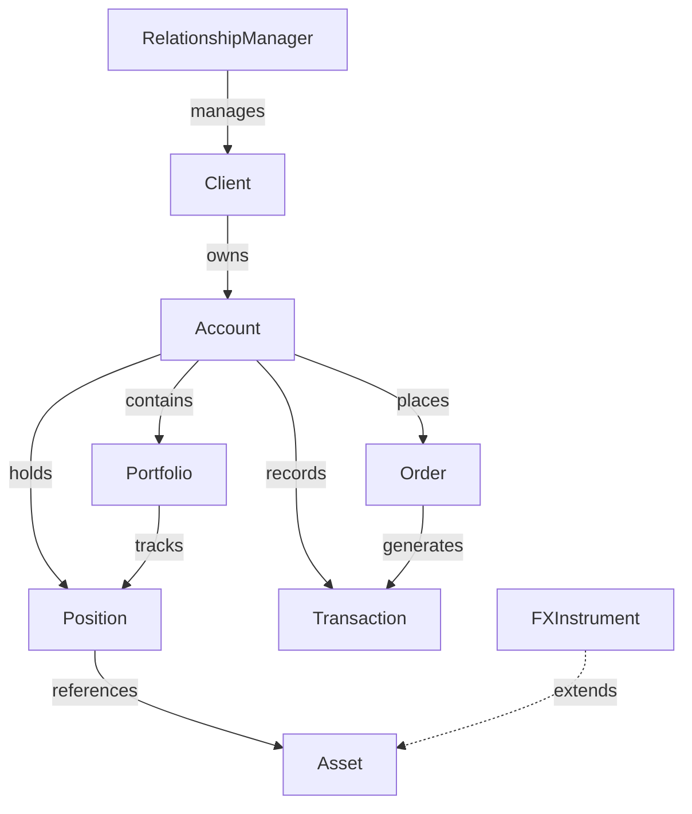
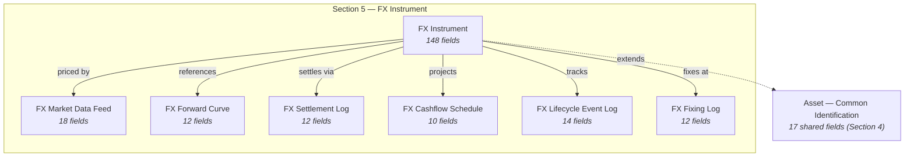

# 06 — Vahalla Wealth Data Specification — Foreign Exchange Instruments

> **Document Index:** [00-index.md](00-index.md) | **Related:** [06.1 — CSV Sample Data](06.1-sample-data-csv-foreign-exchange.md) | [01 — Wealth Management Specification](01-wealth-management-specification.md) | [02 — Equity & Bond Specification](02-bank-data-specification-equity-bond.md)

| | |
|---|---|
| **Document Title** | Investment Module - Foreign Exchange Instruments Specification |
| **System** | Vahalla Wealth Management System |
| **Document Version** | 1.5 |
| **Date** | 2026-02-12 |
| **Classification** | Confidential |
| **Status** | Draft |
| **Prepared By** | Vahalla System Team |

### Revision History

| Version | Date | Author | Description |
|---|---|---|---|
| 1.0 | 2025-07-15 | Vahalla System Team | Initial draft — FX Instruments specification with trade identification, currency pair, execution, notional & amounts, exchange rates, and settlement fields for FX Spot and Forward |
| 1.1 | 2025-09-25 | Vahalla System Team | Added NDF and FX Swap leg fields; added option and barrier option sections (vanilla, knock-in, knock-out); added counterparty and trading venue sections; added Appendix A enum reference tables |
| 1.2 | 2025-11-30 | Vahalla System Team | Added clearing, valuation, and regulatory reporting sections; added master agreement and collateral fields; added risk metrics (Greeks, VaR) and market data inline fields |
| 1.3 | 2026-01-18 | Vahalla System Team | Added FX Market Data Feed, Forward Curve, Settlement Log, Cashflow Schedule, Lifecycle Event Log, and Fixing Log supporting entities; added cross-currency swap and documentation sections |
| 1.4 | 2026-02-03 | Vahalla System Team | Added Entity Relationship diagram; added fees & credit support sections; added Entity Summary table; expanded day count and calendar conventions |
| 1.5 | 2026-02-12 | Vahalla System Team | Added sample data sections (JSON & CSV for FX Forward); added data quality requirements and delivery specifications; final field renumbering |

---

## 1. Purpose

This document specifies the data fields, formats, and standards required from banking partners to integrate **Foreign Exchange (FX) Instruments** data into our Wealth Management System. The data model is aligned with the **ISO 20022** financial messaging standard to ensure interoperability, consistency, and regulatory compliance across all partners.

**This document covers the Foreign Exchange Instruments asset class only.** FX instruments include spot transactions, forwards, FX swaps, non-deliverable forwards (NDFs), non-deliverable swaps (NDSs), FX options, currency options, FX futures, currency swaps, and cross-currency swaps.

For other asset classes, refer to:
- [02 — Equity & Bond Specification](02-bank-data-specification-equity-bond.md)
- [03 — Investment Funds Specification](03-bank-data-specification-investment-funds.md)
- [04 — Money Market Instruments Specification](04-bank-data-specification-money-market.md)
- [07 — Structured Products Specification](07-bank-data-specification-structured-products.md)

---

## 2. Entity Relationship Overview

### 2.1 Wealth Management Entities (doc 01)



### 2.2 FX Instrument Data Model (this document)



---

## 3. Data Standards & Conventions

### 3.1 Applicable ISO Standards

| Standard | Description | Usage |
|---|---|---|
| **ISO 6166** | ISIN — International Securities Identification Number | Primary security identifier (12 chars) — for listed FX instruments |
| **ISO 17442** | LEI — Legal Entity Identifier | Counterparty and issuer identification (20 chars) |
| **ISO 18774** | FISN — Financial Instrument Short Name | Standardized short name (max 35 chars) |
| **ISO 10962** | CFI — Classification of Financial Instruments | Instrument classification (6 chars) |
| **ISO 10383** | MIC — Market Identifier Code | Exchange/venue identification (4 chars) |
| **ISO 4217** | Currency Codes | All currency fields (3 chars, e.g. USD, EUR, THB) |
| **ISO 3166** | Country Codes | Country identification (2-char alpha) |
| **ISO 8601** | Date/Time Format | All date and timestamp fields |
| **ISO 20022** | Financial Messaging Standard | Overall data model alignment |
| **FpML** | Financial products Markup Language | OTC derivative trade representation |

### 3.2 Data Type Definitions

| Data Type | Format | Example |
|---|---|---|
| `String` | UTF-8 text | `"Deutsche Bank AG"` |
| `Decimal` | Numeric with decimal precision (up to 18 digits) | `1.08250000` |
| `Int` | Integer | `5` |
| `Boolean` | `true` / `false` | `true` |
| `Date` | ISO 8601 date: `YYYY-MM-DD` | `2026-01-15` |
| `DateTime` | ISO 8601 with timezone: `YYYY-MM-DDTHH:MM:SSZ` | `2026-01-15T09:30:00Z` |
| `Enum` | Predefined value from allowed list | `FX_SPOT` |

### 3.3 Field Requirement Levels

| Level | Label | Meaning |
|---|---|---|
| **Required** | Required | Must be provided. Record will be rejected without this field. |
| **Conditionally Required** | Conditional | Required when a specific condition is met (noted in Description). |
| **Optional** | Optional | Provide if available. Enhances data quality. |

### 3.4 Delivery Format

- **Preferred:** JSON or XML (ISO 20022 compliant messages)
- **Acceptable:** CSV with header row matching field names, or plain text (fixed-width/delimited)
- **Encoding:** UTF-8
- **Frequency:** Daily end-of-day batch, or real-time via API

### 3.5 Entity Summary

| Entity / Object | Section | # Fields | Description | ISO 20022 Message | Frequency |
|---|---|---|---|---|---|
| **Common Identification** | Section 4 | 17 | Shared identification, classification, and timestamps | `fxtr.014` | Static / On change |
| **FX Instrument** | Section 5.1–5.24 | 148 | FX-specific fields: instrument type, currency pair, trade details, execution, confirmation, notional, exchange rates, settlement, settlement risk, delivery, NDF, FX swap, option, barrier option, option valuation, counterparty, trading venue, clearing, valuation, regulatory, master agreement, collateral, risk metrics, market data, lifecycle, cross-currency swap, documentation, fees, credit support, day count | `fxtr.014` | Per trade / Daily |
| **FX Market Data Feed** | Section 6 | 18 | Real-time / EOD FX rate feed: bid/ask/mid, OHLC, volume, source | `fxtr.017` | Intraday / EOD |
| **FX Forward Curve** | Section 7 | 12 | Forward points and outright rates by tenor | `fxtr.017` | Daily / Intraday |
| **FX Settlement Log** | Section 8 | 12 | Settlement records: amounts, accounts, agents, status | `pacs.009` | Per settlement / Daily |
| **FX Cashflow Schedule** | Section 9 | 10 | Projected cashflows: premium, settlement, margin payments | `fxtr.014` | On trade / On change |
| **FX Lifecycle Event Log** | Section 10 | 14 | Trade lifecycle events: amendment, novation, termination, exercise, fixing | `fxtr.014` | On event / Daily |
| **FX Fixing Log** | Section 11 | 12 | NDF/NDS fixing records: fixing date, rate, source, publication | `fxtr.017` | Per fixing / Daily |

> **Note:** Field `#` restarts from 1 for each entity. When combining entities in a CSV file, use the field name (not `#`) as the unique column identifier.

---

## 4. Common Identification Fields

These fields apply to **all FX instrument records**. Every record must include these fields.

### 4.1 Primary Identification

| # | Field Name | Data Type | Required | Description | Example | ISO 20022 Reference |
|---|---|---|---|---|---|---|
| 1 | `id` | String | Required | Unique identifier assigned by the bank for this FX trade record | `"FX-001234"` | fxtr.014 — `TradId/Id` |
| 2 | `isin` | String | Optional | ISIN code per ISO 6166 (12 chars) — for listed FX instruments only | `"DE000A1EWWW0"` | fxtr.014 — `SctyId/ISIN` |
| 3 | `cusip` | String | Optional | CUSIP identifier (9 chars) | `""` | fxtr.014 — `SctyId/OthrId/Id` (CUSIP) |
| 4 | `sedol` | String | Optional | SEDOL identifier (7 chars) | `""` | fxtr.014 — `SctyId/OthrId/Id` (SEDOL) |
| 5 | `ticker` | String | Optional | Ticker symbol (if exchange-listed) | `"EURUSD"` | fxtr.014 — `SctyId/TckrSymb` |
| 6 | `name` | String | Required | Descriptive name of the FX trade | `"EUR/USD Spot 1M"` | fxtr.014 — `FinInstrmAttrbts/Nm` |
| 7 | `assetClass` | Enum | Required | Must be `FOREIGN_EXCHANGE_INSTRUMENTS` for all records in this specification | `"FOREIGN_EXCHANGE_INSTRUMENTS"` | fxtr.014 — `FinInstrmAttrbts/ClssfctnTp` |

### 4.2 Issuer & Classification

| # | Field Name | Data Type | Required | Description | Example | ISO 20022 Reference |
|---|---|---|---|---|---|---|
| 8 | `issuer` | String | Optional | Name of the issuing / booking entity | `"Deutsche Bank AG"` | fxtr.014 — `Issr/Nm` |
| 9 | `lei` | String | Optional | LEI of the booking entity per ISO 17442 (20 chars) | `"7LTWFZYICNSX8D621K86"` | fxtr.014 — `Issr/LEI` |
| 10 | `fisn` | String | Optional | Financial Instrument Short Name per ISO 18774 | `"EUR/USD/FWD/3M"` | fxtr.014 — `FinInstrmAttrbts/FISN` |
| 11 | `cfi` | String | Optional | Classification of Financial Instruments per ISO 10962 (6 chars) | `"FFXCSO"` | fxtr.014 — `FinInstrmAttrbts/CFICd` |
| 12 | `currency` | String | Required | Base currency of the instrument per ISO 4217 (3 chars) | `"EUR"` | fxtr.014 — `FinInstrmAttrbts/DnmtnCcy` |
| 13 | `country` | String | Optional | Country of booking entity per ISO 3166-1 alpha-2 | `"DE"` | fxtr.014 — `FinInstrmAttrbts/CtryOfIsse` |
| 14 | `description` | String | Optional | Free-text description of the FX trade | `"3-month EUR/USD forward, value date 2026-04-15"` | fxtr.014 — `FinInstrmAttrbts/Desc` |
| 15 | `documentUrl` | String | Optional | URL to confirmation or term sheet | `"https://bank.com/docs/FX001-confirm.pdf"` | fxtr.014 — `AddtlInf/InfURL` |

### 4.3 Timestamps

| # | Field Name | Data Type | Required | Description | Example | ISO 20022 Reference |
|---|---|---|---|---|---|---|
| 16 | `createdAt` | DateTime | Required | Record creation timestamp | `"2026-01-15T09:30:00Z"` | fxtr.014 — `CreDtTm` |
| 17 | `updatedAt` | DateTime | Required | Last update timestamp | `"2026-02-12T14:00:00Z"` | fxtr.014 — `UpdDtTm` |

---

## 5. FX Instrument Data Fields

For records where `assetClass` = `FOREIGN_EXCHANGE_INSTRUMENTS`.

### 5.1 FX Identification & Classification

| # | Field Name | Data Type | Required | Description | Allowed Values / Example | ISO 20022 Reference |
|---|---|---|---|---|---|---|
| 1 | `instrumentType` | Enum | Required | FX instrument sub-type | See [Appendix A.1](#a1-foreignexchangeinstrumenttype) | fxtr.014 — `FXTrad/TradTp` |
| 2 | `uniqueTransactionIdentifier` | String | Optional | Unique Transaction Identifier (UTI) per regulatory reporting | `"UTI-FX-2026-001234"` | fxtr.014 — `TradId/UTI` |
| 3 | `uniqueProductIdentifier` | String | Optional | Unique Product Identifier (UPI) per ISDA | `"UPI-FX-SPOT-001"` | fxtr.014 — `TradId/UPI` |
| 4 | `productTaxonomy` | String | Optional | Product taxonomy classification | `"FX:Forward:NDF"` | fxtr.014 — `TradId/PdctTxnmy` |
| 5 | `priorUniqueTransactionIdentifier` | String | Optional | Prior UTI for amendments or novations | `"UTI-FX-2026-001233"` | fxtr.014 — `TradId/PrrUTI` |
| 6 | `tradeReferenceNumber` | String | Optional | Bank internal trade reference number | `"TRD-FX-20260115-001"` | fxtr.014 — `TradId/TradRefNb` |
| 7 | `dealerReferenceNumber` | String | Optional | Dealer / sales desk reference number | `"DLR-FX-001234"` | fxtr.014 — `TradId/DlrRefNb` |

### 5.2 Currency Pair

| # | Field Name | Data Type | Required | Description | Example | ISO 20022 Reference |
|---|---|---|---|---|---|---|
| 8 | `baseCurrency` | String | Required | Base currency per ISO 4217 (3 chars) | `"EUR"` | fxtr.014 — `FXTrad/TradgSdBuyAmt/Ccy` |
| 9 | `quoteCurrency` | String | Required | Quote currency per ISO 4217 (3 chars) | `"USD"` | fxtr.014 — `FXTrad/TradgSdSellAmt/Ccy` |
| 10 | `currencyPair` | String | Optional | Currency pair notation (Base/Quote) | `"EUR/USD"` | fxtr.014 — `FXTrad/CcyPair` |
| 11 | `invertedPair` | Boolean | Optional | Whether the quote is inverted from market convention | `false` | fxtr.014 — `FXTrad/InvrtdPair` |

### 5.3 Trade Details

| # | Field Name | Data Type | Required | Description | Allowed Values / Example | ISO 20022 Reference |
|---|---|---|---|---|---|---|
| 12 | `tradeSide` | Enum | Optional | Trade direction | See [Appendix A.4](#a4-fxtradeside) | fxtr.014 — `FXTrad/TradSd` |
| 13 | `executionType` | Enum | Optional | Execution type classification | See [Appendix A.5](#a5-fxexecutiontype) | fxtr.014 — `FXTrad/ExctnTp` |
| 14 | `tradeDate` | Date | Required | Trade execution date | `"2026-01-15"` | fxtr.014 — `FXTrad/TradDt` |
| 15 | `executionTimestamp` | DateTime | Optional | Exact execution timestamp | `"2026-01-15T09:30:15.123Z"` | fxtr.014 — `FXTrad/ExctnDtTm` |
| 16 | `valueDate` | Date | Required | Settlement / value date | `"2026-01-17"` | fxtr.014 — `FXTrad/ValDt` |
| 17 | `maturityDate` | Date | Optional | Maturity date (for forwards, swaps, options) | `"2026-04-15"` | fxtr.014 — `FXTrad/MtrtyDt` |
| 18 | `tenorPeriod` | String | Optional | Tenor designation | `"ON"`, `"TN"`, `"SN"`, `"1W"`, `"1M"`, `"3M"`, `"6M"`, `"1Y"` | fxtr.014 — `FXTrad/TnrPrd` |

### 5.4 Execution Details

| # | Field Name | Data Type | Required | Description | Example | ISO 20022 Reference |
|---|---|---|---|---|---|---|
| 19 | `executionPrice` | Decimal | Optional | Execution rate / price | `1.08250000` | fxtr.014 — `FXTrad/ExctnPric` |
| 20 | `executionVenueType` | String | Optional | Venue type | `"OTC"`, `"EXCHANGE"`, `"MTF"`, `"OTF"` | fxtr.014 — `FXTrad/ExctnVnTp` |
| 21 | `executionMethod` | String | Optional | Execution method | `"ELECTRONIC"`, `"VOICE"`, `"HYBRID"` | fxtr.014 — `FXTrad/ExctnMtd` |
| 22 | `executionAlgorithm` | String | Optional | Algorithm used for execution (if applicable) | `"TWAP"`, `"VWAP"`, `"ICEBERG"` | fxtr.014 — `FXTrad/ExctnAlgo` |

### 5.5 Confirmation

| # | Field Name | Data Type | Required | Description | Allowed Values / Example | ISO 20022 Reference |
|---|---|---|---|---|---|---|
| 23 | `confirmationStatus` | Enum | Optional | Confirmation status | See [Appendix A.7](#a7-fxconfirmationstatus) | fxtr.014 — `FXTrad/CnfrmtnSts` |
| 24 | `confirmationDate` | Date | Optional | Date of trade confirmation | `"2026-01-15"` | fxtr.014 — `FXTrad/CnfrmtnDt` |
| 25 | `confirmationMethod` | String | Optional | Confirmation method | `"SWIFT"`, `"EMAIL"`, `"PLATFORM"` | fxtr.014 — `FXTrad/CnfrmtnMtd` |

### 5.6 Notional & Amounts

| # | Field Name | Data Type | Required | Description | Example | ISO 20022 Reference |
|---|---|---|---|---|---|---|
| 26 | `notionalAmount` | Decimal | Required | Notional amount of the trade | `10000000.00` | fxtr.014 — `FXTrad/NtnlAmt` |
| 27 | `notionalCurrency` | String | Required | Notional currency per ISO 4217 | `"EUR"` | fxtr.014 — `FXTrad/NtnlCcy` |
| 28 | `baseCurrencyAmount` | Decimal | Required | Amount in base currency | `10000000.00` | fxtr.014 — `FXTrad/TradgSdBuyAmt/Amt` |
| 29 | `quoteCurrencyAmount` | Decimal | Required | Amount in quote currency | `10825000.00` | fxtr.014 — `FXTrad/TradgSdSellAmt/Amt` |

### 5.7 Exchange Rates

| # | Field Name | Data Type | Required | Description | Example | ISO 20022 Reference |
|---|---|---|---|---|---|---|
| 30 | `exchangeRate` | Decimal | Required | Agreed exchange rate | `1.08250000` | fxtr.014 — `FXTrad/XchgRate` |
| 31 | `spotRate` | Decimal | Optional | Spot rate at time of trade | `1.08200000` | fxtr.014 — `FXTrad/SpotRate` |
| 32 | `forwardRate` | Decimal | Optional | Forward outright rate (for forwards) | `1.08250000` | fxtr.014 — `FXTrad/FwdRate` |
| 33 | `forwardPoints` | Decimal | Optional | Forward points (pips) | `5.00` | fxtr.014 — `FXTrad/FwdPts` |
| 34 | `allInRate` | Decimal | Optional | All-in rate (spot + forward points) | `1.08250000` | fxtr.014 — `FXTrad/AllInRate` |
| 35 | `quotationType` | Enum | Optional | Quotation type | See [Appendix A.3](#a3-fxquotationtype) | fxtr.014 — `FXTrad/QtnTp` |

### 5.8 Settlement

| # | Field Name | Data Type | Required | Description | Allowed Values / Example | ISO 20022 Reference |
|---|---|---|---|---|---|---|
| 36 | `settlementType` | Enum | Required | Settlement type | See [Appendix A.2](#a2-fxsettlementtype) | fxtr.014 — `FXTrad/SttlmTp` |
| 37 | `settlementDate` | Date | Required | Settlement date | `"2026-01-17"` | fxtr.014 — `FXTrad/SttlmDt` |
| 38 | `settlementCurrency` | String | Optional | Settlement currency per ISO 4217 | `"USD"` | fxtr.014 — `FXTrad/SttlmCcy` |
| 39 | `settlementAmount` | Decimal | Optional | Settlement amount | `10825000.00` | fxtr.014 — `FXTrad/SttlmAmt` |
| 40 | `settlementMethod` | Enum | Optional | Settlement method | See [Appendix A.14](#a14-settlementmethod) | fxtr.014 — `FXTrad/SttlmMtd` |
| 41 | `settlementCycle` | Enum | Optional | Settlement cycle | See [Appendix A.15](#a15-settlementcycle) | fxtr.014 — `FXTrad/SttlmCycl` |
| 42 | `settlementInstructions` | String | Optional | Free-text settlement instructions | `"Pay to Nostro account at Citibank NY"` | fxtr.014 — `FXTrad/SttlmInstrs` |

### 5.9 Settlement Risk

| # | Field Name | Data Type | Required | Description | Example | ISO 20022 Reference |
|---|---|---|---|---|---|---|
| 43 | `settlementRisk` | Boolean | Optional | Whether settlement risk exists | `false` | fxtr.014 — `FXTrad/SttlmRsk` |
| 44 | `continuousLinkedSettlement` | Boolean | Optional | Whether CLS eligible | `true` | fxtr.014 — `FXTrad/CLS` |
| 45 | `paymentVersusPayment` | Boolean | Optional | Whether PVP settlement | `true` | fxtr.014 — `FXTrad/PVP` |
| 46 | `settlementNetting` | Boolean | Optional | Whether netting applies | `false` | fxtr.014 — `FXTrad/SttlmNttg` |
| 47 | `nettingType` | Enum | Optional | Netting type | See [Appendix A.9](#a9-fxnettingtype) | fxtr.014 — `FXTrad/NttgTp` |

### 5.10 Delivery Instructions

| # | Field Name | Data Type | Required | Description | Example | ISO 20022 Reference |
|---|---|---|---|---|---|---|
| 48 | `baseCurrencyDeliveryAccount` | String | Optional | Delivery account for base currency | `"DE89370400440532013000"` | fxtr.014 — `FXTrad/DlvryInstrs/BseCcyAcct` |
| 49 | `quoteCurrencyDeliveryAccount` | String | Optional | Delivery account for quote currency | `"US33100060001234567890"` | fxtr.014 — `FXTrad/DlvryInstrs/QtCcyAcct` |
| 50 | `baseCurrencyDeliveryAgent` | String | Optional | Delivery agent for base currency | `"Deutsche Bundesbank"` | fxtr.014 — `FXTrad/DlvryInstrs/BseCcyAgt` |
| 51 | `quoteCurrencyDeliveryAgent` | String | Optional | Delivery agent for quote currency | `"Federal Reserve Bank of New York"` | fxtr.014 — `FXTrad/DlvryInstrs/QtCcyAgt` |
| 52 | `baseCurrencyDeliveryAgentLei` | String | Optional | LEI of base currency delivery agent | `"529900HNOAA1KXQJUQ27"` | fxtr.014 — `FXTrad/DlvryInstrs/BseCcyAgtLEI` |
| 53 | `quoteCurrencyDeliveryAgentLei` | String | Optional | LEI of quote currency delivery agent | `"254900HROIFWPRGM1V77"` | fxtr.014 — `FXTrad/DlvryInstrs/QtCcyAgtLEI` |

### 5.11 NDF-Specific Fields

| # | Field Name | Data Type | Required | Description | Allowed Values / Example | ISO 20022 Reference |
|---|---|---|---|---|---|---|
| 54 | `fixingDate` | Date | Conditional | NDF fixing date. Required if `instrumentType` = `NDF` or `NDS` | `"2026-04-13"` | fxtr.014 — `FXTrad/NDF/FxgDt` |
| 55 | `fixingSource` | Enum | Conditional | Fixing rate source. Required if `instrumentType` = `NDF` or `NDS` | See [Appendix A.10](#a10-fxfixingsource) | fxtr.014 — `FXTrad/NDF/FxgSrc` |
| 56 | `fixingRate` | Decimal | Optional | Fixing rate (populated after fixing) | `1.08300000` | fxtr.014 — `FXTrad/NDF/FxgRate` |
| 57 | `settlementRateSource` | String | Optional | Settlement rate source description | `"WM/Reuters London 4pm"` | fxtr.014 — `FXTrad/NDF/SttlmRateSrc` |
| 58 | `cutType` | Enum | Optional | Cut time for fixing | See [Appendix A.6](#a6-fxcuttype) | fxtr.014 — `FXTrad/NDF/CutTp` |

### 5.12 FX Swap-Specific Fields

| # | Field Name | Data Type | Required | Description | Example | ISO 20022 Reference |
|---|---|---|---|---|---|---|
| 59 | `nearLegValueDate` | Date | Conditional | Near leg value date. Required if `instrumentType` = `FX_SWAP` | `"2026-01-17"` | fxtr.014 — `FXTrad/FXSwp/NrLgValDt` |
| 60 | `nearLegRate` | Decimal | Conditional | Near leg exchange rate | `1.08200000` | fxtr.014 — `FXTrad/FXSwp/NrLgRate` |
| 61 | `nearLegAmount` | Decimal | Optional | Near leg notional amount | `10000000.00` | fxtr.014 — `FXTrad/FXSwp/NrLgAmt` |
| 62 | `nearLegBaseCurrencyAmount` | Decimal | Optional | Near leg base currency amount | `10000000.00` | fxtr.014 — `FXTrad/FXSwp/NrLgBseCcyAmt` |
| 63 | `nearLegQuoteCurrencyAmount` | Decimal | Optional | Near leg quote currency amount | `10820000.00` | fxtr.014 — `FXTrad/FXSwp/NrLgQtCcyAmt` |
| 64 | `farLegValueDate` | Date | Conditional | Far leg value date. Required if `instrumentType` = `FX_SWAP` | `"2026-04-17"` | fxtr.014 — `FXTrad/FXSwp/FrLgValDt` |
| 65 | `farLegRate` | Decimal | Conditional | Far leg exchange rate | `1.08250000` | fxtr.014 — `FXTrad/FXSwp/FrLgRate` |
| 66 | `farLegAmount` | Decimal | Optional | Far leg notional amount | `10000000.00` | fxtr.014 — `FXTrad/FXSwp/FrLgAmt` |
| 67 | `farLegBaseCurrencyAmount` | Decimal | Optional | Far leg base currency amount | `10000000.00` | fxtr.014 — `FXTrad/FXSwp/FrLgBseCcyAmt` |
| 68 | `farLegQuoteCurrencyAmount` | Decimal | Optional | Far leg quote currency amount | `10825000.00` | fxtr.014 — `FXTrad/FXSwp/FrLgQtCcyAmt` |
| 69 | `swapPoints` | Decimal | Optional | Swap points (far leg - near leg) | `5.00` | fxtr.014 — `FXTrad/FXSwp/SwpPts` |
| 70 | `impliedYield` | Decimal | Optional | Implied yield from swap points (%) | `0.18` | fxtr.014 — `FXTrad/FXSwp/ImpldYld` |

### 5.13 FX Option-Specific Fields

| # | Field Name | Data Type | Required | Description | Allowed Values / Example | ISO 20022 Reference |
|---|---|---|---|---|---|---|
| 71 | `optionType` | Enum | Conditional | Option type. Required if `instrumentType` = `FX_OPTION` or `CURRENCY_OPTION` | See [Appendix A.16](#a16-optiontype) | fxtr.014 — `FXTrad/Optn/OptnTp` |
| 72 | `optionStyle` | Enum | Conditional | Option exercise style | See [Appendix A.17](#a17-optionstyle) | fxtr.014 — `FXTrad/Optn/OptnStyl` |
| 73 | `strikeRate` | Decimal | Conditional | Strike exchange rate. Required for options | `1.10000000` | fxtr.014 — `FXTrad/Optn/StrkRate` |
| 74 | `premium` | Decimal | Optional | Option premium amount | `150000.00` | fxtr.014 — `FXTrad/Optn/Prmm` |
| 75 | `premiumCurrency` | String | Optional | Premium currency per ISO 4217 | `"USD"` | fxtr.014 — `FXTrad/Optn/PrmmCcy` |
| 76 | `premiumPaymentDate` | Date | Optional | Premium payment date | `"2026-01-17"` | fxtr.014 — `FXTrad/Optn/PrmmPmtDt` |
| 77 | `premiumType` | String | Optional | Premium quotation type | `"PERCENTAGE"`, `"POINTS"`, `"AMOUNT"` | fxtr.014 — `FXTrad/Optn/PrmmTp` |
| 78 | `expirationDate` | Date | Conditional | Option expiration date. Required for options | `"2026-04-15"` | fxtr.014 — `FXTrad/Optn/XprtnDt` |
| 79 | `expirationTime` | DateTime | Optional | Option expiration time | `"2026-04-15T14:00:00Z"` | fxtr.014 — `FXTrad/Optn/XprtnTm` |
| 80 | `deliveryDate` | Date | Optional | Option delivery date (if exercised) | `"2026-04-17"` | fxtr.014 — `FXTrad/Optn/DlvryDt` |
| 81 | `exerciseDate` | Date | Optional | Date the option was exercised (if applicable) | `"2026-04-15"` | fxtr.014 — `FXTrad/Optn/ExrcDt` |
| 82 | `automaticExercise` | Boolean | Optional | Whether automatic exercise applies | `true` | fxtr.014 — `FXTrad/Optn/AutoExrc` |

### 5.14 Barrier Option Features

| # | Field Name | Data Type | Required | Description | Example | ISO 20022 Reference |
|---|---|---|---|---|---|---|
| 83 | `barrierType` | String | Optional | Barrier type | `"KNOCK_IN"`, `"KNOCK_OUT"`, `"DOUBLE_BARRIER"` | fxtr.014 — `FXTrad/Optn/Brr/BrrTp` |
| 84 | `barrierLevel` | Decimal | Optional | Primary barrier level | `1.15000000` | fxtr.014 — `FXTrad/Optn/Brr/BrrLvl` |
| 85 | `upperBarrier` | Decimal | Optional | Upper barrier level (for double barriers) | `1.15000000` | fxtr.014 — `FXTrad/Optn/Brr/UpprBrr` |
| 86 | `lowerBarrier` | Decimal | Optional | Lower barrier level (for double barriers) | `1.02000000` | fxtr.014 — `FXTrad/Optn/Brr/LwrBrr` |
| 87 | `barrierMonitoring` | String | Optional | Barrier monitoring type | `"CONTINUOUS"`, `"DISCRETE"` | fxtr.014 — `FXTrad/Optn/Brr/BrrMntrg` |

### 5.15 Option Valuation

| # | Field Name | Data Type | Required | Description | Example | ISO 20022 Reference |
|---|---|---|---|---|---|---|
| 88 | `impliedVolatility` | Decimal | Optional | Implied volatility (%) | `8.50` | fxtr.014 — `FXTrad/Optn/ImpldVltlty` |
| 89 | `historicalVolatility` | Decimal | Optional | Historical volatility (%) | `7.80` | fxtr.014 — `FXTrad/Optn/HstclVltlty` |
| 90 | `volatilitySurface` | String | Optional | Volatility surface reference | `"EUR/USD 3M ATM"` | fxtr.014 — `FXTrad/Optn/VltltySrfc` |

### 5.16 Counterparty Information

| # | Field Name | Data Type | Required | Description | Example | ISO 20022 Reference |
|---|---|---|---|---|---|---|
| 91 | `counterparty` | String | Required | Counterparty name | `"JPMorgan Chase & Co."` | fxtr.014 — `FXTrad/CtrPty/Nm` |
| 92 | `counterpartyLei` | String | Optional | Counterparty LEI (20 chars) | `"8I5DZWZKVSZI1NUHU748"` | fxtr.014 — `FXTrad/CtrPty/LEI` |
| 93 | `counterpartyRole` | String | Optional | Counterparty role | `"BUYER"`, `"SELLER"` | fxtr.014 — `FXTrad/CtrPty/Role` |
| 94 | `counterpartyCountry` | String | Optional | Counterparty country per ISO 3166 | `"US"` | fxtr.014 — `FXTrad/CtrPty/Ctry` |
| 95 | `counterpartySector` | String | Optional | Counterparty sector classification | `"FINANCIAL"`, `"NON_FINANCIAL"`, `"CENTRAL_BANK"` | fxtr.014 — `FXTrad/CtrPty/Sctr` |
| 96 | `broker` | String | Optional | Broker name | `"ICAP"` | fxtr.014 — `FXTrad/Brkr/Nm` |
| 97 | `brokerLei` | String | Optional | Broker LEI | `"213800UFHRI2JICLBR17"` | fxtr.014 — `FXTrad/Brkr/LEI` |
| 98 | `primeBroker` | String | Optional | Prime broker name | `"Goldman Sachs"` | fxtr.014 — `FXTrad/PrmBrkr/Nm` |
| 99 | `primeBrokerLei` | String | Optional | Prime broker LEI | `"784F5XWPLTWKTBV3E584"` | fxtr.014 — `FXTrad/PrmBrkr/LEI` |
| 100 | `executingBroker` | String | Optional | Executing broker name | `"Barclays"` | fxtr.014 — `FXTrad/ExcBrkr/Nm` |
| 101 | `executingBrokerLei` | String | Optional | Executing broker LEI | `"213800LBQA1Y9L22JB70"` | fxtr.014 — `FXTrad/ExcBrkr/LEI` |

### 5.17 Trading Venue

| # | Field Name | Data Type | Required | Description | Example | ISO 20022 Reference |
|---|---|---|---|---|---|---|
| 102 | `tradingVenue` | String | Optional | Trading venue name | `"EBS"`, `"Reuters Matching"`, `"360T"`, `"FXall"` | fxtr.014 — `FXTrad/TradgVn/Nm` |
| 103 | `tradingVenueLei` | String | Optional | Trading venue LEI | `"549300UF4R84F48NCH34"` | fxtr.014 — `FXTrad/TradgVn/LEI` |
| 104 | `executionVenue` | String | Optional | Execution venue identifier | `"EBS"` | fxtr.014 — `FXTrad/ExctnVn` |
| 105 | `mic` | String | Optional | Market Identifier Code per ISO 10383 (4 chars) | `"XOFF"` | fxtr.014 — `FXTrad/TradgVn/MktIdCd` |

### 5.18 Clearing & Settlement

| # | Field Name | Data Type | Required | Description | Allowed Values / Example | ISO 20022 Reference |
|---|---|---|---|---|---|---|
| 106 | `clearingType` | Enum | Optional | Clearing type | See [Appendix A.18](#a18-clearingtype) | fxtr.014 — `FXTrad/Clrg/ClrgTp` |
| 107 | `clearingHouse` | String | Optional | Clearing house name | `"LCH"`, `"CME Clearing"` | fxtr.014 — `FXTrad/Clrg/ClrgHs` |
| 108 | `clearingHouseLei` | String | Optional | Clearing house LEI | `"F226TOH6YD6XJB17KS62"` | fxtr.014 — `FXTrad/Clrg/ClrgHsLEI` |
| 109 | `clearingMember` | String | Optional | Clearing member name | `"Deutsche Bank AG"` | fxtr.014 — `FXTrad/Clrg/ClrgMmbr` |
| 110 | `clearingMemberLei` | String | Optional | Clearing member LEI | `"7LTWFZYICNSX8D621K86"` | fxtr.014 — `FXTrad/Clrg/ClrgMmbrLEI` |
| 111 | `centralCounterparty` | String | Optional | Central counterparty name | `"LCH Ltd"` | fxtr.014 — `FXTrad/Clrg/CCP` |
| 112 | `centralCounterpartyLei` | String | Optional | Central counterparty LEI | `"F226TOH6YD6XJB17KS62"` | fxtr.014 — `FXTrad/Clrg/CCPLEI` |

### 5.19 Valuation

| # | Field Name | Data Type | Required | Description | Allowed Values / Example | ISO 20022 Reference |
|---|---|---|---|---|---|---|
| 113 | `marketValue` | Decimal | Optional | Current market value | `25000.00` | fxtr.014 — `FXTrad/Valtn/MktVal` |
| 114 | `markToMarket` | Decimal | Optional | Mark-to-market value | `25000.00` | fxtr.014 — `FXTrad/Valtn/MkToMkt` |
| 115 | `unrealizedPnL` | Decimal | Optional | Unrealized profit/loss | `25000.00` | fxtr.014 — `FXTrad/Valtn/UnrlzdPnL` |
| 116 | `valuationDate` | Date | Optional | Valuation date | `"2026-02-12"` | fxtr.014 — `FXTrad/Valtn/ValtnDt` |
| 117 | `valuationCurrency` | String | Optional | Valuation currency per ISO 4217 | `"USD"` | fxtr.014 — `FXTrad/Valtn/ValtnCcy` |
| 118 | `valuationMethod` | Enum | Optional | Valuation method | See [Appendix A.19](#a19-valuationmethod) | fxtr.014 — `FXTrad/Valtn/ValtnMtd` |

### 5.20 Regulatory Reporting

| # | Field Name | Data Type | Required | Description | Example | ISO 20022 Reference |
|---|---|---|---|---|---|---|
| 119 | `reportingJurisdiction` | String | Optional | Reporting jurisdiction | `"EU"`, `"US"`, `"UK"`, `"SG"`, `"HK"` | fxtr.014 — `FXTrad/Rgltry/RptgJrsdctn` |
| 120 | `reportingTimestamp` | DateTime | Optional | Regulatory reporting timestamp | `"2026-01-15T10:00:00Z"` | fxtr.014 — `FXTrad/Rgltry/RptgTmStmp` |
| 121 | `actionType` | Enum | Optional | Regulatory action type | See [Appendix A.20](#a20-actiontype) | fxtr.014 — `FXTrad/Rgltry/ActnTp` |
| 122 | `regulatoryReportingRequired` | Boolean | Optional | Whether regulatory reporting is required | `true` | fxtr.014 — `FXTrad/Rgltry/RgltryRptgReqrd` |
| 123 | `tradeRepository` | String | Optional | Trade repository name | `"DTCC GTR"`, `"Regis-TR"`, `"UnaVista"` | fxtr.014 — `FXTrad/Rgltry/TradRpstry` |
| 124 | `tradeRepositoryLei` | String | Optional | Trade repository LEI | `"549300JJHZ1QQKBQ5S07"` | fxtr.014 — `FXTrad/Rgltry/TradRpstryLEI` |

### 5.21 Master Agreement

| # | Field Name | Data Type | Required | Description | Allowed Values / Example | ISO 20022 Reference |
|---|---|---|---|---|---|---|
| 125 | `masterAgreementType` | Enum | Optional | Master agreement type | See [Appendix A.21](#a21-masteragreementtype) | fxtr.014 — `FXTrad/MstrAgrmnt/MstrAgrmntTp` |
| 126 | `masterAgreementVersion` | String | Optional | Master agreement version | `"2002"` | fxtr.014 — `FXTrad/MstrAgrmnt/MstrAgrmntVrsn` |
| 127 | `masterAgreementDate` | Date | Optional | Master agreement date | `"2020-06-15"` | fxtr.014 — `FXTrad/MstrAgrmnt/MstrAgrmntDt` |

### 5.22 Collateral

| # | Field Name | Data Type | Required | Description | Example | ISO 20022 Reference |
|---|---|---|---|---|---|---|
| 128 | `collateralRequired` | Boolean | Optional | Whether collateral is required | `true` | fxtr.014 — `FXTrad/Coll/CollReqrd` |
| 129 | `collateralType` | String | Optional | Collateral type | `"CASH"`, `"SECURITIES"`, `"LETTER_OF_CREDIT"` | fxtr.014 — `FXTrad/Coll/CollTp` |
| 130 | `collateralAmount` | Decimal | Optional | Collateral amount | `500000.00` | fxtr.014 — `FXTrad/Coll/CollAmt` |
| 131 | `collateralCurrency` | String | Optional | Collateral currency per ISO 4217 | `"USD"` | fxtr.014 — `FXTrad/Coll/CollCcy` |
| 132 | `initialMargin` | Decimal | Optional | Initial margin amount | `500000.00` | fxtr.014 — `FXTrad/Coll/InitlMrgn` |
| 133 | `variationMargin` | Decimal | Optional | Variation margin amount | `25000.00` | fxtr.014 — `FXTrad/Coll/VartnMrgn` |
| 134 | `independentAmount` | Decimal | Optional | Independent amount | `0.00` | fxtr.014 — `FXTrad/Coll/IndpdntAmt` |
| 135 | `thresholdAmount` | Decimal | Optional | Threshold amount | `250000.00` | fxtr.014 — `FXTrad/Coll/ThrshldAmt` |
| 136 | `minimumTransferAmount` | Decimal | Optional | Minimum transfer amount | `50000.00` | fxtr.014 — `FXTrad/Coll/MinTrfAmt` |
| 137 | `marginCallFrequency` | String | Optional | Margin call frequency | `"DAILY"`, `"WEEKLY"` | fxtr.014 — `FXTrad/Coll/MrgnCallFrqcy` |

### 5.23 Risk Metrics (Options)

| # | Field Name | Data Type | Required | Description | Example | ISO 20022 Reference |
|---|---|---|---|---|---|---|
| 138 | `delta` | Decimal | Optional | Delta — sensitivity to underlying rate change | `0.55` | fxtr.014 — `FXTrad/RskMtrcs/Dlt` |
| 139 | `gamma` | Decimal | Optional | Gamma — rate of change of delta | `0.03` | fxtr.014 — `FXTrad/RskMtrcs/Gmm` |
| 140 | `vega` | Decimal | Optional | Vega — sensitivity to volatility change | `12000.00` | fxtr.014 — `FXTrad/RskMtrcs/Vg` |
| 141 | `theta` | Decimal | Optional | Theta — time decay per day | `-500.00` | fxtr.014 — `FXTrad/RskMtrcs/Tht` |
| 142 | `rho` | Decimal | Optional | Rho — sensitivity to interest rate change | `3000.00` | fxtr.014 — `FXTrad/RskMtrcs/Rh` |

### 5.24 Inline Market Data

| # | Field Name | Data Type | Required | Description | Example | ISO 20022 Reference |
|---|---|---|---|---|---|---|
| 143 | `bidRate` | Decimal | Optional | Bid rate | `1.08230000` | fxtr.017 — `FXRate/BdRate` |
| 144 | `askRate` | Decimal | Optional | Ask rate | `1.08270000` | fxtr.017 — `FXRate/AskRate` |
| 145 | `midRate` | Decimal | Optional | Mid rate | `1.08250000` | fxtr.017 — `FXRate/MdRate` |
| 146 | `lastTradeRate` | Decimal | Optional | Last traded rate | `1.08250000` | fxtr.017 — `FXRate/LastTradRate` |
| 147 | `volume` | Decimal | Optional | Trading volume | `500000000.00` | fxtr.017 — `FXRate/Vol` |

### 5.25 Lifecycle

| # | Field Name | Data Type | Required | Description | Allowed Values / Example | ISO 20022 Reference |
|---|---|---|---|---|---|---|
| 148 | `tradeStatus` | Enum | Required | Current trade status | See [Appendix A.8](#a8-fxtradestatus) | fxtr.014 — `FXTrad/TradSts` |
| 149 | `amendmentDate` | Date | Optional | Date of last amendment | `"2026-02-01"` | fxtr.014 — `FXTrad/Lfcycl/AmdmntDt` |
| 150 | `terminationDate` | Date | Optional | Early termination date | `"2026-03-15"` | fxtr.014 — `FXTrad/Lfcycl/TrmtnDt` |
| 151 | `earlyTermination` | Boolean | Optional | Whether early termination occurred | `false` | fxtr.014 — `FXTrad/Lfcycl/ErlyTrmtn` |
| 152 | `novationDate` | Date | Optional | Novation date (if novated) | `"2026-02-15"` | fxtr.014 — `FXTrad/Lfcycl/NvtnDt` |
| 153 | `novatedTo` | String | Optional | LEI of the entity novated to | `"549300EXAMPLE000001"` | fxtr.014 — `FXTrad/Lfcycl/NvtdTo` |

### 5.26 Cross-Currency Swap-Specific Fields

| # | Field Name | Data Type | Required | Description | Example | ISO 20022 Reference |
|---|---|---|---|---|---|---|
| 154 | `payLegCurrency` | String | Conditional | Pay leg currency. Required if `instrumentType` = `CROSS_CURRENCY_SWAP` | `"EUR"` | fxtr.014 — `FXTrad/XCcySwp/PayLgCcy` |
| 155 | `payLegNotional` | Decimal | Conditional | Pay leg notional amount | `10000000.00` | fxtr.014 — `FXTrad/XCcySwp/PayLgNtnl` |
| 156 | `payLegRate` | Decimal | Optional | Pay leg interest rate (%) | `3.50` | fxtr.014 — `FXTrad/XCcySwp/PayLgRate` |
| 157 | `payLegPaymentFrequency` | Enum | Optional | Pay leg payment frequency | See [Appendix A.22](#a22-paymentfrequency) | fxtr.014 — `FXTrad/XCcySwp/PayLgPmtFrqcy` |
| 158 | `payLegDayCountBasis` | Enum | Optional | Pay leg day count basis | See [Appendix A.23](#a23-daycountbasis) | fxtr.014 — `FXTrad/XCcySwp/PayLgDayCntBsis` |
| 159 | `receiveLegCurrency` | String | Conditional | Receive leg currency. Required if `instrumentType` = `CROSS_CURRENCY_SWAP` | `"USD"` | fxtr.014 — `FXTrad/XCcySwp/RcvLgCcy` |
| 160 | `receiveLegNotional` | Decimal | Conditional | Receive leg notional amount | `10825000.00` | fxtr.014 — `FXTrad/XCcySwp/RcvLgNtnl` |
| 161 | `receiveLegRate` | Decimal | Optional | Receive leg interest rate (%) | `4.25` | fxtr.014 — `FXTrad/XCcySwp/RcvLgRate` |
| 162 | `receiveLegPaymentFrequency` | Enum | Optional | Receive leg payment frequency | See [Appendix A.22](#a22-paymentfrequency) | fxtr.014 — `FXTrad/XCcySwp/RcvLgPmtFrqcy` |
| 163 | `receiveLegDayCountBasis` | Enum | Optional | Receive leg day count basis | See [Appendix A.23](#a23-daycountbasis) | fxtr.014 — `FXTrad/XCcySwp/RcvLgDayCntBsis` |
| 164 | `principalExchange` | Boolean | Optional | Whether principal is exchanged at inception and maturity | `true` | fxtr.014 — `FXTrad/XCcySwp/PrncplXchg` |
| 165 | `initialExchangeRate` | Decimal | Optional | Exchange rate at inception | `1.08250000` | fxtr.014 — `FXTrad/XCcySwp/InitlXchgRate` |
| 166 | `finalExchangeRate` | Decimal | Optional | Exchange rate at maturity (if different) | `1.08250000` | fxtr.014 — `FXTrad/XCcySwp/FnlXchgRate` |

### 5.27 Documentation

| # | Field Name | Data Type | Required | Description | Example | ISO 20022 Reference |
|---|---|---|---|---|---|---|
| 167 | `confirmationUrl` | String | Optional | URL to trade confirmation | `"https://bank.com/docs/FX001-confirm.pdf"` | fxtr.014 — `FXTrad/Doc/CnfrmtnURL` |
| 168 | `termSheetUrl` | String | Optional | URL to term sheet | `"https://bank.com/docs/FX001-terms.pdf"` | fxtr.014 — `FXTrad/Doc/TrmShtURL` |

### 5.28 Fees & Costs

| # | Field Name | Data Type | Required | Description | Example | ISO 20022 Reference |
|---|---|---|---|---|---|---|
| 169 | `commission` | Decimal | Optional | Commission amount | `5000.00` | fxtr.014 — `FXTrad/Fees/Cmmssn` |
| 170 | `commissionCurrency` | String | Optional | Commission currency per ISO 4217 | `"USD"` | fxtr.014 — `FXTrad/Fees/CmmssnCcy` |
| 171 | `brokerageFee` | Decimal | Optional | Brokerage fee | `2500.00` | fxtr.014 — `FXTrad/Fees/BrkrgFee` |
| 172 | `transactionCost` | Decimal | Optional | Total transaction cost | `7500.00` | fxtr.014 — `FXTrad/Fees/TxnCost` |
| 173 | `spread` | Decimal | Optional | Bid-ask spread (pips) | `4.00` | fxtr.014 — `FXTrad/Fees/Sprd` |

### 5.29 Credit Support & Day Count

| # | Field Name | Data Type | Required | Description | Allowed Values / Example | ISO 20022 Reference |
|---|---|---|---|---|---|---|
| 174 | `creditSupportAnnex` | Boolean | Optional | Whether a Credit Support Annex (CSA) is in place | `true` | fxtr.014 — `FXTrad/CdtSprt/CSA` |
| 175 | `csaType` | String | Optional | CSA type | `"BILATERAL"`, `"ONE_WAY"` | fxtr.014 — `FXTrad/CdtSprt/CSATp` |
| 176 | `creditRating` | String | Optional | Counterparty credit rating | `"A+"` | fxtr.014 — `FXTrad/CdtSprt/CdtRtg` |
| 177 | `creditLimit` | Decimal | Optional | Credit limit for counterparty | `50000000.00` | fxtr.014 — `FXTrad/CdtSprt/CdtLmt` |
| 178 | `creditLimitCurrency` | String | Optional | Credit limit currency per ISO 4217 | `"USD"` | fxtr.014 — `FXTrad/CdtSprt/CdtLmtCcy` |
| 179 | `dayCountBasis` | Enum | Optional | Day count convention | See [Appendix A.23](#a23-daycountbasis) | fxtr.014 — `FXTrad/DayCnt/DayCntBsis` |
| 180 | `businessDayConvention` | Enum | Optional | Business day adjustment convention | See [Appendix A.24](#a24-businessdayconvention) | fxtr.014 — `FXTrad/DayCnt/BizDayCnvtn` |
| 181 | `paymentCalendar` | String | Optional | Payment calendar reference | `"TARGET"`, `"NEW_YORK"`, `"LONDON"` | fxtr.014 — `FXTrad/DayCnt/PmtClndr` |
| 182 | `fixingCalendar` | String | Optional | Fixing calendar reference | `"LONDON"`, `"NEW_YORK"` | fxtr.014 — `FXTrad/DayCnt/FxgClndr` |

---

## 6. FX Market Data Feed

> **Source:** Real-time or end-of-day FX rate feed. These fields are updated intraday or at market close. Portfolio-level valuation is handled by the Position entity ([01 — Wealth Management Specification](01-wealth-management-specification.md)).

| # | Field Name | Data Type | Required | Description | Example | ISO 20022 Reference |
|---|---|---|---|---|---|---|
| 1 | `currencyPair` | String | Required | Currency pair (Base/Quote) | `"EUR/USD"` | fxtr.017 — `FXRate/CcyPair` |
| 2 | `baseCurrency` | String | Required | Base currency per ISO 4217 | `"EUR"` | fxtr.017 — `FXRate/BseCcy` |
| 3 | `quoteCurrency` | String | Required | Quote currency per ISO 4217 | `"USD"` | fxtr.017 — `FXRate/QtCcy` |
| 4 | `timestamp` | DateTime | Required | Rate snapshot timestamp | `"2026-02-12T16:00:00Z"` | fxtr.017 — `FXRate/AsOfDtTm` |
| 5 | `source` | String | Optional | Rate source | `"Bloomberg"`, `"Reuters"`, `"ECB"` | fxtr.017 — `FXRate/Src` |
| 6 | `quotationType` | Enum | Optional | Quotation type | See [Appendix A.3](#a3-fxquotationtype) | fxtr.017 — `FXRate/QtnTp` |
| 7 | `bidRate` | Decimal | Optional | Bid rate | `1.08230000` | fxtr.017 — `FXRate/BdRate` |
| 8 | `askRate` | Decimal | Optional | Ask rate | `1.08270000` | fxtr.017 — `FXRate/AskRate` |
| 9 | `midRate` | Decimal | Required | Mid rate | `1.08250000` | fxtr.017 — `FXRate/MdRate` |
| 10 | `lastTradeRate` | Decimal | Optional | Last traded rate | `1.08250000` | fxtr.017 — `FXRate/LastTradRate` |
| 11 | `highRate` | Decimal | Optional | Intraday high rate | `1.08500000` | fxtr.017 — `FXRate/HghRate` |
| 12 | `lowRate` | Decimal | Optional | Intraday low rate | `1.07900000` | fxtr.017 — `FXRate/LwRate` |
| 13 | `openRate` | Decimal | Optional | Opening rate | `1.08100000` | fxtr.017 — `FXRate/OpnRate` |
| 14 | `closeRate` | Decimal | Optional | Closing rate | `1.08250000` | fxtr.017 — `FXRate/ClsRate` |
| 15 | `volume` | Decimal | Optional | Trading volume | `500000000.00` | fxtr.017 — `FXRate/Vol` |
| 16 | `spread` | Decimal | Optional | Bid-ask spread (pips) | `4.00` | fxtr.017 — `FXRate/Sprd` |
| 17 | `changePercent` | Decimal | Optional | Daily change (%) | `0.14` | fxtr.017 — `FXRate/ChngPct` |
| 18 | `lastUpdateTime` | DateTime | Optional | Last rate update time | `"2026-02-12T16:00:00Z"` | fxtr.017 — `FXRate/LastUpdtTm` |

---

## 7. FX Forward Curve

> **Source:** Forward points and outright rates by tenor. Linked to a currency pair. One row per tenor point.

| # | Field Name | Data Type | Required | Description | Example | ISO 20022 Reference |
|---|---|---|---|---|---|---|
| 1 | `currencyPair` | String | Required | Currency pair (Base/Quote) | `"EUR/USD"` | fxtr.017 — `FwdCrv/CcyPair` |
| 2 | `baseCurrency` | String | Required | Base currency per ISO 4217 | `"EUR"` | fxtr.017 — `FwdCrv/BseCcy` |
| 3 | `quoteCurrency` | String | Required | Quote currency per ISO 4217 | `"USD"` | fxtr.017 — `FwdCrv/QtCcy` |
| 4 | `spotRate` | Decimal | Required | Current spot rate | `1.08200000` | fxtr.017 — `FwdCrv/SpotRate` |
| 5 | `asOfDate` | Date | Required | Curve date | `"2026-02-12"` | fxtr.017 — `FwdCrv/AsOfDt` |
| 6 | `tenor` | String | Required | Tenor designation | `"ON"`, `"TN"`, `"1W"`, `"1M"`, `"3M"`, `"6M"`, `"1Y"` | fxtr.017 — `FwdCrv/Tnr` |
| 7 | `valueDate` | Date | Required | Value date for this tenor | `"2026-05-12"` | fxtr.017 — `FwdCrv/ValDt` |
| 8 | `forwardPoints` | Decimal | Required | Forward points (pips) | `5.00` | fxtr.017 — `FwdCrv/FwdPts` |
| 9 | `forwardRate` | Decimal | Required | Outright forward rate | `1.08250000` | fxtr.017 — `FwdCrv/FwdRate` |
| 10 | `bid` | Decimal | Optional | Forward bid rate | `1.08230000` | fxtr.017 — `FwdCrv/Bd` |
| 11 | `ask` | Decimal | Optional | Forward ask rate | `1.08270000` | fxtr.017 — `FwdCrv/Ask` |
| 12 | `mid` | Decimal | Optional | Forward mid rate | `1.08250000` | fxtr.017 — `FwdCrv/Md` |

---

## 8. FX Settlement Log

> **Source:** Settlement records for FX trades. Linked to the trade via `instrumentId`. One row per settlement event.

| # | Field Name | Data Type | Required | Description | Example | ISO 20022 Reference |
|---|---|---|---|---|---|---|
| 1 | `settlementId` | String | Required | Unique settlement identifier | `"STL-FX-20260117-001"` | pacs.009 — `SttlmId` |
| 2 | `instrumentId` | String | Required | Reference to the FX trade record ID (foreign key to Section 4 `id`) | `"FX-001234"` | pacs.009 — `FinInstrmId/OthrId/Id` |
| 3 | `settlementDate` | Date | Required | Settlement date | `"2026-01-17"` | pacs.009 — `SttlmDt` |
| 4 | `currency` | String | Required | Settlement currency per ISO 4217 | `"USD"` | pacs.009 — `Ccy` |
| 5 | `amount` | Decimal | Required | Settlement amount | `10825000.00` | pacs.009 — `Amt` |
| 6 | `settlementType` | Enum | Required | Settlement type | See [Appendix A.2](#a2-fxsettlementtype) | pacs.009 — `SttlmTp` |
| 7 | `deliveryAccount` | String | Optional | Delivery account number | `"US33100060001234567890"` | pacs.009 — `DlvryAcct` |
| 8 | `deliveryAgent` | String | Optional | Delivery agent name | `"Citibank NA"` | pacs.009 — `DlvryAgt` |
| 9 | `deliveryAgentLei` | String | Optional | Delivery agent LEI | `"E57ODZWZ7FF32TWEFA76"` | pacs.009 — `DlvryAgtLEI` |
| 10 | `status` | Enum | Required | Settlement status | `"PENDING"`, `"SETTLED"`, `"FAILED"` | pacs.009 — `SttlmSts` |
| 11 | `failureReason` | String | Optional | Reason for settlement failure (if applicable) | `"Insufficient funds"` | pacs.009 — `FlrRsn` |
| 12 | `settledTimestamp` | DateTime | Optional | Actual settlement timestamp | `"2026-01-17T15:00:00Z"` | pacs.009 — `SttldDtTm` |

---

## 9. FX Cashflow Schedule

> **Source:** Projected cashflows for FX trades. Linked to the trade via `instrumentId`. One row per cashflow event.

| # | Field Name | Data Type | Required | Description | Example | ISO 20022 Reference |
|---|---|---|---|---|---|---|
| 1 | `instrumentId` | String | Required | Reference to the FX trade record ID (foreign key to Section 4 `id`) | `"FX-001234"` | fxtr.014 — `FinInstrmId/OthrId/Id` |
| 2 | `cashflowId` | String | Required | Unique cashflow identifier | `"CF-FX001-20260117-001"` | fxtr.014 — `Cshflw/CshflwId` |
| 3 | `paymentDate` | Date | Required | Cashflow payment date | `"2026-01-17"` | fxtr.014 — `Cshflw/PmtDt` |
| 4 | `currency` | String | Required | Cashflow currency per ISO 4217 | `"USD"` | fxtr.014 — `Cshflw/Ccy` |
| 5 | `amount` | Decimal | Required | Cashflow amount | `150000.00` | fxtr.014 — `Cshflw/Amt` |
| 6 | `cashflowType` | String | Required | Cashflow type | `"PREMIUM"`, `"SETTLEMENT"`, `"MARGIN"`, `"INTEREST"`, `"FEE"` | fxtr.014 — `Cshflw/CshflwTp` |
| 7 | `direction` | String | Required | Payment direction | `"PAY"`, `"RECEIVE"` | fxtr.014 — `Cshflw/Drctn` |
| 8 | `status` | String | Required | Cashflow status | `"SCHEDULED"`, `"PAID"`, `"CANCELLED"` | fxtr.014 — `Cshflw/Sts` |
| 9 | `counterparty` | String | Optional | Counterparty for this cashflow | `"JPMorgan Chase & Co."` | fxtr.014 — `Cshflw/CtrPty` |
| 10 | `description` | String | Optional | Cashflow description | `"Option premium payment"` | fxtr.014 — `Cshflw/Desc` |

---

## 10. FX Lifecycle Event Log

> **Source:** Trade lifecycle events. Linked to the trade via `instrumentId`. One row per lifecycle event.

| # | Field Name | Data Type | Required | Description | Example | ISO 20022 Reference |
|---|---|---|---|---|---|---|
| 1 | `eventId` | String | Required | Unique event identifier | `"EVT-FX001-20260115-001"` | fxtr.014 — `Lfcycl/EvtId` |
| 2 | `instrumentId` | String | Required | Reference to the FX trade record ID (foreign key to Section 4 `id`) | `"FX-001234"` | fxtr.014 — `Lfcycl/FinInstrmId` |
| 3 | `eventType` | String | Required | Event type | `"TRADE"`, `"AMENDMENT"`, `"NOVATION"`, `"TERMINATION"`, `"MATURITY"`, `"EXERCISE"`, `"FIXING"` | fxtr.014 — `Lfcycl/EvtTp` |
| 4 | `eventDate` | Date | Required | Event date | `"2026-01-15"` | fxtr.014 — `Lfcycl/EvtDt` |
| 5 | `effectiveDate` | Date | Optional | Effective date of the event | `"2026-01-15"` | fxtr.014 — `Lfcycl/FctvDt` |
| 6 | `eventTimestamp` | DateTime | Optional | Event timestamp | `"2026-01-15T09:30:15Z"` | fxtr.014 — `Lfcycl/EvtDtTm` |
| 7 | `description` | String | Optional | Event description | `"Initial trade booking"` | fxtr.014 — `Lfcycl/Desc` |
| 8 | `previousValue` | String | Optional | Previous value (for amendments) | `"1.08200000"` | fxtr.014 — `Lfcycl/PrvsVal` |
| 9 | `newValue` | String | Optional | New value (for amendments) | `"1.08250000"` | fxtr.014 — `Lfcycl/NewVal` |
| 10 | `initiatedBy` | String | Optional | Entity that initiated the event | `"Deutsche Bank AG"` | fxtr.014 — `Lfcycl/InitdBy` |
| 11 | `approvedBy` | String | Optional | Entity that approved the event | `"JPMorgan Chase & Co."` | fxtr.014 — `Lfcycl/ApprvdBy` |
| 12 | `status` | String | Required | Event status | `"PENDING"`, `"APPROVED"`, `"REJECTED"` | fxtr.014 — `Lfcycl/Sts` |
| 13 | `relatedEventId` | String | Optional | Related event ID (for linked events) | `"EVT-FX001-20260115-000"` | fxtr.014 — `Lfcycl/RltdEvtId` |
| 14 | `comments` | String | Optional | Additional comments | `"Rate amended per client request"` | fxtr.014 — `Lfcycl/Cmmnts` |

---

## 11. FX Fixing Log

> **Source:** NDF/NDS fixing records. Linked to the trade via `instrumentId`. One row per fixing event.

| # | Field Name | Data Type | Required | Description | Allowed Values / Example | ISO 20022 Reference |
|---|---|---|---|---|---|---|
| 1 | `instrumentId` | String | Required | Reference to the FX trade record ID (foreign key to Section 4 `id`) | `"FX-001234"` | fxtr.017 — `Fxg/FinInstrmId` |
| 2 | `fixingId` | String | Required | Unique fixing identifier | `"FIX-FX001-20260413-001"` | fxtr.017 — `Fxg/FxgId` |
| 3 | `fixingDate` | Date | Required | Fixing date | `"2026-04-13"` | fxtr.017 — `Fxg/FxgDt` |
| 4 | `fixingTime` | DateTime | Optional | Fixing time | `"2026-04-13T15:00:00Z"` | fxtr.017 — `Fxg/FxgTm` |
| 5 | `currencyPair` | String | Required | Currency pair | `"EUR/USD"` | fxtr.017 — `Fxg/CcyPair` |
| 6 | `fixingRate` | Decimal | Required | Fixing rate | `1.08300000` | fxtr.017 — `Fxg/FxgRate` |
| 7 | `fixingSource` | Enum | Required | Fixing source | See [Appendix A.10](#a10-fxfixingsource) | fxtr.017 — `Fxg/FxgSrc` |
| 8 | `cutType` | Enum | Optional | Cut type | See [Appendix A.6](#a6-fxcuttype) | fxtr.017 — `Fxg/CutTp` |
| 9 | `published` | Boolean | Optional | Whether the fixing has been published | `true` | fxtr.017 — `Fxg/Pblshd` |
| 10 | `publishedDate` | Date | Optional | Publication date | `"2026-04-13"` | fxtr.017 — `Fxg/PblshdDt` |
| 11 | `settlementAmount` | Decimal | Optional | NDF settlement amount resulting from fixing | `5000.00` | fxtr.017 — `Fxg/SttlmAmt` |
| 12 | `settlementCurrency` | String | Optional | NDF settlement currency | `"USD"` | fxtr.017 — `Fxg/SttlmCcy` |

---

## 12. Sample Data

### 12.1 FX Forward Example (JSON)

```json
{
  "id": "FX-001234",
  "name": "EUR/USD 3M Forward",
  "assetClass": "FOREIGN_EXCHANGE_INSTRUMENTS",
  "issuer": "Deutsche Bank AG",
  "lei": "7LTWFZYICNSX8D621K86",
  "currency": "EUR",
  "country": "DE",
  "description": "3-month EUR/USD forward, value date 2026-04-15",
  "createdAt": "2026-01-15T09:30:00Z",
  "updatedAt": "2026-02-12T16:00:00Z",
  "instrumentType": "FX_FORWARD",
  "uniqueTransactionIdentifier": "UTI-FX-2026-001234",
  "tradeReferenceNumber": "TRD-FX-20260115-001",
  "baseCurrency": "EUR",
  "quoteCurrency": "USD",
  "currencyPair": "EUR/USD",
  "tradeSide": "BUY",
  "executionType": "FORWARD",
  "tradeDate": "2026-01-15",
  "executionTimestamp": "2026-01-15T09:30:15.123Z",
  "valueDate": "2026-04-15",
  "maturityDate": "2026-04-15",
  "tenorPeriod": "3M",
  "executionPrice": 1.08250000,
  "executionVenueType": "OTC",
  "executionMethod": "ELECTRONIC",
  "confirmationStatus": "CONFIRMED",
  "confirmationDate": "2026-01-15",
  "confirmationMethod": "SWIFT",
  "notionalAmount": 10000000.00,
  "notionalCurrency": "EUR",
  "baseCurrencyAmount": 10000000.00,
  "quoteCurrencyAmount": 10825000.00,
  "exchangeRate": 1.08250000,
  "spotRate": 1.08200000,
  "forwardRate": 1.08250000,
  "forwardPoints": 5.00,
  "allInRate": 1.08250000,
  "quotationType": "OUTRIGHT",
  "settlementType": "DELIVERABLE",
  "settlementDate": "2026-04-15",
  "settlementCurrency": "USD",
  "settlementAmount": 10825000.00,
  "settlementMethod": "CASH",
  "settlementCycle": "T_PLUS_2",
  "continuousLinkedSettlement": true,
  "paymentVersusPayment": true,
  "counterparty": "JPMorgan Chase & Co.",
  "counterpartyLei": "8I5DZWZKVSZI1NUHU748",
  "counterpartyRole": "SELLER",
  "counterpartyCountry": "US",
  "counterpartySector": "FINANCIAL",
  "tradingVenue": "360T",
  "marketValue": 25000.00,
  "markToMarket": 25000.00,
  "unrealizedPnL": 25000.00,
  "valuationDate": "2026-02-12",
  "valuationCurrency": "USD",
  "valuationMethod": "MARK_TO_MARKET",
  "regulatoryReportingRequired": true,
  "reportingJurisdiction": "EU",
  "actionType": "NEW",
  "masterAgreementType": "ISDA_2002",
  "masterAgreementVersion": "2002",
  "collateralRequired": true,
  "initialMargin": 500000.00,
  "bidRate": 1.08230000,
  "askRate": 1.08270000,
  "midRate": 1.08250000,
  "tradeStatus": "ACTIVE",
  "creditSupportAnnex": true,
  "creditRating": "A+",
  "dayCountBasis": "ACT_360",
  "businessDayConvention": "MODIFIED_FOLLOWING",
  "paymentCalendar": "TARGET",
  "commission": 5000.00,
  "commissionCurrency": "USD",
  "spread": 4.00
}
```

### 12.2 FX Forward Example (CSV)

> Full CSV reference with formatting rules: [06.1 — CSV Sample Data](06.1-sample-data-csv-foreign-exchange.md)

**Header Row (abbreviated — see 06.1 for full header):**

```csv
id,name,assetClass,issuer,lei,currency,country,createdAt,updatedAt,instrumentType,uniqueTransactionIdentifier,tradeReferenceNumber,baseCurrency,quoteCurrency,currencyPair,tradeSide,executionType,tradeDate,valueDate,maturityDate,tenorPeriod,exchangeRate,spotRate,forwardRate,forwardPoints,quotationType,settlementType,settlementDate,settlementCurrency,settlementAmount,notionalAmount,notionalCurrency,baseCurrencyAmount,quoteCurrencyAmount,counterparty,counterpartyLei,tradeStatus,marketValue,unrealizedPnL,commission,spread
```

**Data Row:**

```csv
FX-001234,"EUR/USD 3M Forward",FOREIGN_EXCHANGE_INSTRUMENTS,"Deutsche Bank AG",7LTWFZYICNSX8D621K86,EUR,DE,2026-01-15T09:30:00Z,2026-02-12T16:00:00Z,FX_FORWARD,UTI-FX-2026-001234,TRD-FX-20260115-001,EUR,USD,EUR/USD,BUY,FORWARD,2026-01-15,2026-04-15,2026-04-15,3M,1.08250000,1.08200000,1.08250000,5.00,OUTRIGHT,DELIVERABLE,2026-04-15,USD,10825000.00,10000000.00,EUR,10000000.00,10825000.00,"JPMorgan Chase & Co.",8I5DZWZKVSZI1NUHU748,ACTIVE,25000.00,25000.00,5000.00,4.00
```

---

## Appendix A: Enum Reference Tables

### A.1 ForeignExchangeInstrumentType

ISO 20022: `ForeignExchangeInstrumentType1Code` — fxtr.014 — `FXTrad/TradTp`

| Value | Description |
|---|---|
| `FX_SPOT` | Spot foreign exchange transaction (T+0 to T+2) |
| `FX_FORWARD` | Forward foreign exchange transaction |
| `FX_SWAP` | FX swap (simultaneous buy and sell of same currency pair at different value dates) |
| `FX_SWAP_NEAR_LEG` | Near leg of an FX swap |
| `FX_SWAP_FAR_LEG` | Far leg of an FX swap |
| `NDF` | Non-Deliverable Forward |
| `NDS` | Non-Deliverable Swap |
| `FX_OPTION` | FX option (vanilla or exotic) |
| `CURRENCY_SWAP` | Currency swap (exchange of principal and interest in different currencies) |
| `CROSS_CURRENCY_SWAP` | Cross-currency interest rate swap |
| `FX_FUTURE` | Exchange-traded FX future |
| `CURRENCY_OPTION` | Exchange-traded currency option |

### A.2 FXSettlementType

ISO 20022: `FXSettlementType1Code` — fxtr.014 — `FXTrad/SttlmTp`

| Value | Description |
|---|---|
| `DELIVERABLE` | Physical delivery of both currencies |
| `NON_DELIVERABLE` | Cash-settled in settlement currency (NDF/NDS) |
| `CASH_SETTLED` | Cash settlement |
| `PHYSICAL_DELIVERY` | Physical delivery (alias for DELIVERABLE) |

### A.3 FXQuotationType

ISO 20022: `FXQuotationType1Code` — fxtr.014 — `FXTrad/QtnTp`

| Value | Description |
|---|---|
| `DIRECT` | Base/Quote (e.g. EUR/USD = 1.0825 means 1 EUR = 1.0825 USD) |
| `INDIRECT` | Quote/Base (inverted) |
| `POINTS` | Forward points only |
| `OUTRIGHT` | Outright forward rate (spot + points) |

### A.4 FXTradeSide

ISO 20022: `FXTradeSide1Code` — fxtr.014 — `FXTrad/TradSd`

| Value | Description |
|---|---|
| `BUY` | Buy base currency / sell quote currency |
| `SELL` | Sell base currency / buy quote currency |
| `BUY_SELL_BACK` | Buy then sell back (repo-style) |
| `SELL_BUY_BACK` | Sell then buy back (reverse repo-style) |

### A.5 FXExecutionType

ISO 20022: `FXExecutionType1Code` — fxtr.014 — `FXTrad/ExctnTp`

| Value | Description |
|---|---|
| `SPOT` | Spot execution |
| `FORWARD` | Forward execution |
| `SWAP` | Swap execution |
| `OPTION` | Option execution |
| `NDF` | Non-deliverable forward execution |

### A.6 FXCutType

ISO 20022: `FXCutType1Code` — fxtr.014 — `FXTrad/NDF/CutTp`

| Value | Description |
|---|---|
| `TOKYO_CUT` | Tokyo 3:00 PM JST |
| `LONDON_CUT` | London 4:00 PM GMT |
| `NEW_YORK_CUT` | New York 10:00 AM EST |
| `CUSTOM` | Custom cut time (specified in trade terms) |

### A.7 FXConfirmationStatus

ISO 20022: `FXConfirmationStatus1Code` — fxtr.014 — `FXTrad/CnfrmtnSts`

| Value | Description |
|---|---|
| `UNCONFIRMED` | Trade not yet confirmed |
| `CONFIRMED` | Trade confirmed by both parties |
| `DISPUTED` | Trade details disputed |
| `MATCHED` | Trade matched on platform |
| `MISMATCHED` | Trade details do not match |
| `PENDING_CONFIRMATION` | Confirmation pending |

### A.8 FXTradeStatus

ISO 20022: `FXTradeStatus1Code` — fxtr.014 — `FXTrad/TradSts`

| Value | Description |
|---|---|
| `PENDING` | Trade pending booking |
| `CONFIRMED` | Trade confirmed |
| `ACTIVE` | Trade active (post-confirmation, pre-settlement) |
| `MATURED` | Trade matured |
| `CANCELLED` | Trade cancelled |
| `AMENDED` | Trade amended |
| `TERMINATED` | Trade terminated early |
| `FAILED` | Trade failed (settlement failure) |
| `SETTLED` | Trade settled |

### A.9 FXNettingType

ISO 20022: `FXNettingType1Code` — fxtr.014 — `FXTrad/NttgTp`

| Value | Description |
|---|---|
| `BILATERAL` | Bilateral netting between two parties |
| `MULTILATERAL` | Multilateral netting (e.g. CLS) |
| `PAYMENT_NETTING` | Payment netting (net settlement amounts) |
| `CLOSE_OUT_NETTING` | Close-out netting (default scenario) |
| `NOVATION_NETTING` | Novation netting via CCP |

### A.10 FXFixingSource

ISO 20022: `FXFixingSource1Code` — fxtr.017 — `Fxg/FxgSrc`

| Value | Description |
|---|---|
| `WMR` | WM/Reuters (now Refinitiv) |
| `ECB` | European Central Bank |
| `FED` | Federal Reserve |
| `BOE` | Bank of England |
| `BOJ` | Bank of Japan |
| `PBOC` | People's Bank of China |
| `CENTRAL_BANK` | Other central bank |
| `MARKET_CONSENSUS` | Market consensus rate |
| `BLOOMBERG` | Bloomberg fixing |
| `REUTERS` | Reuters fixing |
| `CUSTOM` | Custom fixing source |

### A.11 FXBarrierType

| Value | Description |
|---|---|
| `KNOCK_IN` | Barrier activates the option when breached |
| `KNOCK_OUT` | Barrier terminates the option when breached |
| `DOUBLE_BARRIER` | Both upper and lower barriers |

### A.12 FXBarrierMonitoring

| Value | Description |
|---|---|
| `CONTINUOUS` | Barrier monitored continuously |
| `DISCRETE` | Barrier observed only at specific dates/times |

### A.13 FXPremiumType

| Value | Description |
|---|---|
| `PERCENTAGE` | Premium quoted as percentage of notional |
| `POINTS` | Premium quoted in pips/points |
| `AMOUNT` | Premium quoted as absolute amount |

### A.14 SettlementMethod

ISO 20022: `SettlementMethod1Code` — fxtr.014 — `FXTrad/SttlmMtd`

| Value | Description |
|---|---|
| `CASH` | Cash payment |
| `IN_SPECIE` | Delivery of securities |
| `MIXED` | Combination of cash and securities |

### A.15 SettlementCycle

ISO 20022: `SettlementDate1Code` — fxtr.014 — `FXTrad/SttlmCycl`

| Value | Description |
|---|---|
| `T_PLUS_0` | Same-day settlement |
| `T_PLUS_1` | Trade date + 1 business day |
| `T_PLUS_2` | Trade date + 2 business days (standard for most FX) |
| `T_PLUS_3` | Trade date + 3 business days |
| `IMMEDIATE` | Immediate settlement |

### A.16 OptionType

ISO 20022: `OptionType1Code` — fxtr.014 — `FXTrad/Optn/OptnTp`

| Value | Description |
|---|---|
| `CALL` | Right to buy the base currency at the strike rate |
| `PUT` | Right to sell the base currency at the strike rate |

### A.17 OptionStyle

ISO 20022: `OptionStyle1Code` — fxtr.014 — `FXTrad/Optn/OptnStyl`

| Value | Description |
|---|---|
| `AMERICAN` | Exercisable at any time before expiration |
| `EUROPEAN` | Exercisable only at expiration |
| `BERMUDAN` | Exercisable at specific dates before expiration |
| `ASIAN` | Payoff based on average rate over a period |
| `BARRIER` | Payoff depends on barrier breach |
| `BINARY` | Fixed payoff if condition is met at expiration |

### A.18 ClearingType

ISO 20022: `ClearingType1Code` — fxtr.014 — `FXTrad/Clrg/ClrgTp`

| Value | Description |
|---|---|
| `BILATERAL` | Bilateral clearing (no CCP) |
| `CLEARED` | Cleared through a CCP |
| `CENTRAL_COUNTERPARTY` | Central counterparty clearing |

### A.19 ValuationMethod

ISO 20022: `ValuationBasis1Code` — fxtr.014 — `FXTrad/Valtn/ValtnMtd`

| Value | Description |
|---|---|
| `MARK_TO_MARKET` | Valued at current market rate |
| `MARK_TO_MODEL` | Valued using a pricing model |
| `MARK_TO_MANAGEMENT` | Valued per management estimate |
| `THEORETICAL_PRICING` | Theoretical/calculated price |
| `VENDOR_PRICING` | Price sourced from third-party vendor |

### A.20 ActionType

ISO 20022: `ActionType1Code` — fxtr.014 — `FXTrad/Rgltry/ActnTp`

| Value | Description |
|---|---|
| `NEW` | New trade report |
| `MODIFY` | Modification of existing trade |
| `CANCEL` | Cancellation of trade |
| `CORRECT` | Correction of previously reported trade |
| `TERMINATE` | Early termination |
| `REVIVE` | Revival of previously terminated trade |
| `ERROR` | Error correction |
| `VALUATION_UPDATE` | Valuation update |
| `POSITION_COMPONENT` | Position component report |

### A.21 MasterAgreementType

ISO 20022: `MasterAgreementType1Code` — fxtr.014 — `FXTrad/MstrAgrmnt/MstrAgrmntTp`

| Value | Description |
|---|---|
| `ISDA` | ISDA Master Agreement (generic) |
| `ISDA_2002` | ISDA 2002 Master Agreement |
| `ISDA_1992` | ISDA 1992 Master Agreement |
| `GMRA` | Global Master Repurchase Agreement |
| `GMSLA` | Global Master Securities Lending Agreement |
| `EMA` | European Master Agreement |
| `FBF` | Fédération Bancaire Française |
| `DERIV_SEE` | DeriV/SEE Master Agreement |
| `OTHER` | Other master agreement |

### A.22 PaymentFrequency

ISO 20022: `Frequency1Code` — fxtr.014 — `FXTrad/XCcySwp/PmtFrqcy`

| Value | Description |
|---|---|
| `ANNUAL` | Once per year |
| `SEMI_ANNUAL` | Twice per year |
| `QUARTERLY` | Four times per year |
| `MONTHLY` | Once per month |
| `WEEKLY` | Once per week |
| `DAILY` | Daily |
| `AT_MATURITY` | Single payment at maturity |
| `IRREGULAR` | Non-standard schedule |

### A.23 DayCountBasis

ISO 20022: `InterestComputationMethod2Code` — fxtr.014 — `FXTrad/DayCnt/DayCntBsis`

| Value | Description |
|---|---|
| `ACT_360` | Actual/360 |
| `ACT_365` | Actual/365 (Fixed) |
| `ACT_ACT` | Actual/Actual (ISDA or ICMA) |
| `THIRTY_360` | 30/360 (US Bond Basis) |
| `THIRTY_E_360` | 30E/360 (Eurobond Basis) |

### A.24 BusinessDayConvention

ISO 20022: `BusinessDayConventionType1Code` — fxtr.014 — `FXTrad/DayCnt/BizDayCnvtn`

| Value | Description |
|---|---|
| `FOLLOWING` | Next business day |
| `MODIFIED_FOLLOWING` | Next business day unless it crosses month-end, then preceding |
| `PRECEDING` | Previous business day |
| `MODIFIED_PRECEDING` | Previous business day unless it crosses month-start, then following |
| `UNADJUSTED` | No adjustment |

---

## 13. Data Quality Requirements

| Requirement | Description |
|---|---|
| **Completeness** | All required (Required) fields must be populated. Null or empty values for required fields will cause record rejection. |
| **Accuracy** | Identifiers (UTI, LEI) must be valid and verifiable against official registries. Currency codes must be valid ISO 4217. |
| **Timeliness** | End-of-day data must be delivered by **T+0 22:00 UTC**. Intraday trade and rate updates are preferred. |
| **Consistency** | Enum values must exactly match the allowed values listed in Appendix A (case-sensitive, UPPER_SNAKE_CASE). |
| **Uniqueness** | Each FX trade record must have a unique `id`. Duplicate UTI records for the same trade are not permitted. |
| **Currency Alignment** | All monetary values must be accompanied by their currency code. Base and quote currency amounts must be consistent with the exchange rate. |
| **Rate Precision** | Exchange rates should be provided with at least 6 decimal places. Forward points should be provided with at least 2 decimal places. |
| **Settlement Tracking** | Settlement logs must be updated on settlement date with final status (SETTLED or FAILED). |

---

## 14. Contact & Support

For questions regarding this specification, please contact:

| Role | Contact |
|---|---|
| **Technical Integration** | it@codefin.io |
| **Data Quality** | kanawat@codefin.io |
| **Business Requirements** | kanawat@codefin.io |

---

## 15. Required Data Files from Bank

### 15.1 FX Data Files (this document)

| # | File Name | Description | Frequency | Format | ISO 20022 Reference |
|---|---|---|---|---|---|
| 1 | `fx_trade_master.csv` | FX trade master data — all fields from [Section 4](#4-common-identification-fields) and [Section 5](#5-fx-instrument-data-fields) | Daily | CSV / JSON | fxtr.014 |
| 2 | `fx_market_data.csv` | End-of-day FX rate feed ([Section 6](#6-fx-market-data-feed)) | Daily | CSV / JSON | fxtr.017 |
| 3 | `fx_forward_curve.csv` | Forward points and outright rates by tenor ([Section 7](#7-fx-forward-curve)) | Daily | CSV / JSON | fxtr.017 |
| 4 | `fx_settlement.csv` | Settlement records ([Section 8](#8-fx-settlement-log)) | Daily | CSV / JSON | pacs.009 |
| 5 | `fx_cashflows.csv` | Cashflow schedule ([Section 9](#9-fx-cashflow-schedule)) | Daily / On change | CSV / JSON | fxtr.014 |
| 6 | `fx_lifecycle.csv` | Lifecycle event log ([Section 10](#10-fx-lifecycle-event-log)) | On event / Daily | CSV / JSON | fxtr.014 |
| 7 | `fx_fixings.csv` | NDF/NDS fixing records ([Section 11](#11-fx-fixing-log)) | Per fixing / Daily | CSV / JSON | fxtr.017 |

### 15.2 Delivery Schedule

| Delivery Type | Cutoff Time | Description |
|---|---|---|
| **End-of-Day (EOD)** | T+0 22:00 UTC | Full snapshot of all trade data, rates, and settlement status |
| **Intraday** | Real-time / Hourly | Trade booking, rate updates, settlement status (preferred via API) |
| **On Event** | As needed | Trade amendments, novations, terminations, fixings |

### 15.3 File Naming Convention

```
{entity}_{date}_{sequence}.{format}
```

| Component | Format | Example |
|---|---|---|
| `entity` | Lowercase entity name | `fx_trade_master`, `fx_market_data`, `fx_forward_curve` |
| `date` | ISO 8601 date `YYYYMMDD` | `20260212` |
| `sequence` | Zero-padded sequence number | `001`, `002` |
| `format` | File extension | `csv`, `json`, `xml` |

**Examples:**
- `fx_trade_master_20260212_001.csv`
- `fx_market_data_20260212_001.csv`
- `fx_fixings_20260413_001.json`

### 15.4 Delivery Method

| Method | Protocol | Description |
|---|---|---|
| **SFTP** | SFTP over SSH | Primary — bank pushes files to designated SFTP directory |
| **API** | REST / GraphQL over HTTPS | Real-time and intraday updates |
| **Message Queue** | ISO 20022 MX (XML) | Optional — for banks supporting ISO 20022 native messaging |

> **Note:** For CSV formatting rules and sample data rows, refer to:
> - [06.1 — CSV Sample Data — Foreign Exchange](06.1-sample-data-csv-foreign-exchange.md)

---

*End of Document*
