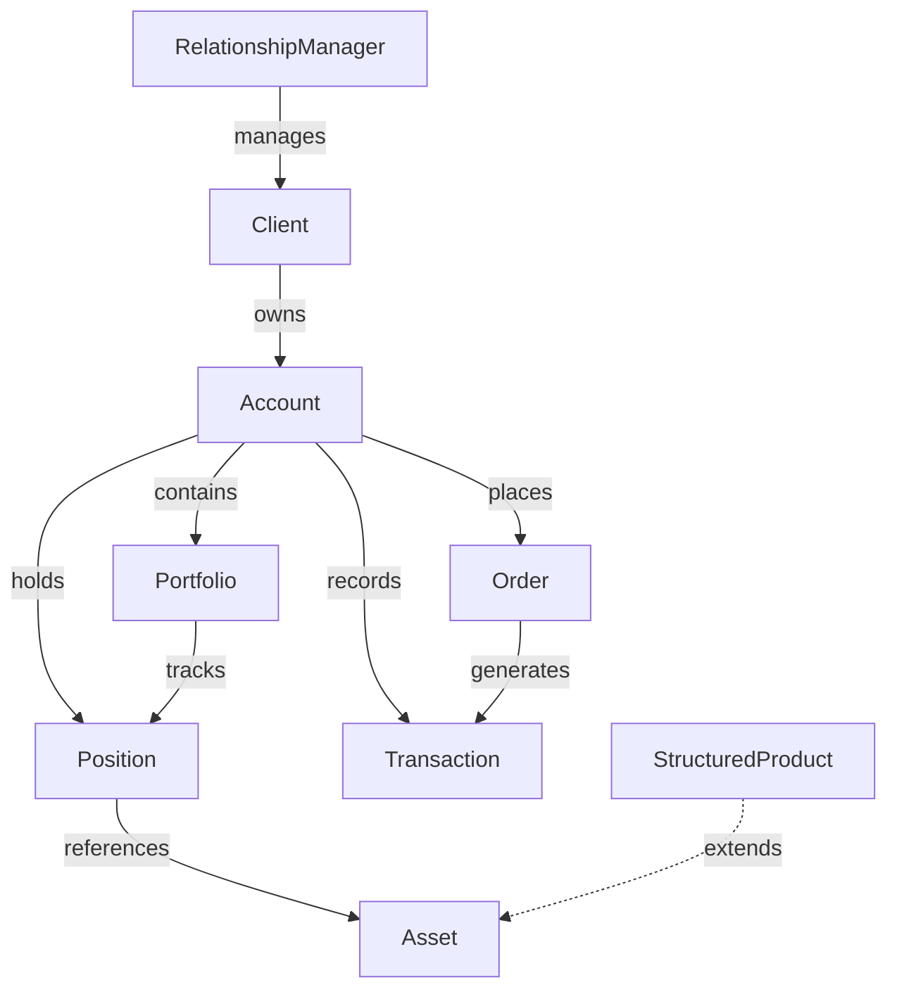
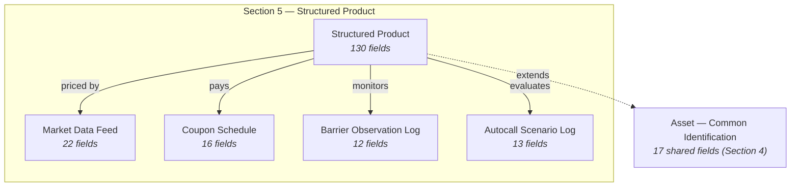

# 07 — Vahalla Wealth Data Specification — Structured Products

> **Document Index:** [00-index.md](00-index.md) | **Related:** [07.1 — CSV Sample Data](07.1-sample-data-csv-structured-products.md) | [01 — Wealth Management Specification](01-wealth-management-specification.md) | [02 — Equity & Bond Specification](02-bank-data-specification-equity-bond.md)

| | |
|---|---|
| **Document Title** | Investment Module - Structured Products Specification |
| **System** | Vahalla Wealth Management System |
| **Document Version** | 1.5 |
| **Date** | 2026-02-12 |
| **Classification** | Confidential |
| **Status** | Draft |
| **Prepared By** | Vahalla System Team |

### Revision History

| Version | Date | Author | Description |
|---|---|---|---|
| 1.0 | 2025-08-01 | Vahalla System Team | Initial draft — Structured Products specification with product identification, underlying assets, capital protection, participation, and barrier fields |
| 1.1 | 2025-10-10 | Vahalla System Team | Added autocall, coupon, and payoff structure sections; added pricing, settlement, and trading fields; added Appendix A enum reference tables |
| 1.2 | 2025-12-15 | Vahalla System Team | Added risk metrics, regulatory reporting, tax, fees, callable/puttable, conversion, distribution, and performance sections; added credit and counterparty fields |
| 1.3 | 2026-01-20 | Vahalla System Team | Added Market Data Feed, Coupon Schedule, Barrier Observation Log, and Autocall Scenario Log supporting entities; added Entity Relationship diagram and Entity Summary table |
| 1.4 | 2026-02-05 | Vahalla System Team | Added day count convention and documentation sections; expanded barrier types (European, American, continuous); added knock-in/knock-out observation frequency fields |
| 1.5 | 2026-02-12 | Vahalla System Team | Added sample data sections (JSON & CSV); added data quality requirements and delivery specifications; final field renumbering |

---

## 1. Purpose

This document specifies the data fields, formats, and standards required from banking partners to integrate **Structured Products** data into our Wealth Management System. The data model is aligned with the **ISO 20022** financial messaging standard to ensure interoperability, consistency, and regulatory compliance across all partners.

**This document covers the Structured Products asset class only.** Structured products are pre-packaged investment instruments that combine derivatives with traditional assets (equities, bonds, indices, commodities, FX) to create customised risk-return profiles. They include capital-protected notes, yield enhancement products (reverse convertibles, autocallables), participation certificates, leverage products, and structured deposits.

For other asset classes, refer to:
- [02 — Equity & Bond Specification](02-bank-data-specification-equity-bond.md)
- [03 — Investment Funds Specification](03-bank-data-specification-investment-funds.md)
- [04 — Money Market Instruments Specification](04-bank-data-specification-money-market.md)

---

## 2. Entity Relationship Overview

### 2.1 Wealth Management Entities (doc 01)



### 2.2 Structured Product Data Model (this document)



---

## 3. Data Standards & Conventions

### 3.1 Applicable ISO Standards

| Standard | Description | Usage |
|---|---|---|
| **ISO 6166** | ISIN — International Securities Identification Number | Primary security identifier (12 chars) |
| **ISO 17442** | LEI — Legal Entity Identifier | Issuer identification (20 chars) |
| **ISO 18774** | FISN — Financial Instrument Short Name | Standardized short name (max 35 chars) |
| **ISO 10962** | CFI — Classification of Financial Instruments | Instrument classification (6 chars) |
| **ISO 10383** | MIC — Market Identifier Code | Exchange/venue identification (4 chars) |
| **ISO 4217** | Currency Codes | All currency fields (3 chars, e.g. USD, EUR, THB) |
| **ISO 3166** | Country Codes | Country of issuance (2-char alpha) |
| **ISO 8601** | Date/Time Format | All date and timestamp fields |
| **ISO 20022** | Financial Messaging Standard | Overall data model alignment |

### 3.2 Data Type Definitions

| Data Type | Format | Example |
|---|---|---|
| `String` | UTF-8 text | `"UBS AG"` |
| `Decimal` | Numeric with decimal precision (up to 18 digits) | `100.2500` |
| `Int` | Integer | `7` |
| `Boolean` | `true` / `false` | `true` |
| `Date` | ISO 8601 date: `YYYY-MM-DD` | `2026-01-15` |
| `DateTime` | ISO 8601 with timezone: `YYYY-MM-DDTHH:MM:SSZ` | `2026-01-15T09:30:00Z` |
| `Enum` | Predefined value from allowed list | `AUTOCALLABLE` |
| `Array` | Ordered list of values (JSON array) | `["2026-03-15", "2026-06-15"]` |

### 3.3 Field Requirement Levels

| Level | Label | Meaning |
|---|---|---|
| **Required** | Required | Must be provided. Record will be rejected without this field. |
| **Conditionally Required** | Conditional | Required when a specific condition is met (noted in Description). |
| **Optional** | Optional | Provide if available. Enhances data quality. |

### 3.4 Delivery Format

- **Preferred:** JSON or XML (ISO 20022 compliant messages)
- **Acceptable:** CSV with header row matching field names, or plain text (fixed-width/delimited)
- **Encoding:** UTF-8
- **Frequency:** Daily end-of-day batch, or real-time via API

### 3.5 Entity Summary

| Entity / Object | Section | # Fields | Description | ISO 20022 Message | Frequency |
|---|---|---|---|---|---|
| **Common Identification** | Section 4 | 17 | Shared identification, issuer, classification, and timestamps | `reda.041` | Static / On change |
| **Structured Product** | Section 5.1–5.25 | 130 | Product-specific fields: product type, underlying, capital protection, participation, barriers, autocall, coupon, payoff, pricing, denomination, settlement, trading, risk metrics, credit risk, regulatory, tax, fees, callable/puttable, conversion, distribution, performance, day count, documentation | `reda.041` | Static / Daily |
| **SP Market Data Feed** | Section 6 | 22 | Real-time / EOD market data feed: bid/ask, theoretical value, Greeks, underlying performance, source | `semt.002` | Intraday / EOD |
| **SP Coupon Schedule** | Section 7 | 16 | Scheduled and paid coupon events: rate, amount, barrier condition, payment status | `reda.041` | On issuance / On change |
| **SP Barrier Observation Log** | Section 8 | 12 | Barrier monitoring records: observation date, underlying price, breach status, distance | `semt.002` | Per observation / Daily |
| **SP Autocall Scenario Log** | Section 9 | 13 | Autocall evaluation records: observation date, barrier level, trigger status, redemption amount | `semt.002` | Per observation / Daily |

> **Note:** Field `#` restarts from 1 for each entity. When combining entities in a CSV file, use the field name (not `#`) as the unique column identifier.

---

## 4. Common Identification Fields

These fields apply to **all structured product records**. Every record must include these fields.

### 4.1 Primary Identification

| # | Field Name | Data Type | Required | Description | Example | ISO 20022 Reference |
|---|---|---|---|---|---|---|
| 1 | `id` | String | Required | Unique identifier assigned by the bank for this product record | `"SEC-SP-001"` | reda.041 — `SctyId/OthrId/Id` |
| 2 | `isin` | String | Required | ISIN code per ISO 6166 (12 chars) | `"CH0123456789"` | reda.041 — `SctyId/ISIN` |
| 3 | `cusip` | String | Optional | CUSIP identifier (9 chars, US/Canada products) | `"012345678"` | reda.041 — `SctyId/OthrId/Id` (CUSIP) |
| 4 | `sedol` | String | Optional | SEDOL identifier (7 chars, UK/Ireland products) | `"B1YW440"` | reda.041 — `SctyId/OthrId/Id` (SEDOL) |
| 5 | `ticker` | String | Optional | Exchange ticker symbol (if listed) | `"UBSAC01"` | reda.041 — `SctyId/TckrSymb` |
| 6 | `name` | String | Required | Full legal name of the structured product | `"UBS Autocallable on EURO STOXX 50"` | reda.041 — `FinInstrmAttrbts/Nm` |
| 7 | `assetClass` | Enum | Required | Must be `STRUCTURED_HYBRID_PRODUCTS` for all records in this specification | `"STRUCTURED_HYBRID_PRODUCTS"` | reda.041 — `FinInstrmAttrbts/ClssfctnTp` |

### 4.2 Issuer & Classification

| # | Field Name | Data Type | Required | Description | Example | ISO 20022 Reference |
|---|---|---|---|---|---|---|
| 8 | `issuer` | String | Required | Name of the issuing entity | `"UBS AG"` | reda.041 — `Issr/Nm` |
| 9 | `lei` | String | Optional | Legal Entity Identifier of issuer per ISO 17442 (20 chars) | `"BFM8T61CT2L1QCEMIK50"` | reda.041 — `Issr/LEI` |
| 10 | `fisn` | String | Optional | Financial Instrument Short Name per ISO 18774 (max 35 chars) | `"UBS/AUTOCALL/SX5E/2027"` | reda.041 — `FinInstrmAttrbts/FISN` |
| 11 | `cfi` | String | Optional | Classification of Financial Instruments per ISO 10962 (6 chars) | `"DTZXFR"` | reda.041 — `FinInstrmAttrbts/CFICd` |
| 12 | `currency` | String | Required | Denomination currency per ISO 4217 (3 chars) | `"USD"` | reda.041 — `FinInstrmAttrbts/DnmtnCcy` |
| 13 | `country` | String | Optional | Country of issuance per ISO 3166-1 alpha-2 | `"CH"` | reda.041 — `FinInstrmAttrbts/CtryOfIsse` |
| 14 | `description` | String | Optional | Free-text description of the product | `"3Y Autocallable Note linked to EURO STOXX 50 with 70% barrier"` | reda.041 — `FinInstrmAttrbts/Desc` |
| 15 | `documentUrl` | String | Optional | URL to term sheet, prospectus, or KID | `"https://bank.com/docs/SP001-termsheet.pdf"` | reda.041 — `AddtlInf/InfURL` |

### 4.3 Timestamps

| # | Field Name | Data Type | Required | Description | Example | ISO 20022 Reference |
|---|---|---|---|---|---|---|
| 16 | `createdAt` | DateTime | Required | Record creation timestamp | `"2026-01-15T09:30:00Z"` | reda.041 — `CreDtTm` |
| 17 | `updatedAt` | DateTime | Required | Last update timestamp | `"2026-02-12T14:00:00Z"` | reda.041 — `UpdDtTm` |

---

## 5. Structured Product Data Fields

For records where `assetClass` = `STRUCTURED_HYBRID_PRODUCTS`.

### 5.1 Product Identification & Classification

| # | Field Name | Data Type | Required | Description | Allowed Values / Example | ISO 20022 Reference |
|---|---|---|---|---|---|---|
| 1 | `productType` | Enum | Required | Structured product sub-type classification | See [Appendix A.1](#a1-structuredproducttype) | reda.041 — `StrctrdPdct/PdctTp` |
| 2 | `uniqueProductIdentifier` | String | Optional | Unique Product Identifier (UPI) per ISDA | `"UPI-SP-2026-001"` | reda.041 — `StrctrdPdct/UPI` |
| 3 | `productTaxonomy` | String | Optional | Product taxonomy classification (e.g. SSPA, EUSIPA) | `"SSPA-1230"` | reda.041 — `StrctrdPdct/PdctTxnmy` |
| 4 | `productCategory` | Enum | Optional | High-level product category | `"CAPITAL_PROTECTION"`, `"YIELD_ENHANCEMENT"`, `"PARTICIPATION"`, `"LEVERAGE"` | reda.041 — `StrctrdPdct/PdctCtgy` |
| 5 | `complexityLevel` | Enum | Optional | Product complexity classification | `"LOW"`, `"MEDIUM"`, `"HIGH"` | reda.041 — `StrctrdPdct/CmplxtyLvl` |

### 5.2 Issuer Details

| # | Field Name | Data Type | Required | Description | Example | ISO 20022 Reference |
|---|---|---|---|---|---|---|
| 6 | `issuerLei` | String | Optional | LEI of the issuer (20 chars) | `"BFM8T61CT2L1QCEMIK50"` | reda.041 — `StrctrdPdct/Issr/LEI` |
| 7 | `issuerRating` | String | Optional | Credit rating of the issuer | `"A+"` | reda.041 — `StrctrdPdct/Issr/CdtRtg` |
| 8 | `issuerCountry` | String | Optional | Issuer domicile country per ISO 3166 | `"CH"` | reda.041 — `StrctrdPdct/Issr/Ctry` |
| 9 | `guarantor` | String | Optional | Name of guarantor entity (if any) | `"UBS Group AG"` | reda.041 — `StrctrdPdct/Guarntr/Nm` |
| 10 | `guarantorLei` | String | Optional | LEI of the guarantor | `"549300SZJ9VS8SGXAN81"` | reda.041 — `StrctrdPdct/Guarntr/LEI` |

### 5.3 Underlying Assets

| # | Field Name | Data Type | Required | Description | Allowed Values / Example | ISO 20022 Reference |
|---|---|---|---|---|---|---|
| 11 | `underlyingAssetType` | Enum | Required | Type of underlying asset(s) | See [Appendix A.7](#a7-underlyingassettype) | reda.041 — `StrctrdPdct/Undrlyg/AsstTp` |
| 12 | `underlyingAssets` | Array | Required | Array of underlying asset objects (see Section 5.3.1) | See below | reda.041 — `StrctrdPdct/Undrlyg/Assts` |
| 13 | `numberOfUnderlyings` | Int | Optional | Number of underlying assets | `1` | reda.041 — `StrctrdPdct/Undrlyg/NbOfUndrlygs` |
| 14 | `basketWeighting` | Enum | Optional | Weighting method for basket underlyings | `"EQUAL"`, `"MARKET_CAP"`, `"CUSTOM"` | reda.041 — `StrctrdPdct/Undrlyg/BsktWghtg` |

#### 5.3.1 Underlying Asset Object

Each element in the `underlyingAssets` array must contain:

| Field Name | Data Type | Required | Description | Example |
|---|---|---|---|---|
| `assetId` | String | Required | Reference ID of the underlying asset | `"SEC-IDX-SX5E"` |
| `assetType` | String | Required | Type of underlying | `"INDEX"`, `"EQUITY"`, `"COMMODITY"`, `"FX"` |
| `isin` | String | Optional | ISIN of the underlying (if applicable) | `"EU0009658145"` |
| `ticker` | String | Optional | Ticker symbol of the underlying | `"SX5E"` |
| `name` | String | Required | Name of the underlying | `"EURO STOXX 50"` |
| `weight` | Decimal | Optional | Weight in basket (%) — required if `numberOfUnderlyings` > 1 | `100.00` |
| `initialPrice` | Decimal | Optional | Initial fixing / strike price | `4250.00` |
| `currentPrice` | Decimal | Optional | Current price of the underlying | `4380.00` |
| `performance` | Decimal | Optional | Performance since initial fixing (%) | `3.06` |
| `currency` | String | Optional | Currency of the underlying per ISO 4217 | `"EUR"` |

### 5.4 Key Dates

| # | Field Name | Data Type | Required | Description | Example | ISO 20022 Reference |
|---|---|---|---|---|---|---|
| 15 | `issueDate` | Date | Required | Product issuance / strike date | `"2025-03-15"` | reda.041 — `StrctrdPdct/IsseDt` |
| 16 | `valuationDate` | Date | Optional | Final valuation / observation date | `"2028-03-10"` | reda.041 — `StrctrdPdct/ValtnDt` |
| 17 | `maturityDate` | Date | Required | Maturity / redemption date | `"2028-03-15"` | reda.041 — `StrctrdPdct/MtrtyDt` |
| 18 | `firstTradingDate` | Date | Optional | First date the product is tradeable | `"2025-03-20"` | reda.041 — `StrctrdPdct/FrstTradgDt` |
| 19 | `lastTradingDate` | Date | Optional | Last date the product is tradeable | `"2028-03-10"` | reda.041 — `StrctrdPdct/LastTradgDt` |
| 20 | `observationDates` | Array | Optional | Array of barrier / coupon observation dates | `["2025-09-15", "2026-03-15", ...]` | reda.041 — `StrctrdPdct/ObsrvtnDts` |
| 21 | `autocallDates` | Array | Optional | Array of autocall evaluation dates | `["2026-03-15", "2026-09-15", ...]` | reda.041 — `StrctrdPdct/AutcllDts` |
| 22 | `couponPaymentDates` | Array | Optional | Array of coupon payment dates | `["2025-09-20", "2026-03-20", ...]` | reda.041 — `StrctrdPdct/CpnPmtDts` |

### 5.5 Capital Protection

| # | Field Name | Data Type | Required | Description | Allowed Values / Example | ISO 20022 Reference |
|---|---|---|---|---|---|---|
| 23 | `capitalProtectionType` | Enum | Required | Type of capital protection | See [Appendix A.5](#a5-capitalprotectiontype) | reda.041 — `StrctrdPdct/CptlPrtctn/Tp` |
| 24 | `principalProtection` | Decimal | Optional | Protection percentage (0–100). E.g. 100 = full protection | `100.00` | reda.041 — `StrctrdPdct/CptlPrtctn/PrncplPrtctnPct` |
| 25 | `protectionLevel` | Decimal | Optional | Protection level as percentage of initial price | `90.00` | reda.041 — `StrctrdPdct/CptlPrtctn/PrtctnLvl` |
| 26 | `protectionBarrier` | Decimal | Optional | Barrier level for conditional protection (% of initial) | `70.00` | reda.041 — `StrctrdPdct/CptlPrtctn/PrtctnBrr` |
| 27 | `conditionalProtection` | Boolean | Optional | Whether protection is conditional on barrier not being breached | `true` | reda.041 — `StrctrdPdct/CptlPrtctn/CndtnlPrtctn` |
| 28 | `protectionConditions` | String | Optional | Description of protection conditions | `"Capital protected if SX5E never falls below 70% of initial level"` | reda.041 — `StrctrdPdct/CptlPrtctn/PrtctnCndtns` |

### 5.6 Participation & Performance

| # | Field Name | Data Type | Required | Description | Example | ISO 20022 Reference |
|---|---|---|---|---|---|---|
| 29 | `participationRate` | Decimal | Optional | Upside participation rate (%) | `100.00` | reda.041 — `StrctrdPdct/Prtcptn/PrtcptnRate` |
| 30 | `gearing` | Decimal | Optional | Leverage / gearing factor | `2.00` | reda.041 — `StrctrdPdct/Prtcptn/Grng` |
| 31 | `cap` | Decimal | Optional | Maximum return cap (%) | `30.00` | reda.041 — `StrctrdPdct/Prtcptn/Cap` |
| 32 | `floor` | Decimal | Optional | Minimum return floor (%) | `0.00` | reda.041 — `StrctrdPdct/Prtcptn/Flr` |
| 33 | `strike` | Decimal | Optional | Strike level (% of initial or absolute) | `100.00` | reda.041 — `StrctrdPdct/Prtcptn/Strk` |
| 34 | `knockOutLevel` | Decimal | Optional | Knock-out barrier level (% of initial) | `140.00` | reda.041 — `StrctrdPdct/Prtcptn/KnckOutLvl` |
| 35 | `knockInLevel` | Decimal | Optional | Knock-in barrier level (% of initial) | `70.00` | reda.041 — `StrctrdPdct/Prtcptn/KnckInLvl` |

### 5.7 Barrier Features

| # | Field Name | Data Type | Required | Description | Allowed Values / Example | ISO 20022 Reference |
|---|---|---|---|---|---|---|
| 36 | `barrierType` | Enum | Optional | Type of barrier | See [Appendix A.3](#a3-barriertype) | reda.041 — `StrctrdPdct/Brr/BrrTp` |
| 37 | `barrierLevel` | Decimal | Optional | Primary barrier level (% of initial) | `70.00` | reda.041 — `StrctrdPdct/Brr/BrrLvl` |
| 38 | `upperBarrier` | Decimal | Optional | Upper barrier level (for double barriers) | `130.00` | reda.041 — `StrctrdPdct/Brr/UpprBrr` |
| 39 | `lowerBarrier` | Decimal | Optional | Lower barrier level (for double barriers) | `70.00` | reda.041 — `StrctrdPdct/Brr/LwrBrr` |
| 40 | `barrierObservation` | Enum | Optional | Barrier observation frequency | `"CONTINUOUS"`, `"DAILY"`, `"WEEKLY"`, `"MONTHLY"`, `"AT_MATURITY"` | reda.041 — `StrctrdPdct/Brr/BrrObsrvtn` |
| 41 | `barrierBreached` | Boolean | Optional | Whether the barrier has been breached | `false` | reda.041 — `StrctrdPdct/Brr/BrrBrchd` |
| 42 | `barrierBreachDate` | Date | Optional | Date the barrier was breached (if applicable) | `"2026-06-15"` | reda.041 — `StrctrdPdct/Brr/BrrBrchDt` |

### 5.8 Autocall Features

| # | Field Name | Data Type | Required | Description | Allowed Values / Example | ISO 20022 Reference |
|---|---|---|---|---|---|---|
| 43 | `autocallable` | Boolean | Optional | Whether the product has autocall feature | `true` | reda.041 — `StrctrdPdct/Autcll/AutcllInd` |
| 44 | `autocallType` | Enum | Conditional | Autocall style. Required if `autocallable` = `true` | See [Appendix A.6](#a6-autocalltype) | reda.041 — `StrctrdPdct/Autcll/AutcllTp` |
| 45 | `autocallBarrier` | Decimal | Conditional | Autocall trigger level (% of initial). Required if `autocallable` = `true` | `100.00` | reda.041 — `StrctrdPdct/Autcll/AutcllBrr` |
| 46 | `autocallFrequency` | Enum | Optional | Autocall observation frequency | `"MONTHLY"`, `"QUARTERLY"`, `"SEMI_ANNUAL"`, `"ANNUAL"` | reda.041 — `StrctrdPdct/Autcll/AutcllFrqcy` |
| 47 | `autocallTriggered` | Boolean | Optional | Whether autocall has been triggered | `false` | reda.041 — `StrctrdPdct/Autcll/AutcllTrggrd` |
| 48 | `autocallTriggerDate` | Date | Optional | Date autocall was triggered (if applicable) | `"2026-09-15"` | reda.041 — `StrctrdPdct/Autcll/AutcllTrggrDt` |
| 49 | `autocallPayment` | Decimal | Optional | Autocall redemption amount (% of denomination) | `105.00` | reda.041 — `StrctrdPdct/Autcll/AutcllPmt` |

### 5.9 Coupon Details

| # | Field Name | Data Type | Required | Description | Allowed Values / Example | ISO 20022 Reference |
|---|---|---|---|---|---|---|
| 50 | `couponType` | Enum | Optional | Type of coupon | See [Appendix A.4](#a4-coupontype) | reda.041 — `StrctrdPdct/Cpn/CpnTp` |
| 51 | `couponRate` | Decimal | Optional | Coupon rate (% per annum) | `8.50` | reda.041 — `StrctrdPdct/Cpn/CpnRate` |
| 52 | `couponFrequency` | Enum | Optional | Coupon payment frequency | See [Appendix A.8](#a8-paymentfrequency) | reda.041 — `StrctrdPdct/Cpn/CpnFrqcy` |
| 53 | `couponBarrier` | Decimal | Optional | Barrier level for conditional coupon (% of initial) | `70.00` | reda.041 — `StrctrdPdct/Cpn/CpnBrr` |
| 54 | `memoryCoupon` | Boolean | Optional | Whether unpaid coupons accumulate (memory feature) | `true` | reda.041 — `StrctrdPdct/Cpn/MmryCpn` |
| 55 | `accumulatedCoupons` | Decimal | Optional | Total accumulated unpaid coupons (absolute amount) | `0.00` | reda.041 — `StrctrdPdct/Cpn/AccmltdCpns` |
| 56 | `nextCouponDate` | Date | Optional | Next scheduled coupon payment date | `"2026-09-20"` | reda.041 — `StrctrdPdct/Cpn/NxtCpnDt` |
| 57 | `nextCouponAmount` | Decimal | Optional | Expected next coupon amount per unit | `42.50` | reda.041 — `StrctrdPdct/Cpn/NxtCpnAmt` |

### 5.10 Payoff Structure

| # | Field Name | Data Type | Required | Description | Allowed Values / Example | ISO 20022 Reference |
|---|---|---|---|---|---|---|
| 58 | `payoffStructure` | Enum | Required | Payoff structure type | See [Appendix A.2](#a2-payoffstructure) | reda.041 — `StrctrdPdct/Pyff/PyffStrctr` |
| 59 | `payoffFormula` | String | Optional | Mathematical payoff formula | `"max(0, Participation × (Final/Initial - Strike)) + Denomination"` | reda.041 — `StrctrdPdct/Pyff/PyffFrmla` |
| 60 | `payoffDescription` | String | Optional | Plain-language payoff description | `"At maturity, if SX5E ≥ 70% of initial, investor receives 100% of principal plus accrued coupons"` | reda.041 — `StrctrdPdct/Pyff/PyffDesc` |
| 61 | `returnCalculation` | String | Optional | Method of return calculation | `"POINT_TO_POINT"`, `"ASIAN_AVERAGE"`, `"LOOKBACK"`, `"CLIQUET"` | reda.041 — `StrctrdPdct/Pyff/RtrnCalc` |

### 5.11 Pricing & Valuation

| # | Field Name | Data Type | Required | Description | Example | ISO 20022 Reference |
|---|---|---|---|---|---|---|
| 62 | `issuePrice` | Decimal | Required | Issue price (% of denomination, e.g. 100 = par) | `100.00` | reda.041 — `StrctrdPdct/Pric/IssePric` |
| 63 | `currentPrice` | Decimal | Optional | Current indicative price (% of denomination) | `98.50` | semt.002 — `MktPric/CurPric` |
| 64 | `redemptionPrice` | Decimal | Optional | Expected redemption price (% of denomination) | `100.00` | reda.041 — `StrctrdPdct/Pric/RdmptnPric` |
| 65 | `theoreticalValue` | Decimal | Optional | Model-derived theoretical value (% of denomination) | `99.20` | semt.002 — `MktPric/ThrtclVal` |
| 66 | `intrinsicValue` | Decimal | Optional | Intrinsic value component | `95.00` | semt.002 — `MktPric/IntrscVal` |
| 67 | `timeValue` | Decimal | Optional | Time value component | `4.20` | semt.002 — `MktPric/TmVal` |
| 68 | `bidPrice` | Decimal | Optional | Bid price (% of denomination) | `97.80` | semt.002 — `MktPric/BdPric` |
| 69 | `askPrice` | Decimal | Optional | Ask price (% of denomination) | `99.20` | semt.002 — `MktPric/AskPric` |

### 5.12 Denomination & Size

| # | Field Name | Data Type | Required | Description | Example | ISO 20022 Reference |
|---|---|---|---|---|---|---|
| 70 | `denomination` | Decimal | Required | Denomination / face value per unit | `1000.00` | reda.041 — `StrctrdPdct/Dnmtn/FaceAmt` |
| 71 | `minimumInvestment` | Decimal | Optional | Minimum investment amount | `10000.00` | reda.041 — `StrctrdPdct/Dnmtn/MinInvstmt` |
| 72 | `totalIssueSize` | Decimal | Optional | Total issuance size | `50000000.00` | reda.041 — `StrctrdPdct/Dnmtn/TtlIssdAmt` |
| 73 | `outstandingAmount` | Decimal | Optional | Current outstanding amount | `45000000.00` | reda.041 — `StrctrdPdct/Dnmtn/OutstndgAmt` |

### 5.13 Settlement

| # | Field Name | Data Type | Required | Description | Allowed Values / Example | ISO 20022 Reference |
|---|---|---|---|---|---|---|
| 74 | `settlementType` | Enum | Optional | Settlement type at maturity | See [Appendix A.9](#a9-settlementtype) | reda.041 — `StrctrdPdct/Sttlm/SttlmTp` |
| 75 | `settlementCurrency` | String | Optional | Settlement currency per ISO 4217 | `"USD"` | reda.041 — `StrctrdPdct/Sttlm/SttlmCcy` |
| 76 | `settlementMethod` | Enum | Optional | Settlement method | See [Appendix A.10](#a10-settlementmethod) | reda.041 — `StrctrdPdct/Sttlm/SttlmMtd` |
| 77 | `settlementCycle` | Enum | Optional | Settlement cycle | See [Appendix A.11](#a11-settlementcycle) | reda.041 — `StrctrdPdct/Sttlm/SttlmCycl` |

### 5.14 Trading

| # | Field Name | Data Type | Required | Description | Allowed Values / Example | ISO 20022 Reference |
|---|---|---|---|---|---|---|
| 78 | `exchange` | String | Optional | Primary exchange / listing venue | `"SIX Swiss Exchange"` | reda.041 — `TradgDtls/PlcOfListg/Nm` |
| 79 | `mic` | String | Optional | Market Identifier Code per ISO 10383 (4 chars) | `"XSWX"` | reda.041 — `TradgDtls/PlcOfListg/MktIdCd` |
| 80 | `tradingVenue` | String | Optional | OTC or specific trading venue | `"OTC"`, `"SIX"`, `"EUWAX"`, `"SCOACH"` | reda.041 — `TradgDtls/TradgVn` |
| 81 | `tradingCurrency` | String | Optional | Trading currency per ISO 4217 | `"EUR"` | reda.041 — `TradgDtls/TradgCcy` |
| 82 | `tradingStatus` | Enum | Optional | Current trading status | See [Appendix A.12](#a12-tradingstatus) | reda.041 — `TradgDtls/TradgSts` |

### 5.15 Risk Metrics (Greeks)

| # | Field Name | Data Type | Required | Description | Example | ISO 20022 Reference |
|---|---|---|---|---|---|---|
| 83 | `delta` | Decimal | Optional | Delta — sensitivity to underlying price change | `0.65` | semt.002 — `FinInstrmDtls/Dlt` |
| 84 | `gamma` | Decimal | Optional | Gamma — rate of change of delta | `0.02` | semt.002 — `FinInstrmDtls/Gmm` |
| 85 | `vega` | Decimal | Optional | Vega — sensitivity to volatility change | `15.30` | semt.002 — `FinInstrmDtls/Vg` |
| 86 | `theta` | Decimal | Optional | Theta — time decay per day | `-0.05` | semt.002 — `FinInstrmDtls/Tht` |
| 87 | `rho` | Decimal | Optional | Rho — sensitivity to interest rate change | `0.10` | semt.002 — `FinInstrmDtls/Rh` |
| 88 | `impliedVolatility` | Decimal | Optional | Implied volatility (%) | `22.50` | semt.002 — `FinInstrmDtls/ImpldVltlty` |

### 5.16 Credit Risk

| # | Field Name | Data Type | Required | Description | Allowed Values / Example | ISO 20022 Reference |
|---|---|---|---|---|---|---|
| 89 | `creditRating` | String | Optional | Credit rating of the product or issuer | `"A+"` | reda.041 — `StrctrdPdct/CdtRsk/CdtRtg` |
| 90 | `creditRatingAgency` | String | Optional | Rating agency name | `"S&P"`, `"Moody's"`, `"Fitch"` | reda.041 — `StrctrdPdct/CdtRsk/CdtRtgAgncy` |
| 91 | `creditQualityStep` | Enum | Optional | CRD IV credit quality step (1–6 or NOT_RATED) | See [Appendix A.13](#a13-creditqualitystep) | reda.041 — `StrctrdPdct/CdtRsk/CdtQltyStep` |
| 92 | `defaultRisk` | Boolean | Optional | Whether issuer is at risk of default | `false` | reda.041 — `StrctrdPdct/CdtRsk/DfltRsk` |
| 93 | `bailInRisk` | Boolean | Optional | Whether the product is subject to bail-in | `true` | reda.041 — `StrctrdPdct/CdtRsk/BailInRsk` |

### 5.17 Regulatory & Documentation

| # | Field Name | Data Type | Required | Description | Example | ISO 20022 Reference |
|---|---|---|---|---|---|---|
| 94 | `priipsCompliant` | Boolean | Optional | Whether the product is PRIIPs regulation compliant | `true` | reda.041 — `StrctrdPdct/Rgltry/PRIIPsCmplnt` |
| 95 | `kidAvailable` | Boolean | Optional | Whether a Key Information Document is available | `true` | reda.041 — `StrctrdPdct/Rgltry/KIDAvlbl` |
| 96 | `prospectusUrl` | String | Optional | URL to the base prospectus | `"https://bank.com/docs/SP001-prospectus.pdf"` | reda.041 — `StrctrdPdct/Rgltry/PrspctsURL` |
| 97 | `kidUrl` | String | Optional | URL to the Key Information Document | `"https://bank.com/docs/SP001-kid.pdf"` | reda.041 — `StrctrdPdct/Rgltry/KIDURL` |
| 98 | `factsheetUrl` | String | Optional | URL to the product factsheet | `"https://bank.com/docs/SP001-factsheet.pdf"` | reda.041 — `StrctrdPdct/Rgltry/FctshtURL` |

### 5.18 Tax

| # | Field Name | Data Type | Required | Description | Allowed Values / Example | ISO 20022 Reference |
|---|---|---|---|---|---|---|
| 99 | `taxStatus` | Enum | Optional | Tax classification | See [Appendix A.14](#a14-taxstatus) | reda.041 — `StrctrdPdct/Tax/TaxSts` |
| 100 | `withholdingTax` | Decimal | Optional | Withholding tax rate (%) | `15.00` | reda.041 — `StrctrdPdct/Tax/WhldgTax` |
| 101 | `taxCountry` | String | Optional | Tax jurisdiction per ISO 3166 | `"CH"` | reda.041 — `StrctrdPdct/Tax/TaxCtry` |

### 5.19 Fees & Costs

| # | Field Name | Data Type | Required | Description | Example | ISO 20022 Reference |
|---|---|---|---|---|---|---|
| 102 | `managementFee` | Decimal | Optional | Annual management fee (%) | `0.50` | reda.041 — `StrctrdPdct/Fees/MgmtFee` |
| 103 | `subscriptionFee` | Decimal | Optional | Subscription / entry fee (%) | `1.00` | reda.041 — `StrctrdPdct/Fees/SbcptFee` |
| 104 | `redemptionFee` | Decimal | Optional | Early redemption fee (%) | `0.50` | reda.041 — `StrctrdPdct/Fees/RdmptnFee` |
| 105 | `performanceFee` | Decimal | Optional | Performance fee (%) | `0.00` | reda.041 — `StrctrdPdct/Fees/PrfrmncFee` |
| 106 | `ongoingCharges` | Decimal | Optional | Total ongoing charges (%) | `0.75` | reda.041 — `StrctrdPdct/Fees/OngngChrgs` |

### 5.20 Callable / Puttable Features

| # | Field Name | Data Type | Required | Description | Example | ISO 20022 Reference |
|---|---|---|---|---|---|---|
| 107 | `callable` | Boolean | Optional | Whether the issuer can call the product early | `false` | reda.041 — `StrctrdPdct/CallPut/CallInd` |
| 108 | `callDates` | Array | Optional | Array of issuer call dates | `["2026-09-15", "2027-03-15"]` | reda.041 — `StrctrdPdct/CallPut/CallDts` |
| 109 | `callPrice` | Decimal | Optional | Call price (% of denomination) | `100.00` | reda.041 — `StrctrdPdct/CallPut/CallPric` |
| 110 | `puttable` | Boolean | Optional | Whether the investor can put the product early | `false` | reda.041 — `StrctrdPdct/CallPut/PutInd` |
| 111 | `putDates` | Array | Optional | Array of investor put dates | `["2026-09-15"]` | reda.041 — `StrctrdPdct/CallPut/PutDts` |
| 112 | `putPrice` | Decimal | Optional | Put price (% of denomination) | `95.00` | reda.041 — `StrctrdPdct/CallPut/PutPric` |

### 5.21 Conversion Features

| # | Field Name | Data Type | Required | Description | Example | ISO 20022 Reference |
|---|---|---|---|---|---|---|
| 113 | `convertible` | Boolean | Optional | Whether the product is convertible to underlying shares | `false` | reda.041 — `StrctrdPdct/Cnvrsn/CnvrsnInd` |
| 114 | `conversionRatio` | Decimal | Conditional | Number of shares per unit. Required if `convertible` = `true` | `5.00` | reda.041 — `StrctrdPdct/Cnvrsn/CnvrsnRatio` |
| 115 | `conversionPrice` | Decimal | Conditional | Conversion price per share. Required if `convertible` = `true` | `200.00` | reda.041 — `StrctrdPdct/Cnvrsn/CnvrsnPric` |
| 116 | `conversionDates` | Array | Optional | Array of conversion window dates | `["2027-03-15", "2028-03-15"]` | reda.041 — `StrctrdPdct/Cnvrsn/CnvrsnDts` |

### 5.22 Distribution

| # | Field Name | Data Type | Required | Description | Allowed Values / Example | ISO 20022 Reference |
|---|---|---|---|---|---|---|
| 117 | `distributionChannel` | Enum | Optional | Distribution channel | `"RETAIL"`, `"INSTITUTIONAL"`, `"PRIVATE_BANKING"` | reda.041 — `StrctrdPdct/Dstrbtn/DstrbtnChnl` |
| 118 | `targetMarket` | String | Optional | Target market description | `"Sophisticated investors seeking yield enhancement"` | reda.041 — `StrctrdPdct/Dstrbtn/TrgtMkt` |
| 119 | `appropriatenessCategory` | String | Optional | MiFID II appropriateness category | `"COMPLEX"`, `"NON_COMPLEX"` | reda.041 — `StrctrdPdct/Dstrbtn/AprprtnssCtgy` |

### 5.23 Performance

| # | Field Name | Data Type | Required | Description | Example | ISO 20022 Reference |
|---|---|---|---|---|---|---|
| 120 | `currentReturn` | Decimal | Optional | Current total return (%) | `3.50` | semt.002 — `FinInstrmDtls/CurRtrn` |
| 121 | `sinceInception` | Decimal | Optional | Return since inception (%) | `5.20` | semt.002 — `FinInstrmDtls/SnceIncptn` |
| 122 | `yearToDate` | Decimal | Optional | Year-to-date return (%) | `1.80` | semt.002 — `FinInstrmDtls/YTD` |
| 123 | `oneYear` | Decimal | Optional | 1-year return (%) | `4.50` | semt.002 — `FinInstrmDtls/OneYr` |
| 124 | `threeYear` | Decimal | Optional | 3-year return (%) | `12.30` | semt.002 — `FinInstrmDtls/ThreeYr` |

### 5.24 Day Count & Calendar

| # | Field Name | Data Type | Required | Description | Allowed Values / Example | ISO 20022 Reference |
|---|---|---|---|---|---|---|
| 125 | `dayCountBasis` | Enum | Optional | Day count convention for coupon accrual | See [Appendix A.15](#a15-daycountbasis) | reda.041 — `StrctrdPdct/DayCnt/DayCntBsis` |
| 126 | `businessDayConvention` | Enum | Optional | Business day adjustment convention | See [Appendix A.16](#a16-businessdayconvention) | reda.041 — `StrctrdPdct/DayCnt/BizDayCnvtn` |
| 127 | `paymentCalendar` | String | Optional | Payment calendar reference | `"TARGET"`, `"NEW_YORK"`, `"LONDON"`, `"TOKYO"` | reda.041 — `StrctrdPdct/DayCnt/PmtClndr` |

### 5.25 Documentation

| # | Field Name | Data Type | Required | Description | Example | ISO 20022 Reference |
|---|---|---|---|---|---|---|
| 128 | `termSheet` | String | Optional | URL to the term sheet | `"https://bank.com/docs/SP001-terms.pdf"` | reda.041 — `StrctrdPdct/Doc/TrmSht` |
| 129 | `finalTerms` | String | Optional | URL to the final terms document | `"https://bank.com/docs/SP001-final-terms.pdf"` | reda.041 — `StrctrdPdct/Doc/FnlTrms` |
| 130 | `baseProspectus` | String | Optional | URL to the base prospectus | `"https://bank.com/docs/SP001-base-prospectus.pdf"` | reda.041 — `StrctrdPdct/Doc/BsPrspcts` |

---

## 6. Structured Product Market Data Feed

> **Source:** Real-time or end-of-day market data feed. These fields are updated intraday or at market close and are distinct from static reference data (Section 5). Portfolio-level valuation is handled by the Position entity ([01 — Wealth Management Specification](01-wealth-management-specification.md)).

#### 6.1 Key Fields

| # | Field Name | Data Type | Required | Description | Example | ISO 20022 Reference |
|---|---|---|---|---|---|---|
| 1 | `assetId` | String | Required | Reference to the product record ID (foreign key to Section 4 `id`) | `"SEC-SP-001"` | semt.002 — `FinInstrmId/OthrId/Id` |
| 2 | `isin` | String | Required | ISIN of the product (alternative key) | `"CH0123456789"` | semt.002 — `FinInstrmId/ISIN` |
| 3 | `timestamp` | DateTime | Required | Market data snapshot timestamp | `"2026-02-12T16:00:00Z"` | semt.002 — `MktPric/PricDtTm` |
| 4 | `currency` | String | Required | Price currency per ISO 4217 | `"USD"` | semt.002 — `MktPric/Ccy` |
| 5 | `source` | String | Optional | Pricing source | `"Bloomberg"`, `"Refinitiv"`, `"Issuer"` | semt.002 — `MktPric/SrcOfPric` |

#### 6.2 Prices

| # | Field Name | Data Type | Required | Description | Example | ISO 20022 Reference |
|---|---|---|---|---|---|---|
| 6 | `bidPrice` | Decimal | Optional | Bid price (% of denomination) | `97.80` | semt.002 — `MktPric/BdPric` |
| 7 | `askPrice` | Decimal | Optional | Ask price (% of denomination) | `99.20` | semt.002 — `MktPric/AskPric` |
| 8 | `midPrice` | Decimal | Optional | Mid price | `98.50` | semt.002 — `MktPric/MdPric` |
| 9 | `lastTradePrice` | Decimal | Optional | Last traded price | `98.60` | semt.002 — `MktPric/LastTradPric` |
| 10 | `theoreticalValue` | Decimal | Optional | Model-derived theoretical value | `99.20` | semt.002 — `MktPric/ThrtclVal` |
| 11 | `intrinsicValue` | Decimal | Optional | Intrinsic value component | `95.00` | semt.002 — `MktPric/IntrscVal` |
| 12 | `timeValue` | Decimal | Optional | Time value component | `4.20` | semt.002 — `MktPric/TmVal` |

#### 6.3 Greeks

| # | Field Name | Data Type | Required | Description | Example | ISO 20022 Reference |
|---|---|---|---|---|---|---|
| 13 | `delta` | Decimal | Optional | Delta | `0.65` | semt.002 — `FinInstrmDtls/Dlt` |
| 14 | `gamma` | Decimal | Optional | Gamma | `0.02` | semt.002 — `FinInstrmDtls/Gmm` |
| 15 | `vega` | Decimal | Optional | Vega | `15.30` | semt.002 — `FinInstrmDtls/Vg` |
| 16 | `theta` | Decimal | Optional | Theta | `-0.05` | semt.002 — `FinInstrmDtls/Tht` |
| 17 | `rho` | Decimal | Optional | Rho | `0.10` | semt.002 — `FinInstrmDtls/Rh` |
| 18 | `impliedVolatility` | Decimal | Optional | Implied volatility (%) | `22.50` | semt.002 — `FinInstrmDtls/ImpldVltlty` |

#### 6.4 Underlying Performance & Metadata

| # | Field Name | Data Type | Required | Description | Example | ISO 20022 Reference |
|---|---|---|---|---|---|---|
| 19 | `underlyingPrice` | Decimal | Optional | Current price of the primary underlying | `4380.00` | semt.002 — `FinInstrmDtls/UndrlygPric` |
| 20 | `underlyingPerformance` | Decimal | Optional | Underlying performance since initial fixing (%) | `3.06` | semt.002 — `FinInstrmDtls/UndrlygPrfrmce` |
| 21 | `distanceToBarrier` | Decimal | Optional | Distance to nearest barrier (%) | `32.94` | semt.002 — `FinInstrmDtls/DstncToBrr` |
| 22 | `lastUpdateTime` | DateTime | Optional | Last market data update time | `"2026-02-12T16:00:00Z"` | semt.002 — `MktPric/LastUpdtTm` |

---

## 7. Structured Product Coupon Schedule

> **Source:** Generated from product terms at issuance. Linked to the product record via `assetId`. One row per coupon event.

#### 7.1 Key Fields

| # | Field Name | Data Type | Required | Description | Example | ISO 20022 Reference |
|---|---|---|---|---|---|---|
| 1 | `assetId` | String | Required | Reference to the product record ID (foreign key to Section 4 `id`) | `"SEC-SP-001"` | reda.041 — `FinInstrmId/OthrId/Id` |
| 2 | `isin` | String | Required | ISIN of the product (alternative key) | `"CH0123456789"` | reda.041 — `FinInstrmId/ISIN` |
| 3 | `couponId` | String | Required | Unique identifier for this coupon entry | `"CPN-SP001-20260920-001"` | reda.041 — `Cpn/EvtId` |

#### 7.2 Coupon Details

| # | Field Name | Data Type | Required | Description | Example | ISO 20022 Reference |
|---|---|---|---|---|---|---|
| 4 | `paymentDate` | Date | Required | Coupon payment date | `"2026-09-20"` | reda.041 — `Cpn/PmtDt` |
| 5 | `observationDate` | Date | Optional | Coupon barrier observation date | `"2026-09-15"` | reda.041 — `Cpn/ObsrvtnDt` |
| 6 | `couponRate` | Decimal | Required | Coupon rate for this period (% per annum) | `8.50` | reda.041 — `Cpn/CpnRate` |
| 7 | `couponAmount` | Decimal | Required | Coupon amount per unit of denomination | `42.50` | reda.041 — `Cpn/CpnAmt` |
| 8 | `currency` | String | Required | Payment currency per ISO 4217 | `"USD"` | reda.041 — `Cpn/Ccy` |

#### 7.3 Barrier & Status

| # | Field Name | Data Type | Required | Description | Allowed Values / Example | ISO 20022 Reference |
|---|---|---|---|---|---|---|
| 9 | `barrierLevel` | Decimal | Optional | Coupon barrier level (% of initial) | `70.00` | reda.041 — `Cpn/BrrLvl` |
| 10 | `underlyingLevelAtObservation` | Decimal | Optional | Underlying level at observation date | `4380.00` | reda.041 — `Cpn/UndrlygLvl` |
| 11 | `barrierMet` | Boolean | Optional | Whether the coupon barrier condition was met | `true` | reda.041 — `Cpn/BrrMet` |
| 12 | `paid` | Boolean | Optional | Whether the coupon has been paid | `true` | reda.041 — `Cpn/PdInd` |
| 13 | `status` | Enum | Required | Status of the coupon payment | `"SCHEDULED"`, `"PAID"`, `"CANCELLED"`, `"ACCUMULATED"` | reda.041 — `Cpn/PrcgSts` |

#### 7.4 Memory Coupon

| # | Field Name | Data Type | Required | Description | Example | ISO 20022 Reference |
|---|---|---|---|---|---|---|
| 14 | `memoryCouponIncluded` | Boolean | Optional | Whether this payment includes accumulated memory coupons | `false` | reda.041 — `Cpn/MmryCpnIncl` |
| 15 | `memoryCouponAmount` | Decimal | Optional | Amount of accumulated memory coupons included | `0.00` | reda.041 — `Cpn/MmryCpnAmt` |
| 16 | `totalPayment` | Decimal | Optional | Total payment including memory coupons | `42.50` | reda.041 — `Cpn/TtlPmt` |

---

## 8. Structured Product Barrier Observation Log

> **Source:** Generated from barrier monitoring. Linked to the product record via `assetId`. One row per observation event.

#### 8.1 Key Fields

| # | Field Name | Data Type | Required | Description | Example | ISO 20022 Reference |
|---|---|---|---|---|---|---|
| 1 | `assetId` | String | Required | Reference to the product record ID (foreign key to Section 4 `id`) | `"SEC-SP-001"` | semt.002 — `FinInstrmId/OthrId/Id` |
| 2 | `isin` | String | Required | ISIN of the product (alternative key) | `"CH0123456789"` | semt.002 — `FinInstrmId/ISIN` |
| 3 | `observationId` | String | Required | Unique identifier for this observation | `"OBS-SP001-20260915-001"` | semt.002 — `ObsrvtnId` |

#### 8.2 Observation Details

| # | Field Name | Data Type | Required | Description | Example | ISO 20022 Reference |
|---|---|---|---|---|---|---|
| 4 | `observationDate` | Date | Required | Barrier observation date | `"2026-09-15"` | semt.002 — `ObsrvtnDt` |
| 5 | `observationTime` | DateTime | Optional | Barrier observation timestamp | `"2026-09-15T17:30:00+01:00"` | semt.002 — `ObsrvtnDtTm` |
| 6 | `underlyingPrice` | Decimal | Required | Underlying price at observation | `4380.00` | semt.002 — `UndrlygPric` |
| 7 | `barrierLevel` | Decimal | Required | Barrier level at observation (absolute) | `2975.00` | semt.002 — `BrrLvl` |
| 8 | `barrierLevelPct` | Decimal | Optional | Barrier level as percentage of initial | `70.00` | semt.002 — `BrrLvlPct` |
| 9 | `breached` | Boolean | Required | Whether the barrier was breached at this observation | `false` | semt.002 — `BrrBrchd` |
| 10 | `distance` | Decimal | Optional | Distance to barrier (%) — positive = above barrier | `32.94` | semt.002 — `DstncToBrr` |
| 11 | `underlyingPerformance` | Decimal | Optional | Underlying performance since initial fixing (%) | `3.06` | semt.002 — `UndrlygPrfrmce` |
| 12 | `observationType` | Enum | Optional | Type of observation | `"SCHEDULED"`, `"CONTINUOUS"`, `"CLOSING"` | semt.002 — `ObsrvtnTp` |

---

## 9. Structured Product Autocall Scenario Log

> **Source:** Generated from autocall evaluation. Linked to the product record via `assetId`. One row per autocall evaluation event.

#### 9.1 Key Fields

| # | Field Name | Data Type | Required | Description | Example | ISO 20022 Reference |
|---|---|---|---|---|---|---|
| 1 | `assetId` | String | Required | Reference to the product record ID (foreign key to Section 4 `id`) | `"SEC-SP-001"` | semt.002 — `FinInstrmId/OthrId/Id` |
| 2 | `isin` | String | Required | ISIN of the product (alternative key) | `"CH0123456789"` | semt.002 — `FinInstrmId/ISIN` |
| 3 | `scenarioId` | String | Required | Unique identifier for this autocall evaluation | `"AC-SP001-20260915-001"` | semt.002 — `AutcllScnrId` |

#### 9.2 Autocall Evaluation

| # | Field Name | Data Type | Required | Description | Example | ISO 20022 Reference |
|---|---|---|---|---|---|---|
| 4 | `autocallDate` | Date | Required | Autocall observation date | `"2026-09-15"` | semt.002 — `AutcllDt` |
| 5 | `autocallBarrier` | Decimal | Required | Autocall barrier level (% of initial) | `100.00` | semt.002 — `AutcllBrr` |
| 6 | `autocallBarrierAbsolute` | Decimal | Optional | Autocall barrier level (absolute) | `4250.00` | semt.002 — `AutcllBrrAbs` |
| 7 | `underlyingLevel` | Decimal | Optional | Underlying level at autocall observation | `4380.00` | semt.002 — `UndrlygLvl` |
| 8 | `underlyingPerformance` | Decimal | Optional | Underlying performance since initial fixing (%) | `3.06` | semt.002 — `UndrlygPrfrmce` |
| 9 | `triggered` | Boolean | Required | Whether the autocall was triggered | `false` | semt.002 — `AutcllTrggrd` |
| 10 | `redemptionAmount` | Decimal | Optional | Redemption amount if triggered (% of denomination) | `105.00` | semt.002 — `RdmptnAmt` |
| 11 | `totalReturn` | Decimal | Optional | Total return if triggered (%) | `5.00` | semt.002 — `TtlRtrn` |
| 12 | `accruedCoupons` | Decimal | Optional | Total accrued coupons at trigger date | `42.50` | semt.002 — `AcrdCpns` |
| 13 | `status` | Enum | Required | Status of the autocall evaluation | `"PENDING"`, `"OBSERVED"`, `"TRIGGERED"`, `"NOT_TRIGGERED"` | semt.002 — `AutcllSts` |

---

## 10. Sample Data

### 10.1 Structured Product Example (JSON)

```json
{
  "id": "SEC-SP-001",
  "isin": "CH0123456789",
  "name": "UBS 3Y Autocallable on EURO STOXX 50",
  "assetClass": "STRUCTURED_HYBRID_PRODUCTS",
  "issuer": "UBS AG",
  "lei": "BFM8T61CT2L1QCEMIK50",
  "fisn": "UBS/AUTOCALL/SX5E/2027",
  "cfi": "DTZXFR",
  "currency": "USD",
  "country": "CH",
  "description": "3Y Autocallable Note linked to EURO STOXX 50 with 70% barrier and 8.5% p.a. conditional coupon",
  "documentUrl": "https://bank.com/docs/SP001-termsheet.pdf",
  "createdAt": "2025-03-15T00:00:00Z",
  "updatedAt": "2026-02-12T16:00:00Z",
  "productType": "AUTOCALLABLE",
  "productTaxonomy": "SSPA-1230",
  "productCategory": "YIELD_ENHANCEMENT",
  "complexityLevel": "HIGH",
  "issuerLei": "BFM8T61CT2L1QCEMIK50",
  "issuerRating": "A+",
  "issuerCountry": "CH",
  "guarantor": "UBS Group AG",
  "guarantorLei": "549300SZJ9VS8SGXAN81",
  "underlyingAssetType": "INDEX",
  "underlyingAssets": [
    {
      "assetId": "SEC-IDX-SX5E",
      "assetType": "INDEX",
      "ticker": "SX5E",
      "name": "EURO STOXX 50",
      "weight": 100.00,
      "initialPrice": 4250.00,
      "currentPrice": 4380.00,
      "performance": 3.06,
      "currency": "EUR"
    }
  ],
  "numberOfUnderlyings": 1,
  "issueDate": "2025-03-15",
  "valuationDate": "2028-03-10",
  "maturityDate": "2028-03-15",
  "firstTradingDate": "2025-03-20",
  "lastTradingDate": "2028-03-10",
  "capitalProtectionType": "CONDITIONAL_PROTECTION",
  "principalProtection": 100.00,
  "protectionBarrier": 70.00,
  "conditionalProtection": true,
  "protectionConditions": "Capital protected if SX5E never falls below 70% of initial level",
  "participationRate": 100.00,
  "strike": 100.00,
  "knockInLevel": 70.00,
  "barrierType": "DOWN_AND_IN",
  "barrierLevel": 70.00,
  "barrierObservation": "CONTINUOUS",
  "barrierBreached": false,
  "autocallable": true,
  "autocallType": "PHOENIX",
  "autocallBarrier": 100.00,
  "autocallFrequency": "SEMI_ANNUAL",
  "autocallTriggered": false,
  "autocallPayment": 100.00,
  "couponType": "CONDITIONAL",
  "couponRate": 8.50,
  "couponFrequency": "SEMI_ANNUAL",
  "couponBarrier": 70.00,
  "memoryCoupon": true,
  "accumulatedCoupons": 0.00,
  "nextCouponDate": "2026-09-20",
  "nextCouponAmount": 42.50,
  "payoffStructure": "BARRIER",
  "payoffDescription": "At maturity, if SX5E >= 70% of initial, investor receives 100% of principal. If barrier breached, investor bears downside 1:1.",
  "returnCalculation": "POINT_TO_POINT",
  "issuePrice": 100.00,
  "currentPrice": 98.50,
  "redemptionPrice": 100.00,
  "theoreticalValue": 99.20,
  "intrinsicValue": 95.00,
  "timeValue": 4.20,
  "bidPrice": 97.80,
  "askPrice": 99.20,
  "denomination": 1000.00,
  "minimumInvestment": 10000.00,
  "totalIssueSize": 50000000.00,
  "outstandingAmount": 45000000.00,
  "settlementType": "CASH",
  "settlementCurrency": "USD",
  "settlementMethod": "CASH",
  "settlementCycle": "T_PLUS_2",
  "exchange": "SIX Swiss Exchange",
  "mic": "XSWX",
  "tradingVenue": "SIX",
  "tradingCurrency": "USD",
  "tradingStatus": "ACTIVE",
  "delta": 0.65,
  "gamma": 0.02,
  "vega": 15.30,
  "theta": -0.05,
  "rho": 0.10,
  "impliedVolatility": 22.50,
  "creditRating": "A+",
  "creditRatingAgency": "S&P",
  "creditQualityStep": "STEP_2",
  "defaultRisk": false,
  "bailInRisk": true,
  "priipsCompliant": true,
  "kidAvailable": true,
  "taxStatus": "TAXABLE",
  "withholdingTax": 15.00,
  "taxCountry": "CH",
  "managementFee": 0.50,
  "ongoingCharges": 0.75,
  "callable": false,
  "puttable": false,
  "convertible": false,
  "distributionChannel": "PRIVATE_BANKING",
  "targetMarket": "Sophisticated investors seeking yield enhancement with conditional capital protection",
  "appropriatenessCategory": "COMPLEX",
  "currentReturn": 3.50,
  "sinceInception": 5.20,
  "yearToDate": 1.80,
  "dayCountBasis": "ACT_360",
  "businessDayConvention": "MODIFIED_FOLLOWING",
  "paymentCalendar": "TARGET"
}
```

### 10.2 Structured Product Example (CSV)

> Full CSV reference with formatting rules: [07.1 — CSV Sample Data](07.1-sample-data-csv-structured-products.md)

**Header Row:**

```csv
id,isin,cusip,sedol,ticker,name,assetClass,issuer,lei,fisn,cfi,currency,country,description,documentUrl,createdAt,updatedAt,productType,uniqueProductIdentifier,productTaxonomy,productCategory,complexityLevel,issuerLei,issuerRating,issuerCountry,guarantor,guarantorLei,underlyingAssetType,numberOfUnderlyings,basketWeighting,issueDate,valuationDate,maturityDate,firstTradingDate,lastTradingDate,capitalProtectionType,principalProtection,protectionLevel,protectionBarrier,conditionalProtection,protectionConditions,participationRate,gearing,cap,floor,strike,knockOutLevel,knockInLevel,barrierType,barrierLevel,upperBarrier,lowerBarrier,barrierObservation,barrierBreached,barrierBreachDate,autocallable,autocallType,autocallBarrier,autocallFrequency,autocallTriggered,autocallTriggerDate,autocallPayment,couponType,couponRate,couponFrequency,couponBarrier,memoryCoupon,accumulatedCoupons,nextCouponDate,nextCouponAmount,payoffStructure,payoffFormula,payoffDescription,returnCalculation,issuePrice,currentPrice,redemptionPrice,theoreticalValue,intrinsicValue,timeValue,bidPrice,askPrice,denomination,minimumInvestment,totalIssueSize,outstandingAmount,settlementType,settlementCurrency,settlementMethod,settlementCycle,exchange,mic,tradingVenue,tradingCurrency,tradingStatus,delta,gamma,vega,theta,rho,impliedVolatility,creditRating,creditRatingAgency,creditQualityStep,defaultRisk,bailInRisk,priipsCompliant,kidAvailable,prospectusUrl,kidUrl,factsheetUrl,taxStatus,withholdingTax,taxCountry,managementFee,subscriptionFee,redemptionFee,performanceFee,ongoingCharges,callable,callPrice,puttable,putPrice,convertible,conversionRatio,conversionPrice,distributionChannel,targetMarket,appropriatenessCategory,currentReturn,sinceInception,yearToDate,oneYear,threeYear,dayCountBasis,businessDayConvention,paymentCalendar,termSheet,finalTerms,baseProspectus
```

**Data Row:**

```csv
SEC-SP-001,CH0123456789,,,UBSAC01,"UBS 3Y Autocallable on EURO STOXX 50",STRUCTURED_HYBRID_PRODUCTS,"UBS AG",BFM8T61CT2L1QCEMIK50,"UBS/AUTOCALL/SX5E/2027",DTZXFR,USD,CH,"3Y Autocallable Note linked to EURO STOXX 50 with 70% barrier","https://bank.com/docs/SP001-termsheet.pdf",2025-03-15T00:00:00Z,2026-02-12T16:00:00Z,AUTOCALLABLE,,SSPA-1230,YIELD_ENHANCEMENT,HIGH,BFM8T61CT2L1QCEMIK50,"A+",CH,"UBS Group AG",549300SZJ9VS8SGXAN81,INDEX,1,,2025-03-15,2028-03-10,2028-03-15,2025-03-20,2028-03-10,CONDITIONAL_PROTECTION,100.00,,70.00,true,"Capital protected if SX5E never falls below 70% of initial level",100.00,,,0.00,100.00,,70.00,DOWN_AND_IN,70.00,,,CONTINUOUS,false,,true,PHOENIX,100.00,SEMI_ANNUAL,false,,100.00,CONDITIONAL,8.50,SEMI_ANNUAL,70.00,true,0.00,2026-09-20,42.50,BARRIER,,"At maturity if SX5E >= 70% of initial investor receives 100% of principal",POINT_TO_POINT,100.00,98.50,100.00,99.20,95.00,4.20,97.80,99.20,1000.00,10000.00,50000000.00,45000000.00,CASH,USD,CASH,T_PLUS_2,"SIX Swiss Exchange",XSWX,SIX,USD,ACTIVE,0.65,0.02,15.30,-0.05,0.10,22.50,"A+","S&P",STEP_2,false,true,true,true,,,,TAXABLE,15.00,CH,0.50,,,0.00,0.75,false,,false,,false,,,PRIVATE_BANKING,"Sophisticated investors seeking yield enhancement",COMPLEX,3.50,5.20,1.80,,,ACT_360,MODIFIED_FOLLOWING,TARGET,,,
```

> **Note:** Array fields (`underlyingAssets`, `observationDates`, `autocallDates`, `couponPaymentDates`, `callDates`, `putDates`, `conversionDates`) cannot be represented in flat CSV format. For CSV delivery, these are omitted from the flat file and delivered as separate related files or as JSON-encoded strings.

---

## Appendix A: Enum Reference Tables

### A.1 StructuredProductType

ISO 20022: `StructuredProductType1Code` — reda.041 — `StrctrdPdct/PdctTp`

**Capital Protection Products**

| Value | Description |
|---|---|
| `PRINCIPAL_PROTECTED_NOTE` | Note with full principal protection at maturity |
| `CAPITAL_GUARANTEED_NOTE` | Note with capital guarantee (may include third-party guarantee) |
| `PARTIALLY_PROTECTED_NOTE` | Note with partial principal protection (e.g. 90%) |

**Yield Enhancement Products**

| Value | Description |
|---|---|
| `REVERSE_CONVERTIBLE` | Note that may convert to underlying shares at maturity |
| `DISCOUNT_CERTIFICATE` | Certificate purchased at discount to underlying |
| `BONUS_CERTIFICATE` | Certificate with bonus payment if barrier not breached |
| `AUTOCALLABLE` | Note that automatically redeems if underlying reaches trigger level |

**Participation Products**

| Value | Description |
|---|---|
| `TRACKER_CERTIFICATE` | Certificate that tracks underlying 1:1 |
| `OUTPERFORMANCE_CERTIFICATE` | Certificate with leveraged upside participation |
| `CAPPED_OUTPERFORMANCE` | Outperformance certificate with maximum return cap |

**Leverage Products**

| Value | Description |
|---|---|
| `TURBO_CERTIFICATE` | Leveraged certificate with knock-out barrier |
| `KNOCK_OUT_CERTIFICATE` | Certificate that expires worthless if barrier is hit |
| `MINI_FUTURE` | Open-ended leveraged product with stop-loss |
| `FACTOR_CERTIFICATE` | Daily leveraged certificate (constant leverage) |

**Linked Notes**

| Value | Description |
|---|---|
| `EQUITY_LINKED_NOTE` | Note linked to equity or equity index performance |
| `CREDIT_LINKED_NOTE` | Note linked to credit events of a reference entity |
| `COMMODITY_LINKED_NOTE` | Note linked to commodity price performance |
| `FX_LINKED_NOTE` | Note linked to foreign exchange rate performance |
| `INTEREST_RATE_LINKED_NOTE` | Note linked to interest rate movements |
| `INFLATION_LINKED_NOTE` | Note linked to inflation index |

**Structured Deposits**

| Value | Description |
|---|---|
| `STRUCTURED_DEPOSIT` | Deposit with return linked to underlying performance |
| `DUAL_CURRENCY_DEPOSIT` | Deposit with principal repayment in one of two currencies |
| `RANGE_ACCRUAL_DEPOSIT` | Deposit that accrues interest when underlying is within a range |

**Other**

| Value | Description |
|---|---|
| `CALLABLE_NOTE` | Note that can be called by the issuer |
| `PUTTABLE_NOTE` | Note that can be put by the investor |
| `CONVERTIBLE_NOTE` | Note convertible to underlying shares |
| `EXCHANGEABLE_NOTE` | Note exchangeable for shares of a different entity |
| `BASKET_CERTIFICATE` | Certificate linked to a basket of underlyings |

### A.2 PayoffStructure

ISO 20022: `PayoffStructure1Code` — reda.041 — `StrctrdPdct/Pyff/PyffStrctr`

| Value | Description |
|---|---|
| `LINEAR` | Linear payoff (1:1 with underlying) |
| `DIGITAL` | Binary / digital payoff (fixed amount if condition met) |
| `BARRIER` | Payoff depends on barrier breach |
| `ASIAN` | Payoff based on average underlying price |
| `LOOKBACK` | Payoff based on maximum or minimum underlying price |
| `CLIQUET` | Payoff based on sum of periodic returns (with caps/floors) |
| `RAINBOW` | Payoff based on multiple underlyings with ranking |
| `WORST_OF` | Payoff determined by worst-performing underlying |
| `BEST_OF` | Payoff determined by best-performing underlying |
| `SPREAD` | Payoff based on spread between two underlyings |
| `CUSTOM` | Custom payoff structure (see `payoffFormula`) |

### A.3 BarrierType

ISO 20022: `BarrierType1Code` — reda.041 — `StrctrdPdct/Brr/BrrTp`

| Value | Description |
|---|---|
| `KNOCK_IN` | Barrier activates a feature when breached |
| `KNOCK_OUT` | Barrier deactivates a feature (or terminates product) when breached |
| `UP_AND_IN` | Upward knock-in barrier |
| `UP_AND_OUT` | Upward knock-out barrier |
| `DOWN_AND_IN` | Downward knock-in barrier |
| `DOWN_AND_OUT` | Downward knock-out barrier |
| `DOUBLE_BARRIER` | Both upper and lower barriers |
| `CONTINUOUS` | Continuously monitored barrier |
| `DISCRETE` | Barrier observed only at specific dates |

### A.4 CouponType

ISO 20022: `CouponType1Code` — reda.041 — `StrctrdPdct/Cpn/CpnTp`

| Value | Description |
|---|---|
| `FIXED` | Fixed coupon paid unconditionally |
| `FLOATING` | Coupon linked to a floating rate index |
| `CONDITIONAL` | Coupon paid only if barrier condition is met |
| `MEMORY` | Conditional coupon with memory feature (accumulated unpaid coupons) |
| `DIGITAL` | Binary coupon — fixed amount if condition met, zero otherwise |
| `RANGE_ACCRUAL` | Coupon accrues daily when underlying is within a range |
| `STEP_UP` | Coupon rate increases over time |
| `STEP_DOWN` | Coupon rate decreases over time |
| `ZERO_COUPON` | No periodic coupon — return at maturity only |

### A.5 CapitalProtectionType

ISO 20022: `CapitalProtectionType1Code` — reda.041 — `StrctrdPdct/CptlPrtctn/Tp`

| Value | Description |
|---|---|
| `FULL_PROTECTION` | 100% principal protection at maturity |
| `PARTIAL_PROTECTION` | Less than 100% principal protection (e.g. 90%) |
| `CONDITIONAL_PROTECTION` | Protection conditional on barrier not being breached |
| `SOFT_PROTECTION` | Protection with partial downside participation below barrier |
| `NO_PROTECTION` | No capital protection — full downside exposure |

### A.6 AutocallType

ISO 20022: `AutocallType1Code` — reda.041 — `StrctrdPdct/Autcll/AutcllTp`

| Value | Description |
|---|---|
| `EUROPEAN` | Autocall evaluated only at maturity |
| `AMERICAN` | Autocall can trigger at any time |
| `BERMUDAN` | Autocall evaluated at specific dates |
| `PHOENIX` | Autocall with memory coupon feature |
| `SNOWBALL` | Autocall with accumulating coupon (snowball effect) |

### A.7 UnderlyingAssetType

ISO 20022: `UnderlyingAssetType1Code` — reda.041 — `StrctrdPdct/Undrlyg/AsstTp`

| Value | Description |
|---|---|
| `EQUITY` | Single equity / stock |
| `SINGLE_STOCK` | Single stock (alias for EQUITY) |
| `BASKET_OF_STOCKS` | Basket of multiple equities |
| `BOND` | Fixed income instrument |
| `COMMODITY` | Commodity (gold, oil, etc.) |
| `CURRENCY` | Foreign exchange rate |
| `INDEX` | Market index (equity, bond, commodity) |
| `INTEREST_RATE` | Interest rate (e.g. SOFR, EURIBOR) |
| `CREDIT` | Credit event / CDS reference |
| `BASKET` | Mixed basket of different asset types |
| `FUND` | Investment fund / ETF |
| `HYBRID` | Hybrid / multi-asset underlying |

### A.8 PaymentFrequency

ISO 20022: `Frequency1Code` — reda.041 — `StrctrdPdct/Cpn/CpnFrqcy`

| Value | Description |
|---|---|
| `ANNUAL` | Once per year |
| `SEMI_ANNUAL` | Twice per year |
| `QUARTERLY` | Four times per year |
| `MONTHLY` | Once per month |
| `WEEKLY` | Once per week |
| `DAILY` | Daily |
| `AT_MATURITY` | Single payment at maturity |
| `IRREGULAR` | Non-standard schedule |

### A.9 SettlementType

ISO 20022: `SettlementType1Code` — reda.041 — `StrctrdPdct/Sttlm/SttlmTp`

| Value | Description |
|---|---|
| `CASH` | Cash settlement |
| `PHYSICAL` | Physical delivery of underlying |
| `NET_CASH` | Net cash settlement |
| `ELECTION` | Issuer or investor election at maturity |

### A.10 SettlementMethod

ISO 20022: `SettlementMethod1Code` — reda.041 — `StrctrdPdct/Sttlm/SttlmMtd`

| Value | Description |
|---|---|
| `CASH` | Cash payment |
| `IN_SPECIE` | Delivery of securities |
| `MIXED` | Combination of cash and securities |

### A.11 SettlementCycle

ISO 20022: `SettlementDate1Code` — reda.041 — `StrctrdPdct/Sttlm/SttlmCycl`

| Value | Description |
|---|---|
| `T_PLUS_0` | Same-day settlement |
| `T_PLUS_1` | Trade date + 1 business day |
| `T_PLUS_2` | Trade date + 2 business days |
| `T_PLUS_3` | Trade date + 3 business days |
| `IMMEDIATE` | Immediate settlement |

### A.12 TradingStatus

ISO 20022: `SecurityStatus2Code` — reda.041 — `TradgDtls/TradgSts`

| Value | Description |
|---|---|
| `ACTIVE` | Currently trading |
| `SUSPENDED` | Trading temporarily suspended |
| `HALTED` | Trading halted |
| `DELISTED` | Removed from exchange listing |
| `PENDING` | Pending listing or approval |

### A.13 CreditQualityStep

ISO 20022: `CreditQualityStep1Code` — reda.041 — `StrctrdPdct/CdtRsk/CdtQltyStep`

| Value | Description |
|---|---|
| `STEP_1` | AAA to AA- (highest quality) |
| `STEP_2` | A+ to A- |
| `STEP_3` | BBB+ to BBB- |
| `STEP_4` | BB+ to BB- |
| `STEP_5` | B+ to B- |
| `STEP_6` | CCC+ and below |
| `NOT_RATED` | No credit rating assigned |

### A.14 TaxStatus

ISO 20022: `TaxStatus1Code` — reda.041 — `StrctrdPdct/Tax/TaxSts`

| Value | Description |
|---|---|
| `TAXABLE` | Subject to standard taxation |
| `TAX_EXEMPT` | Exempt from taxation |
| `TAX_DEFERRED` | Tax deferred until redemption or maturity |
| `QUALIFIED` | Qualifies for preferential tax treatment |
| `NON_QUALIFIED` | Does not qualify for preferential tax treatment |

### A.15 DayCountBasis

ISO 20022: `InterestComputationMethod2Code` — reda.041 — `StrctrdPdct/DayCnt/DayCntBsis`

| Value | Description |
|---|---|
| `ACT_360` | Actual/360 |
| `ACT_365` | Actual/365 (Fixed) |
| `ACT_ACT` | Actual/Actual (ISDA or ICMA) |
| `THIRTY_360` | 30/360 (US Bond Basis) |
| `THIRTY_E_360` | 30E/360 (Eurobond Basis) |

### A.16 BusinessDayConvention

ISO 20022: `BusinessDayConventionType1Code` — reda.041 — `StrctrdPdct/DayCnt/BizDayCnvtn`

| Value | Description |
|---|---|
| `FOLLOWING` | Next business day |
| `MODIFIED_FOLLOWING` | Next business day unless it crosses month-end, then preceding |
| `PRECEDING` | Previous business day |
| `MODIFIED_PRECEDING` | Previous business day unless it crosses month-start, then following |
| `UNADJUSTED` | No adjustment |

---

## 11. Data Quality Requirements

| Requirement | Description |
|---|---|
| **Completeness** | All required (Required) fields must be populated. Null or empty values for required fields will cause record rejection. |
| **Accuracy** | Identifiers (ISIN, CUSIP, SEDOL, LEI) must be valid and verifiable against official registries. |
| **Timeliness** | End-of-day data must be delivered by **T+0 22:00 UTC**. Intraday pricing updates are preferred. |
| **Consistency** | Enum values must exactly match the allowed values listed in Appendix A (case-sensitive, UPPER_SNAKE_CASE). |
| **Uniqueness** | Each product record must have a unique `id`. Duplicate ISIN records for the same product are not permitted. |
| **Currency Alignment** | All monetary values must be accompanied by their currency code. Currency codes must be valid ISO 4217. |
| **Barrier Monitoring** | Barrier observation logs must be updated at least daily for products with continuous barrier monitoring. |
| **Autocall Tracking** | Autocall scenario logs must be updated on each autocall observation date. |

---

## 12. Contact & Support

For questions regarding this specification, please contact:

| Role | Contact |
|---|---|
| **Technical Integration** | it@codefin.io |
| **Data Quality** | kanawat@codefin.io |
| **Business Requirements** | kanawat@codefin.io |

---

## 13. Required Data Files from Bank

### 13.1 Structured Product Data Files (this document)

| # | File Name | Description | Frequency | Format | ISO 20022 Reference |
|---|---|---|---|---|---|
| 1 | `structured_product_master.csv` | Structured product master data — all fields from [Section 4](#4-common-identification-fields) and [Section 5](#5-structured-product-data-fields) | Daily | CSV / JSON | reda.041 |
| 2 | `structured_product_pricing.csv` | End-of-day structured product market data feed ([Section 6](#6-structured-product-market-data-feed)) | Daily | CSV / JSON | semt.002 |
| 3 | `structured_product_coupons.csv` | Coupon schedule and payment records ([Section 7](#7-structured-product-coupon-schedule)) | Daily / On change | CSV / JSON | reda.041 |
| 4 | `structured_product_barriers.csv` | Barrier observation log ([Section 8](#8-structured-product-barrier-observation-log)) | Daily | CSV / JSON | semt.002 |
| 5 | `structured_product_autocalls.csv` | Autocall scenario log ([Section 9](#9-structured-product-autocall-scenario-log)) | Per observation / Daily | CSV / JSON | semt.002 |
| 6 | `structured_product_underlyings.csv` | Underlying asset details (flattened from `underlyingAssets` array) | Daily | CSV / JSON | reda.041 |

### 13.2 Delivery Schedule

| Delivery Type | Cutoff Time | Description |
|---|---|---|
| **End-of-Day (EOD)** | T+0 22:00 UTC | Full snapshot of all master data, pricing, and barrier status |
| **Intraday** | Real-time / Hourly | Pricing and barrier monitoring updates (preferred via API) |
| **On Event** | As needed | Autocall triggers, barrier breaches, coupon payments |

### 13.3 File Naming Convention

```
{entity}_{date}_{sequence}.{format}
```

| Component | Format | Example |
|---|---|---|
| `entity` | Lowercase entity name | `structured_product_master`, `structured_product_pricing` |
| `date` | ISO 8601 date `YYYYMMDD` | `20260212` |
| `sequence` | Zero-padded sequence number | `001`, `002` |
| `format` | File extension | `csv`, `json`, `xml` |

**Examples:**
- `structured_product_master_20260212_001.csv`
- `structured_product_pricing_20260212_001.csv`
- `structured_product_barriers_20260212_001.json`

### 13.4 Delivery Method

| Method | Protocol | Description |
|---|---|---|
| **SFTP** | SFTP over SSH | Primary — bank pushes files to designated SFTP directory |
| **API** | REST / GraphQL over HTTPS | Real-time and intraday updates |
| **Message Queue** | ISO 20022 MX (XML) | Optional — for banks supporting ISO 20022 native messaging |

> **Note:** For CSV formatting rules and sample data rows, refer to:
> - [07.1 — CSV Sample Data — Structured Products](07.1-sample-data-csv-structured-products.md)

---

*End of Document*
