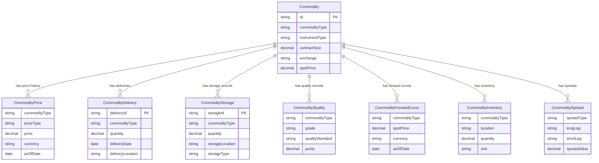

# 07.2 — Vahalla Wealth Data — Bank Data Specification — Commodities

| | |
|---|---|
| **Document** | Bank Data Specification — Commodities |
| **System** | Vahalla Wealth Management System |
| **Version** | 1.5 |
| **Classification** | Confidential |
| **Maintained By** | Vahalla System Team |

## Revision History

| Version | Date | Author | Changes |
|---|---|---|---|
| 1.0 | 2025-08-15 | Vahalla System Team | Initial draft — Commodity master entity with identification, contract specifications, quality & grade, trading details, dates, and pricing fields |
| 1.1 | 2025-10-28 | Vahalla System Team | Added delivery, storage, physical delivery details, settlement, counterparty, and margin & collateral sections; added Appendix A enum reference tables (CommodityType, InstrumentType, QualityStandard, StorageType) |
| 1.2 | 2025-12-20 | Vahalla System Team | Added market data, valuation, regulatory, master agreement, risk metrics (Greeks), option-specific, and swap-specific field sections; added sustainability & ESG, origin & provenance, transport & logistics, and insurance fields |
| 1.3 | 2026-01-25 | Vahalla System Team | Added Commodity Price, Commodity Delivery, Commodity Storage, Commodity Quality, Commodity Forward Curve, Commodity Inventory, and Commodity Spread supporting entities; added Entity Relationship diagram and Entity Summary table |
| 1.4 | 2026-02-05 | Vahalla System Team | Added PricingBasis, DeliveryType, SettlementMethod, SettlementCycle, ActionType, MasterAgreementType, OptionType, OptionStyle, PaymentFrequency, DayCountBasis, and BusinessDayConvention enum tables to Appendix A |
| 1.5 | 2026-02-12 | Vahalla System Team | Added sample data sections (JSON & CSV for WTI Crude Future and Gold Spot); added data quality requirements and delivery specifications; final field renumbering |

---

## 1. Purpose

This document defines the **data fields, formats, and standards** required from the bank for **Commodity instruments** within the Vahalla Wealth Management System.

It covers the following commodity categories and instrument types:

- **Precious Metals** — Gold, Silver, Platinum, Palladium, Rhodium
- **Base Metals** — Copper, Aluminum, Zinc, Nickel, Lead, Tin
- **Energy** — Crude Oil (WTI/Brent), Natural Gas, Heating Oil, Gasoline, Coal, Electricity
- **Agricultural (Grains)** — Wheat, Corn, Soybeans, Rice, Oats, Barley
- **Agricultural (Softs)** — Coffee, Sugar, Cocoa, Cotton, Orange Juice
- **Livestock** — Live Cattle, Feeder Cattle, Lean Hogs
- **Other** — Commodity ETFs, Commodity Indices, Freight, Emissions, Weather Derivatives

Instrument types include: **Spot**, **Future**, **Forward**, **Swap**, **Option**, **Spread**, **Physical**, **ETF**, and **ETC** (Exchange Traded Commodity).

Each entity is mapped to its **ISO 20022** message element where applicable.

---

## 2. Entity Relationship Overview



### Entity Summary

| Entity | Fields | Description |
|---|---|---|
| **Commodity** | 101 | Commodity master data (spot, futures, forwards, swaps, options, physical) |
| **Commodity Price** | 9 | Price snapshots (spot, futures, forward) |
| **Commodity Delivery** | 10 | Physical delivery records |
| **Commodity Storage** | 11 | Storage and warehousing records |
| **Commodity Quality** | 9 | Quality, grade, and certification records |
| **Commodity Forward Curve** | 6 + points | Forward curve with tenor points |
| **Commodity Forward Point** | 5 | Individual forward curve tenor points |
| **Commodity Inventory** | 9 | Warehouse inventory positions |
| **Commodity Spread** | 6 | Calendar, inter-commodity, and location spreads |

---

## 3. Data Standards & Conventions

### 3.1 Applicable ISO Standards

| Standard | Description | Usage |
|---|---|---|
| **ISO 6166** | ISIN — International Securities Identification Number | Primary identifier for listed commodity instruments (ETFs, ETCs) |
| **ISO 10383** | MIC — Market Identifier Code | Exchange identification |
| **ISO 17442** | LEI — Legal Entity Identifier | Counterparty, clearing house, producer, storage facility identification |
| **ISO 4217** | Currency Codes | All currency fields (3-letter codes) |
| **ISO 3166** | Country Codes | Country of origin, listing, counterparty |
| **ISO 8601** | Date/Time Format | All date and timestamp fields |
| **ISO 20022** | Financial Messaging | Field-level mapping to ISO 20022 message elements |
| **UN/CEFACT** | Commodity Codes | Commodity classification codes |
| **Incoterms 2020** | Trade Terms | Delivery and shipping terms (FOB, CIF, CFR, etc.) |

### 3.2 Data Type Definitions

| Data Type | Format | Example |
|---|---|---|
| `String` | UTF-8 text | `"WTI Crude Oil Jun-26 Future"` |
| `Decimal` | Numeric, dot separator, no thousands | `72.50` |
| `Date` | `YYYY-MM-DD` (ISO 8601) | `"2026-06-20"` |
| `DateTime` | `YYYY-MM-DDTHH:MM:SSZ` (ISO 8601 UTC) | `"2026-01-15T09:30:00Z"` |
| `Boolean` | `true` / `false` | `true` |
| `Enum` | UPPER_SNAKE_CASE constant | `"CRUDE_OIL"` |
| `Int` | Integer | `2026` |

### 3.3 Field Requirement Levels

| Level | Meaning |
|---|---|
| **Required** | Must always be provided. Null or empty values will cause record rejection. |
| **Conditional** | Required when a specific condition is met (noted in Description). |
| **Optional** | May be omitted. Improves data quality when provided. |

### 3.4 Delivery Format

Data may be delivered in **CSV** or **JSON** format. See [07.2.1 — CSV Sample Data](07.2.1-sample-data-csv-commodities.md) for formatting rules.

---

## 4. Common Identification Fields

> These fields appear on the **Commodity** entity as it implements the `Asset` interface.

| # | Field Name | Data Type | Required | Description | Example | ISO 20022 Reference |
|---|---|---|---|---|---|---|
| 1 | `id` | String | Required | Unique record identifier | `"CMD-001234"` | `FinInstrmId/OthrId/Id` |
| 2 | `isin` | String | Conditional | ISIN (12 chars). Required for ETFs/ETCs | `"XS1234567890"` | `FinInstrmId/ISIN` |
| 3 | `cusip` | String | Optional | CUSIP (9 chars) | `"037833100"` | `FinInstrmId/OthrId/Id` (CUSIP) |
| 4 | `sedol` | String | Optional | SEDOL (7 chars) | `"2046251"` | `FinInstrmId/OthrId/Id` (SEDOL) |
| 5 | `ticker` | String | Optional | Ticker symbol | `"CLM6"` | `FinInstrmId/OthrId/Id` (Ticker) |
| 6 | `name` | String | Required | Instrument name | `"WTI Crude Oil Jun-26 Future"` | `FinInstrmNm` |
| 7 | `assetClass` | Enum | Required | Always `COMMODITIES` | `"COMMODITIES"` | `ClssfctnTp/AsstClss` |
| 8 | `issuer` | String | Optional | Issuer / originator name | `"CME Group"` | `Issr` |
| 9 | `lei` | String | Optional | Legal Entity Identifier (20 chars) | `"SNZ2OJLFK8MNNCLQOF39"` | `Issr/LEI` |
| 10 | `fisn` | String | Optional | Financial Instrument Short Name (max 35 chars) | `"WTI/FUT/0626"` | `FinInstrmId/FISN` |
| 11 | `cfi` | String | Optional | Classification of Financial Instruments (6 chars) | `"JTXXXX"` | `FinInstrmId/CFI` |
| 12 | `currency` | String | Required | Primary currency per ISO 4217 | `"USD"` | `DnmtnCcy` |
| 13 | `country` | String | Optional | Country of listing or origin per ISO 3166 | `"US"` | `PlcOfListg/Ctry` |
| 14 | `description` | String | Optional | Free-text description | `"WTI Crude Oil future, Jun 2026 delivery, NYMEX"` | `FinInstrmDesc` |
| 15 | `documentUrl` | String | Optional | URL to contract specification or fact sheet | `"https://bank.com/docs/CMD001.pdf"` | `AddtlInf/URL` |
| 16 | `createdAt` | DateTime | Required | Record creation timestamp | `"2026-01-15T09:30:00Z"` | `CreDtTm` |
| 17 | `updatedAt` | DateTime | Required | Record last-update timestamp | `"2026-02-12T16:00:00Z"` | `UpdDtTm` |

---

## 5. Commodity Data Fields

> **Scope:** All commodity instruments — spot, futures, forwards, swaps, options, spreads, physical, ETFs, and ETCs. Field numbering restarts at 1 (common identification fields from [Section 4](#4-common-identification-fields) apply in addition).

### 5.1 Commodity Identification

| # | Field Name | Data Type | Required | Description | Allowed Values / Example | ISO 20022 Reference |
|---|---|---|---|---|---|---|
| 1 | `commodityType` | Enum | Required | Commodity type | See [Appendix A.1](#a1-commoditytype) | deriv.049 — `CmdtyTrad/CmdtyTp` |
| 2 | `instrumentType` | Enum | Required | Commodity instrument type | See [Appendix A.2](#a2-commodityinstrumenttype) | deriv.049 — `CmdtyTrad/InstrmTp` |
| 3 | `uniqueTransactionIdentifier` | String | Optional | Unique Transaction Identifier (UTI) | `"UTI-CMD-2026-001234"` | deriv.049 — `CmdtyTrad/UTI` |
| 4 | `uniqueProductIdentifier` | String | Optional | Unique Product Identifier (UPI) | `"UPI-CMD-2026-001234"` | deriv.049 — `CmdtyTrad/UPI` |
| 5 | `productTaxonomy` | String | Optional | Product taxonomy classification | `"Energy:Crude:WTI"` | deriv.049 — `CmdtyTrad/PdctTxnmy` |
| 6 | `commodityCode` | String | Optional | UN/CEFACT commodity code | `"270900"` | deriv.049 — `CmdtyTrad/CmdtyCd` |

### 5.2 Contract Specifications

| # | Field Name | Data Type | Required | Description | Example | ISO 20022 Reference |
|---|---|---|---|---|---|---|
| 7 | `contractSize` | Decimal | Required | Contract size | `1000.00` | deriv.049 — `CmdtyTrad/CtrctSpcfctns/CtrctSz` |
| 8 | `contractUnit` | String | Optional | Contract unit of measure | `"BARRELS"`, `"TROY_OUNCES"`, `"METRIC_TONS"`, `"BUSHELS"` | deriv.049 — `CmdtyTrad/CtrctSpcfctns/CtrctUnt` |
| 9 | `lotSize` | Decimal | Optional | Minimum lot size | `1.00` | deriv.049 — `CmdtyTrad/CtrctSpcfctns/LotSz` |
| 10 | `minimumTradingSize` | Decimal | Optional | Minimum trading size | `1.00` | deriv.049 — `CmdtyTrad/CtrctSpcfctns/MinTradgSz` |
| 11 | `tickSize` | Decimal | Optional | Minimum price increment | `0.01` | deriv.049 — `CmdtyTrad/CtrctSpcfctns/TckSz` |
| 12 | `tickValue` | Decimal | Optional | Value of one tick | `10.00` | deriv.049 — `CmdtyTrad/CtrctSpcfctns/TckVal` |
| 13 | `priceQuotation` | String | Optional | Price quotation basis | `"Per barrel"`, `"Per troy ounce"`, `"Per metric ton"` | deriv.049 — `CmdtyTrad/CtrctSpcfctns/PricQtn` |

### 5.3 Quality & Grade

| # | Field Name | Data Type | Required | Description | Allowed Values / Example | ISO 20022 Reference |
|---|---|---|---|---|---|---|
| 14 | `grade` | String | Optional | Commodity grade | `"WTI Light Sweet"`, `"Good Delivery"`, `"Grade A"` | deriv.049 — `CmdtyTrad/Qlty/Grd` |
| 15 | `quality` | String | Optional | Quality description | `"API gravity 37-42, sulfur max 0.42%"` | deriv.049 — `CmdtyTrad/Qlty/Qlty` |
| 16 | `qualityStandard` | Enum | Optional | Quality standard body | See [Appendix A.3](#a3-qualitystandard) | deriv.049 — `CmdtyTrad/Qlty/QltyStd` |
| 17 | `purity` | Decimal | Optional | Purity (%) — for metals | `99.99` | deriv.049 — `CmdtyTrad/Qlty/Prty` |
| 18 | `specifications` | String | Optional | Detailed specifications | `"LBMA Good Delivery 400oz bar"` | deriv.049 — `CmdtyTrad/Qlty/Spcfctns` |
| 19 | `certificationRequired` | Boolean | Optional | Whether certification is required | `true` | deriv.049 — `CmdtyTrad/Qlty/CrtfctnReqrd` |

### 5.4 Trading Details

| # | Field Name | Data Type | Required | Description | Allowed Values / Example | ISO 20022 Reference |
|---|---|---|---|---|---|---|
| 20 | `exchange` | String | Required | Exchange name | `"NYMEX"`, `"LME"`, `"ICE"`, `"COMEX"`, `"CBOT"` | deriv.049 — `CmdtyTrad/Xchg` |
| 21 | `mic` | String | Optional | Market Identifier Code per ISO 10383 (4 chars) | `"XNYM"` | deriv.049 — `CmdtyTrad/MktIdCd` |
| 22 | `tradingCurrency` | String | Optional | Trading currency per ISO 4217 | `"USD"` | deriv.049 — `CmdtyTrad/TradgCcy` |
| 23 | `tradingVenue` | String | Optional | Trading venue name | `"CME Globex"` | deriv.049 — `CmdtyTrad/TradgVn/Nm` |
| 24 | `tradingVenueLei` | String | Optional | Trading venue LEI | `"SNZ2OJLFK8MNNCLQOF39"` | deriv.049 — `CmdtyTrad/TradgVn/LEI` |
| 25 | `tradingHours` | String | Optional | Trading hours | `"18:00-17:00 ET (Sun-Fri)"` | deriv.049 — `CmdtyTrad/TradgHrs` |
| 26 | `tradingStatus` | Enum | Optional | Trading status | See [Appendix A.4](#a4-tradingstatus) | deriv.049 — `CmdtyTrad/TradgSts` |

### 5.5 Dates

| # | Field Name | Data Type | Required | Description | Example | ISO 20022 Reference |
|---|---|---|---|---|---|---|
| 27 | `tradeDate` | Date | Optional | Trade execution date | `"2026-01-15"` | deriv.049 — `CmdtyTrad/TradDt` |
| 28 | `valueDate` | Date | Optional | Value / settlement value date | `"2026-01-17"` | deriv.049 — `CmdtyTrad/ValDt` |
| 29 | `firstTradingDate` | Date | Optional | First trading date | `"2025-07-01"` | deriv.049 — `CmdtyTrad/FrstTradgDt` |
| 30 | `lastTradingDate` | Date | Optional | Last trading date | `"2026-05-20"` | deriv.049 — `CmdtyTrad/LastTradgDt` |
| 31 | `firstDeliveryDate` | Date | Optional | First delivery date | `"2026-06-01"` | deriv.049 — `CmdtyTrad/FrstDlvryDt` |
| 32 | `lastDeliveryDate` | Date | Optional | Last delivery date | `"2026-06-30"` | deriv.049 — `CmdtyTrad/LastDlvryDt` |
| 33 | `expirationDate` | Date | Optional | Contract expiration date | `"2026-05-20"` | deriv.049 — `CmdtyTrad/XprtnDt` |
| 34 | `maturityDate` | Date | Optional | Contract maturity date | `"2026-06-20"` | deriv.049 — `CmdtyTrad/MtrtyDt` |
| 35 | `deliveryMonth` | String | Optional | Delivery month code | `"Jun"`, `"M"` | deriv.049 — `CmdtyTrad/DlvryMnth` |
| 36 | `deliveryYear` | Int | Optional | Delivery year | `2026` | deriv.049 — `CmdtyTrad/DlvryYr` |

### 5.6 Pricing

| # | Field Name | Data Type | Required | Description | Allowed Values / Example | ISO 20022 Reference |
|---|---|---|---|---|---|---|
| 37 | `spotPrice` | Decimal | Optional | Spot price | `72.50` | deriv.049 — `CmdtyTrad/Pricg/SpotPric` |
| 38 | `futuresPrice` | Decimal | Optional | Futures price | `73.25` | deriv.049 — `CmdtyTrad/Pricg/FutrsPric` |
| 39 | `settlementPrice` | Decimal | Optional | Daily settlement price | `73.10` | deriv.049 — `CmdtyTrad/Pricg/SttlmPric` |
| 40 | `previousSettlementPrice` | Decimal | Optional | Previous day settlement price | `72.80` | deriv.049 — `CmdtyTrad/Pricg/PrvsSttlmPric` |
| 41 | `openPrice` | Decimal | Optional | Opening price | `72.60` | deriv.049 — `CmdtyTrad/Pricg/OpnPric` |
| 42 | `highPrice` | Decimal | Optional | Intraday high price | `73.50` | deriv.049 — `CmdtyTrad/Pricg/HghPric` |
| 43 | `lowPrice` | Decimal | Optional | Intraday low price | `72.30` | deriv.049 — `CmdtyTrad/Pricg/LwPric` |
| 44 | `closePrice` | Decimal | Optional | Closing price | `73.25` | deriv.049 — `CmdtyTrad/Pricg/ClsPric` |
| 45 | `pricingBasis` | Enum | Optional | Pricing basis | See [Appendix A.5](#a5-pricingbasis) | deriv.049 — `CmdtyTrad/Pricg/PricgBsis` |
| 46 | `benchmarkPrice` | Decimal | Optional | Benchmark reference price | `72.50` | deriv.049 — `CmdtyTrad/Pricg/BnchmrkPric` |
| 47 | `benchmarkSource` | String | Optional | Benchmark price source | `"Platts"`, `"Argus"`, `"ICE"`, `"LME"` | deriv.049 — `CmdtyTrad/Pricg/BnchmrkSrc` |

### 5.7 Delivery

| # | Field Name | Data Type | Required | Description | Allowed Values / Example | ISO 20022 Reference |
|---|---|---|---|---|---|---|
| 48 | `deliveryType` | Enum | Required | Delivery type | See [Appendix A.6](#a6-deliverytype) | deriv.049 — `CmdtyTrad/Dlvry/DlvryTp` |
| 49 | `deliveryLocation` | String | Optional | Primary delivery location | `"Cushing, Oklahoma"` | deriv.049 — `CmdtyTrad/Dlvry/DlvryLctn` |
| 50 | `deliveryPoint` | String | Optional | Delivery point | `"Henry Hub"` | deriv.049 — `CmdtyTrad/Dlvry/DlvryPt` |
| 51 | `deliveryHub` | String | Optional | Delivery hub | `"NYMEX Cushing Hub"` | deriv.049 — `CmdtyTrad/Dlvry/DlvryHub` |
| 52 | `alternativeDeliveryLocations` | String | Optional | Alternative delivery locations (comma-separated) | `"Midland, TX; Houston, TX"` | deriv.049 — `CmdtyTrad/Dlvry/AltDlvryLctns` |

### 5.8 Storage

| # | Field Name | Data Type | Required | Description | Allowed Values / Example | ISO 20022 Reference |
|---|---|---|---|---|---|---|
| 53 | `storageType` | Enum | Optional | Storage type | See [Appendix A.7](#a7-storagetype) | deriv.049 — `CmdtyTrad/Strg/StrgTp` |
| 54 | `storageLocation` | String | Optional | Storage location | `"London, UK"` | deriv.049 — `CmdtyTrad/Strg/StrgLctn` |
| 55 | `storageFacility` | String | Optional | Storage facility name | `"HSBC Vault, London"` | deriv.049 — `CmdtyTrad/Strg/StrgFclty` |
| 56 | `storageFacilityLei` | String | Optional | Storage facility LEI | `"MP6I5ZYZBEU3UXPYFY54"` | deriv.049 — `CmdtyTrad/Strg/StrgFcltyLEI` |
| 57 | `warehouseReceipt` | String | Optional | Warehouse receipt number | `"WR-LBMA-2026-001234"` | deriv.049 — `CmdtyTrad/Strg/WhsRcpt` |

### 5.9 Physical Delivery Details

| # | Field Name | Data Type | Required | Description | Example | ISO 20022 Reference |
|---|---|---|---|---|---|---|
| 58 | `packagingType` | String | Optional | Packaging type | `"400oz bar"`, `"1kg bar"`, `"Drum"` | deriv.049 — `CmdtyTrad/PhysDlvry/PckgTp` |
| 59 | `weightUnit` | String | Optional | Weight unit of measure | `"KG"`, `"MT"`, `"LBS"`, `"TROY_OZ"` | deriv.049 — `CmdtyTrad/PhysDlvry/WghtUnt` |
| 60 | `volumeUnit` | String | Optional | Volume unit of measure | `"BBL"`, `"GAL"`, `"M3"` | deriv.049 — `CmdtyTrad/PhysDlvry/VolUnt` |
| 61 | `minimumDeliveryQuantity` | Decimal | Optional | Minimum delivery quantity | `100.00` | deriv.049 — `CmdtyTrad/PhysDlvry/MinDlvryQty` |
| 62 | `maximumDeliveryQuantity` | Decimal | Optional | Maximum delivery quantity | `10000.00` | deriv.049 — `CmdtyTrad/PhysDlvry/MaxDlvryQty` |
| 63 | `deliveryTolerance` | Decimal | Optional | Delivery tolerance (%) | `5.00` | deriv.049 — `CmdtyTrad/PhysDlvry/DlvryTlrnc` |

### 5.10 Settlement

| # | Field Name | Data Type | Required | Description | Allowed Values / Example | ISO 20022 Reference |
|---|---|---|---|---|---|---|
| 64 | `settlementType` | Enum | Optional | Settlement type | See [Appendix A.8](#a8-settlementtype) | deriv.049 — `CmdtyTrad/Sttlm/SttlmTp` |
| 65 | `settlementDate` | Date | Optional | Settlement date | `"2026-06-22"` | deriv.049 — `CmdtyTrad/Sttlm/SttlmDt` |
| 66 | `settlementCurrency` | String | Optional | Settlement currency per ISO 4217 | `"USD"` | deriv.049 — `CmdtyTrad/Sttlm/SttlmCcy` |
| 67 | `settlementMethod` | Enum | Optional | Settlement method | See [Appendix A.9](#a9-settlementmethod) | deriv.049 — `CmdtyTrad/Sttlm/SttlmMtd` |
| 68 | `settlementCycle` | Enum | Optional | Settlement cycle | See [Appendix A.10](#a10-settlementcycle) | deriv.049 — `CmdtyTrad/Sttlm/SttlmCycl` |

### 5.11 Counterparty

| # | Field Name | Data Type | Required | Description | Example | ISO 20022 Reference |
|---|---|---|---|---|---|---|
| 69 | `counterparty` | String | Optional | Counterparty name | `"Glencore International AG"` | deriv.049 — `CmdtyTrad/CtrPty/Nm` |
| 70 | `counterpartyLei` | String | Optional | Counterparty LEI (20 chars) | `"2138001WOGIIXT8SV678"` | deriv.049 — `CmdtyTrad/CtrPty/LEI` |
| 71 | `broker` | String | Optional | Broker name | `"Goldman Sachs"` | deriv.049 — `CmdtyTrad/Brkr/Nm` |
| 72 | `brokerLei` | String | Optional | Broker LEI | `"784F5XWPLTWKTBV3E584"` | deriv.049 — `CmdtyTrad/Brkr/LEI` |
| 73 | `clearingHouse` | String | Optional | Clearing house name | `"CME Clearing"` | deriv.049 — `CmdtyTrad/ClrgHs/Nm` |
| 74 | `clearingHouseLei` | String | Optional | Clearing house LEI | `"SNZ2OJLFK8MNNCLQOF39"` | deriv.049 — `CmdtyTrad/ClrgHs/LEI` |

### 5.12 Margin & Collateral

| # | Field Name | Data Type | Required | Description | Example | ISO 20022 Reference |
|---|---|---|---|---|---|---|
| 75 | `initialMargin` | Decimal | Optional | Initial margin per contract | `6000.00` | deriv.049 — `CmdtyTrad/Mrgn/InitlMrgn` |
| 76 | `maintenanceMargin` | Decimal | Optional | Maintenance margin per contract | `5400.00` | deriv.049 — `CmdtyTrad/Mrgn/MntncMrgn` |
| 77 | `variationMargin` | Decimal | Optional | Variation margin | `300.00` | deriv.049 — `CmdtyTrad/Mrgn/VartnMrgn` |
| 78 | `marginCurrency` | String | Optional | Margin currency per ISO 4217 | `"USD"` | deriv.049 — `CmdtyTrad/Mrgn/MrgnCcy` |

### 5.13 Market Data

| # | Field Name | Data Type | Required | Description | Example | ISO 20022 Reference |
|---|---|---|---|---|---|---|
| 79 | `openInterest` | Decimal | Optional | Open interest (outstanding contracts) | `350000.00` | deriv.049 — `CmdtyTrad/MktData/OpnIntrst` |
| 80 | `volume` | Decimal | Optional | Trading volume | `125000.00` | deriv.049 — `CmdtyTrad/MktData/Vol` |
| 81 | `tradingVolumeUnit` | String | Optional | Volume unit | `"CONTRACTS"`, `"BARRELS"`, `"LOTS"` | deriv.049 — `CmdtyTrad/MktData/VolUnt` |
| 82 | `numberOfTrades` | Int | Optional | Number of trades | `35000` | deriv.049 — `CmdtyTrad/MktData/NbOfTrads` |
| 83 | `volumeWeightedAveragePrice` | Decimal | Optional | VWAP | `73.05` | deriv.049 — `CmdtyTrad/MktData/VWAP` |

### 5.14 Valuation

| # | Field Name | Data Type | Required | Description | Allowed Values / Example | ISO 20022 Reference |
|---|---|---|---|---|---|---|
| 84 | `marketValue` | Decimal | Optional | Current market value | `73250.00` | deriv.049 — `CmdtyTrad/Valtn/MktVal` |
| 85 | `notionalValue` | Decimal | Optional | Notional value | `73250.00` | deriv.049 — `CmdtyTrad/Valtn/NtnlVal` |
| 86 | `valuationDate` | Date | Optional | Valuation date | `"2026-02-12"` | deriv.049 — `CmdtyTrad/Valtn/ValtnDt` |
| 87 | `valuationCurrency` | String | Optional | Valuation currency per ISO 4217 | `"USD"` | deriv.049 — `CmdtyTrad/Valtn/ValtnCcy` |
| 88 | `valuationMethod` | Enum | Optional | Valuation method | See [Appendix A.11](#a11-valuationmethod) | deriv.049 — `CmdtyTrad/Valtn/ValtnMtd` |

### 5.15 Regulatory

| # | Field Name | Data Type | Required | Description | Allowed Values / Example | ISO 20022 Reference |
|---|---|---|---|---|---|---|
| 89 | `reportingJurisdiction` | String | Optional | Reporting jurisdiction | `"EU"`, `"US"`, `"UK"` | deriv.049 — `CmdtyTrad/Rgltry/RptgJrsdctn` |
| 90 | `regulatoryReportingRequired` | Boolean | Optional | Whether regulatory reporting is required | `true` | deriv.049 — `CmdtyTrad/Rgltry/RgltryRptgReqrd` |
| 91 | `tradeRepository` | String | Optional | Trade repository name | `"DTCC GTR"` | deriv.049 — `CmdtyTrad/Rgltry/TradRpstry` |
| 92 | `tradeRepositoryLei` | String | Optional | Trade repository LEI | `"549300JJHZ1QQKBQ5S07"` | deriv.049 — `CmdtyTrad/Rgltry/TradRpstryLEI` |
| 93 | `reportingTimestamp` | DateTime | Optional | Regulatory reporting timestamp | `"2026-01-15T10:00:00Z"` | deriv.049 — `CmdtyTrad/Rgltry/RptgTmStmp` |
| 94 | `actionType` | Enum | Optional | Regulatory action type | See [Appendix A.12](#a12-actiontype) | deriv.049 — `CmdtyTrad/Rgltry/ActnTp` |

### 5.16 Master Agreement

| # | Field Name | Data Type | Required | Description | Allowed Values / Example | ISO 20022 Reference |
|---|---|---|---|---|---|---|
| 95 | `masterAgreementType` | Enum | Optional | Master agreement type | See [Appendix A.13](#a13-masteragreementtype) | deriv.049 — `CmdtyTrad/CtrctDtls/MstrAgrmntTp` |
| 96 | `masterAgreementVersion` | String | Optional | Master agreement version | `"2002"` | deriv.049 — `CmdtyTrad/CtrctDtls/MstrAgrmntVrsn` |

### 5.17 Risk Metrics (Options)

| # | Field Name | Data Type | Required | Description | Example | ISO 20022 Reference |
|---|---|---|---|---|---|---|
| 97 | `delta` | Decimal | Optional | Delta — sensitivity to underlying price | `0.45` | deriv.049 — `CmdtyTrad/Grks/Dlt` |
| 98 | `gamma` | Decimal | Optional | Gamma — rate of change of delta | `0.02` | deriv.049 — `CmdtyTrad/Grks/Gmm` |
| 99 | `vega` | Decimal | Optional | Vega — sensitivity to volatility | `0.12` | deriv.049 — `CmdtyTrad/Grks/Vg` |
| 100 | `theta` | Decimal | Optional | Theta — time decay per day | `-0.04` | deriv.049 — `CmdtyTrad/Grks/Tht` |

### 5.18 Option-Specific Fields

| # | Field Name | Data Type | Required | Description | Allowed Values / Example | ISO 20022 Reference |
|---|---|---|---|---|---|---|
| 101 | `optionType` | Enum | Conditional | Option type. Required when `instrumentType` = `OPTION` | See [Appendix A.14](#a14-optiontype) | deriv.049 — `CmdtyTrad/Optn/OptnTp` |
| 102 | `optionStyle` | Enum | Conditional | Option exercise style. Required when `instrumentType` = `OPTION` | See [Appendix A.15](#a15-optionstyle) | deriv.049 — `CmdtyTrad/Optn/OptnStyl` |
| 103 | `strikePrice` | Decimal | Conditional | Strike price. Required when `instrumentType` = `OPTION` | `75.00` | deriv.049 — `CmdtyTrad/Optn/StrkPric` |
| 104 | `premium` | Decimal | Optional | Option premium | `2.50` | deriv.049 — `CmdtyTrad/Optn/Prmm` |
| 105 | `premiumCurrency` | String | Optional | Premium currency per ISO 4217 | `"USD"` | deriv.049 — `CmdtyTrad/Optn/PrmmCcy` |

### 5.19 Swap-Specific Fields

| # | Field Name | Data Type | Required | Description | Allowed Values / Example | ISO 20022 Reference |
|---|---|---|---|---|---|---|
| 106 | `swapType` | String | Conditional | Swap type. Required when `instrumentType` = `SWAP` | `"COMMODITY_SWAP"`, `"BASIS_SWAP"` | deriv.049 — `CmdtyTrad/Swp/SwpTp` |
| 107 | `fixedPrice` | Decimal | Optional | Fixed price leg | `72.00` | deriv.049 — `CmdtyTrad/Swp/FxdPric` |
| 108 | `floatingPriceIndex` | String | Optional | Floating price index | `"Platts CIF NWE"`, `"ICE Brent 1st Line"` | deriv.049 — `CmdtyTrad/Swp/FltgPricIdx` |
| 109 | `paymentFrequency` | Enum | Optional | Payment frequency | See [Appendix A.16](#a16-paymentfrequency) | deriv.049 — `CmdtyTrad/Swp/PmtFrqcy` |

### 5.20 Additional Details

| # | Field Name | Data Type | Required | Description | Allowed Values / Example | ISO 20022 Reference |
|---|---|---|---|---|---|---|
| 110 | `dayCountBasis` | Enum | Optional | Day count convention | See [Appendix A.17](#a17-daycountbasis) | deriv.049 — `CmdtyTrad/AddtlDtls/DayCntBsis` |
| 111 | `businessDayConvention` | Enum | Optional | Business day convention | See [Appendix A.18](#a18-businessdayconvention) | deriv.049 — `CmdtyTrad/AddtlDtls/BizDayCnvtn` |
| 112 | `pricingCalendar` | String | Optional | Pricing calendar | `"NYMEX"`, `"LME"`, `"ICE"` | deriv.049 — `CmdtyTrad/AddtlDtls/PricgClndr` |
| 113 | `deliveryCalendar` | String | Optional | Delivery calendar | `"NYMEX"`, `"LME"` | deriv.049 — `CmdtyTrad/AddtlDtls/DlvryClndr` |

### 5.21 Sustainability & ESG

| # | Field Name | Data Type | Required | Description | Example | ISO 20022 Reference |
|---|---|---|---|---|---|---|
| 114 | `sustainabilityCertification` | String | Optional | Sustainability certification | `"RSPO"`, `"Rainforest Alliance"`, `"FSC"` | deriv.049 — `CmdtyTrad/ESG/SstnbltyCrtfctn` |
| 115 | `carbonFootprint` | Decimal | Optional | Carbon footprint (tonnes CO₂e) | `2.50` | deriv.049 — `CmdtyTrad/ESG/CrbnFtprnt` |
| 116 | `esgCompliant` | Boolean | Optional | ESG compliant | `true` | deriv.049 — `CmdtyTrad/ESG/ESGCmplnt` |
| 117 | `organicCertified` | Boolean | Optional | Organic certified (agricultural) | `false` | deriv.049 — `CmdtyTrad/ESG/OrgnCrtfd` |
| 118 | `fairTradeCertified` | Boolean | Optional | Fair trade certified | `false` | deriv.049 — `CmdtyTrad/ESG/FrTradCrtfd` |

### 5.22 Origin & Provenance

| # | Field Name | Data Type | Required | Description | Example | ISO 20022 Reference |
|---|---|---|---|---|---|---|
| 119 | `countryOfOrigin` | String | Optional | Country of origin per ISO 3166 | `"US"` | deriv.049 — `CmdtyTrad/Orgn/CtryOfOrgn` |
| 120 | `regionOfOrigin` | String | Optional | Region of origin | `"Permian Basin"`, `"West Africa"` | deriv.049 — `CmdtyTrad/Orgn/RgnOfOrgn` |
| 121 | `producer` | String | Optional | Producer name | `"ExxonMobil"` | deriv.049 — `CmdtyTrad/Orgn/Prdcr/Nm` |
| 122 | `producerLei` | String | Optional | Producer LEI | `"J3F5HOCMD8DP1ZCMRZ44"` | deriv.049 — `CmdtyTrad/Orgn/Prdcr/LEI` |
| 123 | `mineOrField` | String | Optional | Mine or field name | `"Spraberry/Wolfcamp"` | deriv.049 — `CmdtyTrad/Orgn/MnOrFld` |
| 124 | `harvestYear` | Int | Optional | Harvest year (agricultural) | `2025` | deriv.049 — `CmdtyTrad/Orgn/HrvstYr` |

### 5.23 Transport & Logistics

| # | Field Name | Data Type | Required | Description | Example | ISO 20022 Reference |
|---|---|---|---|---|---|---|
| 125 | `incoterms` | String | Optional | Incoterms 2020 delivery term | `"FOB"`, `"CIF"`, `"CFR"`, `"DDP"`, `"EXW"` | deriv.049 — `CmdtyTrad/Trnsprt/Inctrms` |
| 126 | `shippingTerms` | String | Optional | Shipping terms | `"FOB Cushing"` | deriv.049 — `CmdtyTrad/Trnsprt/ShpgTrms` |
| 127 | `transportMethod` | String | Optional | Transport method | `"PIPELINE"`, `"TANKER"`, `"RAIL"`, `"TRUCK"` | deriv.049 — `CmdtyTrad/Trnsprt/TrnsprtMtd` |
| 128 | `loadingPort` | String | Optional | Loading port | `"Houston, TX"` | deriv.049 — `CmdtyTrad/Trnsprt/LdgPrt` |
| 129 | `dischargePort` | String | Optional | Discharge port | `"Rotterdam, NL"` | deriv.049 — `CmdtyTrad/Trnsprt/DschrgPrt` |

### 5.24 Insurance

| # | Field Name | Data Type | Required | Description | Example | ISO 20022 Reference |
|---|---|---|---|---|---|---|
| 130 | `insuranceRequired` | Boolean | Optional | Whether insurance is required | `true` | deriv.049 — `CmdtyTrad/Insrnc/InsrncReqrd` |
| 131 | `insuranceProvider` | String | Optional | Insurance provider | `"Lloyd's of London"` | deriv.049 — `CmdtyTrad/Insrnc/InsrncPrvdr` |
| 132 | `insuranceAmount` | Decimal | Optional | Insurance coverage amount | `5000000.00` | deriv.049 — `CmdtyTrad/Insrnc/InsrncAmt` |
| 133 | `insuranceCurrency` | String | Optional | Insurance currency per ISO 4217 | `"USD"` | deriv.049 — `CmdtyTrad/Insrnc/InsrncCcy` |

---

## 6. Commodity Price

> **Source:** Price snapshots for commodities (spot, futures, forward). One row per price observation.

| # | Field Name | Data Type | Required | Description | Allowed Values / Example | ISO 20022 Reference |
|---|---|---|---|---|---|---|
| 1 | `commodityType` | Enum | Required | Commodity type | See [Appendix A.1](#a1-commoditytype) | deriv.049 — `CmdtyPric/CmdtyTp` |
| 2 | `priceType` | String | Required | Price type | `"SPOT"`, `"FUTURES"`, `"FORWARD"` | deriv.049 — `CmdtyPric/PricTp` |
| 3 | `price` | Decimal | Required | Price value | `73.25` | deriv.049 — `CmdtyPric/Pric` |
| 4 | `currency` | String | Required | Price currency per ISO 4217 | `"USD"` | deriv.049 — `CmdtyPric/Ccy` |
| 5 | `unit` | String | Required | Unit of measure | `"BBL"`, `"TROY_OZ"`, `"MT"` | deriv.049 — `CmdtyPric/Unt` |
| 6 | `asOfDate` | Date | Required | Price date | `"2026-02-12"` | deriv.049 — `CmdtyPric/AsOfDt` |
| 7 | `asOfTime` | DateTime | Optional | Price timestamp | `"2026-02-12T16:00:00Z"` | deriv.049 — `CmdtyPric/AsOfTm` |
| 8 | `exchange` | String | Optional | Exchange source | `"NYMEX"`, `"LME"`, `"ICE"` | deriv.049 — `CmdtyPric/Xchg` |
| 9 | `source` | String | Optional | Price source | `"Platts"`, `"Argus"`, `"Bloomberg"` | deriv.049 — `CmdtyPric/Src` |

---

## 7. Commodity Delivery

> **Source:** Physical delivery records. One row per delivery event.

| # | Field Name | Data Type | Required | Description | Allowed Values / Example | ISO 20022 Reference |
|---|---|---|---|---|---|---|
| 1 | `deliveryId` | String | Required | Unique delivery identifier | `"DLV-CMD-2026-001234"` | deriv.049 — `CmdtyDlvry/DlvryId` |
| 2 | `commodityType` | Enum | Required | Commodity type | See [Appendix A.1](#a1-commoditytype) | deriv.049 — `CmdtyDlvry/CmdtyTp` |
| 3 | `quantity` | Decimal | Required | Delivery quantity | `1000.00` | deriv.049 — `CmdtyDlvry/Qty` |
| 4 | `unit` | String | Required | Unit of measure | `"BBL"`, `"TROY_OZ"`, `"MT"` | deriv.049 — `CmdtyDlvry/Unt` |
| 5 | `deliveryDate` | Date | Required | Delivery date | `"2026-06-15"` | deriv.049 — `CmdtyDlvry/DlvryDt` |
| 6 | `deliveryLocation` | String | Required | Delivery location | `"Cushing, Oklahoma"` | deriv.049 — `CmdtyDlvry/DlvryLctn` |
| 7 | `deliveryType` | Enum | Required | Delivery type | See [Appendix A.6](#a6-deliverytype) | deriv.049 — `CmdtyDlvry/DlvryTp` |
| 8 | `grade` | String | Optional | Commodity grade | `"WTI Light Sweet"` | deriv.049 — `CmdtyDlvry/Grd` |
| 9 | `quality` | String | Optional | Quality description | `"API 39.6, Sulfur 0.24%"` | deriv.049 — `CmdtyDlvry/Qlty` |
| 10 | `warehouseReceipt` | String | Optional | Warehouse receipt number | `"WR-NYMEX-2026-001234"` | deriv.049 — `CmdtyDlvry/WhsRcpt` |
| 11 | `status` | String | Optional | Delivery status | `"SCHEDULED"`, `"IN_TRANSIT"`, `"DELIVERED"` | deriv.049 — `CmdtyDlvry/Sts` |

---

## 8. Commodity Storage

> **Source:** Storage and warehousing records. One row per storage record.

| # | Field Name | Data Type | Required | Description | Allowed Values / Example | ISO 20022 Reference |
|---|---|---|---|---|---|---|
| 1 | `storageId` | String | Required | Unique storage record identifier | `"STR-CMD-2026-001234"` | deriv.049 — `CmdtyStrg/StrgId` |
| 2 | `commodityType` | Enum | Required | Commodity type | See [Appendix A.1](#a1-commoditytype) | deriv.049 — `CmdtyStrg/CmdtyTp` |
| 3 | `quantity` | Decimal | Required | Stored quantity | `5000.00` | deriv.049 — `CmdtyStrg/Qty` |
| 4 | `unit` | String | Required | Unit of measure | `"TROY_OZ"`, `"BBL"`, `"MT"` | deriv.049 — `CmdtyStrg/Unt` |
| 5 | `storageLocation` | String | Required | Storage location | `"London, UK"` | deriv.049 — `CmdtyStrg/StrgLctn` |
| 6 | `storageFacility` | String | Required | Storage facility name | `"HSBC Vault, London"` | deriv.049 — `CmdtyStrg/StrgFclty` |
| 7 | `storageType` | Enum | Required | Storage type | See [Appendix A.7](#a7-storagetype) | deriv.049 — `CmdtyStrg/StrgTp` |
| 8 | `storageStartDate` | Date | Required | Storage start date | `"2026-01-15"` | deriv.049 — `CmdtyStrg/StrgStrtDt` |
| 9 | `storageEndDate` | Date | Optional | Storage end date | `"2026-06-15"` | deriv.049 — `CmdtyStrg/StrgEndDt` |
| 10 | `storageCost` | Decimal | Optional | Storage cost | `500.00` | deriv.049 — `CmdtyStrg/StrgCst` |
| 11 | `storageCurrency` | String | Optional | Storage cost currency per ISO 4217 | `"USD"` | deriv.049 — `CmdtyStrg/StrgCcy` |

---

## 9. Commodity Quality

> **Source:** Quality, grade, and certification records. One row per quality assessment.

| # | Field Name | Data Type | Required | Description | Allowed Values / Example | ISO 20022 Reference |
|---|---|---|---|---|---|---|
| 1 | `commodityType` | Enum | Required | Commodity type | See [Appendix A.1](#a1-commoditytype) | deriv.049 — `CmdtyQlty/CmdtyTp` |
| 2 | `grade` | String | Required | Commodity grade | `"Good Delivery"` | deriv.049 — `CmdtyQlty/Grd` |
| 3 | `qualityStandard` | Enum | Required | Quality standard body | See [Appendix A.3](#a3-qualitystandard) | deriv.049 — `CmdtyQlty/QltyStd` |
| 4 | `purity` | Decimal | Optional | Purity (%) | `99.99` | deriv.049 — `CmdtyQlty/Prty` |
| 5 | `specifications` | String | Optional | Detailed specifications (JSON or text) | `"LBMA Good Delivery 400oz bar"` | deriv.049 — `CmdtyQlty/Spcfctns` |
| 6 | `certificationNumber` | String | Optional | Certification number | `"LBMA-2026-GD-001234"` | deriv.049 — `CmdtyQlty/CrtfctnNb` |
| 7 | `certificationDate` | Date | Optional | Certification date | `"2026-01-10"` | deriv.049 — `CmdtyQlty/CrtfctnDt` |
| 8 | `certifiedBy` | String | Optional | Certifying body | `"LBMA"` | deriv.049 — `CmdtyQlty/CrtfdBy` |
| 9 | `testResults` | String | Optional | Test results (JSON or text) | `"Assay: 99.99%, Weight: 400.125 oz"` | deriv.049 — `CmdtyQlty/TstRslts` |

---

## 10. Commodity Forward Curve

> **Source:** Forward curve data with tenor points. One row per curve snapshot; points are nested.

| # | Field Name | Data Type | Required | Description | Allowed Values / Example | ISO 20022 Reference |
|---|---|---|---|---|---|---|
| 1 | `commodityType` | Enum | Required | Commodity type | See [Appendix A.1](#a1-commoditytype) | deriv.049 — `CmdtyFwdCrv/CmdtyTp` |
| 2 | `spotPrice` | Decimal | Required | Current spot price | `72.50` | deriv.049 — `CmdtyFwdCrv/SpotPric` |
| 3 | `currency` | String | Required | Currency per ISO 4217 | `"USD"` | deriv.049 — `CmdtyFwdCrv/Ccy` |
| 4 | `unit` | String | Required | Unit of measure | `"BBL"` | deriv.049 — `CmdtyFwdCrv/Unt` |
| 5 | `asOfDate` | Date | Required | Curve date | `"2026-02-12"` | deriv.049 — `CmdtyFwdCrv/AsOfDt` |

### 10.1 Forward Curve Points

> One row per tenor point within a forward curve.

| # | Field Name | Data Type | Required | Description | Example | ISO 20022 Reference |
|---|---|---|---|---|---|---|
| 1 | `tenor` | String | Required | Tenor period | `"1M"`, `"3M"`, `"6M"`, `"1Y"`, `"2Y"` | deriv.049 — `CmdtyFwdPt/Tnr` |
| 2 | `deliveryDate` | Date | Required | Delivery date for this tenor | `"2026-03-15"` | deriv.049 — `CmdtyFwdPt/DlvryDt` |
| 3 | `forwardPrice` | Decimal | Required | Forward price | `73.25` | deriv.049 — `CmdtyFwdPt/FwdPric` |
| 4 | `contango` | Decimal | Optional | Contango (forward − spot) | `0.75` | deriv.049 — `CmdtyFwdPt/Cntng` |
| 5 | `backwardation` | Decimal | Optional | Backwardation (spot − forward) | `0.00` | deriv.049 — `CmdtyFwdPt/Bckwrdtn` |

---

## 11. Commodity Inventory

> **Source:** Warehouse inventory positions. One row per location/grade combination.

| # | Field Name | Data Type | Required | Description | Allowed Values / Example | ISO 20022 Reference |
|---|---|---|---|---|---|---|
| 1 | `commodityType` | Enum | Required | Commodity type | See [Appendix A.1](#a1-commoditytype) | deriv.049 — `CmdtyInvntry/CmdtyTp` |
| 2 | `location` | String | Required | Warehouse location | `"London, UK"`, `"Cushing, OK"` | deriv.049 — `CmdtyInvntry/Lctn` |
| 3 | `quantity` | Decimal | Required | Inventory quantity | `25000.00` | deriv.049 — `CmdtyInvntry/Qty` |
| 4 | `unit` | String | Required | Unit of measure | `"TROY_OZ"`, `"BBL"`, `"MT"` | deriv.049 — `CmdtyInvntry/Unt` |
| 5 | `grade` | String | Optional | Commodity grade | `"Good Delivery"` | deriv.049 — `CmdtyInvntry/Grd` |
| 6 | `owner` | String | Optional | Owner name | `"Vahalla Wealth Fund"` | deriv.049 — `CmdtyInvntry/Ownr/Nm` |
| 7 | `ownerLei` | String | Optional | Owner LEI | `"549300EXAMPLE000001"` | deriv.049 — `CmdtyInvntry/Ownr/LEI` |
| 8 | `lastUpdated` | DateTime | Required | Last update timestamp | `"2026-02-12T16:00:00Z"` | deriv.049 — `CmdtyInvntry/LastUpdtd` |
| 9 | `warehouseReceipts` | String | Optional | Warehouse receipt numbers (comma-separated) | `"WR-001, WR-002, WR-003"` | deriv.049 — `CmdtyInvntry/WhsRcpts` |

---

## 12. Commodity Spread

> **Source:** Spread data — calendar spreads, inter-commodity spreads, location spreads. One row per spread.

| # | Field Name | Data Type | Required | Description | Allowed Values / Example | ISO 20022 Reference |
|---|---|---|---|---|---|---|
| 1 | `spreadType` | String | Required | Spread type | `"CALENDAR"`, `"INTER_COMMODITY"`, `"LOCATION"` | deriv.049 — `CmdtySprd/SprdTp` |
| 2 | `longLeg` | String | Required | Long leg identifier | `"CLM6"` (WTI Jun-26) | deriv.049 — `CmdtySprd/LngLg` |
| 3 | `shortLeg` | String | Required | Short leg identifier | `"CLN6"` (WTI Jul-26) | deriv.049 — `CmdtySprd/ShrtLg` |
| 4 | `spreadValue` | Decimal | Required | Spread value | `-0.50` | deriv.049 — `CmdtySprd/SprdVal` |
| 5 | `spreadCurrency` | String | Optional | Spread currency per ISO 4217 | `"USD"` | deriv.049 — `CmdtySprd/SprdCcy` |
| 6 | `asOfDate` | Date | Required | Spread date | `"2026-02-12"` | deriv.049 — `CmdtySprd/AsOfDt` |

---

## 13. Sample Data

### 13.1 WTI Crude Oil Future Example (JSON)

```json
{
  "id": "CMD-001234",
  "ticker": "CLM6",
  "name": "WTI Crude Oil Jun-26 Future",
  "assetClass": "COMMODITIES",
  "issuer": "CME Group",
  "lei": "SNZ2OJLFK8MNNCLQOF39",
  "currency": "USD",
  "country": "US",
  "description": "WTI Crude Oil future, Jun 2026 delivery, NYMEX",
  "createdAt": "2026-01-15T09:30:00Z",
  "updatedAt": "2026-02-12T16:00:00Z",
  "commodityType": "WTI_OIL",
  "instrumentType": "FUTURE",
  "uniqueProductIdentifier": "UPI-CMD-2026-001234",
  "productTaxonomy": "Energy:Crude:WTI",
  "commodityCode": "270900",
  "contractSize": 1000.00,
  "contractUnit": "BARRELS",
  "lotSize": 1.00,
  "tickSize": 0.01,
  "tickValue": 10.00,
  "priceQuotation": "Per barrel",
  "grade": "WTI Light Sweet",
  "quality": "API gravity 37-42, sulfur max 0.42%",
  "qualityStandard": "NYMEX",
  "exchange": "NYMEX",
  "mic": "XNYM",
  "tradingCurrency": "USD",
  "tradingVenue": "CME Globex",
  "tradingHours": "18:00-17:00 ET (Sun-Fri)",
  "tradingStatus": "ACTIVE",
  "tradeDate": "2026-01-15",
  "firstTradingDate": "2025-07-01",
  "lastTradingDate": "2026-05-20",
  "firstDeliveryDate": "2026-06-01",
  "lastDeliveryDate": "2026-06-30",
  "expirationDate": "2026-05-20",
  "deliveryMonth": "Jun",
  "deliveryYear": 2026,
  "spotPrice": 72.50,
  "futuresPrice": 73.25,
  "settlementPrice": 73.10,
  "previousSettlementPrice": 72.80,
  "openPrice": 72.60,
  "highPrice": 73.50,
  "lowPrice": 72.30,
  "closePrice": 73.25,
  "pricingBasis": "FUTURES",
  "deliveryType": "PHYSICAL",
  "deliveryLocation": "Cushing, Oklahoma",
  "deliveryPoint": "Cushing Hub",
  "settlementType": "PHYSICAL",
  "settlementCurrency": "USD",
  "initialMargin": 6000.00,
  "maintenanceMargin": 5400.00,
  "marginCurrency": "USD",
  "openInterest": 350000.00,
  "volume": 125000.00,
  "tradingVolumeUnit": "CONTRACTS",
  "numberOfTrades": 35000,
  "volumeWeightedAveragePrice": 73.05,
  "marketValue": 73250.00,
  "valuationDate": "2026-02-12",
  "valuationMethod": "MARK_TO_MARKET",
  "reportingJurisdiction": "US",
  "regulatoryReportingRequired": true,
  "actionType": "NEW",
  "countryOfOrigin": "US",
  "regionOfOrigin": "Permian Basin",
  "incoterms": "FOB",
  "transportMethod": "PIPELINE"
}
```

### 13.2 Gold Spot Example (JSON)

```json
{
  "id": "CMD-005678",
  "name": "Gold Spot (XAU/USD)",
  "assetClass": "COMMODITIES",
  "currency": "USD",
  "country": "GB",
  "description": "Gold spot, LBMA Good Delivery, London",
  "createdAt": "2026-01-15T10:00:00Z",
  "updatedAt": "2026-02-12T16:00:00Z",
  "commodityType": "GOLD",
  "instrumentType": "SPOT",
  "contractSize": 1.00,
  "contractUnit": "TROY_OUNCES",
  "priceQuotation": "Per troy ounce",
  "grade": "Good Delivery",
  "qualityStandard": "LBMA",
  "purity": 99.99,
  "specifications": "LBMA Good Delivery 400oz bar",
  "certificationRequired": true,
  "exchange": "LBMA",
  "tradingCurrency": "USD",
  "tradingStatus": "ACTIVE",
  "spotPrice": 2050.00,
  "pricingBasis": "SPOT",
  "benchmarkPrice": 2050.00,
  "benchmarkSource": "LBMA Gold Price PM",
  "deliveryType": "PHYSICAL",
  "deliveryLocation": "London, UK",
  "storageType": "VAULT",
  "storageLocation": "London, UK",
  "storageFacility": "HSBC Vault, London",
  "storageFacilityLei": "MP6I5ZYZBEU3UXPYFY54",
  "warehouseReceipt": "WR-LBMA-2026-001234",
  "packagingType": "400oz bar",
  "weightUnit": "TROY_OZ",
  "marketValue": 2050.00,
  "valuationDate": "2026-02-12",
  "valuationCurrency": "USD",
  "valuationMethod": "MARK_TO_MARKET",
  "countryOfOrigin": "ZA",
  "regionOfOrigin": "Witwatersrand Basin",
  "producer": "AngloGold Ashanti",
  "mineOrField": "Mponeng Mine",
  "insuranceRequired": true,
  "insuranceProvider": "Lloyd's of London",
  "insuranceAmount": 5000000.00,
  "insuranceCurrency": "USD",
  "esgCompliant": true,
  "sustainabilityCertification": "LBMA Responsible Gold"
}
```

### 13.3 WTI Crude Future Example (CSV)

> Full CSV reference with formatting rules: [07.2.1 — CSV Sample Data](07.2.1-sample-data-csv-commodities.md)

**Header Row (abbreviated — see 07.2.1 for full header):**

```csv
id,ticker,name,assetClass,currency,country,createdAt,updatedAt,commodityType,instrumentType,contractSize,contractUnit,exchange,mic,futuresPrice,settlementPrice,deliveryType,deliveryLocation,initialMargin,maintenanceMargin,marginCurrency,openInterest,volume,marketValue,valuationMethod,actionType
```

**Data Row:**

```csv
CMD-001234,CLM6,"WTI Crude Oil Jun-26 Future",COMMODITIES,USD,US,2026-01-15T09:30:00Z,2026-02-12T16:00:00Z,WTI_OIL,FUTURE,1000.00,BARRELS,NYMEX,XNYM,73.25,73.10,PHYSICAL,"Cushing, Oklahoma",6000.00,5400.00,USD,350000.00,125000.00,73250.00,MARK_TO_MARKET,NEW
```

---

## Appendix A: Enum Reference Tables

### A.1 CommodityType

ISO 20022: `CommodityType1Code` — deriv.049 — `CmdtyTrad/CmdtyTp`

**Precious Metals:**

| Value | Description |
|---|---|
| `GOLD` | Gold |
| `SILVER` | Silver |
| `PLATINUM` | Platinum |
| `PALLADIUM` | Palladium |
| `RHODIUM` | Rhodium |

**Base Metals:**

| Value | Description |
|---|---|
| `COPPER` | Copper |
| `ALUMINUM` | Aluminum |
| `ZINC` | Zinc |
| `NICKEL` | Nickel |
| `LEAD` | Lead |
| `TIN` | Tin |

**Energy:**

| Value | Description |
|---|---|
| `CRUDE_OIL` | Crude Oil (generic) |
| `BRENT_OIL` | Brent Crude Oil |
| `WTI_OIL` | WTI Crude Oil |
| `NATURAL_GAS` | Natural Gas |
| `HEATING_OIL` | Heating Oil |
| `GASOLINE` | Gasoline (RBOB) |
| `COAL` | Coal |
| `ELECTRICITY` | Electricity |

**Agricultural — Grains:**

| Value | Description |
|---|---|
| `WHEAT` | Wheat |
| `CORN` | Corn |
| `SOYBEANS` | Soybeans |
| `RICE` | Rice |
| `OATS` | Oats |
| `BARLEY` | Barley |

**Agricultural — Softs:**

| Value | Description |
|---|---|
| `COFFEE` | Coffee |
| `SUGAR` | Sugar |
| `COCOA` | Cocoa |
| `COTTON` | Cotton |
| `ORANGE_JUICE` | Orange Juice |

**Livestock:**

| Value | Description |
|---|---|
| `LIVE_CATTLE` | Live Cattle |
| `FEEDER_CATTLE` | Feeder Cattle |
| `LEAN_HOGS` | Lean Hogs |

**Other:**

| Value | Description |
|---|---|
| `COMMODITY_ETF` | Commodity ETF |
| `COMMODITY_INDEX` | Commodity Index |
| `FREIGHT` | Freight |
| `EMISSIONS` | Emissions (carbon credits) |
| `WEATHER_DERIVATIVE` | Weather Derivative |

### A.2 CommodityInstrumentType

ISO 20022: `CommodityInstrumentType1Code` — deriv.049 — `CmdtyTrad/InstrmTp`

| Value | Description |
|---|---|
| `SPOT` | Spot / physical market |
| `FUTURE` | Exchange-traded future |
| `FORWARD` | OTC forward contract |
| `SWAP` | Commodity swap |
| `OPTION` | Commodity option |
| `SPREAD` | Spread trade |
| `PHYSICAL` | Physical commodity |
| `ETF` | Exchange Traded Fund |
| `ETC` | Exchange Traded Commodity |

### A.3 QualityStandard

ISO 20022: `QualityStandard1Code` — deriv.049 — `CmdtyTrad/Qlty/QltyStd`

| Value | Description |
|---|---|
| `LBMA` | London Bullion Market Association |
| `COMEX` | COMEX (CME Group) |
| `LME` | London Metal Exchange |
| `ICE` | Intercontinental Exchange |
| `NYMEX` | New York Mercantile Exchange |
| `CBOT` | Chicago Board of Trade |
| `ISO_STANDARD` | ISO standard |
| `CUSTOM` | Custom / proprietary standard |

### A.4 TradingStatus

ISO 20022: `TradingStatus1Code` — deriv.049 — `CmdtyTrad/TradgSts`

| Value | Description |
|---|---|
| `ACTIVE` | Actively trading |
| `SUSPENDED` | Trading suspended |
| `HALTED` | Trading halted |
| `DELISTED` | Delisted |
| `PENDING` | Pending listing |

### A.5 PricingBasis

ISO 20022: `PricingBasis1Code` — deriv.049 — `CmdtyTrad/Pricg/PricgBsis`

| Value | Description |
|---|---|
| `SPOT` | Spot price |
| `FORWARD` | Forward price |
| `FUTURES` | Futures settlement price |
| `INDEX` | Index-based pricing |
| `FIXED` | Fixed price |
| `FORMULA` | Formula-based pricing |
| `BENCHMARK_PLUS_MINUS` | Benchmark ± differential |

### A.6 DeliveryType

ISO 20022: `DeliveryType1Code` — deriv.049 — `CmdtyTrad/Dlvry/DlvryTp`

| Value | Description |
|---|---|
| `CASH` | Cash delivery |
| `PHYSICAL` | Physical delivery |
| `CASH_SETTLED` | Cash-settled |
| `FINANCIALLY_SETTLED` | Financially settled |
| `NON_DELIVERABLE` | Non-deliverable |
| `CONTINGENT` | Contingent delivery |
| `EXCHANGE_FOR_PHYSICAL` | Exchange for Physical (EFP) |
| `ALTERNATIVE_DELIVERY` | Alternative delivery |

### A.7 StorageType

ISO 20022: `StorageType1Code` — deriv.049 — `CmdtyTrad/Strg/StrgTp`

| Value | Description |
|---|---|
| `WAREHOUSE` | Warehouse |
| `VAULT` | Vault (precious metals) |
| `TANK` | Tank (liquids) |
| `SILO` | Silo (grains) |
| `OPEN_STORAGE` | Open storage |
| `PIPELINE` | Pipeline |
| `VIRTUAL` | Virtual (financial settlement only) |

### A.8 SettlementType

ISO 20022: `SettlementType1Code` — deriv.049 — `CmdtyTrad/Sttlm/SttlmTp`

| Value | Description |
|---|---|
| `CASH` | Cash settlement |
| `PHYSICAL` | Physical delivery of commodity |
| `NET_CASH` | Net cash settlement |
| `ELECTION` | Settlement type elected at expiry |

### A.9 SettlementMethod

ISO 20022: `SettlementMethod1Code` — deriv.049 — `CmdtyTrad/Sttlm/SttlmMtd`

| Value | Description |
|---|---|
| `CASH` | Cash settlement |
| `IN_SPECIE` | In-kind / physical delivery |
| `MIXED` | Mixed (partial cash, partial physical) |

### A.10 SettlementCycle

ISO 20022: `SettlementCycle1Code` — deriv.049 — `CmdtyTrad/Sttlm/SttlmCycl`

| Value | Description |
|---|---|
| `T_PLUS_0` | Same day settlement |
| `T_PLUS_1` | T+1 settlement |
| `T_PLUS_2` | T+2 settlement |
| `T_PLUS_3` | T+3 settlement |
| `IMMEDIATE` | Immediate settlement |

### A.11 ValuationMethod

ISO 20022: `ValuationBasis1Code` — deriv.049 — `CmdtyTrad/Valtn/ValtnMtd`

| Value | Description |
|---|---|
| `MARK_TO_MARKET` | Valued at current market price |
| `MARK_TO_MODEL` | Valued using a pricing model |
| `MARK_TO_MANAGEMENT` | Valued per management estimate |
| `THEORETICAL_PRICING` | Theoretical/calculated price |
| `VENDOR_PRICING` | Price sourced from third-party vendor |

### A.12 ActionType

ISO 20022: `ActionType1Code` — deriv.049 — `CmdtyTrad/Rgltry/ActnTp`

| Value | Description |
|---|---|
| `NEW` | New trade report |
| `MODIFY` | Modification of existing trade |
| `CANCEL` | Cancellation of trade |
| `CORRECT` | Correction of previously reported trade |
| `TERMINATE` | Early termination |
| `REVIVE` | Revival of previously terminated trade |
| `ERROR` | Error correction |
| `VALUATION_UPDATE` | Valuation update |
| `POSITION_COMPONENT` | Position component report |

### A.13 MasterAgreementType

ISO 20022: `MasterAgreementType1Code` — deriv.049 — `CmdtyTrad/CtrctDtls/MstrAgrmntTp`

| Value | Description |
|---|---|
| `ISDA` | ISDA Master Agreement (generic) |
| `ISDA_2002` | ISDA 2002 Master Agreement |
| `ISDA_1992` | ISDA 1992 Master Agreement |
| `GMRA` | Global Master Repurchase Agreement |
| `GMSLA` | Global Master Securities Lending Agreement |
| `EMA` | European Master Agreement |
| `FBF` | Fédération Bancaire Française |
| `DERIV_SEE` | DeriV/SEE Master Agreement |
| `OTHER` | Other master agreement |

### A.14 OptionType

ISO 20022: `OptionType1Code` — deriv.049 — `CmdtyTrad/Optn/OptnTp`

| Value | Description |
|---|---|
| `CALL` | Right to buy the underlying commodity at the strike price |
| `PUT` | Right to sell the underlying commodity at the strike price |

### A.15 OptionStyle

ISO 20022: `OptionStyle1Code` — deriv.049 — `CmdtyTrad/Optn/OptnStyl`

| Value | Description |
|---|---|
| `AMERICAN` | Exercisable at any time before expiration |
| `EUROPEAN` | Exercisable only at expiration |
| `BERMUDAN` | Exercisable at specific dates before expiration |
| `ASIAN` | Payoff based on average price over a period |
| `BARRIER` | Payoff depends on barrier breach |
| `BINARY` | Fixed payoff if condition is met at expiration |

### A.16 PaymentFrequency

ISO 20022: `Frequency1Code` — deriv.049 — `CmdtyTrad/Swp/PmtFrqcy`

| Value | Description |
|---|---|
| `ANNUAL` | Once per year |
| `SEMI_ANNUAL` | Twice per year |
| `QUARTERLY` | Four times per year |
| `MONTHLY` | Once per month |
| `WEEKLY` | Once per week |
| `DAILY` | Daily |
| `AT_MATURITY` | Single payment at maturity |
| `IRREGULAR` | Non-standard schedule |

### A.17 DayCountBasis

ISO 20022: `InterestComputationMethod2Code` — deriv.049 — `CmdtyTrad/AddtlDtls/DayCntBsis`

| Value | Description |
|---|---|
| `ACT_360` | Actual/360 |
| `ACT_365` | Actual/365 (Fixed) |
| `ACT_ACT` | Actual/Actual (ISDA or ICMA) |
| `THIRTY_360` | 30/360 (US Bond Basis) |
| `THIRTY_E_360` | 30E/360 (Eurobond Basis) |

### A.18 BusinessDayConvention

ISO 20022: `BusinessDayConventionType1Code` — deriv.049 — `CmdtyTrad/AddtlDtls/BizDayCnvtn`

| Value | Description |
|---|---|
| `FOLLOWING` | Next business day |
| `MODIFIED_FOLLOWING` | Next business day unless it crosses month-end, then preceding |
| `PRECEDING` | Previous business day |
| `MODIFIED_PRECEDING` | Previous business day unless it crosses month-start, then following |
| `UNADJUSTED` | No adjustment |

---

## 14. Data Quality Requirements

| Requirement | Description |
|---|---|
| **Completeness** | All required (Required) fields must be populated. Null or empty values for required fields will cause record rejection. |
| **Accuracy** | Identifiers (ISIN, LEI, UTI, UPI) must be valid and verifiable against official registries. Currency codes must be valid ISO 4217. Country codes must be valid ISO 3166. |
| **Timeliness** | End-of-day data must be delivered by **T+0 22:00 UTC**. Intraday price and volume updates are preferred. |
| **Consistency** | Enum values must exactly match the allowed values listed in Appendix A (case-sensitive, UPPER_SNAKE_CASE). |
| **Uniqueness** | Each commodity record must have a unique `id`. Duplicate records for the same instrument are not permitted. |
| **Quality Data** | For physical commodities, grade, quality standard, and purity (metals) must be accurate and match certification records. |
| **Delivery Accuracy** | Delivery locations, dates, and warehouse receipt numbers must be verifiable. Delivery status must be kept current. |
| **Pricing Consistency** | Spot, futures, and settlement prices must be consistent with the exchange source. VWAP must be calculated correctly. |

---

## 15. Contact & Support

For questions regarding this specification, please contact:

| Role | Contact |
|---|---|
| **Technical Integration** | it@codefin.io |
| **Data Quality** | kanawat@codefin.io |
| **Business Requirements** | kanawat@codefin.io |

---

## 16. Required Data Files from Bank

### 16.1 Commodity Data Files (this document)

| # | File Name | Description | Frequency | Format | ISO 20022 Reference |
|---|---|---|---|---|---|
| 1 | `commodity_master.csv` | Commodity master data — [Section 5](#5-commodity-data-fields) | Daily | CSV / JSON | deriv.049 |
| 2 | `commodity_price.csv` | Price snapshots — [Section 6](#6-commodity-price) | Daily / Intraday | CSV / JSON | deriv.049 |
| 3 | `commodity_delivery.csv` | Delivery records — [Section 7](#7-commodity-delivery) | On event / Daily | CSV / JSON | deriv.049 |
| 4 | `commodity_storage.csv` | Storage records — [Section 8](#8-commodity-storage) | Daily / On change | CSV / JSON | deriv.049 |
| 5 | `commodity_quality.csv` | Quality records — [Section 9](#9-commodity-quality) | On event | CSV / JSON | deriv.049 |
| 6 | `commodity_forward_curve.csv` | Forward curve data — [Section 10](#10-commodity-forward-curve) | Daily | CSV / JSON | deriv.049 |
| 7 | `commodity_inventory.csv` | Inventory positions — [Section 11](#11-commodity-inventory) | Daily | CSV / JSON | deriv.049 |
| 8 | `commodity_spread.csv` | Spread data — [Section 12](#12-commodity-spread) | Daily | CSV / JSON | deriv.049 |

### 16.2 Delivery Schedule

| Delivery Type | Cutoff Time | Description |
|---|---|---|
| **End-of-Day (EOD)** | T+0 22:00 UTC | Full snapshot of all commodity data, prices, inventory, and forward curves |
| **Intraday** | Real-time / Hourly | Price updates, volume, open interest (preferred via API) |
| **On Event** | As needed | Delivery events, quality certifications, storage changes |

### 16.3 File Naming Convention

```
{entity}_{date}_{sequence}.{format}
```

| Component | Format | Example |
|---|---|---|
| `entity` | Lowercase entity name | `commodity_master`, `commodity_price`, `commodity_delivery` |
| `date` | ISO 8601 date `YYYYMMDD` | `20260212` |
| `sequence` | Zero-padded sequence number | `001`, `002` |
| `format` | File extension | `csv`, `json`, `xml` |

**Examples:**
- `commodity_master_20260212_001.csv`
- `commodity_price_20260212_001.csv`
- `commodity_forward_curve_20260212_001.json`

### 16.4 Delivery Method

| Method | Protocol | Description |
|---|---|---|
| **SFTP** | SFTP over SSH | Primary — bank pushes files to designated SFTP directory |
| **API** | REST / GraphQL over HTTPS | Real-time and intraday updates |
| **Message Queue** | ISO 20022 MX (XML) | Optional — for banks supporting ISO 20022 native messaging |

> **Note:** For CSV formatting rules and sample data rows, refer to:
> - [07.2.1 — CSV Sample Data — Commodities](07.2.1-sample-data-csv-commodities.md)

---

*End of Document*
